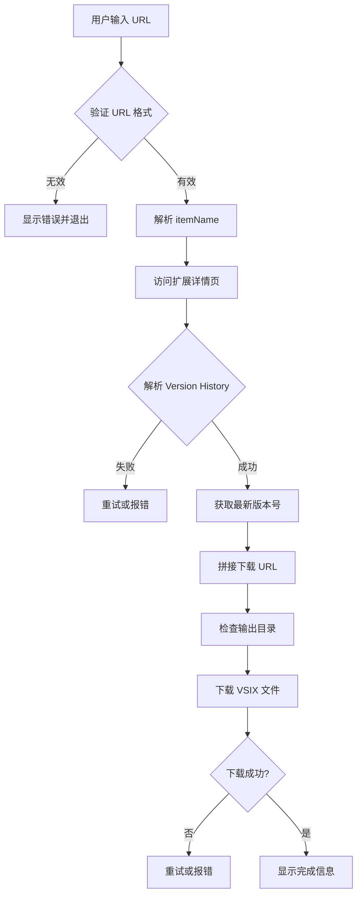

# VSIX 下载工具 - 架构设计

## 项目概述

一个使用 Python 和 uv 实现的命令行工具，用于从 VS Code 插件市场下载 VSIX 文件。

## 核心功能

1. **URL 解析**：从 VS Code 插件市场 URL 中提取扩展信息
2. **版本获取**：自动解析 Version History 获取最新版本号
3. **VSIX 下载**：拼接下载 URL 并下载文件到指定目录
4. **错误处理**：完善的异常处理和用户友好的错误提示
5. **用户可用性**：进度条、重试机制、断点续传等

## 项目结构

```
download_vsix/
├── pyproject.toml          # 项目配置和依赖
├── README.md               # 项目文档
├── .gitignore              # Git 忽略文件
├── vsixs/                  # 默认下载目录
│
├── src/
│   └── download_vsix/
│       ├── __init__.py
│       ├── cli.py          # 命令行入口
│       ├── parser.py       # URL 和页面解析模块
│       ├── downloader.py   # 下载模块
│       ├── utils.py        # 工具函数
│       └── exceptions.py   # 自定义异常
│
├── tests/
│   ├── __init__.py
│   ├── test_parser.py
│   ├── test_downloader.py
│   └── test_utils.py
│
└── scripts/
    └── install.sh          # 安装脚本 (可选)
```

## 技术栈

- **Python**: 3.11+
- **包管理器**: uv
- **HTTP 请求**: httpx (异步支持)
- **HTML 解析**: BeautifulSoup4
- **CLI**: typer (用户友好的 CLI)
- **进度条**: rich (美观的终端输出)
- **日志**: loguru (结构化日志)

## 模块设计

### 1. parser.py - 解析模块

```python
class ExtensionInfo:
    """扩展信息数据类"""
    field_a: str      # publisher (e.g., denoland)
    field_b: str      # extension name (e.g., vscode-deno)
    version: str      # latest version (e.g., 3.43.3)
    item_name: str    # full item name (e.g., denoland.vscode-deno)
    download_url: str # complete download URL

class ExtensionParser:
    """解析器类"""
    def parse_item_name(url: str) -> tuple[str, str]
    def fetch_latest_version(item_name: str) -> str
    def build_download_url(field_a: str, field_b: str, version: str) -> str
```

### 2. downloader.py - 下载模块

```python
class VSIXDownloader:
    """下载器类"""
    def download(download_url: str, output_dir: str, filename: str)
    def download_with_progress(url: str, output_path: str)
    def resume_download(url: str, output_path: str, partial_size: int)
```

### 3. cli.py - 命令行接口

```python
def main(url: str, output_dir: str = "vsixs", force: bool = False)
def download_command()
def validate_url(url: str) -> bool
```

### 4. exceptions.py - 自定义异常

```python
class InvalidURLError(Exception)
class VersionNotFoundError(Exception)
class DownloadFailedError(Exception)
class NetworkError(Exception)
```

### 5. utils.py - 工具函数

```python
def sanitize_filename(name: str) -> str
def ensure_directory(path: str) -> Path
def format_file_size(size: int) -> str
def calculate_checksum(file_path: str) -> str
```

## 工作流程



## 错误处理策略

| 错误类型 | 处理方式 |
|---------|---------|
| 无效 URL | 立即提示，给出正确格式示例 |
| 网络错误 | 自动重试 3 次，每次间隔递增 |
| 版本解析失败 | 提供手动输入版本选项 |
| 下载失败 | 支持断点续传 |
| 磁盘空间不足 | 提前检查并提示 |
| 权限错误 | 明确提示需要权限 |

## 用户可用性增强

1. **进度显示**: 使用 rich 显示下载进度条
2. **彩色输出**: 成功/警告/错误信息使用不同颜色
3. **详细模式**: `-v` 参数显示详细日志
4. **强制覆盖**: `--force` 参数覆盖已存在文件
5. **批量下载**: 支持从文件读取多个 URL
6. **配置文件**: 支持 `~/.vsix-downloader/config.toml`

## 依赖项

```toml
[project]
dependencies = [
    "httpx>=0.27.0",
    "beautifulsoup4>=4.12.0",
    "typer>=0.12.0",
    "rich>=13.7.0",
    "loguru>=0.7.0",
]
```

## 使用示例

```bash
# 基本用法
uv run download-vsix https://marketplace.visualstudio.com/items?itemName=denoland.vscode-deno

# 指定输出目录
uv run download-vsix <url> --output-dir ./my-extensions

# 强制覆盖
uv run download-vsix <url> --force

# 详细模式
uv run download-vsix <url> -v
```
