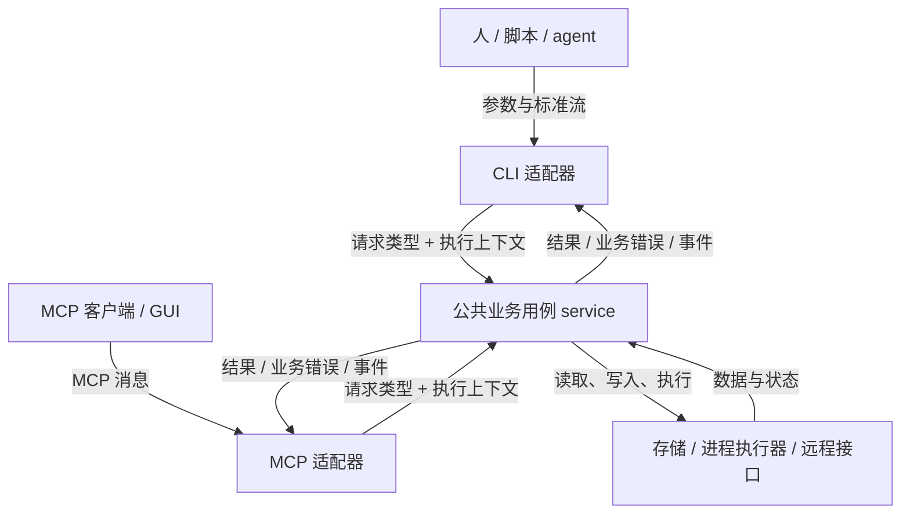

# CLI 与 MCP 双壳架构工作指南

> 面向开发者与 AI agent：为同一工具提供 CLI 和 MCP 两个入口，并复用公共业务用例。
>
> 适用任务：改造存量 CLI；从零建设需要双入口的工具。
>
> 更新：2026-09-15，第二版。
>
> 规范基线：本文引用 MCP 2025-11-25；SDK 行为另标版本。项目采用其他版本时，
> 应按实际协商版本、依赖锁定版本和目标客户端重新验证，不能混用规范与草案。

## 0. 使用范围与执行方式

双壳架构的目标是让业务规则有共同归属，同时保留两个入口各自需要的交互方式。
CLI 可供人、脚本和 agent 使用；MCP 可供 agent、GUI 和其他客户端使用。
接入 MCP 能统一发现与调用方式，但能否互通仍取决于传输、协议版本和客户端能力。

统一核心与多入口的概念框架（投影 / 模式 / UX 三桶分类、GUI 扩展决策、渠道能力矩阵）
见《[统一核心与多通道投影指南](<统一核心与多通道投影指南.md>)》；本指南聚焦 CLI 与 MCP 双入口的实施细节。

本文的要求分四类，阅读和实施时应保持区分：

| 类别 | 含义 | 如何使用 |
|---|---|---|
| 协议要求 | 指定版本 MCP 的要求，正文附官方来源 | 按实际协议版本实现；SDK 可代为处理，但仍需验证 |
| 架构约束 | 采用公共业务层后应维持的职责边界 | 用依赖关系和行为测试验证 |
| SDK 行为 | 某个库、版本和 API 的具体行为 | 升级或换语言时重新核对 |
| 项目决策 | 命令名称、工具粒度、输出格式、是否导出 Schema 等 | 按需求选定并记录，不视为协议限制 |

开发前先读取目标项目及上级的 `AGENTS.md`，确定本次改动范围、兼容要求、数据目录和检查命令。
用户已明确的目标与仓库约束优先。未明确的常规实现选择由开发者作出并记录；
只有影响需求、公开契约或破坏兼容性的未决事项才需要进一步澄清。

| 任务 | 执行路径 |
|---|---|
| 存量 CLI 改造 | 第 1～7 章作为设计依据，执行第 8 章工作流 A，第 9 章验收 |
| 从零新建 | 第 1～7 章作为设计依据，执行第 8 章工作流 B，第 9 章验收 |
| 只补 MCP 入口 | 优先核查现有业务层是否可复用，再按工作流 A 接入 |
| 查阅项目案例 | 第 10 章；案例有明确限制，不作为规范来源 |

本指南主要讨论本地工具与 stdio MCP。若业务已有远程服务，CLI 经 API 调用远程业务、
MCP 作为另一适配入口也是合理架构，应复用现有服务边界。增加 HTTP MCP 时，需要另行
落实该传输的连接、认证和部署要求，不能直接套用 stdio 进程模型。

## 1. 先确定能力和契约

### 1.1 以业务用例盘点能力

先列出用户要完成的操作，再决定各入口暴露什么。共用业务层不要求两侧命令数量、
名称或参数形状一一对应；双方都提供的同义操作，应共享业务不变量和副作用规则。

能力对照表至少包含以下列；不暴露清单允许为空：

| 业务用例 | CLI 入口 | MCP 工具 | 参数与结果差异 | 副作用与失败语义 | 决策理由 |
|---|---|---|---|---|---|
| 查询记录 | 列表子命令 | 查询工具 | CLI 可表格/JSON，MCP 返回结构化结果 | 相同过滤与排序规则 | 两侧都需要 |
| 批量更新 | 子命令或文件输入 | 一次批量工具或单项工具 | 批量上限可不同且需说明 | 明确部分成功与重试范围 | 根据调用成本和使用场景定粒度 |
| 执行程序 | 前台透传或收集输出 | 非交互执行，或有状态执行接口 | stdin、超时、输出上限分别约定 | 共享校验、执行状态和记账规则 | 交互模型不同 |
| shell 补全 | completion | 按需求决定 | 通常仅 CLI 使用 | 无业务状态变更 | 终端集成需求 |

表中内容是设计示例，不是每个项目必须具备的能力。权限范围、调用成本、产品定位、
协议能力与终端习惯都可以成为不同暴露范围的理由。每项业务需求应有明确归宿。

### 1.2 为每个用例定义可验证的契约

契约应在实现前澄清关键行为；允许用类型、Schema、测试样例或简短设计说明共同表达，
无需先完成一份大文档才能写代码。

| 维度 | 至少明确的内容 |
|---|---|
| 输入 | 字段、类型、单位、可选性、缺省值、空值、边界、未知字段策略 |
| 输出 | 成功结果、空集合、排序、分页、截断标记、部分成功结构 |
| 错误 | 稳定业务错误码、可公开说明、字段错误、操作状态是否已改变 |
| 副作用 | 哪些数据或外部资源会变化；原子性与幂等性 |
| 执行 | 超时预算、取消传播、完成判定、资源所有者 |
| 兼容 | 哪些 CLI 行为与 MCP 字段已对外承诺；变更和迁移方式 |

同义参数应共享归一化规则。若两个入口采用不同默认值，例如 CLI 前台执行不设超时、
MCP 执行有时间上限，应记录为执行策略差异，并分别测试，不能宣称默认值一致。

### 1.3 选择一个可维护的契约定义源

避免维护互不校验的多份字段定义。以下方案均可使用：

| 定义源 | 适用情形 | 维护要求 |
|---|---|---|
| 公共请求/结果类型 + Schema 元数据 | 单语言项目，SDK 推导能力足够 | 检查推导后的 Schema；对缺失约束作集中补充 |
| 独立 JSON Schema 或契约包 | 跨语言、外部集成或契约稳定性要求较高 | 生成或校验类型与适配器，明确生成方向 |
| MCP 注册定义 | 工具产品以 MCP 为主要接口 | CLI 可复用契约元数据，业务实现仍不依赖 MCP SDK |

选择依据是维护成本与对外兼容性。MCP 注册处不是所有项目的必选源头。
Schema 可以自动生成，使用说明、事务语义和差异说明仍需编写并核对。
如先有 Schema 草案，应说明何时转成正式定义或生成产物，避免草案继续独立漂移。

## 2. 公共业务层与入口职责

### 2.1 依赖方向

CLI 与 MCP 适配器调用同一组业务用例；业务用例通过接口使用存储、进程或远程服务。
“service”是职责名称，小项目可以只用一个模块和少量函数，无需为分层创建大量空接口。



图中 service 表示复用的代码，不代表全局单例。CLI 和 MCP 即使位于同一可执行文件，
也可能在不同进程内持有不同实例；共享数据的并发安全还需要存储层保证。

| 层 | 负责 | 应避免 |
|---|---|---|
| CLI 适配器 | flag/位置参数解析、输入转换、输出格式、终端交互、退出码 | 维护独立的业务规则或持久化编排 |
| MCP 适配器 | 工具注册、协议输入输出、上下文传递、错误适配、能力协商相关处理 | 引入一套独立业务规则 |
| 公共业务用例 | 参数归一化、业务不变量、领域调用、事务/流程编排、领域结果 | 导入 CLI/MCP SDK，决定终端布局或协议响应 |
| 基础设施 | 数据库、文件、进程、网络等具体操作 | 把底层错误细节直接当公共契约 |
| 组装入口 | 读取配置、创建依赖、设定日志去向、运行入口、清理资源 | 把连接或可变状态藏在不可控的全局变量中 |

“薄适配器”按职责判断，不按行数或固定三段代码判断。
解析协议请求、转换视图、传递取消、安排进度通知都可能需要额外代码。

### 2.2 输出、日志和依赖注入

公共业务层不直接使用进程级 stdin/stdout/stderr 做交互，不自行退出进程。
它可以通过注入的 logger、事件回调、进度接口报告诊断和执行状态，由组装入口决定去向。
禁止直接写标准流，不等于禁止业务层记录日志。

请求与结果使用明确的类型。返回领域对象还是专用结果 DTO，按复杂度选择；
不要无意把 ORM 会话、延迟加载对象或数据库内部字段变成公开 API。
业务错误可以携带可公开说明与结构化建议，终端排版和 MCP 内容块留在入口处理。

进程退出集中在程序最外层。CLI 命令返回退出码，使资源清理能够先完成。
仅把 `os.Exit` 移到另一个输出函数，仍会跳过尚未执行的清理逻辑。

### 2.3 透传执行也需要共同的业务归属

透传执行的差异主要在 I/O 和执行策略。可以让用例调用可注入的执行器：
CLI 提供终端流，MCP 提供受限缓冲或文件输出。执行器负责具体进程控制，
用例负责前置校验、授权条件、执行记录和完成状态。

长时间运行期间，不应为了“前后都要记账”而一直持有数据库事务。
可分成短事务记录开始、执行外部操作、短事务记录结果，并定义最终记账失败的处理方式。

不应仅为了复用底层对象而新增 `Service.Store()`，让两个入口分别编排同一业务流程。
存量代码暂时绕过业务用例时，应标明仍重复的规则、对应回归测试与后续迁移边界。

## 3. 参数、Schema 与校验

### 3.1 业务不变量由公共用例保证

解析校验、契约校验与业务校验可以同时存在，关键是它们各有明确作用：

| 检查 | 主要归属 | 说明 |
|---|---|---|
| flag 拼写、位置参数个数、JSON 可解析性 | 对应入口 | 属于调用形式 |
| 类型、枚举、范围、字段依赖 | Schema 与公共用例所用的校验逻辑 | 入口可提前报错；绕过入口调用用例仍须守住业务规则 |
| 字符串归一化、业务默认值 | 公共用例或共享构造函数 | 同义调用不得因入口不同而改变 |
| 文件存在、记录唯一、允许的状态转换 | 用例与存储约束 | 预检查不能代替原子写入时的约束 |
| 身份/访问范围 | 入口解析身份，用例检查业务访问条件 | 不根据“来自 CLI 还是 MCP”隐式放宽规则 |

跨字段条件能用 JSON Schema 表达时可以表达，例如 `if/then/else`、`not` 和
`dependentRequired`。工具或表单库不支持某些关键词时，应记录具体兼容限制，
并由公共校验补足。[JSON Schema 条件校验](https://json-schema.org/understanding-json-schema/reference/conditionals)

下面是一份独立的输入契约示例：`running=true` 时禁止同时提供 `status`；
`running=false` 时允许状态过滤。空字符串不是有效状态。

```json
{
  "$schema": "https://json-schema.org/draft/2020-12/schema",
  "type": "object",
  "properties": {
    "status": { "type": "string", "enum": ["active", "invalid"] },
    "running": { "type": "boolean", "default": false }
  },
  "additionalProperties": false,
  "if": {
    "required": ["running"],
    "properties": { "running": { "const": true } }
  },
  "then": { "not": { "required": ["status"] } }
}
```

公共查询用例仍应拒绝相同的冲突组合，CLI 和 MCP 都调用该用例。
Schema 的提前拒绝与用例校验可以有不同展示文本，业务约束必须一致。

### 3.2 明确缺省、空值与默认值

可选字段至少区分“未提供”和“显式提供的值”。更新接口尤其需要决定
`null`、`false`、`0`、空字符串、空数组和空对象分别代表保留、清空、关闭还是非法。

Go 的 `omitempty` 影响序列化及部分 SDK 的 required 推导，不能单独保留字段是否出现的
全部信息。根据契约选择指针、显式 Optional 类型或自定义解码；需要同时区分缺失与
`null` 时，仅有普通指针通常也不够。其他语言同样要验证缺失值的处理方式。

JSON Schema 的 `default` 是注解，标准校验过程不保证填充缺失字段；
SDK、表单库或业务代码可能另外应用默认值。实现时应查明谁在填充，并验证直接调用
service、CLI 和 MCP 的同义请求得到相同业务值。[默认值说明](https://json-schema.org/understanding-json-schema/reference/annotations)

### 3.3 类型和约束应保持准确

本文规范基线下，工具输入与 structuredContent 的根按对象组织；业务数组或标量可用
`items`、`value` 等字段封装。字段内部仍应使用真实 JSON 类型。采用 SDK 支持的其他根形状前，
先核实协议版本与目标客户端是否兼容。[工具 Schema 与结果定义](https://modelcontextprotocol.io/specification/2025-11-25/server/tools)

- 枚举写入 `enum`，范围使用相应 Schema 关键词；description 补充单位、含义和示例。
- 固定结构的 JSON 参数优先使用明确对象类型；只有确实开放的键值扩展才使用 map。
  任意 JSON 值可能是数组、数字、字符串或 `null`，不能统一改成对象类型。
- 使用 `json.RawMessage` 或自定义序列化类型时，核对 SDK 实际推导结果。可覆盖 Schema、
  提供类型映射或在适配器转换；类型名称本身不是判定错误的依据。
- `maxLength` 约束字符长度，不能直接等同于 UTF-8 字节上限。字节容量在业务层按编码校验；
  其他可表达的长度限制仍可写入 Schema。[字符串约束](https://json-schema.org/understanding-json-schema/reference/string)
- 记录未知字段是否拒绝、列表分页方式、单次批量上限与结果大小限制；数值来自项目需求，
  不从参考项目直接复制。

## 4. 错误、部分成功与执行结果

### 4.1 公共错误表达业务含义

公共错误可包含稳定 `code`、可公开 `message`、字段或资源标识等 `details`。
保留内部原因链供诊断；Go 可实现 `Unwrap`，但不要把原始数据库错误或完整内部信息
自动输出给调用方。

错误分类应一致，映射函数可以按领域拆分，不要求整个项目只有一个巨型 `wrapErr`。
CLI 的未知 flag、MCP 的协议错误也不必伪装成同一个业务错误码。

CLI 退出码由 CLI 适配器根据业务错误和命令语境决定，不进入新设计的公共业务错误。
执行子进程得到的 `exit_code` 则属于执行结果数据，可以同时提供给两侧。
存量 `ExitCode` 字段如需兼容，应明确标为迁移期设计。

### 4.2 先定义操作完成语义，再映射入口状态

| 结果状态 | 公共用例表达 | CLI / MCP 的处理 |
|---|---|---|
| 全部成功 | 完整结果 | 成功退出；正常工具结果 |
| 原子操作失败 | 错误与已知操作状态 | 失败状态；不能声称存在已提交的部分成功 |
| 允许部分成功 | 每项成功/失败记录及总体状态 | 按约定决定退出码与 `isError`，保留完整结果 |
| 子进程非零退出 | 进程退出码、输出和执行状态 | 按执行用例定义解释；通用 runner 可将其标为失败 |
| 超时或请求取消 | 已观察到的状态与清理结果 | 区分取消请求、实际停止和已发生的副作用 |
| 无法确定结果 | 明确未知状态及查询依据 | 不声称未执行，不盲目重试有副作用操作 |

部分成功可以用专用结果类型，也可以在语言允许时返回“有效结果 + 错误”。
若采用后一种形式，适配器必须识别并保留结果，不能见到 `err != nil` 就丢弃数据。
同一用例的总体成功判定应有共同依据，两侧只做展示和状态映射。

部分完成的重试应限定到未完成项，或使用约定的幂等机制。仅设置错误标志无法防止
调用方重复执行已经成功的部分。

### 4.3 MCP 错误语义与 SDK 行为分开处理

协议要求：工具执行失败用工具结果中的 `isError` 表达；无法按协议处理的请求使用
JSON-RPC 错误。SDK 中返回一个语言层面的 error/exception，最终走哪条通道由具体 API
决定。[MCP 错误处理](https://modelcontextprotocol.io/specification/2025-11-25/server/tools#error-handling)

下表仅适用于已核对的 Go SDK v1.8.0：

| API / 返回方式 | 实际行为 | 适用方式 |
|---|---|---|
| 泛型 `mcp.AddTool` + `ToolHandlerFor`，返回普通 `error` | 自动转为 `IsError=true` 的内容结果 | 可用于无需携带部分结果的业务失败 |
| 同一泛型 handler 返回显式 `*jsonrpc.Error` | 该版本将其作为协议错误处理 | 只用于对应协议语义，不用于一般业务失败 |
| 低层 `Server.AddTool` + `ToolHandler` 返回 `error` | 按协议错误处理 | 工具失败需显式构造结果；自行承担相关校验 |
| 泛型 handler 返回结果与 `Out`、第三返回值为 nil | SDK 序列化并校验输出 | 成功或需要保留完整输出的部分失败 |

依据：[Go handler 定义](https://github.com/modelcontextprotocol/go-sdk/blob/v1.8.0/mcp/tool.go)、
[泛型适配实现](https://github.com/modelcontextprotocol/go-sdk/blob/v1.8.0/mcp/server.go)。

该版本中，手动返回 `IsError=true` 不会跳过非空类型化输出的 Schema 校验。
不要无条件套用 `(errResult(err), zero, nil)`：零值可能不满足输出约束。
无部分结果时可返回经过公共错误转换的普通 error；需要结构化错误或部分结果时，
应设计与输出 Schema 一致的结果分支，并通过集成测试验证。

TS、Python 等 SDK 的返回/抛错方式应按锁定版本另行核对。
`code: message` 可以是项目的文本展示约定，但 MCP 没有规定该格式。
若客户端需要稳定读取错误码，应约定结构化字段及其 Schema，避免依赖解析提示文案。

### 4.4 完整保留工具返回内容

协议要求和兼容建议：成功输出及携带结构化数据的分支应符合已公布的输出 Schema；返回结构化内容时，
为兼容性宜同时提供序列化 JSON 的文本内容块。项目可另加简短说明。
部分失败时也应保留有价值的结果，避免摘要替代全部数据。
[MCP 结构化内容与输出 Schema](https://modelcontextprotocol.io/specification/2025-11-25/server/tools#structured-content)

客户端应保留整个工具结果，包括 `content`、`structuredContent`、`isError` 以及所需元数据。
`content` 可能承载文本、图片、音频或资源信息，不能仅保存结构化字段。
展示层可以优先渲染结构化结果，并用内容块补充错误说明和其他信息。

## 5. 两个入口的实现边界

### 5.1 CLI：保留终端和脚本契约

CLI 负责解析、调用用例、呈现结果和返回退出码。输出策略由项目选定：
可以默认面向人的文本并提供 `--json`，也可以采用始终 JSON 的接口。
改造存量工具时保持已承诺的格式，不能因新增 MCP 就改变脚本依赖的行为。

| 项目 | 实施要求 |
|---|---|
| stdout / stderr | 正常数据与诊断分开；JSON 模式不得夹杂日志、颜色控制符或启动横幅 |
| 错误输出 | 约定文本/JSON 错误的输出流；透传场景避免污染子进程 stdout |
| 参数解析 | 验证位置参数、重复 flag、`--` 分隔符、布尔值、含空格路径和透传参数 |
| help / version | 按需读取构建信息和配置，避免无关数据库初始化与写入 |
| 退出码 | 保留存量含义；新命令明确成功、参数错误、业务失败与子进程退出的映射 |
| 清理 | 在最外层退出前等待必要清理完成，不能由输出函数中途终止进程 |

退出码是 CLI 契约，不能把参考项目中的 1、127 等数值直接当成所有平台和命令的规则。
JSON 包络字段同样是项目选择，不要求与 MCP 顶层协议结构相同。

### 5.2 MCP stdio：分开启动配置与工具参数

协议要求：stdio 的 stdin/stdout 用于 MCP 消息，stdout 不能混入其他输出。
日志可以写 stderr；客户端可以捕获、转发或忽略它，不能把所有 stderr 文本当成调用失败。
[MCP stdio 传输](https://modelcontextprotocol.io/specification/2025-11-25/basic/transports#stdio)

`<prog> mcp` 可以接受启动配置，例如日志级别、配置选择或工作目录。
这些参数应在进入协议会话前解析；每次工具调用的业务参数来自 MCP 消息。
启动失败的诊断写 stderr，不要复用向 stdout 写 CLI 帮助或错误包络的分支。

由 SDK 处理初始化和消息编码；项目声明所需能力，并验证实际协商结果。
协议版本、SDK 版本与应用版本分别记录，不能用某个 npm/Go 依赖版本代替协议版本。
[初始化与能力协商](https://modelcontextprotocol.io/specification/2025-11-25/basic/lifecycle)

### 5.3 工具命名与副作用说明

名称应在 server 内唯一且符合协议命名约定。`<prog>.<verb>` 是可选命名策略；
聚合客户端仍应以 server 身份与工具名共同标识工具，不能只靠前缀消除所有冲突。

工具说明写清用途、关键输入、单位、缺省语义与副作用。需要鉴权或能力限制时，
说明入口如何获得身份、业务用例如何执行访问检查。

ToolAnnotations 用于辅助描述行为：`readOnlyHint` 表示不修改环境；
`destructiveHint=false` 表示只做新增式更新；`idempotentHint` 描述同参重复调用的影响；
`openWorldHint` 描述交互范围是否开放。声明要结合完整用例的副作用，包括隐式记账。
这些字段都是提示，来自不可信 server 时不能作为授权依据。
[ToolAnnotations 定义](https://modelcontextprotocol.io/specification/2025-11-25/schema#toolannotations)

### 5.4 按交互需求选择机制

交互能力逐项设计，不以“需要交互”或“运行很久”直接判为无法接入 MCP。

| 需求 | 可选实现 | 边界 |
|---|---|---|
| 有限时间内返回结果 | 普通工具调用 | 设置客户端等待与服务端执行预算 |
| 长操作进度 | progress 通知 | 通知是可选的；没有进度不代表任务已停止 |
| 执行中补充信息 | elicitation | 检查客户端声明的能力，提供不支持时的明确结果 |
| 跨请求查询任务状态 | 项目任务接口，或协商支持的 MCP Tasks | 约定状态、保留期、结果获取、取消与恢复 |
| 持续日志 | 日志资源、订阅或带游标的有限读取 | 保留期和读取上限明确；不把无限日志塞进一次结果 |
| PTY / TUI 字节交互 | CLI，或单独设计终端会话接口 | 标准 tools/call 不提供通用 PTY 字节透传 |
| 打开本地窗口或终端 | 可作为启动类工具 | 明确执行在哪台机器、会话归属和进程寿命 |

progress 与 elicitation 已有协议定义，使用时核对双方支持：
[Progress](https://modelcontextprotocol.io/specification/2025-11-25/basic/utilities/progress)、
[Elicitation](https://modelcontextprotocol.io/specification/2025-11-25/client/elicitation)。
本文基线中的 Tasks 属于实验性能力，采用前需核对所用版本与客户端实现；
它不是通用终端流协议。[MCP Tasks](https://modelcontextprotocol.io/specification/2025-11-25/basic/utilities/tasks)

## 6. 生命周期、并发与取消

### 6.1 依赖由明确的所有者创建和关闭

CLI 通常在单次命令完成后关闭资源；stdio MCP 通常随客户端会话运行。
业务层实例、数据库池、事务和子进程可以有不同生命周期，应分别管理。

| 资源 | 建议归属 | 关键约束 |
|---|---|---|
| 业务层实例与连接池 | 一次命令或一个 server 实例 | 显式创建/注入与关闭，可按需要惰性初始化 |
| 事务、游标、借用的连接 | 一个短操作作用域 | 尽早释放；等待进程或外部长任务时不长期占用 |
| 请求上下文 | 单次调用 | deadline、取消和请求标识传到用例与底层 I/O |
| 执行中的子进程 | 明确的请求或后台任务 | 定义断连、退出、取消时是否终止及由谁回收 |
| 日志与输出缓冲 | 进程或请求 | 设置容量与截断策略，完成后释放 |

惰性初始化应区分“尚未初始化”“正在初始化”“初始化失败”和“可用”。
临时故障允许恢复时，需要有界的重新初始化或重连策略。
`sync.Once` 只保证初始化函数执行一次，适合不需要重试的初始化；
它不能保证后续操作线程安全，也不会因初始化返回错误自动重试。
[Go sync.Once](https://pkg.go.dev/sync#Once.Do)

关闭顺序应与资源归属对应：停止接收新操作，取消或等待在途操作，按策略处理子进程，
最后释放连接等资源。需要后台任务继续存活时，应有独立的任务所有者，不能依赖
stdio server 恰好还活着。

### 6.2 同进程与跨进程并发都要处理

MCP 可能并发调用，多个 CLI/MCP 进程也可能同时访问同一份数据。
共享代码并不自动保证安全。项目应明确：

- 用例是否可重入；可变状态是否需要同步；共享连接池与单次事务的界限。
- 写入依赖的唯一约束、事务和锁；避免仅用“先查询再写入”防冲突。
- 长操作的并发上限，以及取消、查询状态是否会被其他长操作阻塞。
- 操作重试是否幂等；连接恢复不等于可以自动重放写操作。

小工具可以选串行执行，但要明确排队与取消行为，并测试该选择。

### 6.3 取消需要贯穿执行链

适配器应把上下文或取消信号传到公共用例，再传到数据库、网络请求和进程执行器。
Go 的阻塞用例通常接受 `context.Context`；其他语言采用相应取消机制。
收到通知不代表任意阻塞代码都会自动停止。

普通请求取消采用通知机制，存在完成与取消的竞态；有些操作无法中断。
客户端应区分“已请求取消”和“已确认停止”，必要时另行查询操作状态。
任务增强调用应使用其对应的任务取消机制。
[MCP 取消规范](https://modelcontextprotocol.io/specification/2025-11-25/basic/utilities/cancellation)

对于执行外部程序的工具，还需决定：

- 是否终止整个进程树；是否先尝试正常结束；清理等待是否有上限。
- 达到输出保留上限后继续排空管道还是终止执行，避免写满 pipe 导致死锁。
- 超时、取消、普通失败分别记录什么；最终记账失败如何被发现和补偿。
- 请求取消后的必要清理使用什么有限预算，避免复用已取消上下文导致清理立即失败。

这些策略放在可复用的执行器与用例中；MCP/CLI 只选择适合入口的策略。
日志至少能关联操作标识、耗时、结果与清理失败，实际保存位置遵循仓库规定。

## 7. 工具发现、Schema 导出与客户端

### 7.1 导出可以同源，发现必须考虑分页

`<prog> schema` 是可选的离线检查入口。实现可直接导出共享注册定义，也可通过
内存 transport 建会话后调用 tools/list；后者适合核对实际协议视图。
无业务需求时，注册和导出不应打开数据库或产生业务副作用。

tools/list 支持分页。获取完整清单时应读取后续游标直至结束，并处理分页中的错误。
Go SDK v1.8.0 可使用 `ClientSession.Tools` 迭代器；只调用一次 `ListTools` 不保证全量。
[MCP 工具发现](https://modelcontextprotocol.io/specification/2025-11-25/server/tools#listing-tools)、
[Go 客户端实现](https://github.com/modelcontextprotocol/go-sdk/blob/v1.8.0/mcp/client.go)

Schema 对照至少比较名称、描述、输入/输出 Schema 与行为标注，而非只比较工具数。
比较前可以对对象键及明确无序的集合归一化，不能删除真实约束以获得一致结果。

动态工具或按权限过滤的 server，应记录发现时的配置、身份和能力上下文。
离线导出可以是静态全集或某个上下文的视图，二者需明确区分。
客户端若使用缓存，应在工具列表变更或重新连接后按约定刷新。

### 7.2 保留完整结果并区分失败来源

客户端可以使用异常，也可以把失败转换成判别联合；遵循项目现有风格即可。
至少区分工具结果、协议/传输失败与取消请求，不把所有状态折叠成一个含义模糊的 `ok`。

以下仅示意已连接客户端的结果包装，不是完整连接或取消实现：

```ts
const result = await client.callTool(
  { name: toolName, arguments: args },
  undefined,
  { signal }
)
return { kind: 'tool_result' as const, result }
```

保留整个 result 后，展示层根据 `result.isError`、`result.content` 和
`result.structuredContent` 分流。未经支持的内容类型也应保留或明确提示，
不能静默裁掉图片、资源信息或错误说明。

连接管理至少处理这些状态：

| 场景 | 处理要求 |
|---|---|
| 多个调用同时首次连接 | 共享同一个建连 Promise，避免为同一配置重复启动 server |
| 连接期间用户取消 | 在连接等待前登记取消；取消后不得继续发送该调用 |
| 共享连接与单请求取消 | 不能为了取消一个等待者而中断其他正常调用 |
| 工具错误 | 保留连接；按工具结果处理 |
| 协议错误 | 依错误类型处理，不能一概认定连接已坏 |
| transport 关闭或握手失败 | 释放本次创建的资源并更新状态；避免覆盖 SDK 必要的关闭回调 |
| 客户端退出 | 清理已连接及正在连接的资源，处理启动后尚未登记的子进程 |
| 重连 | 恢复后续调用能力；写操作是否重试由幂等契约决定 |

客户端等待超时与服务端执行超时是两个预算。应给结果返回和清理留出合理余量，
并说明超时后服务端是否仍可能继续执行。

### 7.3 Schema 可以生成基础表单

Schema 驱动表单适合提供通用入口，不能保证任何工具都获得完整、易用的交互界面。
检查所用表单库与 validator 对 JSON Schema 方言、组合、引用、格式和额外属性的支持，
提供校验错误和必要的原始 JSON 输入方式。复杂领域交互可以使用专用页面。

“无需工具专用页面”是客户端的产品选择；CSP、是否使用动态代码生成等属性应按具体
库和配置验证。消费端通常通过公开接口读写业务数据，避免绕过用例直接修改数据库；
若提供只读查询或导出接口，也应把它作为正式契约维护。

## 8. 实施工作流

### 8.1 工作流 A：改造存量 CLI

迁移以已有公开行为为基线，按一个业务用例逐步改造。任何计划改变的行为都应单独列出
兼容影响；新增 MCP 本身不构成修改 CLI 契约的理由。

| 步骤 | 动作与产物 | 进入下一步的依据 |
|---|---|---|
| A1 建立基线 | 读取项目约束；盘点命令、参数、输出流、退出码、配置和副作用；记录现有问题 | 关键行为有可重复的样例或测试，已知问题与本次变更分开 |
| A2 设计对照 | 完成第 1 章能力表和契约；选择 MCP 传输、SDK 版本与目标客户端 | 每项业务需求有归宿，新增限制与执行差异有明确理由 |
| A3 提取公共用例 | 逐项迁移归一化、业务校验和编排；保留 CLI 格式与退出码；注入所需依赖 | 对应 CLI 回归通过；公共规则可绕过入口独立验证 |
| A4 接入 MCP | 注册工具、输入输出和错误适配；连接上下文与资源生命周期 | 完成真实 stdio 握手、调用与错误路径；stdout 无杂音 |
| A5 验证双入口 | 按第 9 章核对等价行为、差异、分页、取消和并发等适用场景 | 受影响的契约有测试证据；实现限制写入项目文档 |
| A6 收尾 | 更新使用说明和契约；若提供离线导出则验证完整内容；整理变更与恢复方式 | 文档与最终实现相符，提交范围清晰，未处理项明确 |

优先复用已有业务层，不为满足目录名称而重复建层。
存量实现中的全局状态、退出函数或重复业务规则若暂时保留，应说明影响；
不能以“参考项目也这样做”为依据免除相关回归验证。

### 8.2 工作流 B：从零新建

新项目按业务用例做可验证的小步实现，两个入口的先后由主要使用场景决定。

| 步骤 | 动作与产物 | 验收依据 |
|---|---|---|
| B1 定义需求 | 列出用户、业务用例、执行环境和能力表；确定本次需要的入口 | 范围、外部依赖与成功条件明确 |
| B2 确定契约 | 选择定义源，写输入/结果、错误与副作用语义、兼容目标 | 关键规则可转为测试样例，缺省与空值无歧义 |
| B3 实现一条完整用例 | 公共用例 + 基础设施 + 优先入口；可用独立测试先验证业务 | 用例可独立验证，入口仅承担适配职责 |
| B4 接入另一入口 | 复用已实现用例，落实各入口的交互和错误表达 | 公共行为一致，执行策略差异有测试 |
| B5 扩展与交付 | 按同样方式完成剩余用例，执行第 9 章并编写项目文档 | 需求覆盖完整，资源与失败路径可验证 |

业务用例、契约与适配器可以交替完善。先写 CLI 或 MCP 都不能成为把业务规则堆入入口的理由。
单次任务不需要额外引入插件系统、代码生成框架或通用服务基类，除非它解决了明确需求。

### 8.3 兼容与恢复

新增字段、修改默认值、改变错误码、缩小输入范围或变更副作用，都可能影响调用方。
项目应记录已承诺的客户端范围，并用契约差异检查识别变更。输出新增字段也应考虑
严格客户端或禁止额外属性的 Schema，不能自动认定为兼容。

迁移宜保持用例或入口的变更可独立回退。涉及数据迁移时另行定义备份与恢复方式；
禁用 MCP 入口只能停止该入口的后续调用，不会撤销已经发生的业务操作。

## 9. 验证与交付

### 9.1 以行为证据验收

每个适用项记录对应测试或人工联调结果。不适用的场景写明原因，
不为凑齐清单添加不存在的功能或不可达错误路径。

| 验证对象 | 最少需要观察的行为 |
|---|---|
| 公共用例 | 代表性成功/空结果；边界、冲突与状态转换；不经过适配器也保持业务规则 |
| 缺省与空值 | 未提供、`null`、显式零值与空集合；同义输入在两侧归一化一致 |
| CLI 兼容 | 受影响命令的参数解析、stdout/stderr、输出形状、退出码和副作用 |
| 透传执行 | 子进程收到的参数与 stdin；输出透传；退出码；适用平台的信号行为 |
| MCP 协议 | 真实 stdio 握手、工具发现、成功调用；协议错误与工具错误可区分 |
| 输出契约 | 成功及声明的部分失败分支符合 Schema；客户端保留 content 与结构化结果 |
| 错误适配 | SDK 拒绝非法输入的实际形态；业务失败不因无效零值输出变成协议错误 |
| 发现与导出 | 强制多页时无遗漏；输入输出 Schema 和标注一致；导出无业务写入 |
| 取消与超时 | 取消前、执行中和临近完成的状态；清理与资源释放；不能确认时明确未知 |
| 并发与重试 | 首次并发连接、初始化失败恢复、重复写入、共享数据冲突及幂等行为 |
| 退出与断连 | 在途操作与子进程按约定结束或转交；连接、事务和输出管道无遗留 |
| 客户端展示 | 纯文本、结构化、部分失败及适用的其他内容类型均不静默丢失 |

内存 transport 适合快速验证 handler 和 Schema，但覆盖不了真实进程启动、
stdio 编码、输出污染和退出清理，因此需要真实 stdio 联调或集成测试补足。
CLI 使用子进程测试，或注入输入输出流测试命令函数；内部存在退出函数不是免测理由。

Schema 快照可帮助发现变化，但不能代替行为测试。以对象键顺序、时间戳、耗时等差异为由
归一化测试结果时，应保留真正影响契约的字段与顺序语义。

### 9.2 检查命令的使用方式

检查命令在目标子项目目录执行，不从父仓库假设存在统一构建系统。
以下是 Go 项目使用相应工具链时的模板；项目若有自己的检查脚本，优先采用项目约定。
该模板列出开发完成后的检查方式，不代表本文档已执行这些项目测试。

```powershell
# 先进入本次实际修改的 Go 子项目目录
go build ./...
go vet ./...
go test ./...

# 辅助定位直接 I/O 与退出调用；命中后阅读上下文
rg -n 'fmt\.(Print|Fprint)|os\.(Exit|Stdout|Stderr|Stdin)|log\.(Fatal|Panic)' internal
```

搜索结果可能命中注释、组装代码和正常适配器，也可能漏掉别名或间接调用。
不要把“零命中”当架构证明。并发敏感代码按工具链支持情况补充 race 检查；
其他语言采用对应构建、类型检查和测试命令，避免照搬 Go 命令。

联调 MCP 时使用与目标版本兼容的官方 Inspector 或测试客户端，记录实际版本、
启动命令和观察结果。浏览 tools/list 后还需实际调用工具，不能仅凭“可连接”验收。

### 9.3 本仓库的交付约定

- 项目文档放父仓库 `docs/<lang>/<项目>/`，遵循项目路径的镜像层级；
  本指南保留在 `docs/agent-guides/`。不在子项目新增 docs/specs/plans 目录。
- 自有运行数据放 `%APPDATA%\language_projects\<项目名>`；
  取不到 APPDATA 时回退 `~/.language_projects/<项目名>/`，写入前创建完整目录链。
  仓库已明确的例外按 `AGENTS.md` 执行。
- 新增测试数据可使用该项目数据根下的 `tests/<唯一标识>/`，通过依赖注入指向该路径，
  避免访问用户真实业务数据；清理前验证目标确属该测试实例。
- 提交分开处理父仓库文档与子仓项目代码。父仓库文档使用 `docs: <中文主题>`；
  子项目使用 `<project>:<type>: <中文主题>`，不跨项目混提。
- 交付时说明改动、验证结果、兼容影响和剩余限制，并给出包含 `cd` 的 PowerShell 提交命令。
  涉及 SQLAlchemy 模型变更时，按仓库要求提示人工审阅。

最终交付逐项核对：

- [ ] 能力对照表覆盖需求，公开差异有理由；不强求工具与命令数量一致。
- [ ] 公共业务规则、错误语义与执行状态有明确归属，两个入口不独立编排同一业务。
- [ ] Schema、默认值、空值与实际校验一致；SDK 行为按依赖版本验证。
- [ ] CLI 兼容与真实 MCP stdio 行为均有证据。
- [ ] 适用的取消、并发、部分成功与资源关闭场景已验证。
- [ ] 若提供 Schema 导出或客户端，已验证多页发现与完整结果保留。
- [ ] 项目文档、数据位置和提交范围符合仓库约束。
- [ ] 未完成事项与已知限制有明确描述，不以检查项数量代替完成度。

## 10. 本仓案例与使用限制

下列引用按 2026-09-15 工作区内容核对，只用于定位可借鉴的实现。
代码可能继续变化，项目文档中的协议结论也应与实际版本核对。
本文不要求其他项目照搬这些实现，也不授权开发某个项目时顺带修改案例项目。

| 案例 | 可借鉴内容 | 使用时注意 |
|---|---|---|
| [clictl service](../../go_projects/clictl/internal/service/service.go) | 提取业务方法、统一错误分类 | 仍有 CLI ExitCode 与 Store 暴露，属于存量实现选择 |
| [clictl MCP 注册](../../go_projects/clictl/internal/mcp/tools.go) | 工具定义、视图转换、结果适配 | list 互斥仍在入口处理；手动错误结果需结合 SDK 输出校验审查 |
| [clictl 执行](../../go_projects/clictl/internal/mcp/exec.go)与[CLI 执行](../../go_projects/clictl/internal/runner/runner.go) | 输出收集、进程控制与透传的不同形态 | 两侧执行编排仍有重复；MCP 默认 60 秒，CLI 透传没有该默认超时 |
| [clictl Schema 导出](../../go_projects/clictl/internal/mcp/schema.go) | 内存连接读取实际工具定义 | 当前只取一页，不能作为完整分页实现照抄 |
| [clictl MCP 测试](../../go_projects/clictl/internal/mcp/mcp_test.go) | 内存会话与业务集成测试思路 | 不能替代 CLI 兼容和真实 stdio 验证；数据隔离按当前仓库规则配置 |
| [tooldeck 连接管理](../../typescript_projects/tooldeck/src/main/mcp/manager.ts) | stdio 客户端与完整结果保留 | 采用前补查连接中的取消、并发建连、关闭回调与分页处理 |
| [tooldeck 结果展示](../../typescript_projects/tooldeck/src/renderer/src/modules/generic/ResultView.tsx) | 结构化结果及文本错误的展示 | 按项目所需内容类型补齐显示能力，不据此宣称通用内容全覆盖 |

相关项目文档：[clictl MCP 接口文档](<../go_projects/clictl/MCP 接口文档.md>)、
[Go CLI JSON 输出模式参考](<../go_projects/clictl/Go CLI JSON 输出模式参考.md>)。
这两份文档用于查阅项目现状和接口；其中的架构建议不能自动替代本项目的设计决策。

Go 的版本依据见 [clictl go.mod](../../go_projects/clictl/go.mod)：
`github.com/modelcontextprotocol/go-sdk v1.8.0`。
tooldeck 的 [package.json](../../typescript_projects/tooldeck/package.json) 声明
`@modelcontextprotocol/sdk ^1.30.0`，当前 [pnpm-lock.yaml](../../typescript_projects/tooldeck/pnpm-lock.yaml)
锁定 1.30.0。依赖范围与实际锁定版本应分别记录。

修订记录：2026-09-15 第二版按业务用例、适配器和运行生命周期组织内容，
将协议要求、SDK 行为与项目决策分开，并为存量案例注明适用边界。
