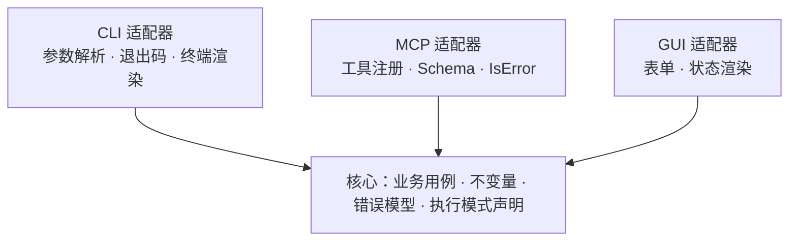

# 统一核心与多通道投影指南

> 面向开发者与 AI agent：同一工具同时提供 CLI、MCP、GUI 等多入口时，能力应该放在哪一层、渠道差异应该怎么处理的判断方法。
>
> 适用任务：新工具的多入口设计；存量工具扩展入口（补 MCP、补 GUI）；评估"先实现 MCP 再转 CLI/GUI"类方案。
>
> 更新：2026-09-15，第一版。
>
> 定位：本指南解决概念与决策问题（统一在哪、能力怎么分桶、渠道差异怎么取舍）。
> CLI 与 MCP 双入口的协议行为、SDK 差异与验收清单见《[CLI 与 MCP 双壳架构工作指南](<CLI 与 MCP 双壳架构工作指南.md>)》，本指南不重复实施细节。

## 0. 结论先行

- **统一点是核心领域语义，不是任何一个协议。** CLI、MCP、GUI、HTTP 都是同一核心的适配器；`docker`（daemon API + CLI + Desktop）、`git`（core + CLI + GUI）、`k8s`（API server + kubectl + Dashboard）都是这一形态的既有先例。
- **MCP 是窄通道，CLI 是宽通道。** MCP 的工具调用收窄为"单次请求-响应 + 结构化 JSON + 布尔失败"；流式输出、执行中交互、退出码、管道组合在 CLI 侧是常态能力。
- **降级有方向：宽到窄可降级（且必须让降级可见），窄到宽不可逆。** 能力若在核心层就缺失，任何渠道转换都无从谈起。
- **渠道相关能力按三桶归位**：投影（进核心模型）、模式（进核心操作声明 + 适配器能力矩阵）、UX 表面（允许渠道专属，但必须显式标记）。
- **不要用某渠道的当前能力定义核心边界。** MCP 仍在演进（elicitation、progress、结构化输出已入规范；长任务接口处于实验阶段），按"今天的 MCP 子集"设计核心会随协议返工。

### 0.1 两个常见误推

| 误推 | 成立的部分 | 不成立的部分 |
|---|---|---|
| "MCP 能表达的，原样转 CLI，大多数场合可用" | 声明面：参数、类型、枚举、默认值、描述可以机械转换，甚至反向生成帮助与补全 | 行为面：流式、交互、退出码、管道组合无法从 MCP 的形状还原 |
| "先实现 MCP，再派生 CLI/GUI" | 作为**交付顺序**：AI 优先的产品先交付 MCP 通道，合理 | 作为**设计顺序**：会让核心被单一渠道的当前局限定义 |

设计顺序恒为：**核心先行，渠道随后**；交付顺序可按产品需要任选渠道先上。

## 1. 通道能力对照

| 能力维度 | CLI | MCP（tools/call） | GUI |
|---|---|---|---|
| 结构化输入 | 弱（文本参数解析） | 原生（JSON Schema） | 原生（表单） |
| 结构化结果 | 项目约定（如 JSON 输出模式） | 原生（structuredContent + outputSchema） | 原生 |
| 流式输出 | 原生（stdout/stderr） | 无通用流式；progress 通知是进度近似 | 原生 |
| 执行中交互 | 原生（stdin/TTY） | 有限（elicitation，依赖客户端声明能力） | 原生 |
| 进程结果分类 | 原生（退出码） | 映射为 isError；退出码可放入结构化结果 | 归适配器，无进程退出码概念 |
| 管道与组合 | 原生（shell 层） | 无（组合发生在客户端/编排层） | 无 |
| 能力发现 | 帮助文本（人读） | tools/list + Schema（机读） | 内嵌，无需发现协议 |
| 长任务 | 前台阻塞，或后台启动 + 查状态 | 需任务接口或 progress 近似 | 进度组件 |
| 取消 | 信号（Ctrl+C 等） | 协议取消通知 | 交互按钮 |
| 身份与授权 | 进程身份 | 客户端能力协商与身份 | 会话身份 |

对照表的使用方式：为每个业务用例逐行核对，**明确该用例在每个目标渠道的支持档位**（原生 / 降级 / 拒绝），登记到第 4 章的矩阵，而不是等实现时临时决定。

## 2. 统一点：核心领域语义

核心拥有：业务用例（领域动作）、业务不变量、错误模型、执行模式声明、结果数据、状态与记账。
适配器拥有：参数解析、结果渲染、渠道约定（退出码映射 / isError / 表单）、渠道能力协商。

三个测试用于判断一段逻辑该不该进核心：

1. **依赖测试**：核心能否在不 import 任何渠道 SDK 的情况下编译、测试？不能则放错了层。
2. **第二渠道测试**：这个能力，下一个渠道会不会也要？会则它不属于当前渠道。
3. **语义测试**：去掉渠道词汇后，它还说得通吗？"退出码"去掉渠道后是"执行结果分类"，说得通，进核心；"Tab 补全"去掉渠道后不成立，留渠道。

## 3. 三桶分类法

总判据：**这个能力是领域的属性，还是渠道的属性？**

| 桶 | 定义 | 归属 | 典型例子 |
|---|---|---|---|
| 投影 | 同一份语义在不同渠道的呈现差异 | 核心模型承载语义，适配器实施映射 | 错误到退出码 / isError / 对话框；结果到 JSON / 表格 / 富文本 |
| 模式 | 同一操作的不同执行方式 | 核心操作声明支持哪些模式，适配器声明自己支持哪些 | buffered / streaming / interactive |
| UX 表面 | 只有某个渠道说得清的交互表面 | 渠道专属，但必须显式标记 | Tab 补全、man 排版、ANSI 颜色、GUI 拖拽 |

### 3.1 投影

投影的关键是"一份语义、多处渲染"，而不是"各渠道各自定义一份"。判定投影是否做对的方法：同义调用在不同渠道归一化后，必须产生相同的业务值与副作用。

clictl 的正例：`service.Error{Code, Message, ExitCode, Suggestions}`（[service.go:12](../../go_projects/clictl/internal/service/service.go)）同时携带多渠道投影素材——MCP 适配器把它映射成 `IsError` 与 `code: message` 文本（[server.go:54](../../go_projects/clictl/internal/mcp/server.go)），CLI 适配器把它映射为进程退出码。

由此得到一个重要结论：**"退出码"不是 CLI 独有物**，它是"执行结果分类"语义在 CLI 渠道上的投影规则。类似地，"确认提示"是"需要人工确认"语义在 CLI（y/n）、MCP（elicitation）、GUI（对话框）上的三个投影。把这类能力误归为渠道独有，会迫使其他渠道各自发明一套。

### 3.2 模式

模式描述执行的形状，而不是结果的呈现：

| 模式 | 含义 | MCP | CLI | GUI |
|---|---|---|---|---|
| buffered | 执行完、收集完整结果后返回 | 唯一可表达 | 可用 | 可用 |
| streaming | 边执行边输出（日志、进度、大输出） | 降级：progress 近似，或缓冲 + 截断 | 原生 | 原生 |
| interactive | 执行中需要用户输入 | 降级：elicitation，或拒绝并告知 | 原生 | 原生 |

规则：

- 模式在核心操作上声明（一个操作可以有多种模式），适配器声明支持矩阵；不支持的组合**显式拒绝或降级**，不静默改变语义。
- 降级必须可见：截断标记、非交互声明、超时值等要随结果返回，并在工具或命令描述中说明。
- clictl 的降级实例：MCP `clictl.run` 对 streaming 的降级 = 非交互（stdin 接 DevNull）+ 缓冲 + 单流 1 MiB 截断标记 + 默认 60 秒超时杀树（[exec.go:15-22](../../go_projects/clictl/internal/mcp/exec.go)、[exec.go:89-92](../../go_projects/clictl/internal/mcp/exec.go)），工具描述明确写"非交互前台执行"。
- 模式差异本身不是缺陷：CLI 前台透传不设默认超时、MCP 执行有超时预算，属于执行策略差异，登记并分别测试即可（双壳指南 1.2 同款要求）。

**模式与投影的区分**：同一次执行，等待方式不同（透传 / 缓冲）是模式；同一结果，渲染方式不同（表格 / JSON）是投影。

### 3.3 UX 表面

允许渠道专属，但必须显式标记为 UX 表面，且不得在其中藏业务规则。

- 正例：clictl 的 PowerShell 补全候选来自 `clictl completion names`，数据源于核心注册表（[completion.go:103](../../go_projects/clictl/internal/cli/completion.go)），补全脚本只做终端侧渲染——数据在核心，交互在渠道，边界干净。
- 反例判定：如果补全脚本里做了权限过滤、如果颜色里编码了状态机业务含义，那就是把业务伪装成了 UX。用业务不变量测试：删掉这段逻辑，数据一致性会被破坏吗？会则该逻辑不属于 UX。

## 4. 渠道能力矩阵与登记要求

每个适配器在项目文档中登记三样东西：

1. **支持的投影**：错误码、退出码、结构化输出、人读渲染等，各自怎么映射；
2. **支持的模式**：哪些操作支持 buffered / streaming / interactive；
3. **拒绝的组合与拒绝方式**：如 MCP 不支持交互式执行时，错误信息中明确指向 CLI。

矩阵示例（按第 1 章对照表逐用例填写）：

| 用例 | 模式 | CLI | MCP | GUI |
|---|---|---|---|---|
| 查询列表 | buffered | 表格 / JSON | 结构化结果 | 列表页 |
| 执行程序 | buffered | 收集输出 | 同左 | 同左 |
| 执行程序 | streaming | 透传 | 拒绝，提示用 CLI | 实时输出 |
| 执行程序 | interactive | 透传 | 拒绝，提示用 CLI | 专用交互页 |

新增渠道时先查矩阵，只做投影与转换；发现需要新能力时，先判断它属于哪个桶，再决定改核心还是留在渠道。

## 5. 反模式

### 5.1 把某渠道当统一源头（MCP-first 陷阱）

症状：核心接口按 MCP 工具的形状设计——平铺命名、单次请求-响应、只支持缓冲。
后果：流式与交互无处安放，只能走暗路（5.2）或假装支持；MCP 协议演进后，核心要跟着改形状。
修正：核心按领域用例设计，MCP 只是投影之一。MCP 先行只作为交付顺序，不作为设计顺序。

### 5.2 溢出当暗路（无主路径）

症状：核心只做窄子集，宽能力绕过核心、直接在某个适配器里实现。

实证：clictl 的 CLI `run` 透传直接调用 `runner.Run` 并直接拿 store 记账（[commands.go:282](../../go_projects/clictl/internal/cli/commands.go)、[runner.go:27-64](../../go_projects/clictl/internal/runner/runner.go)），而 MCP 走核心侧 `execTool`（[exec.go:73](../../go_projects/clictl/internal/mcp/exec.go)）。已知代价：

- 同名两义：两个 `run` 的模式与错误路由不同（前置错误 stderr vs 结果信封），文档需要专门解释；
- 记账不变量手工重复：透传路径自行 `InsertLaunch` / `FinishLaunch`，核心的统一记账被绕过；
- 第二渠道无法复用：将来 GUI 要实时输出，需要写第三份实现。

修正路径：把执行器做成注入点——核心用例持有执行器接口，CLI 注入终端透传实现、MCP 注入缓冲实现（即双壳指南 2.3 的"透传执行也需要共同的业务归属"）。存量路径暂时保留时，必须登记重复的规则、对应回归测试与迁移边界（双壳指南第 10 章对 `Service.Store()` 的标注即示例）。

### 5.3 把 MCP 表达不了的一切强行塞进 MCP

症状：把流式包装成轮询分页、把交互包装成"先猜参数、失败重试"。
后果：语义伪装，客户端体验差，且掩盖了真实的渠道能力差异。
规则：MCP 表达不了的能力，明确拒绝并给出替代路径（"请使用 CLI"），不假装支持。

### 5.4 最大公约数核心

症状：为了让多渠道"看起来一致"，砍掉宽通道已有能力或改变其默认值。
规则：渠道差异是正常的（超时默认、输出形状、批量上限），登记为执行策略差异并分别测试；不以牺牲宽通道换取表面一致（双壳指南 1.2 同款要求）。

## 6. 落地决策清单

对每个业务用例：

1. **写用例**：用领域动作描述（"注册工具""执行程序"），不含渠道词汇。
2. **定模式**：需要 buffered / streaming / interactive 中的哪些？
3. **定投影**：需要哪些映射（错误码 / 退出码 / 结构化输出 / 人读渲染 / 确认提示）？
4. **查 UX**：有无真渠道专属表面？有则显式标记。
5. **建核心**：接口只描述 1–4 中的语义与模式；适配器只做解析、映射与渲染。
6. **选首个渠道**：任何渠道都可以先交付；请求-响应型且以 AI 使用为主可先交付 MCP；流式 / 交互 / 管道型先交付 CLI。
7. **登记矩阵**：渠道能力矩阵保留未实现渠道的槽位，注明"未实现"，不留空白。
8. **验收**：同义调用跨渠道一致性测试；降级路径可用性测试；无主路径要么不存在，要么已登记。

GUI 期望管理：

- Schema 自动表单适合 CRUD / 查询类用例（上限见双壳指南 7.3）；
- 复杂交互（拖拽、实时图表、多步向导）用专用页面，数据来自核心读模型；
- GUI 的实时刷新与 CLI 的 streaming 是同一个"模式"需求的两个投影，应先回核心确认该模式已声明，再实现渠道侧渲染。

## 7. 验收自检

- [ ] 核心不依赖任何渠道 SDK，可独立测试；无直接 stdout / 进程退出调用。
- [ ] 每个操作的"模式 + 投影"在核心有声明；适配器只做转换。
- [ ] 渠道差异（超时、上限、输出形态、默认值）已登记且分别测试。
- [ ] 降级显式可见：截断标记、非交互声明、拒绝信息随结果或描述返回。
- [ ] 绕过核心的存量路径有债务登记、回归测试与迁移边界。
- [ ] 新增渠道按矩阵接入，未新增业务规则、未私改语义。
- [ ] UX 专属表面中不包含业务规则（业务不变量测试通过）。
- [ ] MCP 拒绝的组合有明确替代路径提示（指向 CLI 或其他渠道）。

## 8. 案例与相关文档

本仓库可借鉴的实现（按 2026-09-15 内容核对；代码会继续变化，引用仅用于定位）：

| 案例 | 可借鉴 / 需注意 |
|---|---|
| [clictl service](../../go_projects/clictl/internal/service/service.go) | 错误模型同时携带多渠道投影素材（Code / ExitCode / Suggestions）；`Store()` 暴露属存量选择，有债务标注 |
| [clictl MCP 注册](../../go_projects/clictl/internal/mcp/tools.go) | Schema 同源推导、错误到 IsError 的映射；非零退出码的 isError 策略见 [tools.go:322](../../go_projects/clictl/internal/mcp/tools.go) |
| [clictl 执行（MCP）](../../go_projects/clictl/internal/mcp/exec.go) 与 [CLI 透传](../../go_projects/clictl/internal/runner/runner.go) | 模式划分正例；核心归属偏差点（5.2） |
| [clictl CLI 入口](../../go_projects/clictl/internal/cli/commands.go) 与 [completion](../../go_projects/clictl/internal/cli/completion.go) | 绕过核心的存量路径实证；补全候选数据源于核心、渲染留在终端的干净边界 |

相关文档：

- [CLI 与 MCP 双壳架构工作指南](<CLI 与 MCP 双壳架构工作指南.md>)：双入口实施细节、SDK 行为、验收清单。
- [clictl MCP 接口文档](<../go_projects/clictl/MCP 接口文档.md>)
- [Go CLI JSON 输出模式参考](<../go_projects/clictl/Go CLI JSON 输出模式参考.md>)

修订记录：2026-09-15 第一版。整理自"统一核心、投影 / 模式 / UX 三桶"讨论；案例以 clictl 正反例为准。
