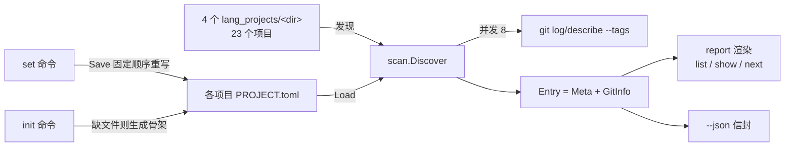

# Design Document — projstat

## Overview

projstat 是一个 Go 编写的单二进制 CLI，为 `language_projects` 总仓下 4 个语言子仓的 23 个项目提供统一状态标注与追踪。数据模型为"静态手工标注 + 动态 git 采集"两层：手工标注落在每个项目根目录的 `PROJECT.toml`，git 元数据每次运行时并发现采、不落盘；两者合并渲染为表格 / 详情 / 待办三种视图，并提供 zedhub 风格的 JSON 信封输出。

## Context



- 总仓为 git submodules 结构，项目目录不是独立 git 仓库，而是各语言 monorepo 的子目录——`git -C <dir>` 仍可逐目录采集。
- 现有元数据散落在 README / TODO / NOTES / SPEC / HANDOFF.md，格式随机、各自为政——projstat 对这些文档不做任何解析与检测（用户已确认），信息统一来自 PROJECT.toml + git 元数据。
- 仓库 Go 工具文化：直接依赖极简（mcp-cleanup 仅 1 个直接依赖）、无 cobra、module 名为裸项目名（`module projstat`）。
- 运行环境：Windows + PowerShell 5.1，GBK 默认代码页，需 UTF-8 处理。
- `.archived/` 完全忽略（需求修订已确认）：归档即移目录，工具不再表达归档态，stage 枚举无 archived。

## Goals and Non-Goals

- Goals:
    - 一条命令回答"每个项目处于什么阶段、接下来做什么、是否阅源码/可用/已测试"
    - git 元数据（最后提交、dirty、提交数）自动采集并与手工标注合并展示
    - Windows PowerShell 5.1 下开箱即用：根目录自动发现、UTF-8 输出、CJK 对齐
    - 依赖仅 BurntSushi/toml + golang.org/x/text，单 exe 分发
- Non-Goals:
    - 网页仪表盘（二期，走 `--json` + 单文件 HTML）
    - `.archived/` 内项目的任何管理
    - 写操作涉及 git（不 commit、不 stage，只改文件）
    - TODO/NOTES 等项目内文档的任何处理（不解析、不检测存在性——随机程度高）
    - 多机同步机制（PROJECT.toml 随各语言子仓自然提交即可）

## Detailed Design

### 工程骨架

- [ ] # CREATED `go_projects/projstat/go.mod`
    - **Purpose** module 定义与依赖锁定
    - **Changes** `module projstat`；`go 1.26.6`；require BurntSushi/toml（v1 最新）+ golang.org/x/text（v0.41.0，与 mcp-cleanup 同版本）
    - **Complexity** Low
- [ ] # CREATED `go_projects/projstat/.gitignore`
    - **Purpose** 忽略构建产物
    - **Changes** `projstat.exe`、`*.exe`
    - **Complexity** Low

### 数据模型与 PROJECT.toml（internal/meta）

- [ ] # CREATED `go_projects/projstat/internal/meta/meta.go`
    - **Purpose** 元数据结构、校验、加载与固定顺序落盘（REQ-3、REQ-15）
    - **Changes** 定义以下核心类型与函数：
        ```go
        type Stage string
        var ValidStages = []Stage{"idea", "learning", "wip", "mvp", "usable", "paused", "dropped"}

        type Meta struct {
            Name       string `toml:"name"`
            Lang       string `toml:"lang"`         // go|python|rust|typescript
            Stage      Stage  `toml:"stage"`        // 空串 = 未标注
            SourceRead *bool  `toml:"source_read"`  // nil = 未标注（三态）
            Usable     *bool  `toml:"usable"`
            Tested     *bool  `toml:"tested"`
            Summary    string `toml:"summary"`
            NextAction string `toml:"next_action"`
            NextDue    string `toml:"next_due"`     // "2026-09-30"，空 = 未定
            Notes      string `toml:"notes"`
            UpdatedAt  string `toml:"updated_at"`   // RFC3339 本地时区，tool 维护
        }

        func (m *Meta) Validate() error                 // stage 枚举 + due 日期 "2006-01-02" 校验
        func Load(dir string) (*Meta, error)            // 文件不存在 → (nil, nil)；解析失败 → 带路径的 error
        func Save(dir string, m *Meta) error            // 手写发射器（见下），写前 UpdatedAt = time.Now().Format(RFC3339)
        func Skeleton(name, lang string) *Meta          // 仅 name/lang，其余零值
        ```
    - **Save 手写发射器**：BurntSushi encoder 不支持逐字段注释，故 Save 用 `fmt.Fprintf` 按**固定字段顺序**输出扁平键 + 行尾注释 + 跳过零值布尔；字符串统一走 `escTOML(v string) string`（转义 `"` `\` 与 `\n\r\t` 控制字符，其余可见字符原样）。Load 仍用 BurntSushi 解码——解析难、发射易，各取所长。
    - **规范文件长相**（Save 的输出契约）：
        ```toml
        # projstat 元数据 —— set 重写会丢弃手写注释
        # stage: idea | learning | wip | mvp | usable | paused | dropped
        name = "zedhub"
        lang = "python"
        stage = "usable"
        source_read = true
        usable = true
        summary = "Zed 会话 SQLite 只读查询 CLI"
        next_action = "补导出过滤参数"
        next_due = "2026-09-30"
        notes = ""
        updated_at = "2026-09-06T12:00:00+08:00"
        ```
    - **Complexity** Medium

### 根定位与 git 采集（internal/scan）

- [ ] # CREATED `go_projects/projstat/internal/scan/scan.go`
    - **Purpose** 根目录发现、项目发现、git 并发采集、降级（REQ-1、REQ-2、REQ-9、REQ-10）
    - **Changes**：
        ```go
        type GitInfo struct {
            LastCommitAt time.Time // 零值 = 采集失败/非仓库
            Tag          string    // 最近可达 tag（describe --tags --abbrev=0）；无 tag = 空串
        }
        type Entry struct {
            Dir  string // 相对根："python_projects/zedhub"
            Name string // 目录名
            Lang string // go|python|rust|typescript（由 <lang>_projects 推导）
            Meta *Meta  // nil = 未标注
            Git  GitInfo
        }

        func FindRoot(start string) (string, error)
        // 从 start 逐级向上：目录同时含 .git（目录或文件均可，兼容 worktree）与 go_projects 即命中；
        // 到盘符未命中 → error（信息含 --root 用法）

        func Discover(root string) ([]Entry, error)
        // 遍历 go_projects/python_projects/rust_projects/typescript_projects 的直接子目录（仅目录，按名排序）；
        // 逐个 meta.Load 填充 Entry.Meta；不触碰 .archived

        func CollectGit(root string, es []Entry)
        // 信号量 8 并发，对每个 Entry 仅两条只读命令：
        //   git -C <dir> log -1 --format=%cI                     → LastCommitAt（time.Parse RFC3339）
        //   git -C <dir> describe --tags --abbrev=0 <该目录最后提交> → Tag（"该项目最后提交时已进入的最近 tag"）
        //   （第二条先取 git log -1 --format=%H 得到 commit，再 describe；无 tag/失败 → 空串）
        // 不采集 commit message 等正文；任一命令失败（git 不在 PATH / 非仓库）→ 该 Entry 的 GitInfo 保持零值，绝不报错中断（REQ-10）
        ```
    - **Complexity** Medium
- [ ] # CREATED `go_projects/projstat/internal/scan/console_windows.go` 与 `console_other.go`
    - **Purpose** Windows 代码页修正（REQ-13）
    - **Changes** 前者 `//go:build windows`，`func SetupConsole()` 内 `kernel32.SetConsoleOutputCP(65001)`（syscall 实现，无新依赖）；后者空实现
    - **Complexity** Low

### 渲染与 JSON（internal/report）

- [ ] # CREATED `go_projects/projstat/internal/report/render.go`
    - **Purpose** 表格 / 详情 / 待办三种视图 + 相对时间 + CJK 对齐 + ANSI 管理 + JSON 信封（REQ-5、REQ-6、REQ-8、REQ-11、REQ-13）
    - **Changes**：
        ```go
        var UseColor bool // main 启动时判定：stdout 为字符设备（os.Stdout.Stat() & os.ModeCharDevice）且非 --json

        func Width(s string) int          // 逐 rune 用 x/text/width.LookupRune：EastAsianWide/Fullwidth → 2，否则 1
        func Pad(s string, w int) string  // 按 Width 补空格（截断超宽时避免切断 ANSI，调用方先算内容宽）
        func RelTime(t time.Time) string  // 未来/过去均可："<1h" "3h" "2d" "3w" "1y"；零值 → "-"
        func Table(es []Entry) string     // list 表格：NAME|LANG|STAGE|SRC|USE|TST|COMMIT|NEXT_DUE
        func NextTable(es []Entry) string // NAME|LANG|STAGE|DUE|ACTION（action 截断 ~40 显示宽）
        func Show(e Entry) string         // key-value 详情 + git 小节（最后提交时间、最近 tag）
        func Envelope(data any, count int, elapsed time.Duration) string // {"status":"ok",...}，encoding/json Marshal
        ```
    - **三态列**：`✓`（true）/ `✗`（false）/ `-`（nil 或未标注）；stage 空串显示 `-`
    - **逾期规则**：`next_due != ""` 且 `parse(next_due) < today` → 该行 next_due 文本包红色 ANSI（`\x1b[31m…\x1b[0m`），仅 UseColor 时生效
    - **Complexity** High（对齐 + ANSI + 截断三者耦合是本项目最大实现风险点）
- [ ] # CREATED `go_projects/projstat/internal/report/json.go`
    - **Purpose** JSON payload 组装（REQ-11）
    - **Changes** 定义导出视图结构（三态布尔 → `*bool` json 序列化自然得到 true/false/null）：
        ```go
        type EntryJSON struct {
            Dir string `json:"dir"`; Name string `json:"name"`; Lang string `json:"lang"`
            Stage string `json:"stage"`; SourceRead *bool `json:"source_read"`
            Usable *bool `json:"usable"`; Tested *bool `json:"tested"`
            Summary string `json:"summary"`; NextAction string `json:"next_action"`
            NextDue string `json:"next_due"`; UpdatedAt string `json:"updated_at"`
            LastCommitAt string `json:"last_commit_at"` // RFC3339 或 ""
            Tag string `json:"tag"`; Overdue bool `json:"overdue"`
        }
        func EntryToJSON(e Entry) EntryJSON
        ```
    - **Complexity** Low

### CLI 入口与子命令（main.go）

- [ ] # CREATED `go_projects/projstat/main.go`
    - **Purpose** 子命令分发、参数解析、退出码（REQ-4、REQ-5、REQ-6、REQ-7、REQ-8、REQ-12）
    - **Changes** `func main() { scan.SetupConsole(); os.Exit(run(os.Args[1:])) }`；`run` 手写 switch 分发，全局 flag 集：`--root`（FindRoot 失败时的显式覆盖）、`--json`：
        | 命令 | 参数 | 行为 |
        |---|---|---|
        | （无） | 同 list | 默认视图 |
        | init | — | Discover 后对 Meta==nil 者写 Skeleton；输出 `created N, skipped M` |
        | list | --lang --stage --sort name\|commit\|due | 过滤 → 排序（name 默认不分大小写；commit=LastCommitAt 降序零值垫底；due=NextDue 升序空值垫底）→ Table |
        | show | \<name\> | 名称解析（见下）→ Show 详情 |
        | set | \<name\> --stage --source-read --usable --tested --summary --next --due --notes --lang | Load（无则 Skeleton）→ `flag.Visit` 只应用显式设置的 flag（bool flag 天然支持 `--usable` 与 `--usable=false`）→ Validate → Save → 单行确认 |
        | next | — | 过滤 NextAction != "" → 逾期置顶 → due 升序空值最后 → NextTable |
        - **名称解析**：按 Entry.Name 全局匹配；恰好 1 个 → 执行；0 个 → 退出码 1 列近似名；>1 个 → 退出码 1 列候选并提示 `<lang>/<name>` 形式（lang/name 二段式再解析一次）
        - **退出码**：0 成功含空结果 / 1 运行错误（根定位失败、名称无匹配、TOML 解析失败）/ 2 用法错误（未知子命令、非法 flag、set 值校验失败且未写文件）
        - **--json**：list/next 输出 `data` 数组 + count + elapsed_ms；show 输出单对象；错误路径输出 `{"status":"error","message":…}` 且退出码 1
    - **Complexity** Medium

### 文档与自举

- [ ] # CREATED `go_projects/projstat/README.md`
    - **Purpose** 使用说明与字段文档
    - **Changes** 命令示例、PROJECT.toml 字段表、stage 枚举中文释义、"set 重写丢弃手写注释"明示、`chcp 65001` 提示
    - **Complexity** Low
- [ ] # CREATED `go_projects/projstat/PROJECT.toml`
    - **Purpose** 自身也纳入管理（23 → 24 个项目，含 projstat 自己）
    - **Changes** `projstat init` 生成后按实情补 stage=usable 等字段
    - **Complexity** Low

### Functional Requirements Table

| Requirement ID | Requirement | Design Component |
|----------------|-------------|------------------|
| REQ-1 | 项目发现（4 子仓深度 1，23 个） | scan.Discover |
| REQ-2 | 根目录定位 / --root | scan.FindRoot + main.go --root |
| REQ-3 | PROJECT.toml 字段与校验 | meta.Meta / Validate / Load / Save |
| REQ-4 | init 幂等骨架 | main.go init + meta.Skeleton |
| REQ-5 | list 表格过滤排序 | main.go list + report.Table |
| REQ-6 | show 详情与名称解析 | main.go 名称解析 + report.Show |
| REQ-7 | set 单字段更新 | main.go set（flag.Visit）+ meta.Save |
| REQ-8 | next 待办视图 | main.go next + report.NextTable |
| REQ-9 | git 并发采集不落盘 | scan.CollectGit（信号量 8） |
| REQ-10 | git 缺失降级 | scan.CollectGit 零值容忍 |
| REQ-11 | JSON 信封 | report.Envelope + report.json |
| REQ-12 | 退出码 0/1/2 | main.go run |
| REQ-13 | Windows 控制台兼容 | scan.SetupConsole + report.Width/UseColor |
| REQ-14 | 依赖约束 | go.mod（toml + x/text）、手写 switch |
| REQ-15 | 固定顺序重写 + 注释明示 | meta.Save 发射器 + README |

### Action checklist

- [ ] 初始化工程：go.mod、.gitignore、空 main.go 可编译（REQ-14）
- [ ] meta 包：Meta/Validate/Load/Save/Skeleton + escTOML（REQ-3、REQ-15）
- [ ] scan 包：FindRoot/Discover/CollectGit + console_windows/other（REQ-1、REQ-2、REQ-9、REQ-10、REQ-13）
- [ ] report 包：Width/Pad/RelTime/UseColor/Table/NextTable/Show + json.go（REQ-5、REQ-6、REQ-8、REQ-11、REQ-13）
- [ ] main.go：init/list/show/set/next 分发、名称解析、退出码、--root/--json（REQ-4~REQ-8、REQ-12）
- [ ] README + 自身 PROJECT.toml + go build/vet 通过（REQ-15）
