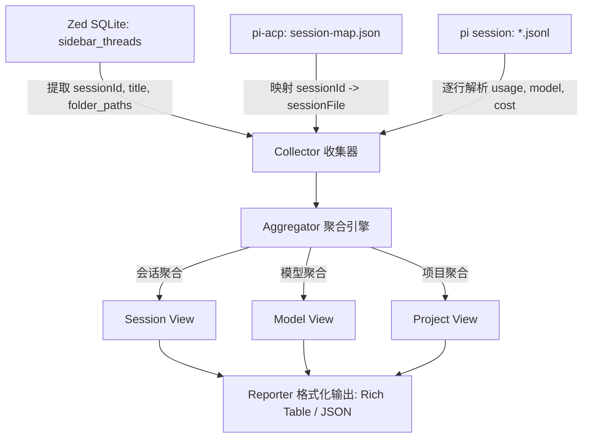

# 📋 Plan: Zed pi-acp Token 消耗与成本统计工具

## 问题陈述
Zed 编辑器通过 `pi-acp`（基于 @earendil-works/pi-coding-agent）接入外部 Agent 进行代码辅助，但在日常使用中缺乏透明的 Token 消耗看板与成本统计。用户需要一个独立可执行程序，能够自动关联 Zed 会话元数据与 pi 底层日志，多维度（按项目/工作区、按模型、按会话明细、时间区间）汇总 Token（输入/输出/缓存/思考推理）与费用。

## 需求
1. **多数据源自动关联**：
   - 从 Zed 的 SQLite 数据库（`sidebar_threads`）安全复制读取 `agent_id = 'pi-acp'` 的会话标题与工作区组合（遵循 safe read 铁律，复制 WAL 三件套到临时目录读取）。
   - 从 `~/.pi/pi-acp/session-map.json` 关联 `sessionId` 与对应的 `sessionFile` 路径。
   - 读取并解析底层 JSONL 会话事件，精确聚合 Token 消耗。
2. **多模型单会话处理**：
   - 单个会话内切模型时，按每条 assistant 消息所属的 `provider/model` 独立归集 Token 与费用。
   - 在会话视图中展示混合模型标签，在模型聚合视图中按真实调用模型精确分拆统计。
3. **多维聚合呈现看板**：
   - 终端美观表格输出（支持 Rich 表格渲染与普通文本回退）。
   - 视图支持：会话维度（最近 N 条会话看板）、模型聚合维度（各模型总 Token 与金额）、项目工作区聚合维度（各工程消耗对比）。
   - 遵循《CLI 工具开发标准》，默认人读终端看板，支持 `--json` 输出结构化数据。
4. **技术选型与存放位置**：
   - 子项目置于 `python_projects/zed-pi-stats`，支持 `uv run` 免安装开箱即用。

## 背景与调研结论
- **Zed db 路径**：`%LOCALAPPDATA%\Zed\db\0-stable\db.sqlite`，表 `sidebar_threads` 字段 `session_id`, `agent_id`, `title`, `folder_paths`, `updated_at`。
- **映射文件路径**：`~/.pi/pi-acp/session-map.json`，结构为 `sessions[sessionId] = { cwd, sessionFile, updatedAt }`。
- **日志格式**：`~/.pi/agent/sessions/<encoded-cwd>/*.jsonl`，行类型包括 `message`（含 assistant 的 `usage` 和 `model`）、`usage`、`compaction` 等，Token 字段完整（`input`, `output`, `cacheRead`, `cacheWrite`, `reasoning`, `totalTokens`, `cost`）。

## 架构方案

## 任务分解

- [x] Task 1: 初始化项目配置与数据实体定义
  - 文件：`python_projects/zed-pi-stats/pyproject.toml`, `python_projects/zed-pi-stats/src/zed_pi_stats/models.py`
  - 实现：创建 pyproject.toml（配置 rich、click/argparse 等依赖），定义 TokenUsage、ModelUsageBreakdown、SessionStats、ProjectStats 等强类型数据模型。
  - 验证：`uv run --project python_projects/zed-pi-stats python -c "import zed_pi_stats.models; print('models ok')"` 返回 models ok
  - Demo：能够实例化标准 Token 数据结构并支持序列化为字典与 JSON。

- [x] Task 2: 实现安全数据采集与会话解析引擎 (Collector)
  - 文件：`python_projects/zed-pi-stats/src/zed_pi_stats/collector.py`
  - 实现：实现 `read_zed_threads()`（临时目录复制 WAL 安全读取 SQLite）、`load_session_map()`（解析 session-map.json）、`parse_session_jsonl()`（逐行解析并按模型归集 usage，兼容 compaction 与 branch_summary）。
  - 验证：`uv run --project python_projects/zed-pi-stats python -c "from zed_pi_stats.collector import collect_all_sessions; s = collect_all_sessions(); print(f'Collected {len(s)} sessions')"` 打印采集到的有效会话数量 > 0
  - Demo：读取本地真实存在的 10+ 个 pi-acp 会话并输出前 3 个会话的 Token/费用汇总。

- [x] Task 3: 实现多维统计聚合与格式化输出 (Aggregator & Reporter)
  - 文件：`python_projects/zed-pi-stats/src/zed_pi_stats/reporter.py`
  - 实现：编写聚合函数（按会话、按模型、按项目工作区）；编写终端 Rich 渲染器（彩色看板、数字千分符格式化、美元费用格式化），并提供纯文本兼容及 `--json` 格式化支持。
  - 验证：`uv run --project python_projects/zed-pi-stats python -c "from zed_pi_stats.collector import collect_all_sessions; from zed_pi_stats.reporter import print_summary; print_summary(collect_all_sessions())"` 终端正常渲染三张汇总表
  - Demo：直接在终端打印「会话消耗明细」、「模型消耗汇总」、「工作区消耗汇总」表格。

- [x] Task 4: CLI 命令行入口接线与收尾
  - 文件：`python_projects/zed-pi-stats/src/zed_pi_stats/cli.py`, `python_projects/zed-pi-stats/README.md`
  - 实现：封装命令行参数（`--limit / -n` 控制最近会话条数、`--model` 仅看模型、`--project` 仅看项目、`--json` 输出 JSON、`--days` 筛选时间范围）；编写项目 README.md 记录使用方法。
  - 验证：`uv run --project python_projects/zed-pi-stats zed-pi-stats --help` 和 `uv run --project python_projects/zed-pi-stats zed-pi-stats --json` 正常退出无报错
  - Demo：运行 `uv run --project python_projects/zed-pi-stats zed-pi-stats -n 5` 输出最近 5 个会话的详细看板。

---
最后更新：2026-09-23
作者：AI & User
版本：v1.0.0
