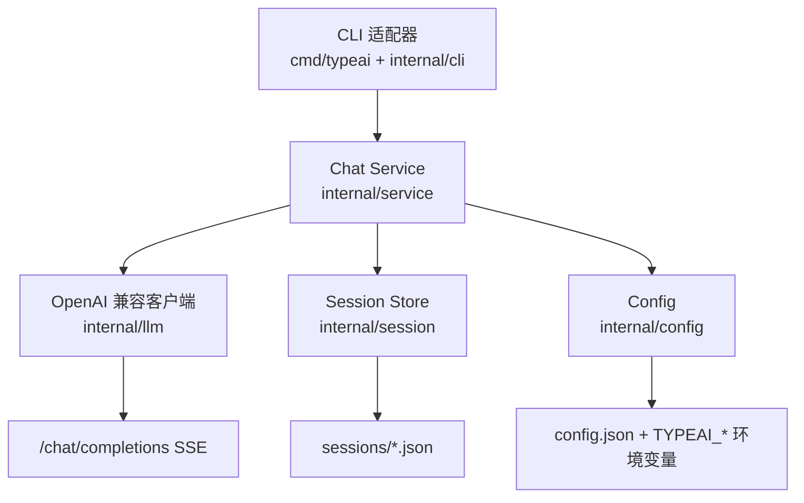

# 计划：typeai 原始打字机 AI 对话 CLI

**问题陈述**：需要一个启动快、依赖轻、交互直接的终端 AI 对话工具：用户启动后立即进入连续问答，AI 回答按打字机模式流式输出；第一阶段不处理界面美化，也不做会话恢复。现有 `quickask` 定位是预设式单问，并且默认 REPL 依赖 `quickaskd` 子进程与握手，不适合作为本次“原始打字机”目标的直接改造对象。

**需求**：

1. 新建 Go 独立项目 `go_projects/typeai`，命令名 `typeai`。
2. 无参数启动进入连续对话；每行输入是一个用户消息，AI 回答流式逐段打印。
3. 接入 OpenAI 兼容 `/chat/completions` 接口，使用 SSE `stream=true`。
4. 多轮上下文仅在当前进程内存中维护；不做 resume、不做历史注入、不做上下文裁剪。
5. 每次 AI 响应成功完成后，把当前完整会话原子写入对应 session JSON；请求失败时不落盘该轮。
6. session JSON 使用缩进格式，供人类直接阅读；每个进程启动时创建一个独立文件。
7. 自有数据只放在 `%APPDATA%\language_projects\typeai\`；取不到 `APPDATA` 时回退 `~/.language_projects/typeai/`。
8. 配置独立于 `quickask`，由 `typeai config set` 管理；`TYPEAI_BASE_URL`、`TYPEAI_API_KEY`、`TYPEAI_MODEL` 可覆盖配置文件。
9. 第一阶段不美化：不做颜色、Markdown 渲染、边框、加载动画和 TUI。
10. 第二期 backlog：`export` 将 session JSON 转为 HTML、界面美化、会话列表/搜索/resume、上下文裁剪策略。

**背景**：

- 用户已确认：技术栈选 Go；AI 接入选 OpenAI 兼容接口；交互为连续会话；持久化要求是每次 AI 响应完成后写入 session JSON，无需 resume；`export` 转 HTML 放第二期。
- 用户已确认：新建 `typeai`，不复用也不修改 `quickask`；配置独立并支持环境变量覆盖。
- `quickask/internal/llm/client.go` 已验证 OpenAI 兼容 SSE 解析思路可参考，但项目间保持隔离，不建立共享依赖。
- 《CLI 工具开发标准》要求新独立 CLI 提供 `schema`，管理/查询命令支持 `--json`，业务逻辑放在 Service 层。`typeai` 的主用例是长交互终端会话，普通 MCP tools/call 不提供通用 PTY/TUI 终端交互，因此第一阶段不提供 MCP，并在 README 记录例外理由。
- Go 子仓项目命名不使用连字符；产 Windows exe 的项目默认配置父仓地鼠图标。

**方案**：

采用单进程、标准库优先的极简架构，不启动后台服务、不做进程间握手。CLI 壳只负责参数解析、行输入、流式输出和退出码；公共 Service 负责对话编排、成功后持久化与业务错误；配置和 session 分别由独立存储模块读写；LLM 客户端仅封装 OpenAI 兼容 HTTP/SSE 协议。

关键行为约定：

- 启动后创建 session 元数据，但首轮成功回答前不写 session 文件；之后每次成功回答都业务追加本轮 user/assistant 消息，并在落盘时把完整会话重新序列化为一个合法 JSON，用临时文件原子替换同一个 session 文件（文件级全量重写，不丢历史）。
- 发送请求时使用“历史消息 + 本轮用户消息”的副本；请求失败不改变可重试的内存历史。
- 成功收到完整 assistant 回答后，才把 user 与 assistant 两条消息追加进正式历史并落盘。
- session 文件名使用 `YYYYMMDD-HHMMSS-<短随机ID>.json`，避免同秒冲突。
- session JSON 不保存 API Key，只保存模型名、时间戳与消息列表。
- `/exit`、`/quit` 退出；空行继续等待输入；Ctrl+C 直接结束进程，已成功完成的上一轮不受影响。
- 配置优先级：显式命令参数 → `TYPEAI_*` 环境变量 → `config.json` → 内置默认值。
- `schema`、`help`、`version` 不读配置、不创建数据目录、不发起网络请求。

**任务分解**：

- [x] Task 1: 搭建 typeai 项目骨架与配置/契约基础 完成
  - 文件：`go_projects/typeai/go.mod`、`go_projects/typeai/cmd/typeai/main.go`、`go_projects/typeai/internal/cli/run.go`、`go_projects/typeai/internal/cli/output.go`、`go_projects/typeai/internal/config/config.go`、`go_projects/typeai/internal/service/errors.go`
  - 实现：创建 Go 1.26 标准库项目；CLI 分发 `help`、`version`、`schema`、`config` 与无参数交互入口；实现数据目录定位、原子配置读写、环境变量覆盖和稳定 JSON 包络；先让 `help/version/schema/config` 可构建、可运行，交互入口返回占位业务错误。
  - 验证：在 `go_projects/typeai` 执行 `gofmt -w .`、`go build ./...`、`go vet ./...`、`go test ./...`；预期均成功，且 `go run ./cmd/typeai schema` 输出可解析 JSON、不创建数据目录。
  - Demo：能运行 `typeai help`、`typeai version`、`typeai config get --json`，并看到统一 JSON 包络。
  - 实施说明：已按执行约定不编写/运行测试；已执行 `gofmt -w <Task 1 文件>` 与 `go build ./...`，编译通过。Task 3 接线前，对话入口按计划保留占位错误。

- [x] Task 2: 实现 OpenAI 兼容流式客户端与会话服务 完成
  - 文件：`go_projects/typeai/internal/llm/client.go`、`go_projects/typeai/internal/session/store.go`、`go_projects/typeai/internal/service/chat.go`
  - 实现：用标准库实现 `/chat/completions` SSE 请求与增量回调；ChatService 维护多轮消息副本，成功后追加 user/assistant 消息；SessionStore 负责创建文件名、缩进序列化和临时文件原子替换；定义 `bad_args`、`not_configured`、`upstream`、`internal` 等业务错误。
  - 验证：在 `go_projects/typeai` 执行 `go test ./internal/llm ./internal/session ./internal/service`；预期覆盖 SSE 成功/HTTP 错误/取消、失败轮不落盘、成功轮完整落盘与同秒文件名不冲突。
  - Demo：通过注入 fake HTTP client 与临时目录调用 Service 后，session JSON 中按顺序包含 user/assistant 消息且无 API Key。
  - 实施说明：已按执行约定不编写/运行测试；已执行 `gofmt -w <Task 2 文件>` 与 `go build ./...`，编译通过。Service 已实现请求历史副本、成功后提交历史、失败轮不落盘和 session 原子替换。

- [x] Task 3: 接线原始打字机 REPL 与配置命令 完成
  - 文件：`go_projects/typeai/internal/cli/run.go`、`go_projects/typeai/internal/cli/chat.go`、`go_projects/typeai/internal/cli/config.go`、`go_projects/typeai/cmd/typeai/main.go`
  - 实现：无参数启动时读取有效配置并进入 `> ` 行输入循环；AI 增量直接写 stdout，成功后换行并按“业务追加、文件级全量重写”方式落盘，失败输出人读错误并保留可重试历史；实现 `/exit`、`/quit`、空行与 Ctrl+C 退出；实现 `config get/set` 的人读与 `--json` 模式，`set` 支持部分更新且不回显 API Key。
  - 验证：在 `go_projects/typeai` 执行 `go build ./...`、`go vet ./...`、`go test ./...`；再用本地 fake OpenAI SSE 服务启动 `go run ./cmd/typeai` 连续输入两轮，预期两轮回答都流式输出、上下文生效、session JSON 在第二轮后被更新。
  - Demo：配置真实 OpenAI 兼容端点后，运行 `typeai` 即可连续问答；退出后可直接打开 `%APPDATA%\language_projects\typeai\sessions\` 中对应 JSON 阅读。
  - 实施说明：已按执行约定不编写/运行测试与 fake SSE 端到端流程；已执行 `gofmt -w <Task 3 文件>` 与 `go build ./...`，编译通过。REPL 已接入 ChatService，成功轮按“业务追加、文件级全量重写”落盘，失败轮保留可重试历史。

- [x] Task 4: 补齐 schema、README、构建脚本与 Windows 图标 完成
  - 文件：`go_projects/typeai/internal/cli/schema.go`、`go_projects/typeai/README.md`、`go_projects/typeai/build.ps1`、`go_projects/typeai/.gitignore`、`go_projects/typeai/cmd/typeai/icon.ico`、`go_projects/typeai/cmd/typeai/rsrc_windows_amd64.syso`
  - 实现：让 `schema` 与命令契约同源导出 `interface: "cli"` 目录；README 记录命令、配置优先级、session JSON 结构、数据目录、无 MCP 例外理由与第二期 backlog；build.ps1 构建 Windows amd64 exe；按父仓默认图标流程复制地鼠图标并生成 `.syso`。
  - 验证：在 `go_projects/typeai` 执行 `go build ./...`、`go vet ./...`、`go test ./...`、`.\build.ps1`；预期构建成功，`typeai schema` 与 README 描述一致，exe 图标提取结果为 32x32。
  - Demo：用户可按 README 配置一次后，通过构建出的 `typeai.exe` 直接进入打字机对话。
  - 实施说明：已按执行约定不编写/运行测试；已执行 `go build ./...`、`.\build.ps1 -Version dev` 与图标提取检查，编译成功且提取结果为 32x32。README、CLI schema、构建脚本、默认图标与 `.gitignore` 已补齐。

- [ ] Task 5: 端到端收尾与轻量启动核对 待办
  - 文件：`go_projects/typeai/README.md`、`go_projects/typeai/internal/cli/*.go`、`go_projects/typeai/internal/service/*.go`
  - 实现：检查所有命令接线，移除占位与未使用代码；确认轻量入口无业务 I/O；核对错误输出流、退出码、session 原子写和第二期 backlog；如发现小问题只在本项目范围内修正。
  - 验证：在 `go_projects/typeai` 执行 `gofmt -w .`、`go build ./...`、`go vet ./...`、`go test ./...`；执行 `Measure-Command { .\build\typeai.exe --help }` 记录启动耗时，预期明显低于带子进程握手方案且无后台进程残留；执行 fake SSE 端到端对话验证两轮上下文与 session 文件。
  - Demo：最终交付一个单进程、无守护、无美化的快速终端 AI 对话工具，并留存可复现验证结果。

---

- 最后更新：2026-09-25
- 作者：AI
- 版本：v1.0
