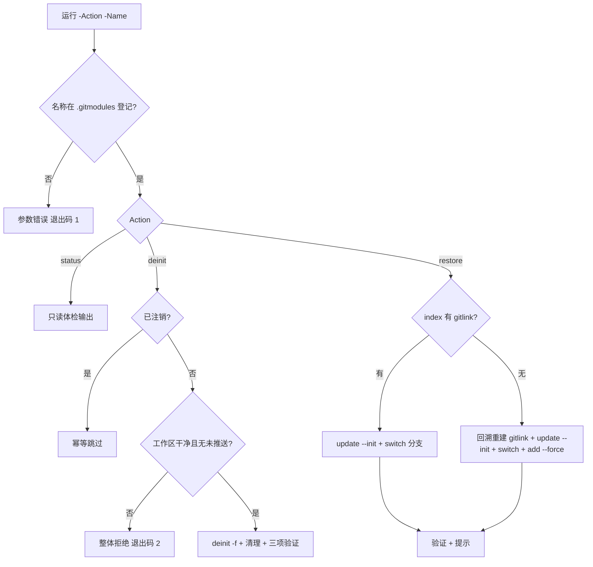

# 24. 子模块临时注销与恢复脚本（submodule-toggle.ps1）

Plan for: "为 native/rust 子模块提供临时注销（deinit）与恢复（restore）的一键脚本，自带前置判断与 AI 可读自描述"

## 问题陈述

`native_projects`、`rust_projects` 按《Git 子模块临时注销（native、rust）.md》做本地注销/恢复时，全部依赖手工多步 git 命令与人工核验（本地 = 远端、工作区干净），容易漏步骤，对新 AI 会话也不友好；且 `native_projects` 存在 gitlink 被静默移除的历史遗留，恢复路径与 `rust_projects` 不同。需要一个放在 `.scripts/` 的单脚本，把检查、执行、验证一次做全。

范围边界：

- 只做本地操作：`git submodule deinit -f` 与恢复（`update --init` + 切换跟踪分支 + 必要时重建 gitlink）；
- 不改 `.gitmodules`、不删 `.git/modules/<name>`、不动远端；
- 不自动执行父仓 commit / push，只输出建议命令。

## 需求（用户决策原话）

- [1]=a：注销前若发现子模块有未提交改动或未推送 commit，拒绝执行——报告哪个子模块不干净，由用户先 commit/push 干净后再跑；
- [2]=a：恢复 `native_projects` 时 gitlink 已被静默移除，脚本自动从历史提交取回 gitlink 并完成恢复，最后提示需要提交父仓指针；
- [3]=a：子模块名称必须显式给出（`-Name`），不给名字就报错并示例提示（防止误伤主力子模块）。

补充需求（任务本身）：

- 脚本自描述：comment-based help + 顶部 AI 速读注释块 + 参数错误时输出用法示例，其他 AI agent 拿到即可使用；
- 动作显式：`-Action status|deinit|restore`，其中 status 为只读体检；
- 文档同步：README「可用脚本」表与 `docs/repo` 注销文档引用脚本。

## 背景（调研发现）

- 当前状态实测（2026-09-26）：`git submodule status` → `go_projects`(+)、`python_projects`(无前缀)、`rust_projects`(-)、`typescript_projects`(+)；`native_projects` 不出现（gitlink 缺失）。index 中 rust gitlink = `b260a913`，无 native 条目；`.git/modules/` 五个库全部保留；`.git/config` 仅注册 go/python/typescript。
- native gitlink 历史核验：`git rev-list -1 HEAD -- native_projects` = `a134f32`（该提交中路径已删除），其父提交 `a134f32^` 的 `ls-tree` 为 `160000 089db157 native_projects`——脚本可动态回溯找到，无需硬编码 hash。
- 编码约定：既有 `.scripts/*.ps1` 均为 UTF-8 with BOM（实测 `ef bb bf`）；新脚本沿用，保证 Windows PowerShell 5.1 下中文不乱码。
- 文档依据：`docs/repo/Git 子模块临时注销（native、rust）.md`（时间线、验证命令、恢复方案 A/B、gitlink 遗留说明）。
- 计划编号：`docs/plans/` 当前最大编号 23，本计划取 24。

## 方案

### CLI 契约

```powershell
# 只读体检
./.scripts/submodule-toggle.ps1 -Action status  -Name native_projects,rust_projects
# 临时注销（本地 deinit，保留恢复能力）
./.scripts/submodule-toggle.ps1 -Action deinit  -Name native_projects,rust_projects
# 恢复
./.scripts/submodule-toggle.ps1 -Action restore -Name rust_projects
```

- `-Action`、`-Name` 均必填；`-Name` 支持逗号或空格分隔多个；名称必须在 `.gitmodules` 登记，否则参数错误；
- 父仓根校验：脚本目录上一级必须存在 `.gitmodules`，否则报错；
- 退出码：0=成功（含幂等跳过）；1=参数/校验错误；2=前置检查不通过；3=执行失败；
- 全部输出中文；错误提示附用法示例与 `Get-Help` 指引。

### 判定状态机



### deinit 前置检查（任一不通过则整体拒绝，逐项报告）

1. 已注销（工作区不存在/未初始化）→ 幂等跳过，不计失败；
2. 工作区干净：`git -C <path> status --porcelain` 为空（含未跟踪文件）；
3. 无本地独有提交：`git -C <path> log --all --not --remotes --oneline` 为空（未推送保护）；
4. （提示不阻断）存在 stash 时输出提醒——stash 保存在 `.git/modules/<name>`，deinit 不会丢失。

### deinit 执行

1. `git submodule deinit -f -- <path>`；
2. 残留空目录则删除（仅当目录存在）；
3. 验证：`git submodule status -- <path>` 前缀 `-`、`.git/modules/<name>` 仍存在、`.git/config` 已无该子模块注册；
4. 汇总提示：未动 `.gitmodules`/远端/index，无需父仓提交。

### restore 执行

1. 已初始化 → 幂等跳过；
2. index gitlink 检测（`git ls-files -s -- <path>` 解析 160000）：
   - 存在：`git submodule update --init -- <path>` → `git -C <path> switch <branch>`（branch 取自 `.gitmodules`，默认 main）；
   - 缺失（native 型）：动态回溯 `git rev-list HEAD -- <path>`，取第一个 `git ls-tree` 含 160000 的提交 c → `git checkout <c> -- <path>` → `update --init` → `switch <branch>` → `git add --force -- <path>`（index 更新为分支最新）→ 结束时提示需提交父仓指针并提供建议命令；
3. 验证：`git submodule status` 有对应行；`git -C <path> branch --show-current` = 目标分支；
4. 提示：不自动提交、不推送。

### status 体检（只读）

逐目标输出：`.gitmodules` 登记、`.git/modules` 库、index gitlink 值与来源、初始化状态、分支/HEAD、工作区干净度、未推送提交数、stash 数、状态判定与下一步建议。

## 任务分解

- [x] Task 1: 脚本骨架 + status 只读体检 完成
  - 文件：`.scripts/submodule-toggle.ps1`（新建，UTF-8 with BOM）
  - 实现：comment-based help（3 个动作示例 + 检查规则说明）；顶部 AI 速读注释块；参数与父仓根校验；status 动作完整渲染
  - 验证：`powershell -ExecutionPolicy Bypass -File .scripts/submodule-toggle.ps1 -Action status -Name native_projects,rust_projects` → native 显示「gitlink 缺失 + 已注销」、rust 显示「gitlink b260a913 + 已注销」，与 `git submodule status` 实测一致；缺 `-Name` 时退出码 1 且输出用法示例
  - Demo：一条命令看清两个子模块的注销状态与恢复可行性

- [x] Task 2: deinit 动作（前置判断 + 幂等 + 整体拒绝） 完成
  - 文件：`.scripts/submodule-toggle.ps1`
  - 实现：前置检查 1-4、整体拒绝汇总、deinit + 残留清理 + 三项验证、汇总提示
  - 验证：① 真实仓 `-Action deinit -Name native_projects,rust_projects` → 两者均为已注销，输出「已注销，跳过」，仓库状态零变化（`git submodule status` 与跑前一致）；② 临时 mini 测试仓（`%TEMP%`，用后删除）验证：子模块有未推送 commit → 拒绝（退出码 2）；有未提交改动 → 拒绝；干净 → deinit 成功且 `.git/modules` 保留
  - Demo：mini 仓演示「不干净即拒绝、干净才注销」的完整判断链路

- [x] Task 3: restore 动作（普通 + gitlink 重建） 完成
  - 文件：`.scripts/submodule-toggle.ps1`
  - 实现：普通恢复与 native 型 gitlink 重建两条路径、切换分支、验证、父仓提交提示
  - 验证：临时 mini 测试仓（用后删除）验证两种路径：① gitlink 在 index → `update --init` + `switch` 后 `submodule status` 正常、分支 = main；② `git rm --cached` 模拟 gitlink 缺失 → 脚本自动回溯重建、恢复成功、`git ls-files -s` 出现 160000 且 index 值 = 子模块 HEAD；③ 重复 restore → 幂等跳过
  - Demo：mini 仓演示 gitlink 缺失场景被自动修复恢复

- [x] Task 4: 文档同步（README 表 + 注销文档引用） 完成
  - 文件：`README.md`（「可用脚本」表加一行）、`docs/repo/Git 子模块临时注销（native、rust）.md`（新增「脚本操作（推荐）」节，保留手动命令作原理说明）
  - 实现：表行含脚本名/功能/用法；文档节含三个动作示例、检查规则、与手动步骤的对应关系
  - 验证：`uv run .scripts/build_docs.py build --strict` 构建通过（无断链）；README 表行与脚本实际参数一致
  - Demo：新 AI 会话从 README 表或注销文档即可发现并正确调用脚本

- [x] Task 5: 收尾（AOCI 维护 + 计划勾选） 完成
  - 文件：`aoci.code.txt`、`.aoci/baseline.json`、本计划文件
  - 实现：全部改动稳定后执行一次 AOCI 维护（新增/变更对象：脚本、README、注销文档）；按机器返回候选逐批 apply 至 remaining=0；勾选计划任务并更新页脚
  - 验证：AOCI 工具返回 aligned / `next_action: none`；本计划任务全部 `[x]` 完成
  - Demo：仓库认知资产与文件现状重新对齐

---
最后更新：2026-09-27
作者：AI & User
版本：v1.1（已批准并执行完毕，2026-09-27）

## 实施说明（执行期记录）

- 按执行约定（skill 默认）未跑 Task 2/3 的临时 mini 测试仓验证与 Task 4 的 `build_docs.py build --strict`；脚本逻辑为静态推导，首次真实使用建议先跑 `-Action status` 观察。
- AOCI 维护一次完成：批次含本任务 4 个对象 + 其他会话遗留 6 个对象（GUIDE 中文重命名系列、agyquota specs/03、typeai specs/02），10/10 apply 成功；verify/check/guide 三级终局证明通过（180/180 Entry，drift 清零，complete=true）。
- 遗留轻微 warning：脚本 424 行，E 规模带应标 L 而非 M（本次写入后跨带增长），下次该 Entry 维护时更新。
