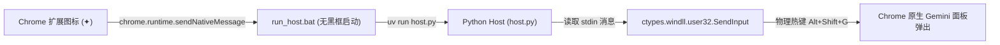

# Plan: Chrome Gemini 图标极简启动器 (Native Messaging + uv)

**问题陈述**：
Chrome 原生内置的“Chrome 中的 Gemini”在浏览器工具栏占用过宽的药丸形胶囊按钮（`✦ 问问 Gemini`），挤占了顶栏地址栏空间。用户希望将其视觉上精简为一个仅占单图标宽度的 `✦` 图标，点击后能无缝呼出该原生 AI 伴侣面板。

**需求**：
1. **视觉精简**：Chrome 扩展只提供一个 16×16 / 32×32 的极简 `✦` 图标按钮，不带多余文字，常驻在扩展工具栏。
2. **原生呼出**：点击扩展按钮时，通过 Native Messaging 协议向本地主机发送信号，模拟 Windows 物理键盘热键 `Alt + Shift + G`，唤起 Chrome 内置原生 Gemini 伴侣侧边栏。
3. **技术栈约定**：
   - 宿主程序使用 Python，结合 `uv` 命令（单文件脚本通过 PEP 723 依赖声明免虚拟环境管理，或独立轻量依赖）。
   - 模拟按键使用 Windows 原生 `ctypes.windll.user32.SendInput`（零额外第三方大库，毫秒级响应，可靠传递系统物理热键）。
   - 代码工程放置在 `typescript_projects/gemini-launcher/`。
   - 提供注册表一键注册脚本（`.bat` / `.ps1`），方便将 Native Messaging Host 注册至当前用户的 Chrome (`HKCU\Software\Google\Chrome\NativeMessagingHosts`)。

**背景**：
1. Chrome 扩展受限于沙盒安全机制，无法直接通过 JS 向浏览器宿主窗口触发系统物理快捷键。
2. Native Messaging 是 Chrome 官方支持的标准双向通信机制。扩展可以通过标准输入输出（stdin/stdout，前置 4 字节小端长度头）与本地进程通信。
3. 用户本地已具备 `uv` 环境（版本 0.12.17）。结合 `uv run host.py` 可以做到环境完全自闭环。

**方案**：

---

**任务分解**：

- [ ] Task 1: 初始化项目目录与 Chrome 扩展核心文件
  - 文件：
    - `typescript_projects/gemini-launcher/extension/manifest.json`
    - `typescript_projects/gemini-launcher/extension/background.js`
    - `typescript_projects/gemini-launcher/extension/icons/icon16.png`
    - `typescript_projects/gemini-launcher/extension/icons/icon32.png`
    - `typescript_projects/gemini-launcher/extension/icons/icon128.png`
  - 实现：
    - `manifest.json` 采用 Manifest V3，声明 `action`、`nativeMessaging` 权限。
    - `background.js` 监听 `chrome.action.onClicked`，调用 `chrome.runtime.sendNativeMessage("com.gemini.launcher", { action: "trigger" })`。
    - 生成/提供符合 Gemini 风格的高清极简 `✦` 图标（SVG 转 PNG 或 Canvas 绘制高保真四角星芒）。
  - 验证：文件结构完整，manifest 符合 Chrome MV3 规范。
  - Demo：Chrome 以开发者模式加载该扩展后，工具栏出现极简四角星芒图标。

- [ ] Task 2: 编写基于 uv 的 Python Native Host 与无黑框启动脚本
  - 文件：
    - `typescript_projects/gemini-launcher/host/host.py`
    - `typescript_projects/gemini-launcher/host/run_host.bat`
    - `typescript_projects/gemini-launcher/host/com.gemini.launcher.json`
  - 实现：
    - `host.py`：使用 Python 标准库 `sys.stdin.buffer` 读取 Native Messaging 协议（4 字节小端 uint32 消息长度 + JSON），解析到消息后调用 `ctypes.windll.user32.SendInput` 精确发送 `VK_MENU (Alt)` + `VK_SHIFT (Shift)` + `0x47 ('G')` 的按下与释放，随后通过 stdout 回显成功响应。
    - `run_host.bat`：使用 `uv run python host.py`（或指向 uv 的无窗执行），保证即使环境变化也能稳定拉起。
    - `com.gemini.launcher.json`：声明 Native Host 配置（`name: com.gemini.launcher`, `path`, `type: stdio`, `allowed_origins` 绑定扩展 ID）。
  - 验证：直接在终端通过 stdin 管道写入 4 字节前缀的测试 JSON 消息，验证按键发送逻辑且正常退出。
  - Demo：运行测试命令后能成功触发系统热键。

- [ ] Task 3: 编写一键注册与解除注册脚本并打通端到端链路
  - 文件：
    - `typescript_projects/gemini-launcher/register.ps1`
    - `typescript_projects/gemini-launcher/unregister.ps1`
    - `typescript_projects/gemini-launcher/README.md`
  - 实现：
    - `register.ps1`：自动获取当前目录下的 `com.gemini.launcher.json` 绝对路径，将其注册到注册表项 `HKCU:\Software\Google\Chrome\NativeMessagingHosts\com.gemini.launcher`；支持传入或交互式提示输入扩展 ID 并自动回写 allowed_origins。
    - `unregister.ps1`：从注册表中清理注册项。
    - `README.md`：详细记录使用说明（关闭原生药丸按钮 -> 加载扩展 -> 运行注册脚本 -> 点击图标验证）。
  - 验证：运行 `register.ps1` 后，PowerShell 查询注册表项确认键值正确指向 manifest json。
  - Demo：在 Chrome 顶部点击 `✦` 图标，右侧无缝弹出原生 Gemini 侧边栏。

---
**最后更新：** 2026-09-27
**作者：** Antigravity & User
**版本：** v1.0.0
