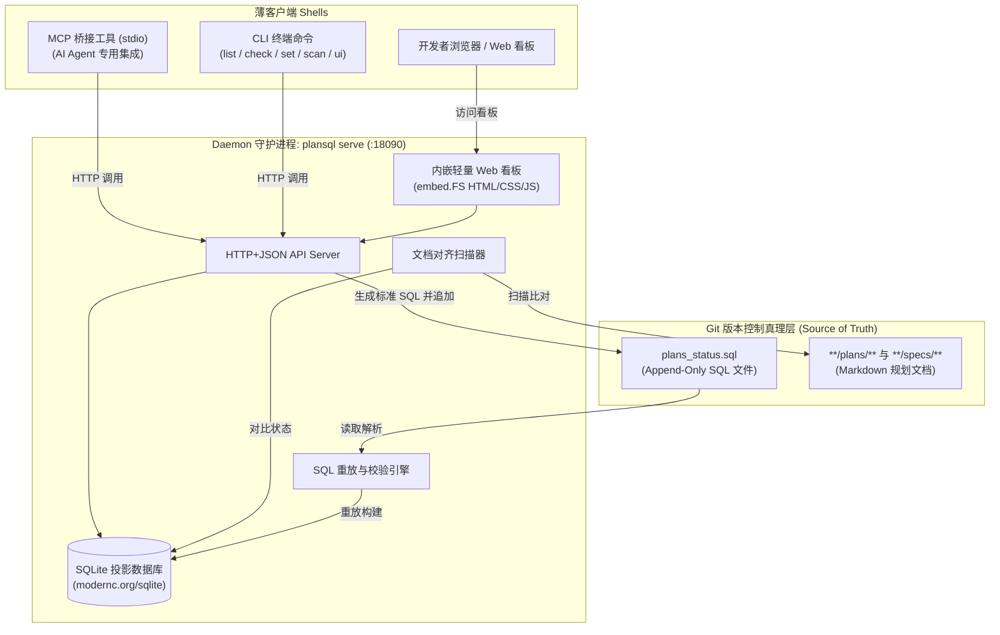

# 28 - plansql：基于 SQL 追加流与 SQLite 投影的 Plan/Spec 状态管理与约束 CLI

## 概述

Plan for: "plansql — 基于 SQL 追加流与 SQLite 投影的 Plan/Spec 状态管理与约束 CLI"

**问题陈述**：
在团队与 AI 协作过程中，项目内的 `**/plans/**` 和 `**/specs/**` 任务规划文档往往缺乏统一机器可读的状态追踪机制；直接将状态存入 SQLite `.db` 文件因二进制合并冲突无法很好地适配 Git 版本控制，而由 AI 直接手写 SQL 则极易出现语法、转义或路径错误。需要一款遵循《CLI 工具开发标准 v2》（daemon + 薄客户端）的 Go 工具，以纯文本追加 SQL（Append-Only WAL）作为 Git 可信源，以 SQLite 作为本地重放投影，负责 SQL 语法/完整性校验、项目文档与状态对齐扫描、内嵌 Web 可视化看板以及提供 CLI/MCP 双入口供人类与 AI 安全更新状态。

**需求**（含用户原话与澄清决策）：
1. **数据真理与存储模式**：
   - 物理存储必须是纯文本 `.sql` 文件，只能追加（Append-Only），提交进 Git，供版本追踪与 AI 读取。
   - SQLite 仅作为运行时投影视图（内存或本地缓存），由工具通过重放 `.sql` 动态构建，不提交进 Git。
2. **表结构设计**：
   - 表名：`plan_spec_status`
   - 字段：
     - `id`: INTEGER PRIMARY KEY AUTOINCREMENT
     - `type`: TEXT NOT NULL CHECK(type IN ('plan', 'spec'))
     - `path`: TEXT NOT NULL UNIQUE（相对于当前项目/仓库的规范化路径）
     - `status`: TEXT NOT NULL CHECK(json_valid(status))（支持存储结构化状态 JSON，含 completed/progress/stage 等）
     - `created_at`: TEXT NOT NULL DEFAULT (datetime('now', 'localtime'))
     - `updated_at`: TEXT NOT NULL DEFAULT (datetime('now', 'localtime'))
3. **功能边界**：
   - **SQL 校验与监测**（`check`）：检测目标 `.sql` 文件中是否存在语法错误、JSON 格式错误或非法路径。
   - **对齐扫描**（`scan`）：扫描文件系统中所有的 `**/plans/**` 和 `**/specs/**`，与当前数据库状态比对，检出未登记文档或失效引用。
   - **可视化看板**（`ui` / 内嵌 Web）：内置轻量 Web 控制台（看板与表格）以及 CLI 终端表格输出，可视化当前 plan/spec 状态与完成度。
   - **双模安全变更**：
     - 支持 AI 与人类通过 CLI（`set` 命令）或 MCP 工具调用变更状态，工具负责格式化并原子追加一条合法 SQL 到指定 `.sql` 文件末尾，并立即刷新视图；
     - 同时也允许直接向 `.sql` 追加文本，并通过 `check` 命令排错。
4. **规范遵循**：
   - 遵循《CLI 工具开发标准 v2》（daemon 架构）：业务逻辑仅编译入 daemon（`plansql serve`），CLI（`cmd/plansql`）与 MCP（stdio）作为薄客户端通过 HTTP+JSON 与 daemon 通信。
   - 数据目录遵循仓库强约束：运行时缓存/地址文件统一存放在 `%APPDATA%\language_projects\plansql\`。
   - 开发语言采用 Go 1.25+，纯 Go 编译无 CGO 依赖（使用 `modernc.org/sqlite`）。

**背景**：
- 仓库内已有 `go_projects/agyquota`、`go_projects/clictl` 等成熟实现，依赖与项目骨架可直接复用参考。
- 根目录 `AGENTS.md` 对 `**/plans/**` 和 `**/specs/**` 的独立提交做出了强约束，本工具正是给这套治理逻辑提供落盘状态支持。

**方案**：

- **架构组件划分**：
  1. `cmd/plansql/`：CLI 薄客户端与命令装配入口，生产环境未连上时可自动 detach 唤起 daemon。
  2. `internal/daemon/`：`serve` 子命令与 HTTP API，包含 SSE 日志流、闲置超时管理、静态资源分发。
  3. `internal/core/`：
     - `store.go`：基于 `modernc.org/sqlite` 的 SQLite 驱动层，执行 DDL 与 SQL 重放。
     - `wal.go`：`.sql` 文件的原子追加写入、锁控制、语法检查。
     - `scanner.go`：扫描磁盘上的 `**/plans/**` 和 `**/specs/**`，与数据库记录 Diff 对齐。
  4. `internal/cli/`：人读表格输出（ASCII Table）、JSON 输出、参数解析。
  5. `internal/mcp/`：stdio JSON-RPC MCP 协议桥，暴露 `plansql.list`、`plansql.set`、`plansql.check`、`plansql.scan` 工具及 `schema` 导出。
  6. `internal/web/`：Go 1.16+ `embed.FS` 内嵌的纯前端仪表盘页面，支持看板状态拖拽/快速勾选完成，自动回传后端追加 SQL。

---

## 任务分解

- [x] Task 1: 初始化项目骨架与数据层核心（go.mod、SQLite 驱动与 SQL 重放引擎）
  - 文件：`go_projects/plansql/go.mod`、`go_projects/plansql/internal/core/store.go`、`go_projects/plansql/internal/core/wal.go`
  - 实现：创建 Go 模块（引入 `modernc.org/sqlite`），定义 `plan_spec_status` DDL 与约束规则；实现 WAL 引擎：读取 `.sql` 文件逐句重放执行以构建 SQLite 投影、语法与语义校验器（检测 JSON 合法性与字段约束）、以及原子追加 SQL 变更方法。
  - 验证：编写针对内存 SQLite 与临时 SQL 文件的单元测试，验证建表、连续插入、更新重放与语法错误拦截。命令：`go test ./internal/core/...`，预期全部通过。
  - Demo：能够从包含多条 INSERT/UPDATE 语句的测试 SQL 文件成功还原出正确的数据库投影。

- [x] Task 2: 实现文件系统规划文档对齐扫描器（Scanner / Reconciler）
  - 文件：`go_projects/plansql/internal/core/scanner.go`
  - 实现：遍历工作区中所有匹配 `**/plans/*.md` 与 `**/specs/**/*.md` 的真实文件，获取相对路径；与 SQLite 投影比对，输出 4 类状态集合：已登记已完成、已登记进行中、未登记文档（待纳入）、悬空记录（文件已被删除但 SQL 中存在）。
  - 验证：编写测试针对模拟目录树进行扫描比对。命令：`go test ./internal/core -run TestScanner`，预期精确识别各分类。
  - Demo：调用 Scanner 能输出结构化的对齐比对报告。

- [x] Task 3: 实现 Daemon 守护进程与 HTTP REST API（API + 自动 Detach 机制）
  - 文件：`go_projects/plansql/internal/daemon/server.go`、`go_projects/plansql/internal/daemon/handlers.go`、`go_projects/plansql/internal/daemon/lifecycle.go`
  - 实现：提供 HTTP 服务（默认端口 18090），暴露 `/api/v1/items`（查改）、`/api/v1/check`（验）、`/api/v1/scan`（扫）、`/api/v1/append`（写）；接入 `%APPDATA%\language_projects\plansql\` 存放锁文件与端口探测；实现标准 v2 的生产环境自动拉起、闲置 30 分钟优雅退出。
  - 验证：编译并启动服务，使用 curl 验证 `/api/v1/items` 获取列表与 `/api/v1/check` 校验返回。
  - Demo：后台启动服务后可通过 HTTP 请求实现状态查询与追加写入。

- [x] Task 4: 实现内嵌轻量 Web 可视化看板（Dashboard Web UI）
  - 文件：`go_projects/plansql/internal/web/embed.go`、`go_projects/plansql/internal/web/static/{index.html,app.js,style.css}`
  - 实现：采用原生 HTML5/Tailwind-like 纯净 CSS 与原生 JS，利用 Go `embed.FS` 打包入二进制；提供看板视图（按 pending / in_progress / completed 分栏）与表格视图；支持搜索过滤、一键变更状态、直观展示未登记文档并支持“一键生成初始化 SQL”。
  - 验证：启动 daemon 并在浏览器中访问 `http://127.0.0.1:18090`，操作卡片变更状态，确认磁盘上的 `.sql` 文件实时追加对应变更语句。
  - Demo：浏览器打开页面，可拖拽或点击改变任务状态，页面刷新后数据依然保持同步。

- [x] Task 5: 实现 CLI 薄客户端命令集（list, check, set, scan, ui, serve）
  - 文件：`go_projects/plansql/cmd/plansql/main.go`、`go_projects/plansql/internal/cli/{root.go,list.go,check.go,set.go,scan.go,ui.go}`
  - 实现：实现薄客户端：命令行参数解析并请求 daemon API；`list` 输出美观的终端 ASCII 表格与 `--json` 格式；`check` 在检测到 SQL 错误时退出码返回非 0 并高亮错误行；`set` 命令支持快捷设置状态；`ui` 命令自动调用默认浏览器唤起 Web 仪表盘。
  - 验证：在终端执行 `plansql list`、`plansql check`、`plansql set docs/plans/28-plansql-tracker.md --status completed`，检查输出及返回码。
  - Demo：在终端无需浏览器即可一目了然查看当前全部 plan 的完成情况与校验结果。

- [x] Task 6: 实现 MCP stdio 桥接与 Schema 导出（AI Agent 专用通道）
  - 文件：`go_projects/plansql/internal/mcp/{bridge.go,tools.go,schema.go}`
  - 实现：遵循标准 v1/v2，基于 `github.com/modelcontextprotocol/go-sdk` 实现 stdio MCP 服务器，桥接 HTTP daemon；对外暴露 `plansql_list`、`plansql_set_status`、`plansql_check`、`plansql_scan` 工具；实现 `plansql schema` 子命令输出 JSON Schema。
  - 验证：通过 stdio 管道发送 JSON-RPC `tools/list` 与 `tools/call` 请求，验证 AI 成功调用并正确收到 JSON 结构响应；运行 `plansql schema` 验证输出格式。
  - Demo：AI Agent 可通过 MCP 协议在任务完成后自动调用 `plansql_set_status` 完成安全归档。

- [x] Task 7: 接线收尾、项目初始化文档与父仓集成
  - 文件：`go_projects/plansql/README.md`、`docs/projects/go_projects/plansql/设计说明.md`、`plans_status.sql`
  - 实现：编写工具说明文档与 AI 交互指南；在工作区根目录初始化第一个 `plans_status.sql` 记录历史 plans/specs 状态；全量编译二进制并完成端到端冒烟验证。
  - 验证：执行 `go build -o plansql.exe ./cmd/plansql`；执行 `./plansql.exe scan`、`./plansql.exe check` 校验通过；验证无遗留悬空文件。
  - Demo：生成单文件二进制 `plansql.exe`，支持全套 CLI、Web UI 与 MCP 命令流。

---

- 最后更新：2026-09-29
- 作者：AI & User
- 版本：v1.0.1
