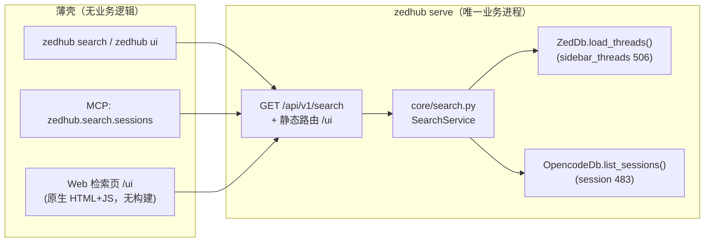

# 29 - zedhub 会话搜索工具与 Web 检索页（一期：元数据检索）

## 概述

Plan for: "zedhub 新增 Zed 会话搜索工具 + 本地 Web 检索页"

**问题陈述**：
`python_projects/zedhub` 已能列出 Zed 索引里的 agent 会话（`threads list` / `sessions list`），
但检索能力只有 `threads list --search` 的「标题/id/agent 整体子串」一条，且没有界面：
想找「上个月在哪个会话里谈过某件事」只能自己翻列表。本次新增一个**会话搜索能力**：
按关键词 + agent/项目/时间/归档等条件检索会话元数据，并配一个由 daemon 直接托管的
本地 Web 检索页（搜索框 → 结果列表 → 点开看所属会话）。正文全文检索明确为**二期**。

**需求**（含用户澄清决策，原话选项见对话记录）：

1. **范围**：就是「能搜 + 有 Web 页面」，其余按 zedhub 既有约定设计（用户答 1=a）；
   因此按《CLI 工具开发标准》同时补 CLI 子命令、MCP 工具与 `schema` 导出，GUI 只是第三个壳。
2. **搜索深度（一期）**：只搜**元数据**——标题 / agent / 会话与线程 id / 项目路径 /
   创建·更新时间 / 归档状态；秒级返回、不建索引（用户答 2=a）。
3. **二期（本次不做，仅留演进空间）**：会话**正文全文检索**（opencode 消息正文约
   2820 万字符，另有 claude-code/codex 原始 jsonl），需要本地 FTS 索引与增量维护。
4. **GUI 形态**：搜索页 = 搜索框 + 结果列表（命中片段高亮）+ 点开看所属会话；
   由现有 daemon 直接托管在 `http://127.0.0.1:8766/ui`，**不新增进程、不引入前端构建链**
   （用户答 3=a）。
5. **架构边界（不可破）**：Service 层只存在于 daemon；GUI 与 CLI、MCP 一样是薄客户端，
   只经 `/api/v1` 取数，页面内不写业务逻辑；契约改动全部经 `contract.py` 单一事实源。
6. **数据目录约束**：本次不产生新的自产数据文件；若后续二期建索引，索引文件只能落
   `%APPDATA%\language_projects\zedhub\`。

**背景**（本次只读调研结论，均基于真实代码与本机真实数据）：

- **现状架构**：`zedhub serve` 是唯一业务进程，HTTP+JSON API 在 `127.0.0.1:8766`，
  端点由 `contract.HTTP_ENDPOINTS` 声明、`http_api.py` 按声明注册；CLI（`cli.py`）、
  MCP 桥（`mcp_bridge.py`）、RPC 壳全部经 HTTP 转发；`schema_export.py` 从契约同源导出。
  **当前完全没有 Web 页面**，原 spec `requirements.md` 把「Web UI」列为非目标——本次增量
  正式取代该条，其余非目标（公网服务、鉴权、gRPC）继续有效。
- **可用数据**（本机实测）：
  - Zed 索引 `%LOCALAPPDATA%\Zed\db\0-stable\db.sqlite` 的 `sidebar_threads`：共 **506** 条
    （opencode 296 / antigravity-acp 69 / claude-acp 59 / codex-acp 44 / pi-acp 35 /
    glm-acp-agent 3），其中 453 条带 `session_id`、78 条标题为空、147+ 条已归档；
    **Zed 库里没有会话正文**，只有标题、agent、`folder_paths`、时间、归档标记。
  - OpenCode `~/.local/share/opencode/opencode.db`（2.0 GB）：`session` 表 **483** 条
    （标题全非空，含 `directory`、`agent`=build/plan/explore/general、`model` JSON、
    创建/更新/归档时间）；与 Zed 索引的交集 **266** 条，**217** 条未进 Zed 索引。
  - `part` 表 63887 行、含文本 19334 行（≈2820 万字符）→ 这是二期全文检索的语料。
- **可复用件**（不新造轮子）：`ZedDb.load_threads()`、`OpencodeDb.list_sessions()`、
  `ThreadService.list_threads()` 的过滤语义、`open_snapshot()`（Zed 快照三件套）、
  `open_opencode_ro()`（只读直连 + 快照兜底）、`client.DaemonClient`（地址发现/握手）、
  `serialization.py`（人读渲染）、`build_app(extra_routes=...)`（静态路由注入点已存在）。
- **风险与既有约束**：改代码只重启一边会被 buildID 握手当场检出（开发构建需先
  `zedhub serve`）；opencode 库可能缺失或降级（既有语义是**降级标志进 payload，不报错**，
  见 `stats.effort`），搜索沿用同一口径。

**方案**：

- **搜索语义（服务端唯一定义）**：
  - `q` 按空白切分为多个 token，**全部 token 必须命中**（AND）；每个 token 在
    「标题 / agent_id / thread_id / session_id / 项目路径」任一字段做 casefold 子串匹配；
  - `q` 为空 = 只按过滤条件浏览（GUI 首屏加载用）；
  - 过滤：`agent`（精确）、`project`（路径子串，不区分大小写）、`archived`
    （no/only/all，默认 no，沿用既有三态）、`since`/`until`（按 updated_at，缺省用 created_at）；
  - 结果条目标注 `matched_fields`（title/agent/id/project），供 GUI 高亮；
  - 排序按最近活动（updated_at→created_at）降序；`limit` 默认 50、`0` 表示不限制。
- **省源合并策略**：以 Zed 索引为**主表**（它就是「Zed 里看得见的会话」），
  用 `session_id` 关联 OpenCode 会话并合并其 `directory`/`model`；
  `include_unlinked=true` 时再补上 217 条未进 Zed 索引的 OpenCode 会话
  （`kind="opencode_session"`），默认不显示，避免与 Zed 视图重复。
- **降级口径**：Zed 索引缺失 → 报 `snapshot_failed`（搜索锚定 Zed，与 `threads list` 一致）；
  OpenCode 库缺失/不可读 → 不失败，结果只含 Zed 侧并带 `degraded` 说明。
- **契约改动清单**（全部经 `contract.py`）：
  1. `HTTP_ENDPOINTS` 增 `GET /api/v1/search`，`api_method="search.sessions"`，
     query 参数 `q/agent/project/archived/since/until/limit/include_unlinked`；
  2. `QUERY_PARAM_TYPES` 增 `include_unlinked: "boolean"`，`http_api._extract_params`
     相应加 boolean 强制转换分支（与既有 integer 口径一致）；
  3. `MCP_TOOLS` 增三段式只读工具 `zedhub.search.sessions`（`read_only` 标注、
     `structured_output`、`result_type="object"`）。
- **GUI 设计要点**：`/ui` 静态页（`index.html` + `app.js` + `style.css`，原生实现、零依赖），
  daemon 以新增静态路由托管（`Cache-Control: no-store`，便于开发期改页面即时生效），
  静态路由同样做**回环 Host 校验**（与 API 同一防线，防 DNS rebinding）。
  页面只调既有 `/api/v1`：`/search`（检索）、`/stats`（agent 候选）、`/projects`（项目候选）、
  `/threads/{id}`·`/sessions/{id}`·`/sessions/{id}/content`（点开看所属会话，
  正文默认不自动加载，点「加载正文」才取前 50 条消息）。
- **明确非目标（一期）**：正文全文检索与索引（二期）、跨机器检索、鉴权与公网暴露、
  在 Zed 内直接打开会话、结果导出。

---

## 任务分解

- [x] Task 1: 搜索业务核心与 HTTP 契约（daemon 内可 curl 验证）
  - 文件：`python_projects/zedhub/src/zedhub/core/model.py`、`python_projects/zedhub/src/zedhub/core/search.py`（新建）、`python_projects/zedhub/src/zedhub/api.py`、`python_projects/zedhub/src/zedhub/contract.py`、`python_projects/zedhub/src/zedhub/http_api.py`
  - 实现：在 `core/model.py` 定义 `SearchRequest` 与 `SearchHit`（kind/title/agent_id/thread_id/session_id/projects/model/archived/created_at/updated_at/interacted_at/matched_fields/zed_linked）；新建 `core/search.py` 实现 `SearchService`（token AND 匹配、过滤、排序、limit、Zed 主表 + OpenCode 关联合并、`include_unlinked` 补录、`degraded` 降级），复用 `ZedDb.load_threads()` 与 `OpencodeDb.list_sessions()`；`api.py` 增 `_search`（开 Zed 快照 + OpenCode 只读连接，OpenCode 失败转降级）并注册 `search.sessions`；`contract.py` 按上文契约清单增端点与参数类型；`http_api.py` 补 boolean query 强制转换。
  - 验证：先 `uv run zedhub serve`（另开终端），再 `curl "http://127.0.0.1:8766/api/v1/search?q=zedhub"` 返回 `ok:true` 且 `data.total>0`；`curl "http://127.0.0.1:8766/api/v1/search?q=&archived=all&limit=0"` 的 `total` 等于 506（Zed 索引全量）；`uv run zedhub schema --channel http` 输出中出现 `/api/v1/search` 端点。
  - Demo：curl 一条命令即可按关键词 + 过滤条件拿到会话命中列表，OpenCode 库缺失时返回降级说明而不是报错。
  - 实施说明（与计划的偏差）：Zed 索引实时行数在实施期间由 506 增至 **512**（Zed 正在使用中），验证口径改为「与 `sidebar_threads` 实时行数一致」——实测 `q=&archived=all&limit=0` 得 `total=512` 一致；`include_unlinked=true` 得 `total=729`（512 Zed + 217 未关联 OpenCode 会话），与调研数据吻合；非法布尔值返回 `400 invalid_params`（错误码与契约一致）。

- [x] Task 2: CLI 薄客户端 `zedhub search`
  - 文件：`python_projects/zedhub/src/zedhub/cli.py`、`python_projects/zedhub/src/zedhub/serialization.py`
  - 实现：新增顶层命令 `search`（参数：`query` 位置参数、`--agent`、`--project`、`--archived`、`--since`、`--until`、`--limit`、`--include-unlinked`、`--host`、`--json`），走新命令信封（默认人读、`--json` 输出 `{"ok":true,...}`），业务一律经 `DaemonClient` HTTP 调用；`serialization.py` 增 `render_search_table`（标题/agent/项目/更新时间/归档与关联标记，命中字段标注），并在人读模式下打出降级提示行。
  - 验证：`uv run zedhub search zedhub` 打印命中表格且末行条数与 API `total` 一致；`uv run zedhub search zedhub --agent opencode --json` 是合法 JSON 且 `ok=true`；搜一个不存在的词返回 `(no matches)` 且退出码 0；`uv run zedhub search --help` 列出全部过滤参数。
  - Demo：终端一条命令完成关键词 + agent/时间过滤检索，人读与 `--json` 两种形态都可用。
  - 实施说明：渲染函数落地名为 `render_search_result`（产出两行式条目：主行 + 项目/id 上下文行），比计划里的 `render_search_table` 更贴合结果结构；实测 `q='zedhub'` 得 `5 hit(s)` 与 API `total` 一致，空结果退出码 0。

- [x] Task 3: MCP 工具与 `schema` 导出对齐
  - 文件：`python_projects/zedhub/src/zedhub/contract.py`、`python_projects/zedhub/src/zedhub/schema_export.py`
  - 实现：`MCP_TOOLS` 增 `zedhub.search.sessions`（参数 q/agent/project/archived/since/until/limit/include_unlinked，`api_method="search.sessions"`，非 legacy → 自动带只读标注与 structured output，`mcp_bridge._call_http` 已有的 api_method→GET 端点映射无需改动）；`schema_export._cli_channel` 的 commands 字典补 `search`（含 `ui` 一条，Task 4 落地后即真实），`_http_channel`/`_mcp_channel` 因同源自动带出新端点与工具。
  - 验证：`uv run zedhub schema --channel mcp` 输出含 `zedhub.search.sessions` 且 `forwards_to="search.sessions"`、`read_only_hint=true`；`uv run zedhub schema --channel cli` 的 commands 含 `search`；`uv run zedhub schema` 全量输出是合法 JSON（`python -c "import json,sys; json.load(sys.stdin)"` 解析通过）。
  - Demo：AI agent 通过 MCP 桥调用搜索工具拿到与 CLI 完全一致的结果（同一 HTTP 契约）。
  - 实施说明：MCP 工具注册数由 8 增至 9，实测 `tools/call` 传 `limit="3"`（字符串）被 HTTP 层整数转换采纳（`total=5 / count=3`）；非法 `archived` 经 `ToolError` 返回，`is_error=true` 且信息可读。`ui` 命令的 commands 条目在 Task 4 一并补（避免提前声明未落地命令）。

- [x] Task 4: Web 检索页与 `zedhub ui`
  - 文件：`python_projects/zedhub/src/zedhub/webui/__init__.py`（新建）、`python_projects/zedhub/src/zedhub/webui/index.html`（新建）、`python_projects/zedhub/src/zedhub/webui/app.js`（新建）、`python_projects/zedhub/src/zedhub/webui/style.css`（新建）、`python_projects/zedhub/src/zedhub/http_api.py`、`python_projects/zedhub/src/zedhub/cli.py`
  - 实现：`webui` 包提供静态资源与路由工厂（`/` → 302 `/ui`、`/ui` → 页面、`/ui/{asset}` → 白名单后缀的静态文件，全部做回环 Host 校验 + `no-store`）；`http_api.build_app` 默认挂载这些路由（仍保留 `extra_routes` 注入点给 WS）；页面用原生 HTML/CSS/JS 实现搜索框（自动聚焦、`/` 聚焦、`Esc` 清空、输入防抖）、过滤行（agent 取自 `/stats`、项目取自 `/projects`、归档三态、起止日期、include_unlinked 开关）、结果列表（标题命中高亮、agent 徽章、项目名、时间、归档与 Zed/OpenCode 关联标记）、右侧详情面板（点结果调 `/threads/{id}` 或 `/sessions/{id}`；opencode 会话提供「加载正文」按钮再调 `/sessions/{id}/content` 渲染前 50 条文本消息），以及加载中/空结果/降级横幅三种状态；`cli.py` 增 `ui` 命令（解析 daemon 地址后 `webbrowser.open` 打开 `/ui`，`--print` 只打印 URL 不打开、`--host` 同其他命令）。
  - 验证：`uv run zedhub serve` 后 `curl -i http://127.0.0.1:8766/ui` 返回 200 且 `Content-Type: text/html`、响应体含搜索框元素；`curl -i http://127.0.0.1:8766/ui/app.js` 返回 200 且 `Content-Type` 为 JS；`curl -i http://127.0.0.1:8766/` 返回 302 且 `Location: /ui`；`curl -i -H "Host: evil.example" http://127.0.0.1:8766/ui` 返回 403；`uv run zedhub ui --print` 输出形如 `http://127.0.0.1:8766/ui` 的 URL。
  - Demo：浏览器打开 `http://127.0.0.1:8766/ui`，输入关键词得到高亮结果列表，点开会话看详情、按需加载正文；全程零新增进程、零前端构建。
  - 实施说明：验证在测试端口 8787 上完成（8766 被用户既有 daemon 占用，未打扰）——`/ui` 200 `text/html` + `no-store`、`/ui/app.js` 200 `text/javascript`、`/ui/style.css` 200 `text/css`、`/` 302 `Location: /ui`、非回环 Host 403、`/ui/nope.txt` 与 `/ui/..%2f__init__.py` 均 404、`node --check app.js` 通过。另用无头 Chrome 做了真实渲染与交互验证：`--dump-dom` 渲染出「5 / 5 条命中 · 48ms」、5 个命中条目与 6 处 `<mark>` 高亮（**并据此发现并修掉一个真 bug**：`loadOptions()` 误把 HTTP 信封当 data，导致 agent/项目下拉为空——修复后 38 个 option、agent 8 项带计数、项目 25 项）；再用 CDP 真点开命中条目（详情面板 11 项字段齐全）并点「加载正文」（取到 8 条消息、首条 4103 字符），验证后已删除临时 Chrome profile 与脚本、无浏览器进程残留。

- [x] Task 5: 接线收尾、文档与端到端冒烟
  - 文件：`python_projects/zedhub/README.md`、`docs/projects/python_projects/zedhub/zedhub 对接协议.md`
  - 实现：README 补常用命令（`zedhub search`、`zedhub ui`）与「Web 检索页」小节（地址、形态、一期只搜元数据、正文检索为二期）；对接协议文档补 `GET /api/v1/search` 端点行、MCP 工具条目与 GUI 壳说明，并声明 Web UI 从此不再是全局非目标；确认 `contract.py` 声明与实际路由一致（`schema` 导出即证据）。
  - 验证：端到端冒烟——`uv run zedhub serve` → `curl "…/api/v1/search?q=zedhub"` 命中 → `curl -i …/ui` 200 → `uv run zedhub search zedhub` 命中 → `uv run zedhub schema` 含新端点与工具 → 停掉 daemon 并确认无残留 zedhub 进程与地址文件；文档中的 URL/命令逐条实跑核对。
  - Demo：一条链路走通（CLI / MCP / 浏览器三壳同源），并按仓库约定分范围提交：子仓代码（`python_projects`）一次、父仓文档与计划（`docs/`）各自独立提交；收尾时跑 `aoci check`（或 `aoci status --deep`）确认认知层是否需要维护并如实汇报。
  - 实施说明：冒烟在测试端口 8787 完成（8766 当时被既有 daemon 占用，未打扰），9 项全过：HTTP 检索 `ok=true total=5`、`/ui` 200 `text/html`、CLI 人读 `5 hit(s)`、CLI `--json` 合法（`--agent opencode` 收敛到 4 条且全为 opencode）、`schema` 三通道同源（`/api/v1/search`、`zedhub.search.sessions`、cli commands `search`/`ui`）、`ui --print` 输出 URL、多关键词 AND `total=2`、`include_unlinked` 全量 `729 = 512 Zed + 217 未关联`；README 与对接协议中的命令/URL 逐条实跑核对。
  - 遗留与偏差：① AOCI 认知层——`aoci check` 报 `Volumes governance: blocked (112 findings)`（exit 1），`aoci status --deep` 因 Volumes v1 兼容路径限制直接拒绝（exit 3）；该 blocked 状态与会话开始前就已修改的 `.aoci/baseline.json`、`aoci.code.txt` 相关，且 `aoci.txt` 目前**未收录** zedhub 条目，故本次改动未使既有条目失效，但正式认知维护需在具备 AOCI MCP 的会话中处理（本会话未提供该 MCP 工具）；② 测试资源已清——测试 daemon 全部停止、8787 已释放、临时 Chrome profile 与 CDP 脚本已删除、无浏览器残留；③ 8766 上会话开始时存在的旧 daemon 在任务期间消失（详见「遗留待办」外的收尾汇报）。

---

## 遗留待办（本计划范围外，收尾后需用户决策）

- **端口与地址文件韧性**（实施期间实测发现，用户已同意本次先不做）：
  1. 第二个实例换端口启动（`serve --port <other>`）会无条件覆盖 `runtime/daemon.json`，
     退出时又无条件删除它 —— 正在运行 daemon 的登记会被另一个端口的实例改坏/删掉；
     实测后果：地址文件指向死端口后，所有壳都报「daemon 未运行」，而健康 daemon 仍在跑；
  2. 端口被**非 zedhub** 程序占用时，uvicorn 绑定失败走 `sys.exit(3)`（违反自家 0/1/2 退出码契约），
     且 `cli.serve` 的 `except Exception` 抓不到 `SystemExit`，没有中文提示；
  3. `--port 0` 属坏路径：地址文件写入的是配置值 0 而非实际端口（uvicorn 的 lifespan 早于 bind，
     `on_start` 拿不到真实端口），要支持动态端口须自行预绑定 socket。
  - 修复方向：地址文件仅在「记录指向自己」时删除（pid+build 校验）、bind 失败给中文提示并把退出码规范到 1、
    按需支持 `--port 0`（预绑定 socket 后把实际端口写入地址文件）。

---

- 最后更新：2026-10-01
- 作者：AI & User
- 版本：v1.1.0（Task 1-5 实施完成，含实施说明与遗留待办）
