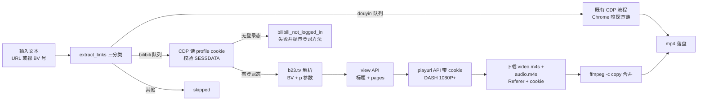

# Plan for: douyin_downloader 扩展 B 站视频下载支持

## 问题陈述

`douyin_downloader`（CLI 名 `douyin_dl`）目前只处理抖音链接，B 站链接（b23.tv 短链 / bilibili.com）一律按"非抖音链接"跳过。用户拿到 B 站分享链接（实例：`https://b23.tv/ApmE1Nd` → `BV1B6YR6gEyd`）时无法下载。本次在同一工具、同一命令内扩展 B 站下载能力；**项目名与命令名暂不改**（用户明确）。

## 需求（澄清确认）

1. 清晰度：**1080P+，走登录态路线**——通过 CDP 读取 Chrome 专用 profile 的 cookie（含 HttpOnly 的 SESSDATA），**复用现有抖音 profile**（一个实例同时携带两站登录态）；检测不到登录态时**直接失败报错，强制先登录**（用户原话："1=a（b记录为下次任务）"→ 后改为登录态；"1=a 2=a 3=b"）。
2. CLI 形态：**同一命令自动识别**——按域名分流，抖音链接走既有 CDP 流程，B 站链接走新 API+cookie 流程，一条命令混吃两类链接。
3. 范围：**顺带考虑多 P 视频**——链接带 `?p=N` 时下载指定 P；不带 `p` 且为多 P 视频时全部下载（每 P 一条记录）。
4. 输入形式：**URL 与裸 BV 号均支持**——`https://b23.tv/xxx`、`https://www.bilibili.com/video/BVxxx`、以及文本中直接出现的 `BV1B6YR6gEyd` 这类裸 BV 号（2026-10-02 用户追加确认），裸 BV 号归一化为 `https://www.bilibili.com/video/<BV>` 后走同一链路。
5. 实现路线：**API + CDP cookie 混合**——B 站公开 web API 拿元数据与流地址（免签名，已实测），登录态经 CDP 从浏览器 profile 取，不解析任何签名。

## 背景（探索发现，均已实测）

- `b23.tv/ApmE1Nd` 302 → `www.bilibili.com/video/BV1B6YR6gEyd?p=1`（3 分钟视频，UP 主"繁花听雨"）。
- `GET api.bilibili.com/x/web-interface/view?bvid=BVxxx`：免签名直接返回标题、`cid`、`pages`（多 P 列表，每 P 有自己的 `cid`/`page`/`part`）。
- `GET api.bilibili.com/x/player/playurl?bvid=...&cid=...&qn=64&fnval=16`：返回 DASH 流信息；**未登录 DASH 实测最高 480P**（`dash.video` 中 `id=32`），登录后可达 1080P（`id=80`）/ 1080P 高码率（`id=112`，大会员），普通会员最高 1080P。
- DASH 音视频分离：`dash.video` / `dash.audio` 各为 m4s 流，下载后需 **ffmpeg 合并**（本机 ffmpeg 2025-12-01 build 已确认可用，`-c copy` 无重编码直接拼）。
- 下载 CDN 流（实测命中 P2P 节点 `mcdn.bilivideo.cn:8082`）**必须带 `Referer: https://www.bilibili.com/`**，否则 403。
- CDP `Network.getCookies`（带 `urls` 参数）可在浏览器层读取含 **HttpOnly** 的 cookie（JS `document.cookie` 读不到 SESSDATA），既有 websocket/CDP 基础设施可直接复用；cookie 随 profile 持久化并自动续期。
- 现有代码相关锚点：`resolve_video_url`（douyin_dl.py:704）、`extract_links`（douyin_dl.py:688）、`download_stream`（douyin_dl.py:576，Referer 写死抖音）、`run_downloads`（douyin_dl.py:825）、`open_douyin_tab`（douyin_dl.py:542，douyin.com 写死）、`build_schema`（douyin_dl.py:160）。

## 方案

单文件四层结构不变（契约 / 基础设施 / Service / CLI 适配）。新增 B 站处理链路与既有抖音链路在 Service 层并行，由 `extract_links` 三分类后分别编排；登录态统一经 CDP 从共享 Chrome profile 读取：

关键设计决策：

- **登录门**：bilibili 队列处理前先经 CDP 读 `.bilibili.com` cookie 并校验 `SESSDATA` 存在；缺失时该批 B 站链接按 `bilibili_not_logged_in` 失败，错误消息指导"加 `--headed` 重跑、在弹出的 Chrome 窗口登录 bilibili.com"；`--headed` 模式下自动打开 bilibili.com 页面便于直接登录。
- **cookie 应用范围**：view/playurl API 请求与 CDN 流下载均带 `Cookie`（SESSDATA 等全量 B 站 cookie）；CDN 下载同时必带 `Referer`。
- **选流**：`dash.video` 取 `id` 最大者（登录后自动跟随账号权益到 1080P+），同 id 多编码时取先出现的（B 站 avc1 优先、兼容性好）；`dash.audio` 取数组第一项（B 站按质量降序，dolby/flac 在独立字段不在该数组）。
- **durl 兼容分支**：个别老视频无 `dash` 仅有 `durl`（FLV/MP4 直链）时直接下载单流、免合并。
- **临时文件**：`video.m4s`/`audio.m4s` 落在 `--output-dir`（用户指定目录），合并成功即删，失败也清理。
- **文件名**：多 P 时主干追加 `_P{page}`；单 P 保持干净无后缀；`video_id` 形如 `BV1xxx_p2`。
- **错误码**：新增 `bilibili_not_logged_in`（无 SESSDATA）、`bilibili_api_error`（view/playurl 调用失败）、`ffmpeg_merge_failed`（合并失败）；复用 `invalid_url`（BV 提取失败 / p 超界）、`stream_not_found`（dash/durl 均无）。
- **skip reason**：其他无关链接的 reason 由 `not_douyin` 统一改为 `not_supported`（schema enum 同步，README 记录变更）。
- **版本**：`2.1.0` → `2.2.0`。

## 任务分解

- [ ] Task 1: 基础设施层扩展——通用 HTTP、下载头参数化、CDP cookie 读取
  - 文件：`python_projects/douyin_downloader/douyin_dl.py`
  - 实现：新增 `http_get_json(url, headers)`（UA + 自定义头、超时、JSON 解析）；`download_stream()` 增加可选 headers 参数，默认值保持抖音 Referer（既有调用零回归）；新增 `cdp_get_cookies(port, url)`（复用 browser 级 CDP，`Network.getCookies` + `urls` 参数读含 HttpOnly 的 cookie）；`open_douyin_tab` 泛化为 `open_tab(port, url, host_filter)`（抖音调用保持原行为）
  - 验证：`uv run douyin_dl.py schema` 输出合法 JSON 且退出码 0（行为不变、可构建）
  - Demo：无用户可见变化，为后续任务供能

- [ ] Task 2: B 站 Service 函数族 + 提链三分类接线
  - 文件：`python_projects/douyin_downloader/douyin_dl.py`
  - 实现：`is_bilibili_url`（b23.tv / bilibili.com）、`resolve_bilibili_url`（短链 302 → BV 号 + p 参数）、裸 BV 号扫描（`BV[0-9A-Za-z]{10}` 独立 token，URL 中已含的 BV 号去重，归一化为 `https://www.bilibili.com/video/<BV>`）、`get_bili_cookies(port)`（读 cookie 并返回 dict，SESSDATA 校验留给编排层）、`fetch_bili_view`、`fetch_bili_playurl`、`pick_bili_streams`（含 durl 兼容分支）；`ExtractResult` 增加 bilibili 队列，`extract_links` 三分类；`run_downloads` 暂把 bilibili 队列按 skipped 记录（行为不退化，Task 3 换真实现）
  - 验证：`uv run douyin_dl.py --json "https://b23.tv/ApmE1Nd"` → 该链接进入 skipped（暂不下载）；既有抖音链接行为不变
  - Demo：混合文本输入（URL + 裸 BV 号）时 JSON 输出分类正确（douyin / bilibili / skipped 各归其位，裸 BV 号与含 BV 的 URL 去重不重复下载）

- [ ] Task 3: B 站下载编排 + 登录门 + ffmpeg 合并（核心功能）
  - 文件：`python_projects/douyin_downloader/douyin_dl.py`
  - 实现：`download_bilibili_one`（登录门：无 SESSDATA → `bilibili_not_logged_in` 失败并给登录指引，headed 模式自动开 bilibili.com；view → playurl 带 cookie → 选流 → 双流下载带 Referer+cookie → `ffmpeg -c copy` 合并 → 临时清理）；`run_downloads` 真接入 bilibili 队列（串行，复用 emit 进度，Chrome 会话复用同一 profile）；多 P 循环（`?p=N` 指定 / 无 p 全下）；错误码 `bilibili_not_logged_in`、`bilibili_api_error`、`ffmpeg_merge_failed`
  - 验证：未登录首跑 → B 站链接按 `bilibili_not_logged_in` 结构化失败并给出指引；`--headed` 登录 B 站后重跑 → `~/Downloads` 出现《本视频完全由GPT-6 Astra制作而成》.mp4，`ffprobe` 确认含音视频双流、时长约 181 秒、分辨率达登录档位（1080P 级）
  - Demo：命令行直接下载 B 站视频成功，清晰度跟随账号权益

- [ ] Task 4: 契约与文档收尾
  - 文件：`python_projects/douyin_downloader/douyin_dl.py`、`python_projects/douyin_downloader/README.md`
  - 实现：`build_schema` 更新（description / summary / constraints 加"B 站需登录态，无 SESSDATA 时失败"说明 / `side_effects.network` 加 B 站域名 / skip reason enum → `not_supported`）；版本号 2.2.0；README 增加 B 站支持说明、首次登录引导（`--headed` 人工登录一次）、用法示例、已知限制
  - 验证：`uv run douyin_dl.py schema` 输出新契约；`uv run douyin_dl.py "<抖音分享文案> https://b23.tv/ApmE1Nd"` 混合输入两类链接均下载成功
  - Demo：一条命令混吃抖音 + B 站链接，schema 契约与实现一致

## 记录

- 澄清决策：登录态走 CDP 读 profile cookie（1=a）、复用抖音 profile（2=a）、无登录态直接失败强制登录（3=b）；480P 免登录方案作废。
- 用户机 ffmpeg 已确认可用（2025-12-01 gyan.dev essentials build）。

---
**最后更新：** 2026-10-02
**作者：** AI & User
**版本：** v1.2.0

## 变更记录

| 版本 | 日期 | 说明 |
|---|---|---|
| v1.2.0 | 2026-10-02 | 用户追加：支持裸 BV 号输入（BV[0-9A-Za-z]{10}，与 URL 中 BV 号去重），归一化后走同一链路 |
| v1.1.0 | 2026-10-02 | 用户改选登录态路线：CDP 读抖音 profile cookie（复用 profile）、无登录态失败强制登录；新增登录门与 `bilibili_not_logged_in` 错误码，任务 1/3/4 相应扩展 |
| v1.0.0 | 2026-10-02 | 初版：480P 纯 API 免登录路线 |
