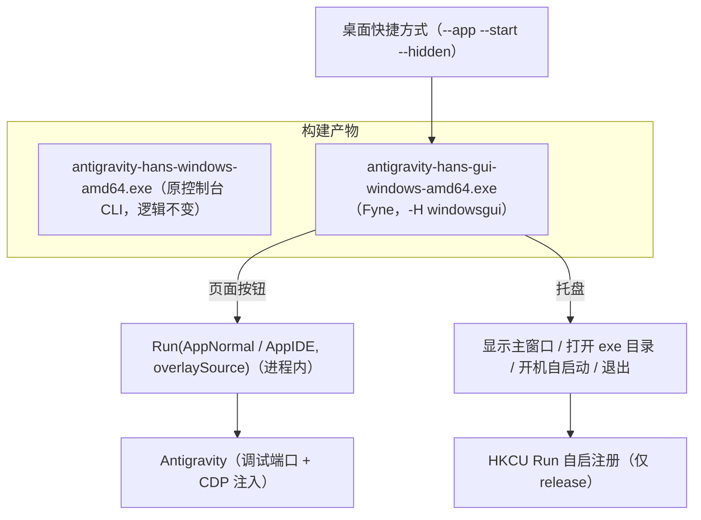

# Plan 33: Antigravity-Hans 新增 Fyne GUI 托盘壳（Windows）

**问题陈述**：
Antigravity-Hans 现有形态为控制台程序（`main.go` 交互菜单 / 命令行参数）。双击快捷方式启动时，因 exe 为控制台子系统（`go build` 未指定 `-H windowsgui`），Windows 先创建控制台窗口，`main.go:30` 收到 `--nogui` 后再调用 `HideConsole()`（`sysproc_windows.go:17`，`ShowWindow(SW_HIDE)`）隐藏，属“先创建后隐藏”，必然出现终端一闪而逝。需要在不改动原有 CLI 逻辑的前提下，新增一层 Windows 专用 GUI 壳：主页面用于启动 Antigravity 动态汉化，系统托盘提供开机自启动（仅 release）、显示主窗口、打开 exe 所在目录，并彻底消除终端窗口。

**需求**（含澄清决策）：
1. 澄清 `1=a`：GUI 使用 Fyne（`fyne.io/fyne/v2`），不使用 Wails。
2. 澄清 `2=a`：仅支持 Windows。
3. 澄清 `3=c`：主页面主要功能 = 通过 `Run(AppNormal, overlaySource)`（与 `main.go:129` 同款调用）启动 agy 动态汉化；核心诉求是“无终端”。
4. 澄清 Windows 产物 `1=a`：原 CLI 文件名（`antigravity-hans-windows-amd64.exe`）与行为保持不变，另新增 `antigravity-hans-gui-windows-amd64.exe`。
5. 澄清 `2=a`：关闭主窗口 = 隐藏到托盘；真正退出仅经托盘菜单。
6. 澄清：多安装路径时不改原有逻辑 —— GUI 无 stdin 时沿用 `Run` 现有回退（取首个路径）；原 CLI 交互选择行为不变。
7. 澄清：新建开发分支 `feat/fyne-gui`；`git tag` 命中的提交为 release，其余为 dev；仅 release 允许开机自启。
8. 约束：项目为开源项目，尽量避免与上游同步冲突；仅做必要的最小侵入改动。
9. 修复目标：双击快捷方式不再闪现终端（复现：快捷方式 → `antigravity-hans.exe --app --nogui`，终端一闪而逝）。

**背景**（只读调研结论）：
- 终端闪现根因：`build.sh` 与 `.github/workflows/release.yml` 的 `go build` 均未指定 `-H windowsgui`；`--nogui` 只能事后隐藏控制台，不能避免控制台创建。
- 参考实现：`go_projects/glmquotawatch-gui`（父仓内）已有 Fyne 托盘/自启设计（`specs/03-fyne-rewrite/design.md`）与托盘交互代码（显示主窗、`explorer.exe` 打开 exe 目录、HKCU Run 自启、`-H windowsgui`、dev 防呆），本次沿用其方案形状。
- Fyne 关键 API（pkg.go.dev / docs.fyne.io 已核实）：`desktop.App` 的 `SetSystemTrayMenu` / `SetSystemTrayIcon` / `SetSystemTrayWindow`（v2.7+，Windows 支持左键唤窗）、`fyne.Do`（后台线程更新 UI）、`Window.SetCloseIntercept`（关窗拦截）。最新稳定版 v2.8.1（2026-10-03 查询）。
- 本机环境：Go 1.25.5、CGO_ENABLED=1、gcc 15.2.0（MSYS2 MinGW64）、`rsrc.exe` 已装于 `~/go/bin`；Fyne Windows 构建需 CGO + gcc。
- 仓库现状：`.thirdparty/Antigravity-Hans` 为父仓 gitignore 的独立克隆（origin `yuexps/Antigravity-Hans`），当前 `main` 位于 tag `v0.4.3`；工作区仅有未跟踪的 `AGENTS.md`、`CLAUDE.md`（不纳入本次任何提交）。本计划落盘父仓 `docs/plans/`（沿用 10 号 `.thirdparty` 计划先例）。
- 本次不改动的核心文件：`cdp.go`、`overlay.go`、`detect.go`、`config.go`、`patch.go`、`launcher.go`、`registry_windows.go`、`shortcut_darwin.go` 等。

**方案**：

技术路线：GUI 与 CLI 共用同一 `package main` 源码，通过构建标签隔离入口——默认构建（无标签）仍产出原控制台 CLI；`-tags gui` 构建产出 Fyne GUI（`-H windowsgui`，无控制台子系统）。GUI 进程内直接调用 `Run`，无需子进程；原 CLI 逻辑零改动。提交信息遵循 `Antigravity-Hans:<type>: <subject>` 前缀。

关键决策：
- 入口隔离：`main.go` 仅加一行 `//go:build !gui`；`-tags gui` 时由 `gui_windows.go` 提供 `main()`，直接调用现有 `Run` / `LoadOverlaySource`，不重构、不引入新包。
- release 判定：构建时 `git describe --tags --exact-match HEAD` 命中且工作区干净 → `-X main.ReleaseMode=release`；否则 dev。开机自启仅在 release 可用（菜单置灰 + 逻辑拒绝双保险）。
- 无终端：GUI exe 采用 `-H windowsgui` 子系统；快捷方式目标切换为 GUI exe，从源头消除控制台创建。
- 字体：运行时加载 Windows 系统 CJK 字体（`msyh.ttc` → `Deng.ttf` → `simhei.ttf` 依次尝试）覆盖 Fyne 主题，避免中文方块字；全部失败回退默认字体（不阻断运行）。
- 图标：按父仓《go exe 默认图标》流程复制 `go-default.ico` 并生成 `.syso` 入库（Go 链接器自动附加到 Windows 产物）；托盘 PNG 由该 ico 提取 64×64 生成。
- 单实例：命名互斥体防止重复实例（dev 构建加 `.dev` 后缀与 release 隔离）。
- 不变量：默认构建行为与原仓库完全一致；不改动 `Run`/`Watch`/`DetectApp` 等核心逻辑；关闭主窗不退出，退出仅经托盘；仅 release 可注册开机自启。

风险与备案：
- Fyne 对 `.ttc` 字体集合的解析能力未实测；按回退链逐一尝试，必要时仅用 `Deng.ttf` / `simhei.ttf`。
- GitHub Actions Windows GUI 构建需 MSYS2 MinGW（用 `msys2/setup-msys2` 安装）；若环境冲突，退回 `fyne-cross`（ubuntu + Docker）方案。
- CI 触发从「VERSION 变更」改为「tag 推送」，发布步骤变为：更新 VERSION → 提交 → 打 tag → 推送 tag。

**任务分解**：

- [x] Task 1: 新建开发分支并引入 Fyne 依赖
  - 文件：`go.mod`、`go.sum`（分支操作无文件产物）
  - 实现：`git switch -c feat/fyne-gui`（从 main@v0.4.3）；`go get fyne.io/fyne/v2@v2.8.1`；确认原 CLI（无标签）构建不链接 Fyne。
  - 验证：`git branch --show-current` 输出 `feat/fyne-gui`；`go build ./...` 通过；`go list -m fyne.io/fyne/v2` 输出 v2.8.1。
  - Demo：分支就绪，原 CLI 构建行为不变。

- [x] Task 2: GUI 入口、主页面与“启动汉化”（构建标签隔离）
  - 文件：`main.go`（仅新增 `//go:build !gui` 一行）、`gui_windows.go`、`gui_other.go`、`gui_theme_windows.go`、`gui_singleinstance_windows.go`
  - 实现：
    - `main.go` 文件头加构建约束；默认（无标签）构建完全不变；`-tags gui && windows` 时改由 `gui_windows.go` 提供 `main()`（`gui_other.go` 处理 `gui && !windows` 占位）。
    - 参数：`--hidden`（静默到托盘）、`--start`（立即启动汉化）、`--app`/`--ide`（目标，默认 app）；未知参数忽略。
    - 主窗口：标题「Antigravity 汉化工具」、约 520×360、`SetCloseIntercept` 隐藏；页面含版本号、[启动 Antigravity 汉化]、[启动 Antigravity IDE 汉化] 按钮与状态标签；按钮在工作 goroutine 调用 `Run(...)`，运行中禁用，结束后经 `fyne.Do` 恢复并更新状态。
    - `Version` / `ReleaseMode` 变量（`-X` 注入，默认 dev）。
    - `gui_theme_windows.go`：系统 CJK 字体回退链覆盖主题，避免中文方块字。
    - `gui_singleinstance_windows.go`：命名互斥体（名称 = 应用名 + release/dev 后缀）；已有实例时提示「已在运行（见系统托盘）」并退出。
  - 验证：`go build ./...` 通过；`go build -tags gui -o dist/antigravity-hans-gui-test.exe .` 通过；`go vet -tags gui ./...` 无报错（备用）。
  - Demo：运行 GUI exe 弹出主窗口（无终端），点击按钮启动 Antigravity 动态汉化；重复启动仅保留一个实例。
  - 实施说明：未单独建 `gui_theme_windows.go` —— 源码核实 Fyne v2.8.1 自带系统字体回退（`fontscan` 按 rune 解析系统字体），中文自动用系统字体渲染，实现较计划更简；如实测出现方块字再补字体主题。

- [x] Task 3: 系统托盘与图标资源
  - 文件：`gui_tray_windows.go`、`gui_assets/tray.png`（新）、`icon.ico`（复制）、`rsrc_windows_amd64.syso`（rsrc 生成）
  - 实现：
    - 托盘：`desktop.App` 断言 + 内嵌 `tray.png` 图标 + `SetSystemTrayWindow`（左键唤窗）；菜单：显示主窗口 / 打开 exe 所在目录 / 开机自启动（Task 4 接线）/ 分隔线 / 退出。
    - 「打开 exe 所在目录」：`os.Executable()` 取目录后经 `explorer.exe` 打开；失败弹错误对话框。
    - 图标按《go exe 默认图标》流程：复制 `docs/assets/projects/go_projects/go-default.ico` → `icon.ico`；`rsrc -ico icon.ico -o rsrc_windows_amd64.syso`；由该 ico 提取 64×64 生成 `gui_assets/tray.png`；三者入库。
  - 验证：`go build -tags gui ...` 通过；运行 GUI：关主窗后托盘仍在，托盘可唤回窗口、可打开 exe 目录、可退出（备用）。
  - Demo：托盘菜单三项交互逐项演示，任务管理器无终端相关子进程。

- [x] Task 4: 开机自启（release 限定）
  - 文件：`gui_autostart_windows.go`（+ `gui_tray_windows.go` 勾选接线）
  - 实现：直写 `HKCU\Software\Microsoft\Windows\CurrentVersion\Run`，值名 `Antigravity-Hans`，数据 `"<exe>" --hidden`；提供查询/写入/删除；`ReleaseMode != "release"` 时菜单置灰且调用返回稳定错误；拒绝注册临时构建产物（go-build / Temp 路径）；切换失败弹对话框并回滚勾选。
  - 验证：dev 构建菜单禁用且调用被拒；`-X main.ReleaseMode=release` 构建后勾选 → 注册表出现该值（检查后手动删除）（备用）。
  - Demo：dev / release 两种构建对比演示开与关。
  - 实施说明：dev 构建下菜单项显示为「开机自启动（开发版不可用）」并置灰；release 构建（`-X main.ReleaseMode=release`）可正常勾选注册。

- [x] Task 5: 构建脚本 `scripts/build-gui.py`
  - 文件：`scripts/build-gui.py`（新目录）
  - 实现：PEP 723 + uv（无第三方依赖）；gcc 前置检查；`git describe --tags --exact-match HEAD`（且工作区干净）→ release，否则 dev；`go build -tags gui -ldflags "-s -w -H windowsgui -X main.Version=<VERSION 或 tag> -X main.ReleaseMode=<release 时>"`；产物 `dist/antigravity-hans-gui-windows-amd64.exe`；打印环境判定结果。
  - 验证：`uv run scripts/build-gui.py` 产出 exe；release 判定与实际 tag 状态一致（备用）。
  - Demo：一条命令产出本地 GUI exe；tag 状态下自动启用 release。

- [x] Task 6: 快捷方式目标切换到 GUI（修复终端闪现）
  - 文件：`shortcut_windows.go`
  - 实现：生成快捷方式时探测同目录 GUI exe（`antigravity-hans-gui-windows-amd64.exe` 或 `antigravity-hans-gui.exe`）；存在则将 TargetPath 指向 GUI exe、Arguments 改为 `--app --start --hidden`（IDE 同理）；不存在时保持现状。根因注释写入代码。
  - 验证：`go build` 通过；运行 `--shortcut` 后读取 .lnk 目标确认为 GUI exe 且无终端（备用）。
  - Demo：双击新快捷方式 → 无黑框闪现，托盘常驻并自动启动汉化。

- [x] Task 7: CI 发布流程改造（tag 即 release）
  - 文件：`.github/workflows/release.yml`
  - 实现：触发改为 `push: tags: v*`（保留 `workflow_dispatch`）；版本号取 tag；新增 windows-latest + MSYS2 MinGW 的 GUI 构建作业（`-tags gui -H windowsgui -X main.ReleaseMode=release`），产物 `antigravity-hans-gui-windows-amd64.exe`；CLI 三平台产物保持；发布说明补 GUI 行。
  - 验证：YAML 可解析；实际发布验证留待打 tag 时观察 Actions（备用）。
  - Demo：推送 tag 后 GitHub Release 同时含 CLI 与 GUI 产物，GUI 为 release 模式。

- [x] Task 8: README 更新
  - 文件：`README.md`
  - 实现：GUI 使用说明（页面按钮、托盘菜单、关窗到托盘、无终端）；开机自启 release 限定；构建说明（`uv run scripts/build-gui.py`、gcc 前置）；发布流程改为打 tag；快捷方式指向 GUI 的说明。
  - 验证：README 描述与实现一致（人工核对）。
  - Demo：新用户按 README 可完成构建与使用。

- [x] Task 9: 收尾验收与计划勾选
  - 文件：无（验证任务）
  - 实现：`go build ./...`、GUI 构建、产物检查（GUI 无控制台子系统）、单实例/托盘/自启/快捷方式逐项走查；更新本计划 checkbox 与页脚。
  - 验证：上述每项有明确结果记录。
  - Demo：向用户汇报完整演示清单。
  - 实施结果：CLI 三平台产物与 GUI 产物（PE 子系统 2，无控制台）构建通过；GUI `--hidden` 冒烟启动正常、终止无残留；dev/release 判定与自启门控符合设计（dev 置灰 + 逻辑拒绝，release 可注册）；快捷方式目标切换逻辑已随 CLI 编译验证。
  - 遗留：GUI 窗口/托盘的目视交互、快捷方式无终端实测、开机自启注册实机验证需用户在本机确认；CI tag 发布链路待首次打 tag 时验证。

---
**最后更新：** 2026-10-04
**作者：** AI & User
**版本：** v1.1（执行完成）
