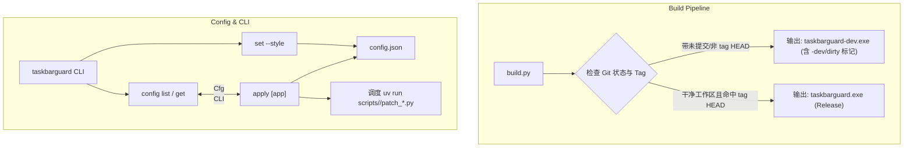

# Implementation Plan - TaskbarGuard 阶段一：配置持久化与双轨构建脚本

**问题陈述**：
当前 `taskbarguard` 项目处于 MVP 阶段，存在两个核心断层：
1. 缺少偏好持久化（`config.json`），用户每次执行 `run` 都必须手动指定 `--style` 参数，无法根据持久化偏好“一键为所有/指定应用打补丁”；
2. 缺少顶层构建脚本 `build.py`，无法便捷输出区分调试状态（`-dev.exe`，容忍 dirty/开发分支）与正式发版（`.exe`，对齐 git tag HEAD 且工作区干净）的二进制产物。

**需求**：
1. 落地阶段一配置持久化机制：支持本地 `config.json`，支持查看与修改各应用（VS Code、DeepSeek Harness 等）的预设款式及自定义路径，新增 `apply` 命令按配置一键调度执行。
2. 编写顶层 `build.py` 脚本：调用 `go build` 输出 `taskbarguard-dev.exe`（开发版，容忍 dirty/开发分支）与 `taskbarguard.exe`（Release 版，强校验当前 HEAD 对齐 git tag 且无未提交修改），并通过 `-ldflags` 将版本号与 commit hash 注入二进制。
3. 阶段二（计划任务/长开机后台守护巡检与 Windows Toast 通知）本次暂不实施，按用户要求暂缓考虑。

**背景**：
- 现有 Go CLI 入口为 `main.go`，目前仅有 `list`、`run`、`install-task`、`schema` 命令。
- 项目位于 `language_projects/go_projects/taskbarguard`，底层依靠 `uv run scripts/.../patch_*.py` 执行注入。
- 工作区规范要求：统一将设计计划归档至文档中心 `docs/plans/`，全局序列顺延为 34。

**方案设计**：

---

**任务分解**：

- [x] Task 1: 设计并实现 `config.json` 数据模型与配置读写模块
  - 文件：`D:/Users/language_projects/go_projects/taskbarguard/config.go`
  - 实现：定义 `AppConfig` 与 `Config` 结构体（包含各应用激活款式、自定义 ICO 路径、是否启用等）；实现 `LoadConfig()`（默认当前目录/可执行文件同级目录，不存在则初始化默认配置）与 `SaveConfig()` 方法。
  - 验证：执行 `go test -v ./...` 包含配置加载、自动落盘、默认值初始化的单元测试，全部 PASS。
  - Demo：调用测试验证无配置文件时自动生成默认 `config.json`。

- [x] Task 2: 在 Go CLI 中接入配置管理与 `apply` / `set` 子命令
  - 文件：`D:/Users/language_projects/go_projects/taskbarguard/main.go`
  - 实现：
    1. 扩展 CLI 命令集，增加 `config`（查看当前生效配置）与 `set <app> [--style <name>] [--custom-icon <path>]`（更新配置并自动落盘）；
    2. 新增 `apply [app]` 命令：若指定 app 则按其配置执行，若未指定 app 则遍历配置中所有启用的应用连续批量应用；
    3. 完善 `run` 命令：当用户未传 `--style` 时，自动回退读取配置中该 app 的激活款式。
  - 验证：运行 `go run . config` 正确打印 JSON 配置；运行 `go run . set vscode --style silver` 成功更新 `config.json`；运行 `go run . apply vscode` 成功读取配置并触发调度。
  - Demo：展示从 `set` 修改偏好到 `apply` 零额外参数一键打补丁全流程。

- [x] Task 3: 编写顶层 `build.py` 支持 `-dev.exe` 与 `.exe` 双轨构建
  - 文件：`D:/Users/language_projects/go_projects/taskbarguard/build.py`
  - 实现：
    1. 使用 Python 标准库调用 git 命令读取当前 commit、tag、dirty 状态；
    2. 提供 `--dev`、`--release` 参数（默认不带参数时同时构建或按环境构建）：
       - `--dev`：直接编译为 `taskbarguard-dev.exe`，版本号后缀追加 `-dev` 或 `-dirty`；
       - `--release`：检查 git 状态，如果工作区 dirty 或当前 HEAD 没有指向任何 tag，则明确报错中断；仅在干净 tag HEAD 下编译生成 `taskbarguard.exe`，注入纯净 tag 版本号；
    3. 支持注入 `-ldflags "-s -w -X main.version=..."`。
  - 验证：在本地 dirty 状态下运行 `python build.py --dev` 成功产出 `taskbarguard-dev.exe`；运行 `python build.py --release` 准确拦截并输出未达 release 要求的提示。
  - Demo：演示通过 `python build.py --dev` 生成开发二进制并查看其嵌入版本信息。

- [x] Task 4: 更新项目文档与 CLI 帮助文档
  - 文件：`D:/Users/language_projects/go_projects/taskbarguard/README.md`
  - 实现：更新文档说明：补充配置持久化字段说明、`set` / `apply` 命令用法，以及 `build.py` 的用法与区别。
  - 验证：对比文档命令与 CLI `--help` 输出一致无遗漏。
  - Demo：用户可通过 README 完整跑通构建与配置持久化使用链路。

---
**最后更新：** 2026-10-05
**作者：** AI & User
**版本：** v1.0.0
