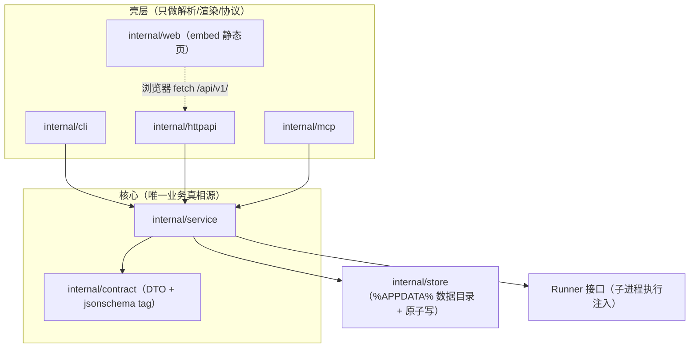

# 35 - TaskbarGuard v3：service 分层 + 前台 web 看板 + MCP 多壳

> 状态：待批准
> 依据：《v3 架构调研》（`docs/projects/go_projects/taskbarguard/v3 架构调研.md`）、《CLI 工具开发标准》v1
> 日期：2026-10-06

## 问题陈述

taskbarguard 当前（阶段一完成后）全部业务逻辑混在根目录 `main.go` 的 CLI 函数体内（`main.go:89-544`）：业务函数直接持有 `stdout/stderr io.Writer`、执行器是全局可变变量 `commandRunner`（`main.go:78-83`）、`apply` 靠进程内递归调用 `runPatch` 复用业务（`main.go:336-348`）、`--schema` 是与类型零关联的手写目录（`main.go:490-528`）。无 http/web/mcp 入口，违反《CLI 工具开发标准》「Service 核心 + 多壳」铁律。

本计划将其改造为 v3 形态：**service 层包所有业务逻辑，cli/http/mcp 为薄壳直调 service；新增嵌入式原生 web 看板，由专设 `web` 子命令前台启动 HTTP 托管，进程终止 HTTP 随之终止（明确不做 daemon）**。同时修复两个调研发现的违规/占位问题（config.json 写 CWD、install-task 注册 `list` 占位）。

## 需求（含用户澄清决策原话）

1. **web 形态（1=a）**：专设 `web` 子命令——前台起 HTTP 托管嵌入式页面，Ctrl+C / 关终端即整体退出；其余子命令（list/run/set/…）不起 HTTP。**不做 daemon**：无自动拉起、无常驻、无地址文件发现机制。
2. **web 功能（2=b）**：可操作看板——应用/款式列表展示 + 修改配置（set 语义）+ 一键 apply 补丁，覆盖 CLI 主要能力。
3. **MCP（3=a）**：本批一次到位，**使用最新 MCP 协议**（协议基线 `2026-07-28`；SDK 取 `go get @latest` 最新稳定版，实施时按标准 §10.2.1 升级前三件事核对）。
4. 每个接口及其不同参数对应 CLI 子命令；`--json` 输出返回值 JSON（v1 包络），`--schema` 输出契约（`google/jsonschema-go` 反射，等价 pydantic `model_json_schema()`；接入 MCP 后顶层 schema 切换为工具目录同源导出）。
5. 顺带修复（用户默认同意）：`config.json` 迁移 `%APPDATA%` 合规目录；`install-task` 注册命令从 `list` 占位改为真实守护动作。

## 背景（调研结论摘要）

- **架构选型：v1 直调形态**（调研 §5.1）——单 exe、cli/http/mcp 各自 import service 进程内直调；web 走 http。daemon 化留待阶段二常驻守护需求落地再评估。
- 参考实现：分层+契约+同源 schema 抄 `go_projects/sourcecount/`；嵌入式 web + serve 组装抄 `go_projects/plansql/` 与 `go_projects/liteconf/`（`http.FileServerFS` + `StripPrefix` + noCache）。
- go-sdk：本仓基线 v1.8.0（`google/jsonschema-go v0.4.3` 为其传递依赖）；最新协议版本 `2026-07-28`，SDK 经 initialize 协商自动支持。
- Go 1.22+ ServeMux 方法路由可用（go.mod 为 go 1.25.3）。
- 现有 CLI 行为基线：子命令 `list|run|config|set|apply|install-task|schema`，`output{OK,Data,Err}` 包络（`main.go:62-71`）已合规，退出码 0/2/1。

## 方案

### 分层与依赖方向

- `cmd/taskbarguard/main.go`：唯一组装入口，子命令分流 `list|run|config|set|apply|install-task|web|mcp|schema`。
- service 层无 `io.Writer`、无 `os.Exit`、无 flag；错误统一 `Error{Code,Message}`（不含退出码）。
- `web` 子命令生命周期：`signal.NotifyContext` 捕获 Ctrl+C → `http.Server.Serve` → ctx 取消触发 `Shutdown` → 进程退出，HTTP 随之终止。

### 关键设计决策

1. **web 子命令**：默认 `127.0.0.1:0` 随机可用端口（打印 URL + 自动开浏览器），`--addr` 固定地址覆盖、`--no-browser` 禁止自动打开；API 前缀 `/api/v1/`，静态看板挂 `/`（liteconf 模式 noCache）。
2. **web API 面**：`GET /api/v1/apps`（应用+款式+当前偏好融合视图）、`PUT /api/v1/apps/{app}`（set 语义）、`POST /api/v1/apply`（一键 apply，可选指定 app）、`GET /api/v1/config`；全部返回 v1 包络（`error.code/message` 结构，与 CLI `--json` 同构）。
3. **数据目录**：`%APPDATA%\language_projects\taskbarguard\<dev|prod>\config.json`（回退 `~/.language_projects/`），写入前自动建目录链；`build.py` 经 `-X taskbarguard/internal/store.buildForm=<dev|prod>` 注入构建形态；首次运行发现旧 CWD `config.json` 自动迁移并提示。
4. **install-task 修正**：注册命令改为守护动作 `"<exe>" apply --silent`；`--silent` 抑制输出、日志追加数据目录 `guard.log`；`build.py` 追加构建 `taskbarguard-guard(-dev).exe`（`-H=windowsgui` 静默变体，供计划任务专用），install-task 优先探测 guard 变体、缺失回退主 exe。
5. **schema 同源**：contract DTO 带 `json` + `jsonschema`（中文 description）tag；各命令 `--schema` 用 `jsonschema.For[T]()` 反射；MCP 落地后顶层 `schema` 子命令切换为 in-memory transport `ListTools` 工具目录导出（去 `interface:"cli"`）。
6. **MCP 工具命名**（三段式 `<prog>.<资源>.<动词>`，与 CLI 子命令一一对应）：`taskbarguard.apps.list`、`taskbarguard.app.run`、`taskbarguard.config.get`、`taskbarguard.config.set`、`taskbarguard.config.apply`、`taskbarguard.task.install`。
7. **CLI 兼容假设**（唯一调用方为本机用户与计划任务）：子命令集与 `--json` 包络保持不变；`schema` 输出形状按标准升级为工具目录（breakging 可接受）；`--config`/`--scripts-dir` 等 flag 保留但默认值改为数据目录合规路径。

## 任务分解

- [ ] Task 1: 建 contract + service 骨架，业务逻辑整体下沉
  - 文件：`go_projects/taskbarguard/internal/contract/types.go`（新建）、`internal/service/service.go`、`internal/service/apps.go`、`internal/service/patch.go`、`internal/service/config.go`（均新建；逻辑自 `main.go:148-211,257-294,399-473` 与 `config.go` 迁移）
  - 实现：`Service` 结构 + 稳定错误 `Error{Code,Message}`；`Runner` 接口注入替代全局 `commandRunner`；`discoverApps/findApp/inspectApp`、补丁编排（校验/款式回退/命令组装）、config 用例（默认值/读写/set 语义）下沉；`apply` 在 service 层复用单应用补丁用例，不再递归 CLI 层；contract 定义各用例 Request/Result DTO（带 jsonschema tag）
  - 验证：`cd go_projects/taskbarguard && go build ./... && go vet ./...` 通过；service 包不 import flag/os/exec 直用
  - Demo：service 包可独立编译，业务函数签名无 io.Writer

- [ ] Task 2: store 层——%APPDATA% 合规数据目录 + dev/prod 隔离 + 旧配置迁移
  - 文件：`internal/store/paths.go`、`internal/store/config.go`（新建）、`build.py`（修改：构建路径改 `./cmd/taskbarguard`、追加 `-X` 注入 buildForm、追加 guard 变体构建）
  - 实现：数据根解析 `%APPDATA%\language_projects\taskbarguard\<dev|prod>\`（回退 `~/.language_projects/`）+ 目录链自动创建；配置原子写（临时文件 + rename）；首次发现 CWD 旧 `config.json` 迁移至新路径并提示
  - 验证：`go build ./...` 通过；`python build.py --dev` 产物注入 buildForm=dev；dev/prod 各跑一次 `config` 落在不同目录
  - Demo：`taskbarguard config --json` 读写的已是 `%APPDATA%` 合规路径

- [ ] Task 3: CLI 薄壳化 + cmd/ 入口重组
  - 文件：`internal/cli/commands.go`、`internal/cli/render.go`（新建）、`cmd/taskbarguard/main.go`（新建组装入口）、根目录 `main.go`（删除）、`main_test.go`/`config_test.go`（随包结构调整迁移适配，保持既有断言语义）
  - 实现：各命令函数只剩「flag 定义 → DTO 组装 → service 调用 → 人读/JSON 渲染 + 退出码 0/2/1」；包络沿用现形状；退出码映射统一
  - 验证：`go build ./... && go test ./...` 通过（备用）；手动 `taskbarguard list / run vscode / set vscode --style blue / apply` 行为与旧版一致
  - Demo：全子命令行为回归，业务调用零输出污染

- [ ] Task 4: schema 反射化
  - 文件：`internal/cli/schema.go`（新建）、`internal/contract/types.go`（补全 tag）
  - 实现：各命令 `--schema` 改 `jsonschema.For[RequestType]()` 反射输出（含 flag 参数维度投影说明）；废弃 `writeCommandSchema` 手写 map；`schema`/`--help`/`--version` 保持零 I/O
  - 验证：`go build ./...`；`taskbarguard list --schema` 输出真实 JSON Schema（含 description、required）
  - Demo：schema 与类型同源，改 DTO 字段后 schema 自动跟随

- [ ] Task 5: httpapi + web 嵌入看板 + `web` 子命令（核心新需求）
  - 文件：`internal/httpapi/server.go`、`internal/httpapi/handlers.go`（新建）、`internal/web/embed.go`、`internal/web/static/index.html`、`internal/web/static/app.js`、`internal/web/static/style.css`（新建）、`cmd/taskbarguard/main.go`（挂 web 子命令）
  - 实现：Go 1.22 方法路由 `/api/v1/` + v1 包络 + 错误→status 映射；embed 静态三件套挂 `/`（noCache + FileServerFS）；`web` 子命令 `signal.NotifyContext` 前台运行，默认随机端口自动开浏览器，Ctrl+C 优雅退出即 HTTP 终止；看板 UI：应用卡片列表（款式选择、启用开关、单应用 apply）+ 全局一键 apply + 结果反馈，浅色亮堂、绿色主色、圆角卡片风格（用户 UI 偏好），原生 fetch 无框架
  - 验证：`go build ./...`；手动 `taskbarguard web` 打开看板，改款式/开关并 apply 生效，Ctrl+C 后进程与端口同时释放（`netstat` 无残留）
  - Demo：浏览器看板完成「查看 → 改配置 → 一键 apply」全流程，无任何常驻进程

- [ ] Task 6: install-task 修正 + guard 静默变体
  - 文件：`internal/service/task.go`（新建，计划任务编排）、`internal/cli/commands.go`（install-task 命令改造）、`build.py`（guard 变体已含于 Task 2）
  - 实现：注册命令改 `"<guard-exe>" apply --silent`（优先 guard 变体、回退主 exe）；`apply --silent` 抑制人读输出、日志追加数据目录 `guard.log`；保持 schtasks ONLOGON 触发
  - 验证：`go build ./...`；`taskbarguard install-task --json` 后 `schtasks /query /tn TaskbarIconGuard /v` 确认 TR 命令为 apply --silent
  - Demo：登录触发任务执行真实守护动作且不弹黑框（guard 变体）

- [ ] Task 7: MCP 壳（最新协议）
  - 文件：`internal/mcp/tools.go`、`internal/mcp/schema.go`（新建）、`go.mod`/`go.sum`（新增 go-sdk 依赖）、`cmd/taskbarguard/main.go`（挂 mcp 子命令）、`internal/cli/schema.go`（顶层 schema 切工具目录导出）
  - 实现：`go get github.com/modelcontextprotocol/go-sdk@latest`（实施时按标准 §10.2.1 升级前三件事核对；协议协商自动支持 `2026-07-28`）；`AddTool` 泛型 handler 直调 service（六工具，三段式命名，input 复用 contract DTO）；stdio 传输、日志写 stderr；`schema` 子命令切 in-memory `ListTools` 工具目录导出
  - 验证：`go build ./...`；`taskbarguard schema --json` 输出工具目录（含各工具 inputSchema）；MCP 客户端接入实测 list/apply 两工具走通
  - Demo：AI 客户端经 `taskbarguard mcp` 完成列表查询与补丁执行

- [ ] Task 8: 测试重组、文档与接线收尾
  - 文件：`internal/service/*_test.go`、`internal/cli/*_test.go`（自 `main_test.go`/`config_test.go` 重组迁移）、`README.md`（更新用法/架构）、`TASK_SCHEDULER.md`（守护命令说明同步）、父仓 `docs/projects/go_projects/taskbarguard/`（镜像架构说明 + MCP 能力表：协议基线/SDK 版本/已验证客户端三件套）
  - 实现：service 单测绕过入口直测用例（Runner 打桩注入）；CLI 集成测试复用 `run()` 模式；磁盘测试注入数据根；全局清点无孤儿代码/死路径；README 与帮助文本覆盖 web/mcp 新命令
  - 验证：`go build ./... && go vet ./... && go test ./...` 通过（备用）
  - Demo：`taskbarguard help` 一屏可见全部子命令；文档与本机行为一致

## 合理假设（未逐条确认，如不符请指出）

1. CLI 子命令集与 `--json` 包络保持兼容；`schema` 顶层输出形状升级为工具目录（调用方仅本机，breaking 可接受）。
2. web 端口默认随机（避免与常驻服务冲突），固定端口经 `--addr` 指定。
3. 阶段 B（scripts 资产 embed 化、免 uv 执行）不在本计划范围；`scripts/` 维持外部 `uv run` 形态。
4. 执行阶段默认按 skill 规则连续执行、不新增测试不跑测试（既有测试随结构调整迁移适配除外，否则无法编译）。

---

**最后更新：** 2026-10-06
**作者：** AI & User
**版本：** v1.0（待批准）
