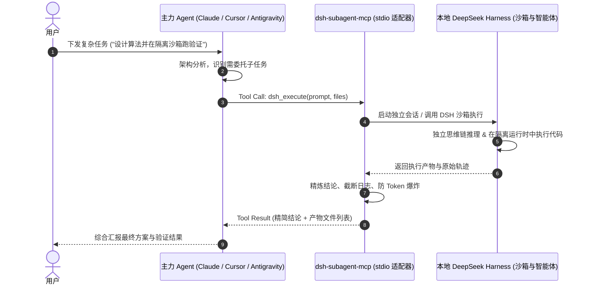

# Plan for: 实现 DSH (DeepSeek Harness) 作为 Subagent 暴露为通用 MCP Server

## 问题陈述
当前主力 AI 编程环境（如 Claude Code、Cursor、Antigravity IDE、Codex 等）作为“主驾驶”，在面对复杂推导、环境隔离测试或特定子任务时，无法直接将任务“委托”给本地运行的 DeepSeek Harness（DSH）。
为了打通跨 Agent 的主从协作模式，需要将 DSH 包装为一个标准的 stdio MCP Server（`dsh-subagent-mcp`），向主力 Agent 暴露子任务派发、沙箱执行等工具接口，并集成进仓库通用的 `.scripts/install-mcp.py` 一键分发到各大 Agent 配置中。

## 需求
1. **轻量标准 MCP 实现**：编写独立的 `dsh-subagent-mcp` 服务（基于 Python 3.10+，支持 `uv` 或直接运行），通过标准 JSON-RPC 2.0 stdio 协议通信。
2. **核心工具定义**：
   - `dsh_execute(prompt: str, files?: list[str])`：将一个子任务派发给 DSH 执行，返回执行结论与改动文件。
   - `dsh_sandbox_run(code: str, language?: str)`：直接借用 DSH 内置的隔离 Python/Node 运行时执行代码，防止主机环境被污染。
3. **输出防护与防 Token 爆炸**：
   - 自动截断长终端输出，仅保留最终结论（Conclusion）、改动文件清单和最近 20 行日志摘要。
   - 完整会话轨迹自动保存至 DSH 会话目录，返回 ID 供按需追溯。
4. **一键分发与生态整合**：
   - 将 `dsh-subagent` 作为内置预设收录进 `.scripts/install-mcp.py`，支持 `uv run .scripts/install-mcp.py --mcp dsh-subagent --agent claude antigravity-ide codex` 极简分发。

## 背景
- 本机已有完备的 DeepSeek Harness 运行时及本地 profile：`C:\Users\29580\.dsh\profiles\desktop\`。
- 调研文档已落盘至 `docs/plans/42-dsh-as-subagent-mcp-research.md`，确立了“独立 stdio 桥接 + 结果精炼摘要”的 Phase 1 架构路线。

## 方案设计

### 架构流程图

---

## 任务分解

- [ ] Task 1: 搭建 dsh-subagent-mcp 核心协议与工具声明骨架
  - 文件：`.scripts/dsh_subagent_mcp.py`
  - 实现：实现标准 JSON-RPC 2.0 stdio 服务端，声明 `tools/list`：`dsh_execute` 和 `dsh_sandbox_run`，支持客户端握手与工具发现。
  - 验证：运行 `python .scripts/dsh_subagent_mcp.py` 并通过 stdin 管道发送 `tools/list` 请求，预期返回格式合法的 JSON-RPC 响应。
  - Demo：向该脚本发送 JSON 握手包，能在 stdout 收到包含 `dsh_execute` 的工具声明列表。

- [ ] Task 2: 实现 DSH 沙箱调用与子任务执行器
  - 文件：`.scripts/dsh_subagent_mcp.py`
  - 实现：检测本地 DSH 运行时（`~/.dsh/dsh-runtimes/dsh-primary-runtime/`），实现 `dsh_sandbox_run`（调用其隔离 Python 环境执行脚本并捕获输出）；实现 `dsh_execute` 封装（支持调用 dsh 命令行会话）。
  - 验证：在本地执行一段包含 pandas/numpy 的测试脚本，验证其在 DSH 专属隔离环境中成功跑出结果。
  - Demo：通过 `dsh_sandbox_run` 成功打印 DSH 隔离环境中的 Python 版本与预装包信息。

- [ ] Task 3: 实现结果精炼器与防 Token 爆炸截断
  - 文件：`.scripts/dsh_subagent_mcp.py`
  - 实现：编写 `truncate_and_summarize()` 函数，当输出超过 2000 字符时自动折叠中间冗余步骤，仅保留首尾和执行状态；保存全量 output 到临时文件并附带路径。
  - 验证：输入模拟 10,000 行控制台日志，确认返回给 MCP 宿主的字符数受控在 2KB 内，并生成本地完整 log 文件。
  - Demo：运行一次长日志测试，控制台输出格式清晰美观且无 Token 溢出风险。

- [ ] Task 4: 将 dsh-subagent 预设接入 install-mcp.py 并分发测试
  - 文件：`.scripts/install-mcp.py`
  - 实现：在 `install-mcp.py` 的 `BUILTIN_PRESETS` 增加 `dsh-subagent` 预设（命令为 `python .scripts/dsh_subagent_mcp.py`）；支持在除 `dsh` 本身之外的各主力 Agent（`claude`, `codex`, `antigravity`, `antigravity-ide`, `opencode`, `pi`）中一键配置。
  - 验证：运行 `uv run .scripts/install-mcp.py --status` 与 `uv run .scripts/install-mcp.py --mcp dsh-subagent --agent claude antigravity`。
  - Demo：在 Claude Code 或 Antigravity 中启动新会话，验证可直接看到并调用 `dsh_execute` 工具。

---

**最后更新：** 2026-10-06  
**作者：** Antigravity & User  
**状态：** 待审批（规划阶段，严格只读）
