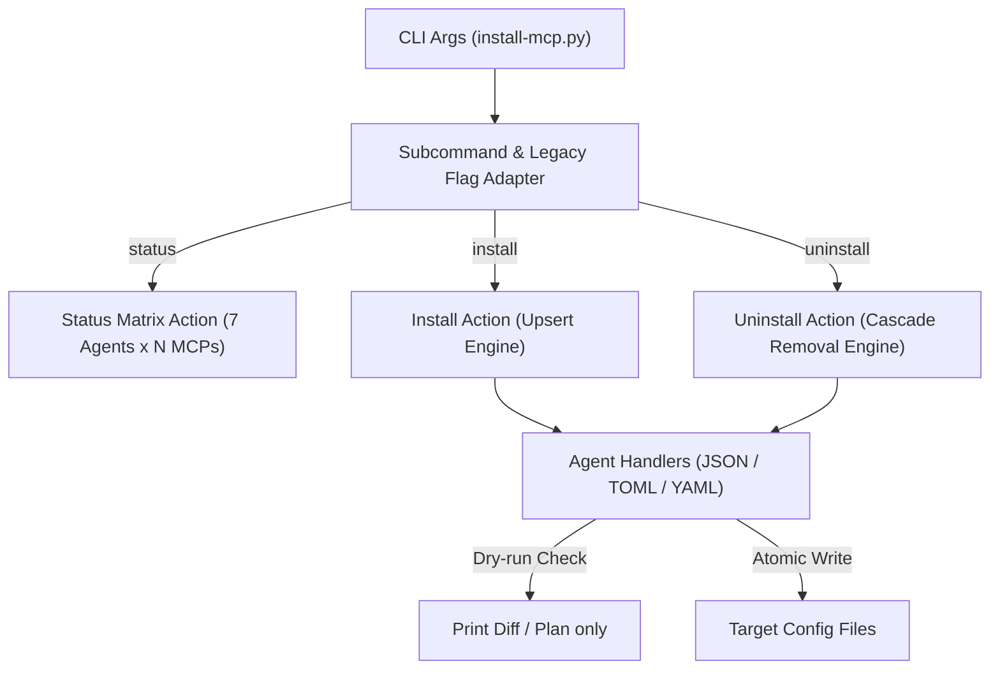

# Plan for: install-mcp.py 对称生命周期改造（支持 install / uninstall 子命令与全状态管理）

## 问题陈述
现有的 `.scripts/install-mcp.py` 核心以“单向安装与同步”为导向，卸载操作仅作为一个弱参数 `--remove` 存在，且不支持批量卸载、缺少子命令对称设计（`install` vs `uninstall`），在管理 7 大 Agent 的多 MCP 时心智负担偏重。
需要将其重构为具备**对称生命周期管理（Install / Uninstall / Status）**的通用分发工具，支持精准卸载（包括 JSON 键值、Codex TOML 段落、DSH YAML 补丁块的安全级联剔除），并提供 `--dry-run` 预览能力，同时无缝保持老用法兼容。

## 需求
1. **显式子命令体系（兼容扁平参数）**：
   - `install-mcp.py status`（或 `--status`）：显示 7 大 Agent × 各 MCP 矩阵。
   - `install-mcp.py install [mcps...]`：安装/更新指定或全部 MCP。
   - `install-mcp.py uninstall [mcps...]`（或 `uninstall` 别名）：从指定或全部 Agent 中卸载指定的 MCP 服务。
   - 保持无子命令直接调用的老习惯兼容（默认等同于 `install all`）。
2. **多 MCP 批量卸载与级联清理**：
   - 支持批量参数：如 `install-mcp.py uninstall everything aoci`。
   - 支持 Agent 作用域限制：如 `--agent dsh claude`。
   - 支持全量清理开关：`install-mcp.py uninstall --all`。
3. **三种格式的精准清理引擎**：
   - **JSON**：原子级删除 `mcpServers.<name>` 或 `mcp.<name>`，清除空对象。
   - **TOML (Codex)**：精准按行级状态机删除 `[mcp_servers.<name>]` 段落及其子字段，保留周围注释与格式，收敛多余连续换行。
   - **YAML (DSH Cordis)**：精准定位 `- id: mcp-<name>` 节点并将其整个 entry 完整移除，确保 DSH 重载后不再尝试启动已删服务。
4. **安全保护与 Dry-run 预览**：
   - 增加 `-n, --dry-run` 参数：仅模拟输出将要变更的配置文件路径和变动内容，不产生真实磁盘写操作。

## 背景
- 当前代码库：`.scripts/install-mcp.py`，代码已处于 git 最新提交（Commit: `cd833f0`）。
- 管理的目标覆盖 7 大 Agent：`claude`, `opencode`, `codex`, `pi`, `antigravity`, `antigravity-ide`, `dsh`。

## 方案设计

### 命令行语法设计

```bash
# 1. 状态查看
python .scripts/install-mcp.py status [--json]

# 2. 安装/同步
python .scripts/install-mcp.py install [everything|aoci|all] [--agent ...] [--force] [--dry-run]

# 3. 卸载/清理
python .scripts/install-mcp.py uninstall <everything|aoci|all> [--agent ...] [--dry-run]

# 4. 兼容老指令（完全向前兼容）
python .scripts/install-mcp.py --status
python .scripts/install-mcp.py --mcp everything
python .scripts/install-mcp.py --remove everything
```

### 架构流程图



---

## 任务分解

- [ ] Task 1: 规范化 Handler 契约与增加多 MCP 卸载接口
  - 文件：`.scripts/install-mcp.py`
  - 实现：在 `AgentHandler` 基类中强化 `remove_servers(mcp_names: list[str], dry_run: bool) -> dict[str, str]` 规范，让 JSON、Codex TOML 和 DSH YAML 三大处理器均支持批量删除与预览标记。
  - 验证：针对模拟测试数据执行卸载函数，验证在 dry_run 下不写入磁盘且返回准确状态。
  - Demo：调用 handler 卸载一个不存在的 mcp 返回 `not_found`，卸载已有的返回 `removed`。

- [ ] Task 2: 强化 Codex TOML 与 DSH YAML 的格式安全清理
  - 文件：`.scripts/install-mcp.py`
  - 实现：优化 `CodexTomlHandler.remove_server` 与 `DshAgentHandler.remove_server`，处理末尾段落删除后的换行规范化，确保删除中间某个 section 后不破坏前后段落的注释和排版。
  - 验证：编写测试字符串，包含两个 section 及前后注释，执行删除其中一个后比对最终文本。
  - Demo：在测试文件删除 section 后输出格式整齐无空段。

- [ ] Task 3: 重构 CLI 解析器为 Subcommand 架构并保留老参数兼容
  - 文件：`.scripts/install-mcp.py`
  - 实现：使用 `argparse.ArgumentParser` 引入 `subparsers`：`status`、`install`、`uninstall`；顶层捕获老参数 `--status`、`--mcp`、`--remove` 并无缝路由到对应子命令逻辑；支持 `--dry-run` 全局标志。
  - 验证：分别测试 `install-mcp.py status`、`install-mcp.py --status`、`install-mcp.py uninstall everything --dry-run` 的解析正确性。
  - Demo：运行带 `--help` 显示清晰的双向子命令文档。

- [ ] Task 4: 端到端功能验证与回归测试
  - 文件：`.scripts/install-mcp.py`
  - 实现：执行完整的测试矩阵：
    1. `--dry-run` 卸载测试（验证无真实写入）；
    2. 针对单个 agent 真实卸载测试并检查 status；
    3. 重新 install 补全并验证 7 个 Agent 全部回归 `[OK-存在]`；
    4. 验证老代理脚本 `.scripts/install-aoci-mcp.py` 依然平稳运行。
  - 验证：执行 `uv run .scripts/install-mcp.py status` 最终确认全状态为一致绿标。
  - Demo：展示从卸载到重新安装的闭环过程。

---

**最后更新：** 2026-10-06  
**作者：** Antigravity & User  
**状态：** 待审批（规划阶段，严格只读，未修改业务代码）
