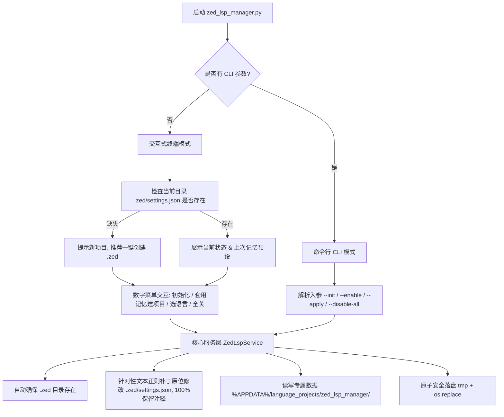

# Plan: 通用 Zed LSP 项目级配置管理脚本 (zed-lsp-manager)

**问题陈述**：
在本机开发中，每个项目目录下的 `.zed/settings.json` 就是用户最核心、最直接需要的工程级配置（按项目精确控制 LSP 行为与内存消耗）。
对于新创建或尚未配置的项目，需要一个通用的、单文件可由 uv 运行的独立脚本，存放在 `D:\Users\language_projects\python_projects\standalone_scripts` 目录下（该子目录严格限定仅存放通用的、单文件 uv 脚本）。
该工具用于：
1. 一键帮助新项目创建 `.zed` 目录及 `settings.json` 规范模板；
2. 一键全关或勾选启用指定语言的语言服务器（LSP）；
3. **100% 保护与保留 JSONC 注释**：摒弃全量 `json.dumps` 反序列化覆盖，采用针对性文本原位补丁引擎，确保用户在 `.zed/settings.json` 中的所有自定义中文注释、空行排版毫发无伤；
4. 支持单槽覆盖式记忆预设，且自产记忆数据**严格遵守仓库规范落盘于 `%APPDATA%\language_projects\zed_lsp_manager\`**，绝不入侵其他应用目录（如 `~/.config/zed/`）；
5. 提供无参终端交互菜单与 CLI 命令行传参双模支持；
6. 可通过 Nuitka 编译打包为 Windows 独立 exe。

**需求**：
1. **存放目录与执行形态**：
   - 目录：`D:\Users\language_projects\python_projects\standalone_scripts\`
   - 脚本：`zed_lsp_manager.py`（单文件，PEP 723 inline script metadata，声明 `commentjson` 等依赖，可直接 `uv run`）。
   - 辅助打包：配套 `zed_lsp_manager_builder.py` 同样作为单文件 uv 脚本放在同级，提供固化 Nuitka 打包（参考 `douyin_downloader/scripts/build_exe.py`）。
2. **JSONC 注释与排版保真强约束**：
   - 严禁全量 dump 清除注释；
   - 采用手术刀式文本替换，仅针对目标语言的 `enable_language_server` 布尔值进行原位修改，四周注释、排版与其它顶层配置完整保留；
   - 新项目模板自带详尽的 Zed LSP 调优中文注释。
3. **数据存放强约束（严格遵守 AGENTS.md）**：
   - 运行时产生的唯一自产数据文件（单槽覆盖式记忆预设）：
     - 优先路径：`%APPDATA%\language_projects\zed_lsp_manager\lsp-batch-memory.json`
     - 回退路径：`~/.language_projects/zed_lsp_manager/lsp-batch-memory.json`
   - 写入前自动创建完整父目录链；**严禁向 `~/.config/zed/` 或任何外部软件目录写入数据**。
4. **定位与新项目创建体验**：
   - 针对当前工作目录（`Path.cwd()`）下的 `.zed/settings.json` 操作。
   - **新项目极简初始化**：若当前目录缺失 `.zed`，交互界面醒目标注 `[✨ 新项目：尚未创建 .zed 配置]`；提供一键初始化选项；且在执行“套用记忆”或“启用指定语言”时，若检测到未创建 `.zed`，自动完成底座目录与文件的创建，实现一步到位。
5. **核心功能矩阵**：
   - **项目脚手架与初始化（Init）**：自动创建 `.zed/settings.json`，提供 Python (basedpyright)、TypeScript (vtsls)、TSX (vtsls)、JavaScript (vtsls)、Rust (rust-analyzer)、Go (gopls) 的标准结构模板；若已有配置则安全补齐缺失项，保留现有自定义配置与注释。
   - **一键全关（Disable All）**：将 `languages` 下所有语言条目的 `enable_language_server` 批量置为 `false`。
   - **勾选启用（Enable Selected）**：将指定的单/多语言置为 `true`，其他保持 `false`。
   - **覆盖式记忆（Memory Preset）**：用户手动设置批量开启时，自动将选中的语言列表覆盖写入 `%APPDATA%\language_projects\zed_lsp_manager\lsp-batch-memory.json`；只保留 1 份最新预设；在新项目中一键“套用记忆”，瞬间完成新项目的 `.zed` 创建与常用语言开启。
6. **双模交互设计（CLI 工具标准）**：
   - **无参运行（双击 / 直接调用）**：自动进入交互式终端控制台，展示当前目录状态、各语言 LSP 开关、当前生效的记忆预设，并提供数字菜单。
   - **命令行模式（CLI Flags）**：支持 `--status`、`--disable-all`、`--enable <langs>`、`--apply-preset`、`--init`、`--json`、`--schema` 等参数，满足脚本调用与 Agent 自动化。
7. **Nuitka 打包配套**：
   - 配套 `zed_lsp_manager_builder.py`，配置 onefile、缓存解压目录、版本元数据与默认图标。

**背景**：
- 用户机器上的 Zed 项目以当前目录的项目级配置为准（见 `sh-zed-lsp-config`）。
- 新建项目时手动创建 `.zed` 目录并手写 JSON/LSP 模板繁琐易错，因此“一键帮助新项目创建 .zed”是高频刚需。
- 数据自产目录必须符合 `AGENTS.md`，严禁污染外部工具配置目录。
- 遵循仓库《CLI 工具开发标准》（Core Service 与外壳解耦，`--json` + `--schema` 为一等公民）。

**方案**：

**任务分解**：
- [x] Task 1: 创建专属子目录与核心业务服务层 ZedLspService
  - 文件：`D:\Users\language_projects\python_projects\standalone_scripts\zed_lsp_manager.py`
  - 实现：
    1. 在 `python_projects` 下建立 `standalone_scripts` 目录；
    2. 实现 `ZedLspService` 类，负责：
       - 项目状态检测（是否存在 `.zed/settings.json`）；
       - 新项目自动创建 `.zed` 目录并写入规范模板；
       - JSONC 安全解析读写与原子落盘（`commentjson`，保留用户注释与字段）；
       - 一键全关所有 LSP 与指定开启；
       - 遵守 `AGENTS.md` 规范的单槽覆盖式记忆管理器（路径：%APPDATA%\language_projects\zed_lsp_manager\lsp-batch-memory.json），支持读取与写入。
  - 验证：在空临时目录下测试初始化、在无 `.zed` 情况下套用记忆，确认只在 `%APPDATA%\language_projects\zed_lsp_manager\` 产生记忆文件，当前目录下生成正确的 `.zed/settings.json`。
  - Demo：通过 Service 方法演示空目录自动建 `.zed` 及状态变更。

- [x] Task 2: 实现 CLI 命令行模式与契约输出 (--json / --schema)
  - 文件：`D:\Users\language_projects\python_projects\standalone_scripts\zed_lsp_manager.py`
  - 实现：集成 `argparse`，支持 `--status`、`--init`、`--disable-all`、`--enable`、`--apply-preset`，以及标准要求的 `--json`（机器数据）、`--schema`（静态自描述规范）与 `--version`。新项目下执行 `--enable` 或 `--apply-preset` 自动建 `.zed`。
  - 验证：在命令行分别执行 `uv run python_projects/standalone_scripts/zed_lsp_manager.py --schema`、`--status --json`、`--version`，验证退出码为 0 且输出结构化 JSON。
  - Demo：展示命令行下带 `--json` 输出的当前项目 LSP 状态及操作结果。

- [x] Task 3: 实现终端无参交互式控制台菜单
  - 文件：`D:\Users\language_projects\python_projects\standalone_scripts\zed_lsp_manager.py`
  - 实现：在无参数传入时启动交互流程：
    1. 头部展示当前路径，若无 `.zed` 醒目标注 `[✨ 新项目：尚未创建 .zed 配置]`；
    2. 展示当前各语言状态与上次记忆预设；
    3. 菜单选项：
       - `1: 初始化创建 .zed 配置 (标准模板)`
       - `2: 一键套用上次记忆 (新项目直接一键完成创建并开启)`
       - `3: 选择开启语言 (输入编号/名称，自动覆盖记忆)`
       - `4: 一键全关所有语言服务器`
       - `5: 查看当前 settings.json 内容`
       - `0: 退出`
  - 验证：模拟交互输入，验证在新项目与存量项目中各菜单项均能准确执行。
  - Demo：在控制台打印新项目与存量项目两种状态下的终端界面。

- [xx] Task 4: 编写 Nuitka 固化构建脚本
  - 文件：`D:\Users\language_projects\python_projects\standalone_scripts\zed_lsp_manager_builder.py`
  - 实现：参考 `douyin_downloader/scripts/build_exe.py`，声明 Nuitka、zstandard、commentjson 依赖；自动从主脚本解析 `VERSION`，配置 onefile、MSVC 编译参数、缓存解压路径（`{CACHE_DIR}/zed_lsp_manager/{VERSION}`）、Windows 控制台模式及默认图标 `docs/assets/projects/python_projects/python-default.ico`。
  - 验证：运行 `uv run python_projects/standalone_scripts/zed_lsp_manager_builder.py --help` 确保参数解析正常。
  - Demo：验证构建命令能够正确拼装并打印 Nuitka 命令行参数。

- [xx] Task 5: 重构 JSONC 文本保真补丁引擎并恢复现有注释
  - 文件：`D:\Users\language_projects\python_projects\standalone_scripts\zed_lsp_manager.py`
  - 实现：重构写机制为原位正则文本补丁，仅修改 `enable_language_server` 布尔值，周围所有中文注释与缩进 100% 完整保留；从 git HEAD 完整恢复了总仓 `.zed/settings.json` 的全部原始中文注释。
  - 验证：在备用信息中提供快速测试命令（`--schema`,执行 `--status --json--enable py,go`）；根据执行规范默认不额外跑耗时集成测试后核对git diff确认所有顶部注释、各语言说明及lsp调优注释均毫无损伤。
  - Demo：通过 `git diff` 验证仅产生 3 行布尔值精准变动。

---
**最后更新：** 2026-10-07
**作者：** AI & User
**版本：** v2.50.0
