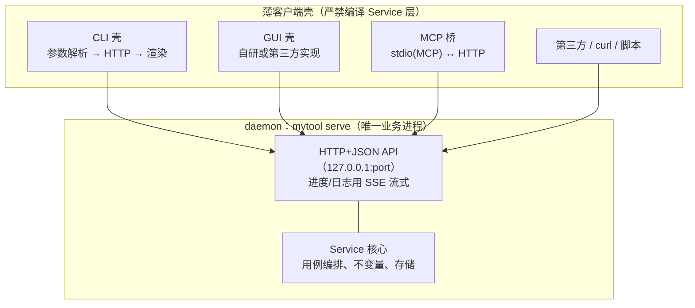

# CLI 工具开发标准 v2（daemon 架构）

> 状态：**探索迭代中（试点标准）——非现行标准，未取代 v1**；更新：2026-09-25。
>
> 读者：本仓库各语言 CLI 工具的开发者、评审者与 AI agent。示例命令使用 Go，原则跨语言适用。
>
> 与 [v1《CLI 工具开发标准》](<CLI 工具开发标准.md>) 的关系：**v1 仍有效、未被废弃**。本文是 daemon 架构方向的探索性共识，会随实践修订；**采用与否按任务判断**（v1 头部有判断指引）：走 daemon 架构的新工具参考本文；契约细节（JSON 包络、业务错误、`--schema` 导出、MCP 协议核对、验收矩阵等）仍以 v1 为准。v1 第 0.2 节仓库约束（AGENTS.md、数据目录等）继续适用。

## 0. 一句话总纲

**Service 层只编译进 daemon 一个二进制；daemon 的 HTTP+JSON API 是唯一契约；CLI、GUI、MCP 全是 daemon 的薄客户端。**

参照系：ollama（一个二进制装下客户端和服务端；空闲策略除外，见 2.1）+ docker（契约一份、按地址连接）。

## 1. 架构



### 1.1 硬规则

| 规则 | 说明 |
|---|---|
| Service 层只编译进 daemon | 壳（CLI/GUI/MCP 桥）里只有 API client 代码。业务逻辑只存在一份编译产物，杜绝多产物漂移；这也是"CLI 与 GUI 同地位"的物理基础 |
| CLI 不含业务逻辑 | 职责仅三段：参数解析 → HTTP 调用 → 输出渲染。测试 API 即测试 CLI |
| HTTP+JSON 是唯一契约 | 契约文档即第三方生态邀请函——GUI 可能由别人实现，只需要 API 文档 |
| stdio 只留给 MCP 桥 | 不为 stdio 单独发明协议壳 |
| gRPC 暂不采用 | 出现多语言类型安全 / 高频双向流需求再议；HTTP+JSON 可 curl 调试，对第三方集成门槛最低 |
| 纯本地命令不走 daemon | `--help`、`--version`、补全脚本生成直接本地输出，不触发任何后台进程 |

### 1.2 MCP 桥

一个独立小进程：stdin/stdout 说 MCP（JSON-RPC），内部转 HTTP 调 daemon。收益：Claude / opencode / Cursor 等 agent 客户端零成本接入。MCP 协议细节（工具命名、Schema、错误映射、`schema` 导出）按 v1 第 5 章执行；**桥是 daemon 的客户端，不直接调 Service**。

## 2. 单二进制双角色（ollama 式）

`mytool` 一个二进制两种角色：

- `mytool serve` → daemon（服务器）
- 其余子命令 → 客户端

### 2.1 生产构建：自动拉起并 detach

```
客户端: 按发现优先级取地址 → 连不上 → 用自身 exe 路径 spawn daemon
        （Windows: DETACHED_PROCESS，脱离父子关系）
        → daemon 写地址文件 → 客户端连上 → 发请求
```

- **自动拉起仅限生产构建**（buildID 中 describe 部分为干净 tag，形如 `v1.2.3`，不带 `-g<hash>`/`-dirty`）；开发构建一律不拉起，见 3.2
- **必须 detach**：daemon 不能保持客户端子进程身份，否则单次命令退出即杀死服务
- **空闲超时自动退出**：自动拉起的 daemon 在无在途请求且持续空闲超过默认 30 分钟后优雅退出并清理地址文件（项目可在项目文档调整时长），避免生产环境长期无人调用时的后台残留；下一次客户端调用按本节流程重新拉起（仅生产构建）。前台 `serve` 由操作者管理，不设空闲退出；空闲计时只累计无在途请求的空档，长查询执行中不触发退出
- **拉起互斥**：自动拉起须防止并发重复启动（地址文件/锁文件互斥校验），发现已有可用实例或端口被占用时放弃拉起并改连
- 地址文件是所有壳的共同入口：CLI 与 GUI 并存时天然共享 daemon 的状态、缓存与会话

### 2.2 发现优先级

| 优先级 | 来源 | 用途 |
|---|---|---|
| 1 | `--host` 参数 | 显式指定 |
| 2 | `MYTOOL_HOST` 环境变量 | 开发 / 多实例（对标 OLLAMA_HOST、DOCKER_HOST） |
| 3 | 地址文件（daemon 启动时写入） | 生产默认 |
| 4 | 内置默认端口 | 兜底 |

## 3. 开发工作流

### 3.1 双终端手动起停

```
终端1: go run . serve          # 前台跑，日志在眼前，Ctrl+C 即停
终端2: go run . <子命令>        # CLI 测试
```

改哪端重启哪端，分别重启互不影响——不存在"改了代码行为没变"的陈旧 server 问题。

### 3.2 自动拉起仅限生产构建；开发构建一律报错

**能否自动拉起由构建身份决定**：buildID 中 describe 部分为干净 tag（形如 `v1.2.3`）即生产构建；非干净 tag（带 `-g<hash>` 或 `-dirty`）即开发构建。

| 构建 | 地址 | 连不上时 |
|---|---|---|
| 生产（干净 tag） | 未指定 | 自动拉起 |
| 生产（干净 tag） | 指定（`--host` / `MYTOOL_HOST`） | 报错——显式指向的实例不存在，绝不本地拉一个 |
| 开发（非干净 tag） | 任意 | 报错，提示"先运行 `mytool serve`" |

运维注记：

- 生产用户开箱即用；开发者始终走 3.1 双终端，不依赖拉起
- **测试自动拉起路径**：本地打临时 tag 构建（`git tag v0.0.0-test && go build … && git tag -d v0.0.0-test`）
- 开发构建干真活时需先手动 `mytool serve`（本标准接受该代价）
- `MYTOOL_HOST` 角色回归纯地址覆盖（对标 OLLAMA_HOST / DOCKER_HOST），用于调试实例端口隔离，不再承担开发态判定

### 3.3 构建指纹握手（buildID）

```bash
go build -ldflags "-X main.buildID=$(git describe --always --dirty).$(date +%s)"
```

- 客户端连接 daemon 后核对双方 buildID，**相等放行，不等报错**：`server 是旧构建 9f3a1e2，请重启后重试`（生产场景提示 `mytool stop` 后重试）
- `-dirty` 后缀区分未提交改动；追加时间戳区分 dirty 状态下的多次构建
- **无人维护版本号**：它不是版本管理，是"两边是否同一次构建"的探测器
- 开发价值：改了协议只重启了一边 → 握手当场报错，1 秒定位；生产价值：升级二进制后旧 daemon 仍在跑 → 同一检查兜底

## 4. 发布流（git tag 驱动）

```
git describe --tags --always --dirty
  开发中: 9f3a1e2-dirty          ← 无 tag、有未提交改动
  开发中: v1.2.3-4-g9f3a1e2      ← tag 之后又有 commit
  发布时: v1.2.3                 ← HEAD 恰好落在 tag 上，干净
```

流程：合并代码 → `git tag -a v1.2.3` → `git push --tags` → CI（goreleaser 等）构建多平台产物 + changelog，发布产物版本即 describe 结果。

纪律：

1. **只从干净检出构建发布**（CI 天然保证）；本地发布加守卫：describe 结果带 `-dirty` 直接拒绝
2. tag 打在合并后、构建前；使用 annotate tag

同一个 describe 字符串四用：开发指纹、握手凭据、`--version` 输出、升级检测。

## 5. 与 v1 的衔接

| v1 内容 | v2 处置 |
|---|---|
| Service 核心与多壳理念（第 0、2 章） | 沿用并升级：壳从"进程内适配器"改为"daemon 的 HTTP 薄客户端" |
| `--json` / `--schema` 基石（第 0、4 章） | 继续有效；daemon API 的 JSON 设计沿用 v1 包络与投影规则 |
| MCP 协议细节（第 5 章） | 继续有效，作用于 MCP 桥 |
| 契约 / 错误 / 并发 / 执行安全（第 1、3、6 章） | 继续有效，等待逐步吸收进本文 |
| Go 组织方式（第 10 章） | 调整：`cmd/<prog>` 双角色入口 + `internal/daemon`（HTTP 层 + Service）+ `internal/client`（各壳共享的 API client） |

## 6. 暂缓项（讨论过、暂不采纳，避免重复讨论）

| 项 | 状态 |
|---|---|
| daemon detach 时日志落盘 | 未定，实现 serve 时再议 |
| API 版本协商（docker 式降级） | 由 buildID 相等检查替代 |
| `--data-root` 开发数据隔离 / 测试自起 daemon | 暂缓，出现测试污染真实数据时再引入 |

修订记录：v2.0-draft（2026-09-25），daemon 架构方向探索性共识（**非最终定案，持续迭代**）：Service 只进 daemon、HTTP 唯一契约、CLI/GUI/MCP 薄壳、单二进制双角色、buildID 握手、git tag 发布流。**v1 未废弃**；v1 与 v2 按任务判断使用（见两份文档头部指引）。

v2.1（2026-09-25），空闲策略改判：自动拉起的 daemon 空闲 30 分钟自动退出并清理地址文件（替代 v2.0 的 ollama 式常驻——生产环境可能长期无人调用，后台常驻属无谓残留），新增自动拉起互斥要求；前台 `serve` 不受空闲退出影响。
