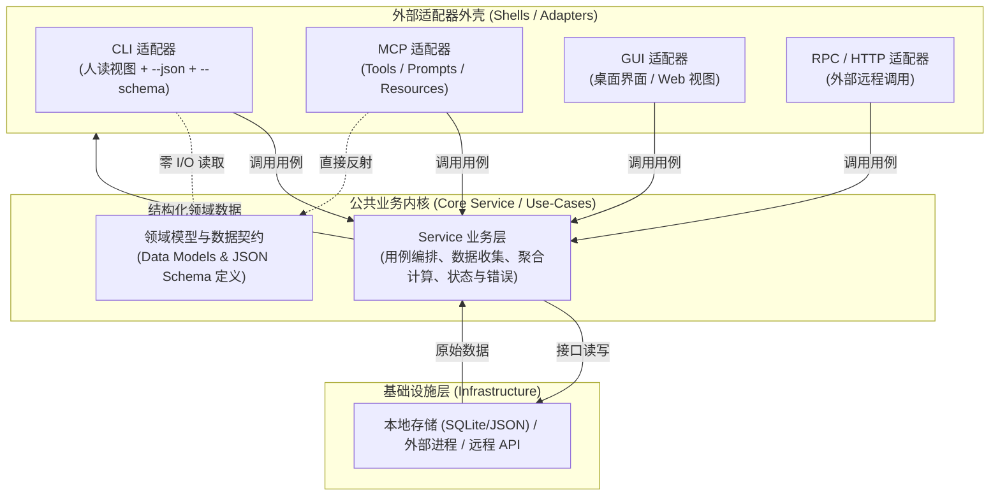

# CLI 工具开发标准

> 状态：现行标准 v1.0；更新：2026-09-15。
>
> 读者：本仓库各语言 CLI 工具的开发者、评审者与 AI agent。原则跨语言适用，工程示例使用 Go。
>
> 本文完整取代《CLI 与 MCP 双壳架构工作指南》《统一核心与多通道投影指南》《MCP 契约为先》。旧文档只保留跳转入口，后续统一维护本文。
>
> 协议依据采用 MCP 2025-11-25，SDK 行为另标版本。此日期是本文的核对基线，不代表最新版本；项目须记录实际协议、SDK 与目标客户端版本。

## 0. 标准速查

**核心架构认知（最高纲领）：**
1. **Service 核心驱动，多壳解耦（Core Service & Multi-Shell Architecture）**：
   公共业务/Service 层（用例编排、业务不变量、数据收集与存储计算）是系统的唯一真实内核；**CLI、GUI、MCP、RPC 都只是其外部适配器（外壳 / Shell）**。
   - **Service 层的独立性是绝对铁律**：即便项目初期仅交付 CLI 入口、暂不实现 MCP，也必须严格将业务逻辑沉淀在独立的 Service / 用例层中，严禁在 CLI 参数解析、Flag 判定或终端渲染代码中混杂核心业务逻辑。
2. **`--json` 与 `--schema` 是机器与 Agent 调用的第一基石，优先级高于 MCP**：
   - 对 CLI 工具而言，**`人类可读视图 + --json（机器数据） + --schema（契约自描述）` 是不可分割的三位一体基线**。
   - MCP 协议本质上只是在此契约之上封装了一层 JSON-RPC 传输壳。**只要 Service 层清晰，且 CLI 具备了精准对齐的 `--json` 和 `--schema`，后续接入 MCP、GUI 或 RPC 壳就是极薄的一层转接代码，信手拈来**；反之，若舍弃 `--json` 与 `--schema` 而直接死磕 MCP 协议，则是本末倒置。

**新工具默认交付 CLI 入口（标配 `--json` 与 `--schema`），公共 Service 核心就绪后按需接入 MCP、GUI 或 RPC 壳。**

本文使用三种要求级别：

| 级别 | 含义 |
|---|---|
| 必须 / 禁止 | 本标准的合规条件；存量偏差须按第 8 章迁移，不得宣称已经符合 |
| 默认 | 新项目直接采用；确需偏离时，在项目文档记录替代方案、理由与兼容影响 |
| 按需 | 有对应需求时实现，并遵守该能力的相关约束；不为满足清单新增无用功能 |

规范要求、仓库约定、SDK 实现行为和项目案例是不同依据。本文中未引用 MCP 规范的工程约定，不应称为“MCP 强制要求”。

### 0.1 新工具的交付基线

| 项目 | 统一要求 |
|---|---|
| 架构分层 | **Service 核心独立**：业务规则、数据采集、计算与存储必须沉淀在公共 Service/用例层；CLI、GUI、MCP、RPC 均为外层壳子，严禁在壳层编写业务逻辑 |
| 机器调用第一基石 | **`--json` + `--schema` 强制标配**：每个管理/查询命令必须支持 `--json` 输出结构化数据，且必须配套支持 `--schema` 导出对应的静态 JSON Schema，为自动化、AI Agent 及后续多壳扩展提供坚实基础 |
| 模式与参数对齐 | **投影动态联动**：CLI 通过 Flag 切换聚合维度或视图（如 `--by-model`）时，`--json` 必须下推只输出投影数据，`--schema` 必须动态反射出对应的 Sub-Schema |
| 多壳接入次序 | **Service 与契约先行，MCP 按需挂载**：只要 Service 层与 `--json`/`--schema` 稳定就绪，挂载 MCP 壳只是水到渠成的简单封装；不以“有无 MCP”作为唯一指标 |
| 离线自描述 | **零 I/O 极速反射**：支持 `--help`、`--version` 及 `<prog> schema`（或 `--flag --schema`）；契约导出分支严禁触发数据库连接、网络或文件 I/O |
| 入口职责 | 壳层（CLI/MCP/GUI/RPC）仅负责入参解析、渠道会话管理与格式渲染，共享同一套公共业务用例 |
| 验收标准 | 验证公共 Service 逻辑准确性、CLI 人读排版与边界，以及机器流与 Schema 的严格一致性 |

适用对象是准备持续维护的独立 CLI 工具。一次性脚本不要求机械套用全部工程结构；纯终端透传等工具若没有合理的 MCP 操作，应在项目文档记录不提供 MCP 的理由。普通管理工具不能仅以“项目小”为由省略 MCP。

提供 MCP 不要求每个 CLI 命令都变成工具。`help`、终端补全等可以仅留在 CLI；每项业务能力的暴露范围须列入能力表。存在真实 GUI/HTTP 需求时，再增加相应入口。

### 0.2 仓库约束

- 先读取目标项目及上级的 `AGENTS.md`。本文适用时须同时遵守仓库约束与用户明确要求。
- 各项目保持独立；参考其他项目不等于允许修改其他项目或建立共享依赖。
- 项目文档放父仓库 `docs/projects/<lang>/<项目相对路径>/`；本标准统一保留在 `docs/projects/go_projects/`，其他语言引用同一文件，不复制一份。
- 自有运行数据只放 `%APPDATA%\language_projects\<项目名>\`；取不到 `APPDATA` 时回退 `~/.language_projects/<项目名>/`，写入前创建完整目录链。仓库明确的例外按 `AGENTS.md` 执行。
- 使用数据库时显式列出查询字段，禁止 `SELECT *`。公共结果不得意外暴露数据库内部字段、ORM 会话或延迟加载对象。

## 1. 从业务契约开始设计

**先说明工具完成什么业务，再说明用户通过哪个入口调用。** 契约先行指实现前确定可验证的行为，不要求先实现 MCP，也不要求先完成全部核心代码。

### 1.1 一份用例表覆盖需求

每个项目维护以下能力表；没有计划建设的渠道无需预留空列。

| 业务用例 | CLI 入口 | MCP 工具 | 输入、结果与副作用 | 执行方式与差异 | 暴露或不暴露的理由 |
|---|---|---|---|---|---|
| 查询记录 | `list` | `<prog>.list` | 相同筛选、排序及记录范围 | CLI 人读/JSON，MCP 结构化结果 | 双入口都需要 |
| 修改记录 | `update` | `<prog>.update` | 相同校验、授权条件与状态变更 | 可有不同参数形式 | 双入口都需要 |
| 执行程序 | `run` | `<prog>.run` | 共用前置检查、执行记录与完成规则 | CLI 可透传，MCP 可采用有界收集 | 明确支持的方式与限制 |
| shell 补全 | `completion` | 不暴露 | 补全候选来自公共查询 | 输出补全脚本或候选文本 | 终端集成 |

表中名称与用例是示例。命令和工具的数量、粒度、命名可以不同；同义调用在**相同业务输入、执行策略与初始状态**下，业务值和副作用必须一致。不同超时、权限身份或批量上限不能混入“一致性”比较。

### 1.2 每个用例必须明确的契约

| 维度 | 最少需要写清的内容 |
|---|---|
| 输入 | 类型、单位、缺省、空值、边界、未知字段策略；哪些是业务参数，哪些是入口配置 |
| 输出 | 公开字段、空结果、排序；涉及分页、截断或部分成功时给出相应结构 |
| 失败 | 稳定业务错误码、可公开说明；失败前是否已产生副作用 |
| 执行 | 完成条件、必要的超时与取消策略、资源归属 |
| 写入 | 原子性、并发冲突、重试与幂等语义；不支持安全重试时明确说明 |
| 兼容 | 已承诺的参数、默认值、结果、错误与输出流；变更的迁移方式 |

简单查询可以用类型与少量例子表达；复杂执行操作需要补充状态和失败说明。JSON Schema 描述数据结构，事务、权限、取消和恢复等行为仍需契约文字与测试支撑。

### 1.3 明确契约的维护源

默认以公共请求/结果类型和集中的契约元数据维护字段定义，适配器使用生成或经校验的映射。跨语言场景可采用独立 JSON Schema；以 MCP 注册定义维护 Schema 也允许，但业务核心不能依赖 MCP SDK。

必须记录生成或校验方向，避免类型、CLI 帮助、MCP Schema 和导出文件独立漂移。共享的是定义与规则，不强求所有渠道使用同一个传输类型。

Schema 可辅助生成帮助、基础表单和参数映射；不能自动生成完整 CLI 交互、进程生命周期或专用 GUI。Inspector 需要可连接的 server；设计阶段可使用最小契约桩，不能把浏览工具列表当成业务正确性验证。

## 2. 公共核心与适配器

**业务归属由职责决定，目录名称和代码行数只是组织方式。** 小工具可使用少量函数和模块，不强制建立框架、插件系统或通用服务基类。



已有远程业务服务时，CLI/MCP 可以调用该服务的 API。复用现有业务边界，不在本地重新实现远程规则；上图不要求核心必须处于同一进程。

### 2.1 各层职责

| 归属 | 负责 | 禁止或应避免 |
|---|---|---|
| 公共业务核心 | 归一化、业务不变量、访问条件、事务和流程编排、结果与错误 | 导入渠道 SDK；直接读写进程标准流；自行退出进程 |
| CLI 适配器 | flag/位置参数解析、终端交互、人读/JSON 渲染、退出码映射 | 独立维护业务规则；绕过用例做记账与状态变更 |
| MCP 适配器 | 工具注册、Schema、协议结果、取消与通知适配 | 把协议形状作为核心能力上限；重复业务编排 |
| 基础设施 | 文件、数据库、网络、进程及平台实现 | 把底层异常原文直接作为稳定公共错误 |
| 组装入口 | 配置读取、依赖创建与注入、日志去向、启动和清理 | 不受控的全局可变状态与隐藏资源所有者 |

核心可以通过注入的 logger、事件回调或进度接口报告状态；禁止直接操作标准流不等于禁止日志，也不等于禁止通过基础设施完成业务 I/O。

确认是否下沉核心时，先判断它是否影响业务不变量。多个入口都需要的排版或序列化仍可属于共享适配代码；“第二个渠道也会用”不能单独作为业务归属的依据。

### 2.2 数据呈现、执行方式与交互表面

| 分类 | 统一什么 | 由入口处理什么 |
|---|---|---|
| 数据呈现 | 结果、业务错误、执行状态、可公开建议 | 表格、JSON、内容块、退出码与对话框 |
| 执行方式 | 用例支持的执行能力与状态语义 | 按渠道选择终端流、缓冲、通知或任务接口 |
| 交互表面 | 所需的业务数据及访问规则 | 补全脚本、ANSI 颜色、排版、拖拽等 |

描述执行方式时分别说明输出交付（收集/实时）、输入交互（无/结构化询问/终端交互）、寿命（请求内/独立任务）。这些维度可以组合；`streaming` 与 `interactive` 不是互斥业务类型。

不对 CLI、MCP、GUI 作统一的“宽/窄”排序。它们在结构化发现、终端字节流、内容类型和客户端交互上各有能力边界。降级仅在满足该用例契约时成立；失去必要语义时必须拒绝，并给出可用入口。

颜色可以呈现业务状态，但状态本身必须来自核心。补全可以呈现已过滤的候选，但访问范围和业务过滤不能只存在于补全脚本。

### 2.3 透传执行仍由公共用例编排

执行用例统一完成前置校验、访问检查、启动记账、执行器调用和最终记账。CLI 注入终端输入输出，MCP 注入受限收集方式；具体进程控制交给执行器。

禁止为方便复用底层连接而新增 `Service.Store()`，让两个壳分别写“查记录 → 启动 → 记账”。存量实现存在此路径时，记录重复规则与迁移范围，并用回归验证保护行为。

## 3. 输入、结果与业务错误

### 3.1 校验可以分层，业务规则必须有共同依据

- 入口检查调用形式：未知 flag、位置参数个数、JSON 能否解析等。
- Schema 表达类型、枚举、范围与可表达的字段依赖；公共用例校验同一业务规则，绕过入口也不能破坏不变量。
- 公共用例或共享构造函数处理业务默认值与归一化；不同入口的执行预算单独配置并登记。
- 存储用唯一约束、事务等维护并发条件下的不变量；预先查询不能代替写入时的约束。

跨字段条件可使用 `if/then/else`、`not`、`dependentRequired` 等关键词。所用 validator 或表单库不支持时，应说明缺口并由公共校验补足。[JSON Schema 条件校验](https://json-schema.org/understanding-json-schema/reference/conditionals)

### 3.2 缺省、空值与真实类型

可选字段不能仅凭语言零值判断是否提供。更新接口须明确缺失、`null`、`false`、`0`、空字符串及空集合分别表示保留、清空、关闭还是非法。

Go 的 `omitempty` 不会自动保存字段是否出现；需要区分缺失与 `null` 时，普通指针通常也不足，应使用能保留出现状态的解码类型。

JSON Schema 的 `default` 是注解，标准校验本身不负责填值。SDK 可能另行填充，项目必须核对并保持与直接调用用例的默认值一致。[JSON Schema 默认值](https://json-schema.org/understanding-json-schema/reference/annotations)

字段使用真实 JSON 类型：固定对象优先明确结构，开放键值扩展才使用 map。`json.RawMessage`、自定义序列化和字节类型须核对实际 Schema，不能按类型名字断定推导结果。字符上限与 UTF-8 字节容量分别校验，不能用字符长度代替字节上限。

### 3.3 业务错误与进程退出码分开

公共错误默认包含稳定的 `code`、可公开的 `message`，按需增加 `details`、`suggestions`。内部原因链保留给诊断，不自动输出数据库错误、凭据或内部堆栈。

**新设计的公共错误不包含 CLI `ExitCode` 或 MCP `isError`。** CLI 根据错误和命令语境映射退出码；MCP 根据业务完成状态映射工具结果。错误分类一致，不要求不同渠道的显示文案逐字相同。

执行子进程观察到的 `exit_code` 是业务结果数据，可以供多个入口使用；它与 CLI 工具自身的退出码是两个概念。结构化建议也不是 CLI 专属数据。

### 3.4 先定义完成状态，再决定成功标志

| 用例结果 | 核心必须保留的信息 | 入口映射 |
|---|---|---|
| 成功 | 完整公开结果；空集合也是合法结果 | 正常结果 |
| 原子失败 | 业务错误与已知状态 | 失败，不伪造已提交的部分成功 |
| 部分成功 | 成功项、失败项及可重试范围 | 默认总体失败，同时保留已有结果 |
| 子进程非零退出 | 退出码、输出及执行状态 | 通用执行器默认视为失败；业务专用解释须写入用例契约 |
| 超时或取消 | 实际观察到的状态、已发生副作用与清理结果 | 区分请求取消、执行停止和结果未知 |
| 无法确认 | 未知状态及可用的查询依据 | 不宣称“没有执行”，不自动重放写操作 |

返回“有效结果 + 错误”时，适配器不得见到错误就丢掉有效结果。部分成功的重试限定在未完成项，或采用契约约定的幂等机制。

## 4. CLI 入口标准

### 4.1 默认人读，显式机器输出

管理、查询类命令默认输出清晰的文本或表格，`--json` 输出稳定 JSON。是否连接 TTY 不改变数据格式；颜色和进度表现可以按终端条件调整。

| 场景 | stdout | stderr |
|---|---|---|
| 人读成功 | 正常结果 | 必要的诊断与进度 |
| 人读失败 | 不追加成功结果；部分结果按用例说明展示 | 错误说明 |
| `--json` 成功或失败 | 一个完整 JSON 结果对象，末尾换行 | 诊断；不混入 JSON 数据流 |
| 终端透传 | 子进程 stdout | 子进程 stderr；工具前置失败写此流 |
| 补全、文件转换等输出即协议 | 对应原始内容 | 诊断 |
| `schema` | 一个 JSON 契约目录对象 | 导出失败的诊断 |

JSON 模式禁止横幅、颜色控制符、进度文本或交互提示。需要确认或补充输入的命令须提供显式非交互参数；缺少必要信息时返回可处理的错误，不能等待终端输入或自动同意。

新工具的 CLI JSON 模式统一采用以下包络；字段含义属于本仓约定：

```json
{"ok": true, "data": {"items": []}}
```

```json
{"ok": false, "error": {"code": "not_found", "message": "记录不存在"}}
```

- 成功必须有 `data`；无返回数据时为 `null`，列表空结果使用空数组。
- 失败必须有 `error.code` 与 `error.message`；部分成功可同时携带 `data`，`ok` 为 `false`。
- 按需增加 `meta` 保存分页或截断等信息，并纳入公开契约；不随意嵌入内部对象。
- 业务 JSON 错误写 stdout，诊断写 stderr；退出码仍必须反映失败。无法进入正常输出流程的启动故障写 stderr，并非零退出。

透传、补全和输出即协议的命令不强制 JSON 包装。命令若不支持 `--json`，应明确拒绝工具自身的该选项；`--` 之后的参数属于子进程，必须原样转交。

#### 4.1.1 投影参数与结构化输出对齐（Projection Flags & Data Slicing）

当 CLI 命令支持通过参数/Flag 改变展示视角或聚合维度（如 `--by-model`、`--by-project`、`--summary-only`）时：
- **数据层精确下推**：`--json` 输出的数据结构必须同步投影到对应视图维度，只返回与该 Flag 语义匹配的字段，禁止仅在终端渲染层过滤显示而在 `--json` 中倾泻未过滤的全量大对象。
- **避免隐式膨胀**：确保自动化调用者（特别是 LLM / AI Agent）获得“所要即所得”的紧凑上下文，降低机器解析成本与 Token 浪费。

### 4.2 参数与退出码

新命令默认采用 `0` 成功、`2` 调用参数错误、`1` 其他失败。透传命令在取得正常子进程退出码时按契约返回该值；启动失败、信号终止及平台特殊状态须单独说明。不得把案例中的 `127` 当成跨平台通用业务错误码。

解析须覆盖位置参数、重复 flag、布尔值、含空格路径、Unicode、`--` 分隔符和透传参数。重复 flag 是否允许由命令契约明确，帮助退出为 `0`，解析失败不能误报成功。

命令函数返回退出码，最外层完成清理后再退出进程。输出辅助函数、公共用例和基础设施不能自行调用 `os.Exit`、`log.Fatal` 或等价 API。

### 4.3 帮助、版本与配置

`--help`、`--version`、`schema` 不初始化业务数据库、执行迁移、发起无关网络请求或写业务状态。确需读取静态配置才能构建工具目录时，仅执行所需读取，并说明配置影响。

存在多种配置来源时，默认优先级为显式 CLI 启动参数 → 项目环境变量 → 配置文件 → 内置默认值；项目公布具体键和优先级。MCP 启动配置与单次调用的业务参数分开，不能把一次调用的选项修改成进程全局状态。

## 5. MCP 入口与离线契约

### 5.1 本地工具默认 stdio

`<prog> mcp` 在进入会话前解析启动配置，随后由 SDK 处理协议初始化和消息编码。stdio 的 stdin/stdout 专用于协议，启动失败和日志写 stderr；客户端不能仅因收到 stderr 就认定调用失败。[MCP 传输](https://modelcontextprotocol.io/specification/2025-11-25/basic/transports)

按实际协商结果使用可选能力，分别记录应用、SDK 和协议版本。能力协商表示对方支持什么功能，不代表身份认证、访问授权或用户已同意某项业务操作。[MCP 初始化](https://modelcontextprotocol.io/specification/2025-11-25/basic/lifecycle)

需要远程访问时，另行采用合适的 MCP HTTP 传输，落实认证、授权与连接生命周期；不能直接套用本地子进程模型。MCP 客户端可以是程序、测试工具或 GUI，不要求一定由 AI host 启动 server。

### 5.2 工具定义与结果

默认工具名采用 `<prog>.<资源>.<动词>` 三段式（如 `gqw.token.set`），与 CLI 命令路径一一对应：资源段与动词段即 CLI 子命令路径（空格换点号），CLI 已暴露而 MCP 缺工具或名字对不上须说明理由；无资源段的顶层动词命令退化为 `<prog>.<动词>`（如 `gqw.status`）。存量两段式 `<prog>.<动词_宾语>` 命名不强制迁移，新增工具与重命名时按三段式对齐。工具名在同一 server 内唯一；聚合端用 server 身份与工具名共同定位。说明至少包括用途、参数单位与缺省、重要限制和副作用。

工具输入必须有准确的 `inputSchema`。本标准要求具有结构化业务结果的工具同时声明 `outputSchema`；按本文协议基线，`structuredContent` 使用对象根，数组和标量用命名字段封装。这是本标准的交付要求，不能说成协议强制每个工具提供输出 Schema。

成功和携带结构化数据的失败分支必须符合对应输出契约；返回结构化内容时宜同时提供序列化 JSON 文本块以兼容客户端。MCP 的内容还可包含图片、音频及资源信息，不能把它概括为“只支持 JSON”。[MCP 工具结果与 Schema](https://modelcontextprotocol.io/specification/2025-11-25/server/tools#structured-content)

MCP 结果 DTO 按用例定义；可复用 CLI JSON 包络，但不要求把 CLI 的进程和输出流约定装入 MCP。复用包络时，`ok` 与 `isError` 必须按同一完成状态映射，成功/失败分支一并纳入 Schema。

`readOnlyHint`、`destructiveHint`、`idempotentHint`、`openWorldHint` 应按实际业务效果填写，包括隐式记账。它们是行为提示，不能代替访问检查或确认机制。[ToolAnnotations](https://modelcontextprotocol.io/specification/2025-11-25/schema#toolannotations)

### 5.3 工具失败与协议失败

工具执行中的业务失败、外部 API 失败等使用 `isError=true` 的工具结果；无法处理的协议请求使用 JSON-RPC 错误。输入校验须区分协议请求结构与工具业务参数，最终行为还要核对 SDK。[MCP 错误处理](https://modelcontextprotocol.io/specification/2025-11-25/server/tools#error-handling)

需要机器读取业务错误时，使用已声明的结构化 `code`、`message` 等字段，并保证相应结果符合 Schema；不能要求客户端从 `code: message` 文案拆出稳定错误码。

handler 返回语言层面的 error/exception 后走哪条通道，是具体 SDK/API 的行为。手工设置 `isError` 也不能假定跳过输出校验。第 10 章给出 Go 版本核对事项，升级依赖时必须重验。

### 5.4 逐项选择进度与交互机制

| 需求 | 可采用的方式 | 必须说明的边界 |
|---|---|---|
| 有限时间完成的操作 | 普通工具调用 | 执行预算与结果大小 |
| 长操作进度 | progress 通知 | 仅表示进度，不等于持续日志流或结果交付 |
| 执行中补充信息 | elicitation | 检查客户端能力；拒绝、取消或不支持时的处理 |
| 跨请求查询状态 | 项目任务接口，或支持的 MCP Tasks | 状态、结果保留、取消、恢复与任务所有者 |
| 持续日志 | 资源、订阅或带游标的有限读取 | 保留期、容量、丢失/截断标记与读取上限 |
| PTY/TUI 终端字节交互 | CLI，或另行设计终端会话协议 | 普通 tools/call 不提供通用终端透传 |

进度通知使用请求提供的关联标识；客户端未请求进度时不能假定一定可显示。[MCP Progress](https://modelcontextprotocol.io/specification/2025-11-25/basic/utilities/progress)

elicitation 支持结构化交互，但依赖客户端声明的能力，不等同于任意子进程 stdin。业务确认条件由用例维护，适配器实现询问；客户端不支持时使用明确的非交互输入或拒绝该操作，不能绕过确认条件。[MCP Elicitation](https://modelcontextprotocol.io/specification/2025-11-25/client/elicitation)

本文基线中的 Tasks 是实验性能力。项目任务接口和协议 Tasks 是两种契约，采用前分别核对支持情况；轮询真实任务状态是合理实现，不能把普通分页输出伪称为实时终端流。[MCP Tasks](https://modelcontextprotocol.io/specification/2025-11-25/basic/utilities/tasks)

能力矩阵按“直接支持 / 有条件支持或降级 / 不暴露或拒绝”记录。降级需要说明发生了什么：例如无交互、输出截断、超时预算；应在描述中预告，在可返回的结果中保留实际状态。

### 5.5 必须提供 `schema` 导出

`<prog> schema` 直接输出 JSON，默认目录结构如下；它是离线元数据入口，不执行工具：

```json
{"name": "example", "version": "1.0.0", "tools": []}
```

`tools` 中每项与实际注册定义同源，包含工具名称、描述、输入 Schema、已声明的输出 Schema 和行为标注。工具附带其他影响调用的公开元数据时也一并保留；不为导出而维护另一份手抄目录。

可以直接导出注册定义，或经内存 transport 读取实际工具视图。读取 `tools/list` 时必须遍历所有 `nextCursor`，处理中途失败；一次调用不能证明完整发现。[MCP 工具发现](https://modelcontextprotocol.io/specification/2025-11-25/server/tools#listing-tools)

静态工具目录应与同配置下的完整发现结果一致。动态或按身份过滤的 server 必须说明离线目录是静态全集还是指定上下文的视图，并在导出元数据中标明；比较时使用相同上下文。不要为了导出静态目录启动业务依赖。

符合第 0 章例外而不提供 MCP 的独立 CLI，`schema` 改为导出自身命令的输入/输出契约，并声明 `interface: "cli"`，避免伪称为 MCP 工具目录；一次性脚本不在此强制范围内。

对照至少覆盖名称、描述、输入/输出 Schema 和标注。只归一化键顺序及明确无序的集合，不能删除约束以使结果“相同”。

#### 5.5.1 单命令 CLI 与投影 Schema 动态对齐

对于非多层子命令架构、依靠选项 Flag 切换返回维度的工具：
- **模式与参数联动**：当用户传入特定投影 Flag 并请求契约时（例如 `<prog> --by-model --schema`），工具必须动态导出与该投影输出完全一致的专有 JSON Schema（Sub-Schema），而不是固定返回全量报告的根 Schema。
- **零 I/O 极速反射**：无论是全局 `<prog> schema` 还是带参数的 `<prog> --flag --schema`，契约反射分支必须在解析参数后立即输出 Schema 并退出，**严禁触发数据库连接、网络请求或文件读取等业务 I/O**。

## 6. 生命周期、并发与执行安全

### 6.1 资源由明确的所有者管理

共享核心表示复用规则和实现，不表示全局单例。不同 CLI/MCP 进程可能同时访问同一份数据，服务实例、连接池和单次事务的寿命须分别管理。

| 资源 | 默认所有者 | 生命周期要求 |
|---|---|---|
| 用例服务、连接池 | 单次 CLI 命令或一个 MCP server 实例 | 显式创建/注入并关闭，可按需惰性初始化 |
| 事务、游标、借用连接 | 短业务操作 | 尽早释放；不跨外部长任务长期持有 |
| 调用上下文 | 一次业务请求 | 取消与 deadline 传到用例、数据库、网络和执行器 |
| 前台子进程 | 执行请求 | 明确退出、断连、取消时的处理与回收方式 |
| 独立后台任务 | 任务管理者 | 可查询状态与回收；不能靠 stdio server 恰好存活 |
| 输出缓冲与持久日志 | 请求或进程 | 有界保留；持久化遵循仓库数据目录约束 |

服务可长时间复用连接池，但不能由此推出“一个任务长期占用一条数据库连接”。执行类用例默认采用：短事务记录开始 → 释放连接 → 执行外部操作 → 短事务记录结果。

惰性初始化要区分未开始、进行中、失败和可用状态。临时失败允许恢复时实现有界重试；Go 的 `sync.Once` 不会因初始化失败自动重试，也不保证后续业务操作线程安全。

关闭时停止接收新操作，按策略等待或取消在途操作，处理子进程，最后释放依赖。清理失败必须可观察，不能在输出成功后静默忽略关键记账错误。

### 6.2 同进程与跨进程并发

项目必须说明用例是否可重入、允许的执行并发量和共享状态保护方式。存储层同时考虑多个 CLI/MCP 进程的写入冲突；进程内 mutex 无法代替跨进程协调。

小工具可以串行处理，但排队请求仍须能取消，长执行不能永久阻塞状态查询或清理。连接恢复只恢复可用性，不代表允许自动重放写操作。

### 6.3 取消、超时与未知结果

适配器将取消传入用例，用例传入实际阻塞操作；仅有 context 参数不证明取消有效。区分客户端等待预算、服务端执行预算和清理预算，配置有限等待并给结果返回留出余量。

普通 MCP 取消是通知，可能与完成竞态；规范允许某些情况下忽略取消，客户端还可能不再接收该请求的返回结果。不能承诺取消后必定收到 `cancelled=true`。需要确认完成状态时，通过正式的操作状态接口查询；任务增强调用使用对应的任务取消机制。[MCP Cancellation](https://modelcontextprotocol.io/specification/2025-11-25/basic/utilities/cancellation)

执行外部程序时必须落实以下适用项：

- 参数默认用参数数组传递；只有产品明确提供 shell 语义时才通过 shell 执行，并说明解析规则。
- 输入交互方式、执行时限、输出容量、达到上限后的行为必须可配置或有明确契约值；不能直接复制案例的 60 秒或 1 MiB。
- 收集输出达到保留上限后，继续排空管道或主动终止执行，不能停止读取而等待子进程退出。
- 截断结果保留明确标记；文本输出还要处理编码和截断到半个字符的情况，必要时使用二进制结果或文件引用。
- 取消/超时是否终止整棵进程树、正常结束的等待时间和强制回收方式须按目标平台实现并验证。
- 必要清理使用独立且有界的清理上下文，不能复用已经取消的请求上下文导致清理立即失败。
- 启动成功但最终记账失败时保留操作标识与失败证据，并提供适合项目的核对/修复方式；不得把未知状态写成成功或未执行。

涉及业务权限的工具，入口解析可信身份，用例检查访问条件。CLI 的进程身份和 MCP 的会话能力不能隐式绕过同一业务规则；仅在实际业务需要时引入相应权限与确认机制。

## 7. 按需建设的客户端与 GUI

本标准不要求每个 CLI 项目同时开发 MCP 客户端或 GUI。项目包含这些组件时，以下规则适用。

- 保留完整工具结果：`content`、`structuredContent`、`isError` 及需要的元数据。展示不支持的内容时明确提示或提供访问方式，不能静默删除图片、资源或错误信息。
- 区分工具失败、协议失败、传输失败和用户取消；协议错误不必然意味着连接已断，工具失败也不应自动触发重连。
- 并发首次连接共享同一次建连；单个等待者取消不能破坏其他正常调用；取消后不再发送该调用。
- 关闭已连接和正在连接的资源，避免遗留启动后尚未登记的子进程；维护 SDK 必需的关闭回调。
- 完整遍历工具发现分页；按列表变更和重连策略刷新缓存；写操作的重试服从用例幂等契约。
- Schema 表单只承担通用输入收集。核对 JSON Schema 方言、组合与引用支持；复杂领域交互使用专用页面，通过公开用例/API 访问业务数据。

实时 GUI、日志查看和终端执行是否能共用事件，由实际事件语义决定；不把所有“实时刷新”都等同于 CLI 字节流。

## 8. 实施与兼容迁移

### 8.1 新项目工作流

| 步骤 | 动作与产物 | 进入下一步的条件 |
|---|---|---|
| 1. 定义需求 | 明确用户、业务用例、执行环境，填写能力表 | 每项需求有入口与成功条件；例外有理由 |
| 2. 确定契约 | 输入/结果、业务错误、执行方式、兼容边界及定义源 | 关键行为可转为测试样例 |
| 3. 实现一条用例 | 公共核心、必要基础设施与优先入口 | 不经过入口也能验证业务规则 |
| 4. 接入另一入口 | CLI/MCP 复用用例，实现差异映射与 `schema` | 同义行为一致；接口差异清楚 |
| 5. 扩展与验收 | 逐用例完成需求，按第 9 章检查 | 真实入口、失败和清理路径有证据 |
| 6. 交付 | 更新项目文档、记录版本与限制 | 使用说明与实现一致，提交范围清晰 |

先交付 CLI 还是 MCP 由主要使用场景决定。默认双入口要求在本次工具交付完成时满足，不要求两个入口同步写，也不要求一次性设计完未来所有能力。

### 8.2 存量工具按用例迁移

1. 建立行为基线：命令、参数、stdout/stderr、退出码、配置和副作用；记录已有问题。
2. 盘点公共层与绕行路径，确定本次迁移用例、两侧映射及兼容影响。
3. 提取公共规则与执行编排，先验证 CLI 基线，再接入或修正 MCP。
4. 补齐本次涉及的契约导出与真实协议验证，登记仍未迁移的行为。
5. 在项目文档说明兼容期、替代调用与恢复方式，交付对应验证结果。

默认 JSON 的存量 CLI 不因本文要求而直接切成人读；旧退出码和结果形状也不静默改写。`ExitCode` 留在旧公共错误、入口直接操作 store 等偏差可以分步消除，但必须标为迁移项，不能转成新项目约定。

### 8.3 变更与恢复

修改默认值、字段类型、未知字段处理、错误码、输出流、退出码或副作用，均需评估调用方。新增输出字段也可能影响严格客户端，不能自动视为兼容。

项目文档记录公开契约变更与升级方法，契约对照和行为测试共同验证。迁移按用例或入口分步实施，保持可回退；数据变更另行定义备份与恢复。关闭 MCP 入口不会撤销已发生的业务操作。

### 8.4 项目交付记录

按项目规模，在项目文档或允许保留的 `README.md` 中记录以下内容，不强制增加多份模板文件：

| 内容 | 必须包含 |
|---|---|
| 能力与契约 | 第 1 章能力表、公开输入/结果、错误和副作用 |
| 运行方式 | CLI/JSON 示例、MCP 启动、配置来源、数据目录、依赖版本与已验证客户端 |
| 差异与例外 | 各入口执行方式、限制、未提供的能力、偏离默认约定的理由 |
| 验收与兼容 | 实际检查结果、存量偏差、迁移与恢复说明 |

用户已明确的范围与常规实现选择按授权执行；涉及未明确的需求取舍或破坏公开兼容性时再澄清，不额外建立逐步审批流程。

## 9. 验收与交付检查

**每个适用要求对应可重复的行为证据。** 不适用项注明原因；本文列举的检查命令不代表已经替任何项目执行过测试。

### 9.1 最小验证矩阵

| 验证对象 | 必测场景 |
|---|---|
| 公共业务核心 | 成功、空结果、业务边界和状态冲突；绕过入口仍维护不变量 |
| 输入契约 | 缺失、`null`、显式零值、空集合、枚举、字段依赖、未知字段与默认值 |
| 跨入口语义 | 相同输入与策略的业务结果/错误/副作用一致；不同策略独立验证 |
| CLI 人读与 JSON | 参数解析失败、成功、业务失败、部分成功；输出流、JSON 可解析性和退出码正确 |
| 轻量入口 | `--help`、`--version`、`schema` 不启动业务依赖或写业务状态 |
| MCP 真实进程 | 启动、初始化、完整发现、成功调用、工具失败与协议失败；stdout 无污染 |
| 输出 Schema | 成功及声明的结构化失败/部分成功均合法；SDK 不因错误零值制造另一类失败 |
| 契约导出 | 与同上下文的完整发现结果对照，强制分页无遗漏；分页中途失败可见 |
| 外部执行 | 参数与 stdin、输出上限、编码、非零退出、超时、进程树回收；输出满载不死锁 |
| 取消与关闭 | 执行前、执行中和临近完成取消；断连、清理预算、资源释放和未知状态 |
| 并发与存储 | 并发初始化与失败恢复、多进程写入冲突、重复写入及长任务期间的连接释放 |
| 客户端（若有） | 完整结果保留、并发建连、连接中取消、分页、重连和退出清理 |
| 存量兼容 | 本次影响范围内的原命令、输出、退出码、配置和副作用回归 |

内存 transport 适合测试 handler 与 Schema；真实进程测试负责验证启动命令、stdio 编码、标准流和退出清理。两者不能相互替代。

Schema 快照用于发现契约变化，不能替代行为测试。时间戳、耗时和无序键可以有明确的比较规则；有业务意义的顺序与约束必须保留。

### 9.2 检查方式

检查在目标子项目目录执行，优先采用项目现有命令；Go 项目通常包括：

```powershell
# 先进入本次实际修改的 Go 子项目目录
go build ./...
go vet ./...
go test ./...
```

并发敏感修改在工具链支持时补充 race 检查；其他语言采用各自构建、类型检查和测试方式。用源码搜索定位直接标准流/退出调用后须阅读上下文，不能用“零命中”代替架构判断。

Inspector 或测试客户端必须与项目版本兼容，记录版本、启动命令和实际调用结果。只查看 `tools/list`，没有执行工具，不满足业务冒烟验收。

有磁盘写入的测试通过注入把数据放入项目数据根的 `tests/<唯一标识>/`，自动创建目录，避开用户真实数据；清理前校验路径确属该实例。构建缓存按工具链管理，不把测试业务数据库留在项目根目录。

### 9.3 发布前清单

- [ ] 需求已被能力表覆盖；默认双入口或例外理由明确。
- [ ] 业务规则、错误、状态与记账有共同归属，无未登记的绕行实现。
- [ ] CLI 默认人读且支持稳定 JSON；原始输出命令的例外已说明。
- [ ] `schema` 与实际定义同源、内容完整且无业务初始化。
- [ ] MCP 的协议要求、实际 SDK 行为与项目默认值已区分。
- [ ] 适用的真实入口、失败、部分成功、取消和并发行为已验证。
- [ ] 项目文档与数据位置符合仓库要求，已说明兼容影响与剩余限制。
- [ ] 父仓库文档与子仓代码分别提交，交付包含改动摘要、验证结果及带 `cd` 的 PowerShell 提交命令。

涉及 SQLAlchemy 模型创建或字段变更时，另按仓库要求提示人工审阅。本清单不授权自动提交、推送或跨项目修改。

## 10. Go 示例与参考实现边界

### 10.1 推荐组织方式

Go 项目默认按 `cmd/<prog>` 组装入口，`internal/service` 放公共用例，`internal/cli` 与 `internal/mcp` 放适配器；按真实需求增加存储与执行器模块。已有结构满足职责边界时无需改名，项目内不另建文档目录。

以下示意公共接口与错误的边界，字段是示例；只有执行程序的工具才需要额外的执行器接口：

```go
package service

import "context"

type GetRequest struct {
	Name string
}

type Tool struct {
	ID   string
	Name string
}

type ToolService interface {
	Get(ctx context.Context, req GetRequest) (Tool, error)
}

type OperationError struct {
	Code        string
	Message     string
	Suggestions []string
}

func (e *OperationError) Error() string {
	return e.Message
}
```

CLI 与 MCP 分别调用该接口并做结果适配。公开 JSON DTO 可以独立于领域类型；Schema 标签放在契约定义或适配类型中，不要求公共核心了解 MCP 注册机制。

### 10.2 Go SDK v1.8.0 的核对事项

以下仅描述核对过的版本/API，不是跨 SDK 规范：

| 返回方式 | 已核对行为 |
|---|---|
| 泛型 `mcp.AddTool` 的 handler 返回普通 `error` | SDK 包装为工具失败；原本返回的部分输出不会自动保留 |
| 同一 handler 直接返回 `*jsonrpc.Error` | 作为协议错误处理 |
| 低层 `Server.AddTool` 的 handler 返回 `error` | 走协议错误；工具失败须显式构造结果 |
| 泛型 handler 的第三返回值为 nil，且类型化输出非空 | 序列化并校验输出，手工 `IsError=true` 也不跳过该校验 |

因此不能复制通用的 `(errResult(err), zero, nil)` 模板。需要结构化错误或部分结果时，返回与声明的失败分支匹配的输出；仅需文本错误时可使用普通 error，但要接受相应结果形状。

该版本还会在处理 Schema 时应用默认值；SDK 接受的输出根类型可能超过本文协议基线的对象形状。采用何种 wire 形状必须按协议与客户端验证，不能仅因 SDK 能序列化就认定兼容。实现依据：[Go handler 类型](https://github.com/modelcontextprotocol/go-sdk/blob/v1.8.0/mcp/tool.go)、[Go 泛型适配](https://github.com/modelcontextprotocol/go-sdk/blob/v1.8.0/mcp/server.go)。

### 10.3 本仓案例只供定位

以下按 2026-09-15 工作区核对。它们体现部分可复用思路，并非已完全符合本标准的模板：

| 案例 | 可借鉴内容 | 已知边界 |
|---|---|---|
| [clictl service](../../../go_projects/clictl/internal/service/service.go) | 业务方法与错误分类的提取 | 公共错误仍带 `ExitCode`，服务仍暴露 `Store()` |
| [CLI 执行器](../../../go_projects/clictl/internal/runner/runner.go)与[MCP 执行](../../../go_projects/clictl/internal/mcp/exec.go) | 终端透传、有界输出与进程控制 | 执行及记账编排仍有重复，不能作为统一用例范例照抄 |
| [clictl Schema 导出](../../../go_projects/clictl/internal/mcp/schema.go) | 内存连接读取注册视图 | 当前只读取一页，不能作为完整分页模板 |

更多项目现状见 [clictl MCP 接口文档](<clictl/MCP 接口文档.md>)、[Go CLI JSON 输出模式参考](<clictl/Go CLI JSON 输出模式参考.md>)。项目现状用于理解兼容负担，不能覆盖本文对新设计的要求。

## 附录：原文冲突的统一处理

此表记录已采用的结论，便于识别迁移影响；具体要求以对应章节为准。

| 原有分歧或问题 | 统一结论 |
|---|---|
| MCP 契约先行与核心先行互相排斥 | 业务用例与行为契约先行；渠道契约随后映射；实现按用例迭代，交付先后不限 |
| MCP 配套是必需还是可选 | 新工具默认配套；不提供时按适用性记录例外，非每个命令都必须暴露 |
| CLI 固定 JSON 与输出格式任意选择 | 新工具默认人读，管理/查询命令必须支持 `--json`；存量保持兼容 |
| Schema 导出可选或默认具备 | 新独立 CLI 必须提供 `schema`；一次性脚本不机械套用 |
| 公共错误必须携带 CLI `ExitCode` | 新公共错误保持业务语义，退出码由 CLI 映射；子进程退出码作为结果保留 |
| 透传是 CLI 体验，可以绕过核心 | 终端 I/O 属于入口，校验、执行编排、状态与记账归公共用例 |
| MCP 完全无交互、只能缓冲或布尔失败 | 按协议与客户端能力区分进度、结构化询问、任务、内容和错误；无通用终端透传 |
| CLI 永远更宽、任何宽能力都能降级 | 逐能力判断；降级须保留必要语义，否则拒绝并说明替代路径 |
| 轮询任务或日志一律属于伪装 | 真实任务状态和有界日志接口允许；不能宣称它们等于终端流 |
| Schema 是完整 API 设计，可自动生成所有入口 | Schema 只覆盖结构契约；补充行为与生命周期，并验证生成产物 |
| service 不做任何 I/O，或常驻必须长持一个连接 | 核心不直接操作标准流，可经依赖执行 I/O；连接池可复用，事务和借用连接及时释放 |
| 业务失败必须手工返回错误结果加零值 | 按 SDK/API 与输出 Schema 设计，不套用会触发二次校验错误的模板 |
| 同源发现保证完整；clictl 已是完整范例 | 同源与全量是两项检查；分页必须验证，存量案例的偏差明确标注 |

修订记录：v1.0（2026-09-15），合并三份指南，统一默认交付要求、职责边界与验收规则；旧指南改为跳转页。
