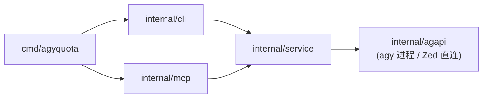
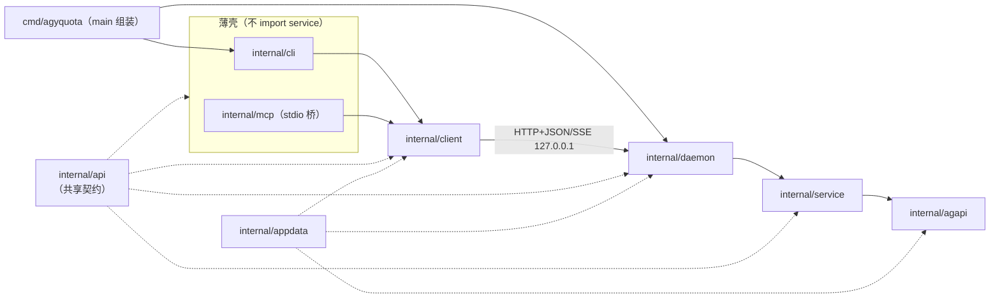
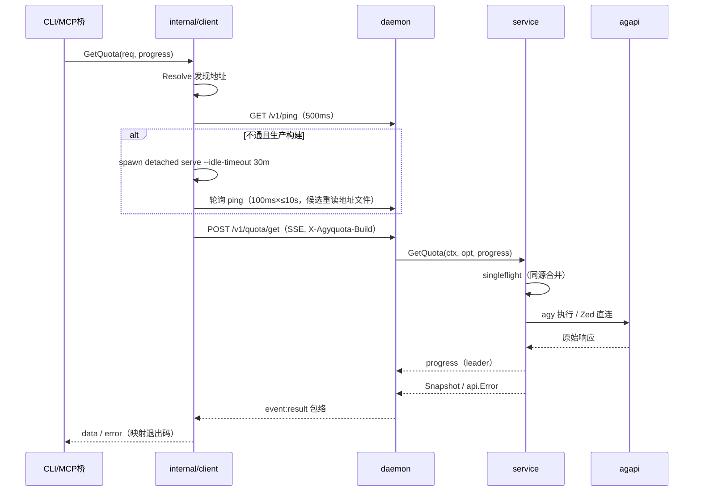

# Design Document

## Overview

把 agyquota 从「进程内三层（`cli`/`mcp` → `service` → `agapi`）」改造为 [v2.1 daemon 架构](<../../../CLI 工具开发标准 v2.md>)：`internal/service` 只被 daemon 装配路径引用；daemon 在回环地址暴露 HTTP+JSON API（SSE 承载进度）；CLI 与 MCP 桥改为共享 `internal/client` 的薄客户端；单二进制双角色（`serve` + 客户端）、地址发现、生产自动拉起、buildID 握手、自动拉起 daemon 空闲 30 分钟自动退出、git tag 发布流。

外部可感知行为（人读输出、`--json` 包络、`--raw`、MCP 工具与 `schema`、错误码、退出码、数据目录）保持不变；契约细节继续按 v1《CLI 工具开发标准》执行。

## Context

现状（0.2.3）：



问题：Service 被两个壳进程内直调，业务实现可随壳各自演进；无统一 HTTP 契约，GUI/第三方接入无从谈起。

目标（依赖方向：只有 daemon 装配路径可依赖 service）：



技术栈锁定：Go 1.25.3（module `agyquota`）、标准库 `net/http`、`cobra`（保留）、`golang.org/x/sync/singleflight`（indirect 转直接）、MCP Go SDK v1.8.0（保留）；不引入 Web 框架。

## Goals and Non-Goals

- Goals：
  - Service 只被 `internal/daemon`（及 `cmd/agyquota` 的 serve 装配）依赖；`internal/cli`、`internal/mcp` 的 `go list -deps` 结果不含 `internal/service`。
  - HTTP+JSON 成为唯一业务契约，响应沿用 v1 包络；进度用 SSE。
  - 单二进制双角色、地址发现、生产自动拉起（Windows detach、无窗口）、buildID 相等握手。
  - 自动拉起的 daemon 空闲 30 分钟自动退出并清理地址文件，下一次调用自动拉起；前台 `serve` 不设空闲退出。
  - 行为回归：CLI/MCP/schema/错误码/退出码/数据目录与 0.2.3 一致。
  - buildID/Version 注入与 git tag 发布流。
- Non-Goals：见 requirements.md「Out of Scope」；不改数据源协议、不引入鉴权/远程访问/GUI。

## Detailed Design

### 1. 契约与共享基础设施

#### 1.1 `internal/api`（单点契约源）

- `CREATED` `go_projects/agyquota/internal/api/api.go`
  - **Purpose**：CLI/daemon/MCP/client 共享的唯一契约定义，避免类型、帮助、Schema、导出各自漂移（v1 §1.3）。
  - **Changes**：
    - 稳定错误码常量：既有 6 个（`source_required`、`agy_not_found`、`agy_execute_failed`、`zed_execute_failed`、`response_parse_failed`、`bad_args`）+ 新增 3 个（`daemon_unreachable`、`daemon_start_failed`、`build_mismatch`）；`internal` 作未知错误兜底（常量一并定义）。
    - `type Error struct { Code string; Message string; Suggestions []string }`，`Error()` 返回 `Message`（与现状 MCP `isError` 文本一致）。
    - DTO 从 `service` 平移、字段与 json tag 不变：`Snapshot`、`Bucket`、`ModelQuota`、`Window`。
    - 请求/响应：`QuotaRequest{Source, TokenFile}`、`PingResponse{Name, Version, BuildID, PID, StartedAt}`、`RawResponse{Raw json.RawMessage}`、`StopResponse{Stopped bool}`。
    - 端点常量：`/v1/ping`、`/v1/quota/get`、`/v1/quota/raw`、`/v1/stop`；头常量 `X-Agyquota-Build`。
    - 包络：`type Envelope struct { OK bool `json:"ok"`; Data json.RawMessage `json:"data,omitempty"`; Error *Error `json:"error,omitempty"` }` + `WriteEnvelope/ReadEnvelope` 双向实现（服务端与客户端共用，杜绝两份编解码）；CLI 成功/失败输出统一走 `WriteEnvelope`，保持 0.2.3 的信封字节形态（成功体无 `error` 键、失败体无 `data` 键）。
  - **Complexity**：Low。

#### 1.2 `internal/appdata`（数据目录单点）

- `CREATED` `go_projects/agyquota/internal/appdata/appdata.go`
  - **Purpose**：`%APPDATA%\language_projects\agyquota\`（回退 `~/.language_projects/agyquota/`）路径解析的单点，供 daemon/client/agapi 共用，避免三处各写一份。
  - **Changes**：`const ProjectName = "agyquota"`；`Dir() string`（写前由调用方 `MkdirAll` 完整目录链）；`AddressFile() string`（`daemon.json`）、`LogFile() string`（`daemon.log`）。
  - **Complexity**：Low。
- `UPDATED` `go_projects/agyquota/internal/agapi/zed.go`、`UPDATED` `go_projects/agyquota/internal/agapi/pe_windows.go`：删除各自的 `resolveDataDir`，改调 `appdata.Dir()`（缓存/静默副本路径不变）。
- `UPDATED` `go_projects/agyquota/internal/agapi/proc_windows.go`：静默副本不可用时的回退路径在 `CreateProcess` 附加 `CREATE_NO_WINDOW`（不变量 7）。
  - **Complexity**：Low。

#### 1.3 `internal/buildinfo`（构建指纹）

- `CREATED` `go_projects/agyquota/internal/buildinfo/buildinfo.go`
  - **Purpose**：buildID 四用同一来源：开发指纹、握手凭据、`--version`、升级检测。
  - **Changes**：
    - `var Version = ""`、`var BuildID = ""`，构建脚本注入 `-X agyquota/internal/buildinfo.Version=… -X agyquota/internal/buildinfo.BuildID=…`。
    - `init()` 兜底：未注入时读 `runtime/debug.ReadBuildInfo()` 的 `vcs.revision`/`vcs.modified`，`Version = 短hash[-dirty]`；取不到为 `dev`。
    - `IsProduction() bool`：**解析 `BuildID`**——仅当末尾 `.` 分隔段为 ≥9 位纯十进制数（Unix 秒时间戳）时才剥离，再匹配 `^(?:agyquota/)?v\d+\.\d+\.\d+$`；`Version` 只供 `--version` 展示。测试断言：`v1.2.3`、`v1.2.3.1700000000`、`agyquota/v1.2.3.1700000000` 为生产；`v1.2.3-4-g9f3a1e2`、`9f3a1e2-dirty` 为开发。
    - 口径说明：`Version` 与 `BuildID` 同一 `git describe --tags --always --dirty` 来源；`BuildID` 额外附 `.时间戳` 用于 dirty 多次构建区分（v2 §3.3），不违背 FR-4/FR-7。
  - **Complexity**：Low。
  - 已知边界：无 ldflags 的 `go run` 双端 BuildID 同为 VCS 派生值，同修订匹配、未提交改动无法区分（v2 开发态限制；build.ps1 注入时间戳后覆盖该场景）。

### 2. daemon 装配与 HTTP 层

- `CREATED` `go_projects/agyquota/internal/daemon/daemon.go`
  - **Purpose**：持有 Service 的唯一进程；监听、地址文件、空闲监控、优雅退出。
  - **Changes**：
    - `type Config struct { Bind string; Port int; IdleTimeout time.Duration; DataDir string }`（`DataDir` 为空时取 `appdata.Dir()`；测试显式注入临时目录）；`Serve(ctx, cfg) error`。
    - 监听 `net.Listen("tcp", net.JoinHostPort(cfg.Bind, port))`；`Port=0` 允许（测试/临时端口），实际地址取 `Listener.Addr()`。
    - 地址文件 `appdata.AddressFile()`，JSON `{schema:1, addr, version, buildID, pid, startedAt}`；**监听成功后**临时文件 + `os.Rename` 原子写入；退出时删除。
    - `http.Server{ReadHeaderTimeout: 5s, BaseContext: func(net.Listener) context.Context { return rootCtx }}`——保证 `r.Context()` 挂在根 ctx 上，关闭时 cancel 根 ctx 能中断在途 handler；不设全局 `WriteTimeout`（SSE 长连接）。
    - 空闲监控（`IdleTimeout > 0` 时）：检查周期 `clamp(IdleTimeout/2, 50ms, 30s)`；条件 `inflight == 0 && time.Since(lastActivity) > IdleTimeout` → 触发 shutdown；`inflight/lastActivity` 由 HTTP 层维护。
    - 优雅退出顺序：置 `shuttingDown`（新请求 503）→ `cancel()` 根 ctx → `srv.Shutdown(5s)` → 删除地址文件 → 退出日志。
    - 信号 `os.Interrupt`/`SIGTERM` 走同一路径。
    - 日志：daemon 写 `os.Stderr`；前台 `serve` 即终端；自动拉起时由 spawn 端重定向到 `appdata.LogFile()`（见 §3）。
  - **Complexity**：High。

- `CREATED` `go_projects/agyquota/internal/daemon/cmd.go`
  - **Purpose**：`serve` 命令组装放在 daemon 包，避免 `internal/cli` 依赖 service（AC-1）。
  - **Changes**：`NewServeCmd() *cobra.Command`：`--bind`（默认 `127.0.0.1`）、`--port`（默认 `17625`，允许 0）、`--idle-timeout`（默认 0=不退出）；执行 `Serve`；非法 flag 沿用 cobra 退出码 2。`cmd/agyquota/main.go` 负责挂载（§5）。
  - **Complexity**：Low。

- `CREATED` `go_projects/agyquota/internal/daemon/http.go`
  - **Purpose**：路由、包络、SSE、握手校验、活动计数。
  - **Changes**：
    - 路由：`GET /v1/ping`；`POST /v1/quota/get`；`POST /v1/quota/raw`；`POST /v1/stop`；未知路径 404、方法不符 405（纯文本，仅程序缺陷可达）。
    - 中间件（顺序）：活动计数（进入 +1、退出 -1 且更新 `lastActivity`）→ **buildID 校验（仅 `/v1/quota/*`）**：请求头 `X-Agyquota-Build` 缺失或不等于本进程 BuildID → 200 + 包络 `build_mismatch`，message 固定模板「buildID 不一致：客户端 {client} / 服务端 {server}，请运行 agyquota stop 后重试」，头缺失时 `{client}` 填「未提供」（`/v1/ping`、`/v1/stop` 豁免，保证升级后仍可 stop）→ 路由。
    - 请求解码：`json.Decoder`；语法错误 → 400 + 包络 `bad_args`（客户端透传该码）；未知字段忽略（前向兼容）。
    - 业务调用：`service.GetQuota/FetchRaw(handlerCtx, opt, progress)`；`*api.Error` → 对应包络；其他 error → `internal`。
    - 状态矩阵：业务成功/业务失败/build_mismatch/内部错误一律 HTTP 200 + 包络；`shuttingDown` 期间新请求 503 + 包络 `daemon_unreachable`（客户端按不可达处理，生产可重新拉起）。
    - SSE（`Accept: text/event-stream`）：逐帧 `event: progress` + 单行 `data: {"message":…}` + 空行，末尾 `event: result` + 单行 `data: <完整包络 JSON>` + 空行；每次 `Flush`。`progress` 回调在 handler goroutine 内同步直写（agapi 的日志回调为同步调用），无跨 goroutine 写。
    - `POST /v1/stop`：先写成功包络并 `Flush`，再由 goroutine 触发 shutdown（响应先落地，不受根 ctx cancel 影响）。
    - 取消：客户端断开 → `r.Context()` done → service ctx → agy 进程树按既有机制回收。
  - **Complexity**：High。

### 3. 客户端 `internal/client`

- `CREATED` `go_projects/agyquota/internal/client/client.go`
  - **Purpose**：所有壳共享的 API client：发现、拉起、握手、请求、SSE 解析、错误映射。
  - **Changes**：
    - 发现：`Resolve() (addr string, explicit bool, err error)`，优先级 `Config.Host`（`--host`）→ `AGYQUOTA_HOST` → 地址文件 → 默认 `127.0.0.1:17625`；地址文件只读 `addr`，损坏/缺失按未发现处理。`--host` 可省略端口（补 17625）；**格式校验在 CLI 参数层完成**（非法 → `bad_args`、退出码 2），`AGYQUOTA_HOST` 非法由 client 返回 `daemon_unreachable`（退出码 1，附建议）。
    - `EnsureDaemon(ctx) error`：
      1. 按发现结果 `Ping`（500ms）：通 → 校验 `buildID` 与本进程相等（不等 → `build_mismatch`，message 模板「buildID 不一致：客户端 {client} / 服务端 {server}，请运行 agyquota stop 后重试」，**原样返回、绝不转拉起**）→ 完成；
      2. 不通：显式地址 → `daemon_unreachable`；开发构建 → `daemon_unreachable` + 建议「先运行 agyquota serve」；生产构建 → 拉起；
      3. 拉起：`os.Executable()` 自身路径执行 `serve --idle-timeout 30m`；spawn 后**同步 `cmd.Wait()` 禁用**，仅异步 `go cmd.Wait()` 记录早退；就绪判据只有「Ping 轮询（100ms 间隔，上限 10s）」；
      4. 轮询候选集合每轮重读地址文件（新 daemon 会原子覆盖陈旧地址）并叠加默认端口，任一 Ping 成功即采用；
      5. 10s 仍不通 → `daemon_start_failed`（附日志路径建议）。
    - 空闲退出竞态：quota 请求以 `daemon_unreachable` 结束（传输失败或 503 包络）且满足「生产 + 未显式指定地址」时，允许**一次**有界的「重新 EnsureDaemon → 重试请求」；quota 两类请求只读，重试安全。
    - `Ping`、`GetQuota(ctx, QuotaRequest, progress func(string)) (*api.Snapshot, error)`、`GetRaw(ctx, QuotaRequest, progress func(string)) (json.RawMessage, error)`、`Stop(ctx) (bool, error)`。
    - 头与解析：quota 请求带 `X-Agyquota-Build` 与 `Accept: text/event-stream`；ping/stop 不带 build 头。响应先解包络再解 `Data`；HTTP 非 200 时若体为包络则透传 code（如 400 `bad_args`、503 `daemon_unreachable`），否则 `internal`；连接失败 → `daemon_unreachable`。
    - SSE 解析：`bufio.Reader.ReadString('\n')`（或 `Scanner` + `Buffer(…, 8<<20)`，覆盖 zed 4MiB 上限的 `--raw`）；按 `event:`/`data:` 逐帧处理，帧间空行分隔；`progress` → 回调（nil 安全），`result` → 终止返回。
    - 超时：查询由调用方 ctx 控制（CLI 沿用 2 分钟，`--raw` 同样有进度）；Ping 500ms；Stop 5s。
  - **Complexity**：High。

- `CREATED` `go_projects/agyquota/internal/client/spawn_windows.go` / `spawn_other.go`
  - **Purpose**：detach 拉起与日志重定向的平台差异。
  - **Changes**：Windows `SysProcAttr{CreationFlags: DETACHED_PROCESS | CREATE_NEW_PROCESS_GROUP, HideWindow: true}`，Unix `Setsid: true`；拉起前若 `appdata.LogFile()` 超过 1 MiB，先 rename 为 `daemon.log.1`（覆盖旧档），再以 append 打开并作为子进程 stdout/stderr（单次运行内不轮转，运行期日志无硬上限）。
  - **Complexity**：Medium / Low。

### 4. Service 改造（业务核心）

- `UPDATED` `go_projects/agyquota/internal/service/service.go`、`go_projects/agyquota/internal/service/quota.go`
  - **Purpose**：业务语义不动，换类型归属、把进度改为按请求传递、加并发单飞。
  - **Changes**：
    - `Snapshot/Bucket/ModelQuota/Window/Error` 改引 `api` 包；`service.Options{Source, TokenFile}` 保留为领域入参，daemon handler 由 `api.QuotaRequest` 一行映射（签名如实变化）。
    - 进度改造：删除 `Service.Progress` 实例字段，改为方法入参——`GetQuota(ctx, opt Options, progress func(string)) (*api.Snapshot, error)`、`FetchRaw(ctx, opt Options, progress func(string)) (json.RawMessage, error)`。
    - 单飞：`singleflight.Group` 只包住 **fetch**（`fetchShared → (*agapi.UsageResult, sourceLabel, error)`），key = `source + "|" + tokenFile`；解析在各调用方内完成。语义：并发同源只执行一次 agy/OAuth；**仅 leader 的 progress 回调被触发**，joined 请求共享结果、无进度（记入实现注释）。
    - ctx 限制：singleflight 共享 leader 的 ctx，leader 取消会连带失败同组请求；本地单用户场景可接受，已同步到 requirements FR-1 的例外条款。
    - 测试接缝：`type Fetcher func(ctx context.Context, opt Options) (*agapi.UsageResult, string, error)`；`Service.Fetcher`（可选，nil 用默认 `fetchBySource`）供单元/集成测试注入假数据源；不影响生产路径。
    - 保持无状态；文件缓存仍归 agapi。
  - **Complexity**：Medium。

### 5. CLI 薄壳与 main 组装

- `UPDATED` `go_projects/agyquota/internal/cli/root.go`
  - **Changes**：
    - 导出 `NewRootCmd() *cobra.Command` 与 `Execute(root *cobra.Command, args []string) int`（原 `Run` 的退出码映射迁入）；`internal/cli` 不再 import `service`/`daemon`。
    - 命令：根默认=quota、`quota`、`mcp`、`schema`、`stop`（`serve` 由 `internal/daemon.NewServeCmd()` 提供、main 挂载）。
    - `Version` 取 `buildinfo.Version`（删除 `internal/cli.Version`）。
    - 持久 flag 新增 `--host`（客户端目标 `host:port`，serve 不使用）；`PersistentPreRunE` 做格式校验，非法返回普通 error → `Execute` 映射 `bad_args`、退出码 2。
    - `mcp` 子命令读取 `--host`（未设置时走 client 自身发现），构造并下传 `client.Config` 给 `mcp.Run(ctx, cfg)`——显式地址语义对 MCP 入口同样生效，不允许静默忽略。
    - `stop`：`client.Stop`；未运行 → 退出码 0、人读「daemon 未运行」、`--json` 为 `{"ok":true,"data":{"stopped":false}}`。
    - 保持退出码 0/1/2 与 `--json` 出口逻辑。
  - **Complexity**：Medium。
- `UPDATED` `go_projects/agyquota/cmd/agyquota/main.go`
  - **Changes**：`root := cli.NewRootCmd(); root.AddCommand(daemon.NewServeCmd()); os.Exit(cli.Execute(root, os.Args[1:]))`。
  - **Complexity**：Low。
- `UPDATED` `go_projects/agyquota/internal/cli/quota.go`、`UPDATED` `go_projects/agyquota/internal/cli/output.go`
  - **Changes**：`quotaRun` 改为 `client.Resolve → EnsureDaemon → GetQuota/GetRaw`，`progress` 写 stderr（`[agyquota] ` 前缀，`--raw` 同样保留）；`outQuota/outRaw/emitOK/emitErrJSON` 改用 `api` 类型并统一走 `api.WriteEnvelope`，人读排版逐字节保持；本地参数校验（缺 source、`--agy/--zed` 互斥）不变。
  - **Complexity**：Medium。

### 6. MCP 桥

- `UPDATED` `go_projects/agyquota/internal/mcp/server.go`、`UPDATED` `go_projects/agyquota/internal/mcp/tools.go`（`schema.go` 行为不变；内部调用点改为 `NewServer(client.Config{})` 以适配新签名，零值 Host 下离线导出仍不触达 daemon）
  - **Changes**：
    - 入口签名：`mcp.Run(ctx context.Context, cfg client.Config)`、`mcp.NewServer(cfg client.Config)`（`cli.mcpCmd` 从 `--host` 构造 Config 并下传）；`NewServer` 版本改 `buildinfo.Version`；`mustSvc` → `mustClient(cfg)`（import `client` + `api`，不 import service）。
    - 工具定义、`quotaGetIn` jsonschema 描述、工具名 `agyquota.quota.get`、Annotations 全部不变；输出类型 `service.Snapshot` → `api.Snapshot`（字段一致，Schema 输出不变）。
    - handler：`EnsureDaemon` → `GetQuota`（progress=nil）→ 返回 `*api.Snapshot` 或普通 error（`Error()=Message`），SDK `isError` 行为不变。
    - `agyquota mcp` 启动不触达 daemon，仅工具调用时执行 EnsureDaemon。
  - **Complexity**：Medium。

### 7. 构建、发布与文档

- `UPDATED` `go_projects/agyquota/scripts/build.ps1`
  - **Changes**：
    - `$describe = git describe --tags --always --dirty`（**必须 `--tags`**，本仓现有 tag 为 lightweight 兼容；v2 §4 同款）。
    - `$buildID = "$describe.$([DateTimeOffset]::UtcNow.ToUnixTimeSeconds())"`。
    - 注入 `-X agyquota/internal/buildinfo.Version=$describe -X agyquota/internal/buildinfo.BuildID=$buildID`；**删除 `-Version` 参数**（防止伪生产构建）。
    - `-Release`：`$describe` 不匹配 `^(?:agyquota/)?v\d+\.\d+\.\d+$` 或含 `-dirty` 时拒绝。
  - **Complexity**：Low。
  - 发布 tag 形态定死 **`agyquota/vX.Y.Z`**（annotated，`git tag -a`）：父仓为多项目共享，裸 `vX.Y.Z` 会与其他项目冲突；`IsProduction` 同时接受无前缀形式。
  - 发布流：合并 → `git tag -a agyquota/vX.Y.Z -m …` → `git push --tags` → `build.ps1 -Release` → 安装。
- `UPDATED` `go_projects/agyquota/README.md`、`UPDATED` `docs/projects/go_projects/agyquota/设计说明.md`：`serve`/`stop`、`--host`/`AGYQUOTA_HOST`、端口与地址文件、开发双终端、自动拉起与空闲退出、数据目录清单、发布流。
- `UPDATED` `go_projects/agyquota/go.mod`：`golang.org/x/sync` 转直接依赖；`go mod tidy`。

### 8. 默认值与文件清单

| 项 | 值 | 说明 |
|---|---|---|
| 默认监听 | `127.0.0.1:17625` | 回环；`serve --port 0` 临时端口 |
| 空闲超时 | `30m` | 仅自动拉起注入 `--idle-timeout 30m`；前台 serve 默认 0 |
| Ping 超时 / 探测 | `500ms` | 发现、就绪与握手 |
| 拉起等待 | 10s（100ms 轮询） | 超时 → `daemon_start_failed` |
| 查询超时 | 2min | CLI 既有预算，经 request ctx 贯穿到 agy |
| stop 宽限 | 5s | `srv.Shutdown` |
| 空闲检查周期 | `clamp(IdleTimeout/2, 50ms, 30s)` | 测试可注入毫秒级超时 |
| 地址文件 | `appdata.AddressFile()`（`daemon.json`） | 原子写、退出删除 |
| daemon 日志 | `appdata.LogFile()`（`daemon.log` + `.1`） | spawn 前超 1 MiB 轮转，仅自动拉起时重定向 |
| 既有缓存 | `appdata.Dir()/.quota_token_cache.json` | 语义不变 |
| `<DataDir>` | `%APPDATA%\language_projects\agyquota\`（回退 `~/.language_projects/agyquota/`） | 仓库强约束 |

### 9. 输入校验、错误处理与不变量

输入契约（v1 §1.2/§3.2）：

| 输入 | 规则 | 失败行为 |
|---|---|---|
| `QuotaRequest.source` | 必填，枚举 `agy`/`zed` | 200 + 包络 `source_required`（与 CLI 一致） |
| `QuotaRequest.tokenFile` | 可选字符串，仅 `zed` 生效 | 路径无效由 agapi 报 `zed_execute_failed` |
| HTTP 请求体 | JSON 语法；未知字段忽略 | 语法错误 → 400 + `bad_args` |
| `serve --port` | 0–65535 | 越界 → 退出码 2 |
| `serve --idle-timeout` | 合法 duration，≥0 | 非法 → 退出码 2 |
| `--host` | `host[:port]`，缺省端口 17625 | 参数层校验，非法 → `bad_args`（退出码 2） |
| `AGYQUOTA_HOST` | 同上 | 非法 → `daemon_unreachable`（退出码 1，不拉起） |

HTTP 状态矩阵：

| 情形 | HTTP | 体 |
|---|---|---|
| 业务成功 / 业务失败 / `build_mismatch` / 内部错误 | 200 | v1 包络 |
| 请求体 JSON 语法错误 | 400 | 包络 `bad_args` |
| 未知路径 / 方法不符 | 404 / 405 | 纯文本（仅程序缺陷可达） |
| `shuttingDown` 期间新请求 | 503 | 包络 `daemon_unreachable` |

错误处理逐操作：

| 操作 | 失败条件 | 结果 |
|---|---|---|
| 探测 / 握手 | 连接失败、buildID 不等 | 按发现来源报错或拉起；不等的 `build_mismatch` 原样透出（含双方指纹与 stop 建议），不转拉起 |
| 自动拉起 | 端口被占 / 子进程早退 / 10s 不通 | `daemon_start_failed`（附日志路径建议） |
| quota 调用 | 业务错误 | 原码原 message 透传 |
| SSE 中断 | 客户端断开 | daemon 取消 ctx、回收 agy；客户端报 `daemon_unreachable`/`internal` |
| 请求中 daemon 空闲退出 | 连接被拒或 503 `daemon_unreachable` | 生产且未显式指定地址 → 一次重新 Ensure + 重试（quota 请求只读，重试安全） |
| `stop` 未运行 | 探测失败 | 成功 no-op（`stopped:false`） |
| 地址文件损坏 / 陈旧 | 解析失败或目标不存活 | 损坏视为不存在；陈旧由新 daemon 原子覆盖 + 轮询候选重读兜底 |
| 静默副本生成失败（agy 回退） | `ensureSilentAgyExe` 报错 | `startAgyProcess` 附加 `CREATE_NO_WINDOW` 后仍尝试执行（见不变量 7），失败则 `agy_execute_failed` |

不变量：

1. 壳包依赖：`internal/cli`、`internal/mcp` 的 `go list -deps` 不含 `internal/service`；`serve` 组装只在 `internal/daemon` 与 `cmd/agyquota`。
2. 契约单点：`internal/api` 是包络、错误码、DTO 唯一定义；`internal/appdata` 是路径唯一定义。
3. 握手门：**除 `/v1/ping`、`/v1/stop` 外**的业务请求必须通过 buildID 相等校验（客户端主动核对 + 服务端头校验双保险）。
4. 地址文件生命周期：只在监听成功后存在，退出（含空闲退出）即删除。
5. 空闲退出只在 `inflight == 0` 时判定；在途请求绝不因空闲被杀；`BaseContext` 保证关闭时在途 handler 被真实取消。
6. 数据落盘只允许 `<DataDir>`；Zed 凭据目录只读，唯一例外是既有 `cleanupLegacyCache`（精确文件名匹配，清理历史版本误写在该目录的本工具缓存）。
7. agy 进程回收：Windows 下成功/失败/取消/超时均原子回收进程树（Job Object，沿用现状）；daemon 以 `DETACHED_PROCESS` 运行时，若静默副本不可用则回退路径必须附加 `CREATE_NO_WINDOW`，避免新建可见控制台。非 Windows 平台两数据源语义不变、交叉编译保持通过，agy 回收沿用现状（仅直接子进程，不承诺进程组）。
8. 自动拉起不阻塞：就绪判据只有有界 Ping 轮询；对子进程的等待必须异步，不得让客户端被 detached daemon 生命周期拖住。
9. 单一 daemon 假设：`serve --port N` 手动实例与自动拉起实例并存时，单飞与缓存写仅在本 daemon 内生效（跨进程共享 `DataDir` 的并发写属已知限制，本地单用户场景可接受）。

### 10. 可测性

- 单元：`api` 包络编解码（omitempty 形状）、`buildinfo.IsProduction` 表驱动（生产：`v1.2.3`/`v1.2.3.1700000000`/`agyquota/v1.2.3`/`agyquota/v1.2.3.1700000000`；开发：`v1.2.3-4-g9f3a1e2`/`9f3a1e2-dirty`）、client 发现优先级与 `--host` 归一化、SSE 解析（含 >64KiB 大帧）、spawn 前日志轮转。
- 集成（仅 `go test` 内）：以 `serve --port 0` + 临时 `DataDir` 起 daemon（进程内 goroutine；需要真实 stdio 的用例起临时子进程），配合 `Service.Fetcher` 注入假数据源，覆盖：ping/握手（含 `build_mismatch` 与 stop 豁免）、quota 成功/业务错误包络、SSE 进度与结果、stop、空闲退出（`--idle-timeout 100ms`）、并发单飞（同源并发只调一次 Fetcher）、请求中空闲退出竞态下的一次重试、mcp 入口 `--host` 下传（指向临时端口 daemon 连通）。
- 手工验收：无未提交改动的检出上打临时 annotated tag `agyquota/v0.0.0` 并以 `.\scripts\build.ps1` 构建，走生产自动拉起（无窗口、`--version` 干净、`-Release` 守卫验证）；开发构建报错提示；`--json`/`--raw`/MCP/schema 回归；静默副本不可用时的回退路径无可见窗口。
- 验证命令（§9 不变量 1 的断言在此执行）：

```powershell
cd D:\Users\language_projects\go_projects\agyquota
go build ./...
go vet ./...
go test ./...
$env:GOOS="linux"; go build ./...; Remove-Item Env:\GOOS
go list -deps ./internal/cli ./internal/mcp | Select-String "agyquota/internal/service"   # 期望：无输出
```

- 说明：上述测试接缝（`Config.DataDir`、`Service.Fetcher`、临时端口）均为 `go test` 内部机制，不新增用户可见的 `--data-root` 或测试框架，不属于 v2 暂缓项。

### Module Collaboration and Data Flow



- 拉起互斥：不加独立锁文件——端口绑定天然互斥（败者退出、客户端改连既有实例），地址文件原子替换避免半写；候选集合每轮重读 + 默认端口兜底解决陈旧地址。
- 并发模型：HTTP 每请求一 goroutine；service singleflight 合并同源取数；agy 进程树受请求 ctx 控制；空闲监控独立 ticker；`BaseContext` 保证关闭取消可达。
- 空闲退出流：ticker 判定 → 取消根 ctx → 删地址文件 → 进程退出；下一次 CLI/MCP 调用按发现与生产规则自动拉起（含一次竞态重试）。

### Acceptance Criteria Mapping

| AC ID | Design Component |
|---|---|
| AC-1 | §1.3 buildinfo、§2 daemon/cmd、§3 client、§5 main 组装；§10 `go list -deps` 断言 |
| AC-2 | §3 spawn_windows、§2 daemon、§7/§10 干净检出 + 临时 tag `agyquota/v0.0.0` + `.\scripts\build.ps1` |
| AC-3 | §3 EnsureDaemon 开发构建分支、§1.3 IsProduction |
| AC-4 | §3 发现优先级与显式地址分支 |
| AC-5 | §2 握手中间件与 stop 豁免、§3 ping 校验、§5 stop |
| AC-6 | §4 service、§5 quota/output、§1.1 DTO 平移与包络 omitempty |
| AC-7 | §6 MCP 桥、§1.1 api（schema 同源不变） |
| AC-8 | §5 schema/help/version 离线路径、§6 工具调用才触达 daemon |
| AC-9 | §2/§3 地址文件与日志、§8 清单、§1.2 appdata |
| AC-10 | §4 singleflight、§2 shutdown、不变量 7 |
| AC-11 | §7 build.ps1 与 tag 形态、§1.3 buildinfo |
| AC-12 | §10 验证命令 |
| AC-13 | §2 空闲监控与 shutdown、§3 拉起/竞态重试/自愈、§8 默认值 |

## Design Review Notes

评审方式：零上下文独立评审（子代理），核对 requirements.md、v1/v2 标准与真实源码/git 实测；返修后复评。

### 首轮发现与处置（已复评核对）

| 编号 | 级别 | 处置 |
|---|---|---|
| HIGH-1 serve 放 cli 破坏依赖断言 | HIGH | 已修复并通过复评：serve 移入 `internal/daemon`，main 挂载，cli 只暴露 `NewRootCmd/Execute` |
| HIGH-2 Progress 字段 + singleflight 数据竞争 | HIGH | 已修复并通过复评：进度改方法入参，单飞只包 fetch；ctx 共享语义已同步需求例外条款 |
| MEDIUM-3 生产判定与 `-Version` 覆盖 | MEDIUM | 已修复并通过复评：`IsProduction` 解析 `BuildID` describe 段；删除 build.ps1 `-Version` |
| MEDIUM-4 `git describe` 需 `--tags`；测试 tag 命令 | MEDIUM | 首轮修复不完整（临时 tag 形态触发不了生产判定），二轮已改为 `agyquota/v0.0.0` + build.ps1 + 干净检出 |
| MEDIUM-5 monorepo tag 命名与判定正则 | MEDIUM | 已修复并通过复评：定死 `agyquota/vX.Y.Z` |
| MEDIUM-6 陈旧地址文件自愈缺口 | MEDIUM | 已修复并通过复评：候选集合每轮重读 + 默认端口兜底 |
| MEDIUM-7 握手范围与 stop 恢复路径 | MEDIUM | 已修复并通过复评：仅 `/v1/quota/*` 校验；ping/stop 豁免；消息模板见二轮 NIT-7 |
| MEDIUM-8 关闭取消未接线 | MEDIUM | 已修复并通过复评：`BaseContext = rootCtx`；stop 先 Flush 再异步 shutdown |
| MEDIUM-9 SSE 64KiB 上限与帧格式 | MEDIUM | 已修复并通过复评：单行 data + 空行分帧；8MiB buffer |
| MEDIUM-10 日志轮转无执行主体 | MEDIUM | 已修复并通过复评：轮转移到 spawn 前 |
| MEDIUM-11 detached daemon 下 agy 回退弹窗 | MEDIUM | 已修复并通过复评：回退附加 `CREATE_NO_WINDOW`；二轮补齐改动文件清单（NIT-6） |
| MEDIUM-12 spawn 早退检测不得同步 Wait | MEDIUM | 已修复并通过复评：就绪只认 Ping 轮询，等待异步 |
| MEDIUM-13 测试接缝 vs Out of Scope | MEDIUM | 已修复并通过复评：requirements 限定为「用户可见能力」 |
| NIT-14~18、20~24 | NIT | 已修复并通过复评 |
| NIT-19 非 Windows 进程树措辞 | NIT | 首轮修复越界（误称「非 Windows 无 agy 数据源」），二轮改为「沿用现状、仅直接子进程、两数据源不变」 |

### 第二轮发现与处置（返修引入/遗留）

| 编号 | 级别 | 处置 |
|---|---|---|
| 新-MEDIUM-1 临时 tag 触发不了生产路径 | MEDIUM | 已修复：requirements AC-2/AC-11 改为干净检出上打 `agyquota/v0.0.0` + `.\scripts\build.ps1`（ldflags 注入）；§10 手工验收同步 |
| 新-MEDIUM-2 FR-1 绝对「取消只影响本请求」与 singleflight 冲突 | MEDIUM | 已修复：requirements FR-1 增加同源合并期间取消 leader 连带失败的例外条款；§4 同步 |
| 新-MEDIUM-3 不变量 7「非 Windows 无 agy 数据源」越界 | MEDIUM | 已修复：不变量 7 改为「两数据源语义不变、交叉编译保持通过，agy 回收沿用现状（仅直接子进程）」 |
| 新-NIT-4 IsProduction 时间戳剥离不精确 | NIT | 已修复：仅末尾段为 ≥9 位十进制数才剥离；测试断言写入 §1.3/§10 |
| 新-NIT-5 `--host` 非法退出码映射 | NIT | 已修复：校验前移 CLI 参数层（普通 error → 2）；env 非法走 `daemon_unreachable`（1） |
| 新-NIT-6 改动清单漏 `proc_windows.go` | NIT | 已修复：§1.2 增列 |
| 新-NIT-7 build_mismatch 消息模板 | NIT | 已修复：§2 服务端与 §3 客户端自检均使用「客户端 {client} / 服务端 {server} + stop 后重试」模板 |
| 新-NIT-8 Envelope omitempty | NIT | 已修复：§1.1 明确 omitempty，CLI 统一走 `WriteEnvelope` |
| 新-NIT-9 Fetcher 签名未定义 | NIT | 已修复：§4 给出函数类型 |
| 新-NIT-10 FR-7 与 FR-4 口径冲突 | NIT | 已修复：FR-7 改为「同一个 describe 来源（buildID 附时间戳）」 |

### 第三轮发现与处置

| 编号 | 级别 | 处置 |
|---|---|---|
| 三轮-MEDIUM-1 MCP `--host` 管道缺失 | MEDIUM | 已修复：`mcp.Run(ctx, client.Config)` / `NewServer(cfg)` 显式下传，`cli.mcpCmd` 从 `--host` 构造 Config（§5/§6）；§10 增加 mcp `--host` 连通集成断言 |
| 三轮-NIT-2 空闲竞态未覆盖 503 形态 | NIT | 已修复：重试触发条件改为「`daemon_unreachable`（传输失败或 503 包络）」，注明 quota 只读可安全重试（§3/§9） |
| 三轮-NIT-3 build_mismatch 头缺失时 `{client}` 无值 | NIT | 已修复：模板注明头缺失时填「未提供」（§2） |
| 三轮-NIT-4 AC-11「干净 tag 形态」措辞易误读 | NIT | 已修复：requirements AC-11 明确 `--version` 输出 describe 本身、buildID 附时间戳，二者不要求逐字相等 |

第四轮复评：**APPROVED**（HIGH 0 / MEDIUM 0；唯一新 NIT——`schema.go` 调用点适配 `NewServer(client.Config{})`——已随手修正，评审闭环）。
