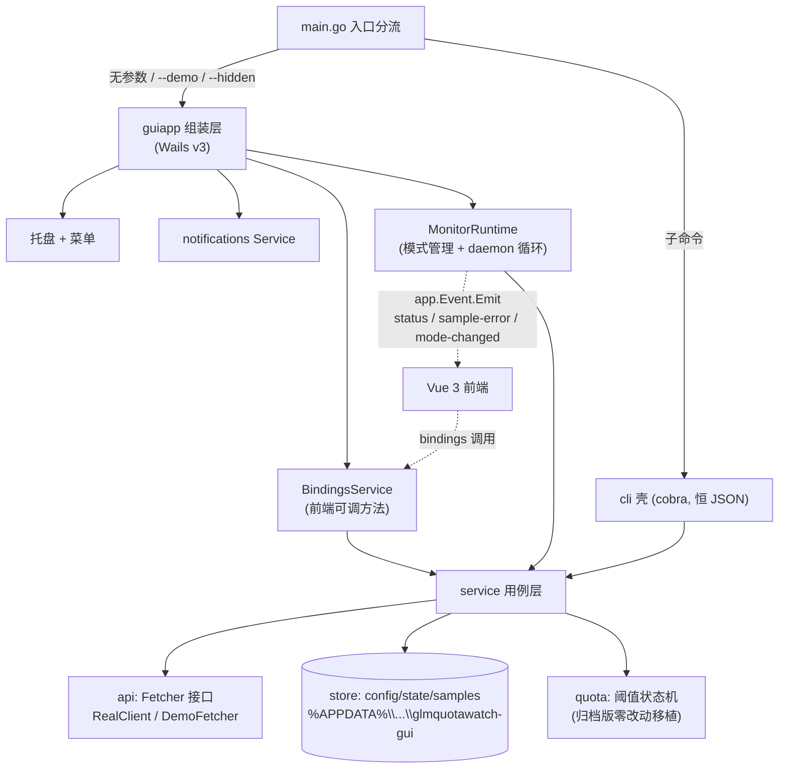

# Design Document — glmquotawatch-gui

## Overview

用 Wails v3（beta.25）实现 glmquotawatch 的 GUI 复活版：Go 业务核心（api / store / quota / service 四包自归档版移植）+ Vue 3 Web 前端 + 系统托盘常驻；CLI 壳恒输出 JSON 信封（面向机器，不保留人读模式）；不保留 MCP 壳；演示模式以可注入的模拟上游实现 60 倍速时间压缩；开机自启经 HKCU 注册表 Run 键实现（Wails v3 beta.25 无内置 autostart 服务，已核实）。

## Context

- 业务语义全部来自归档项目 `.archived/projects/go_projects/glmquotawatch/`：采样接口 `GET /api/monitor/usage/quota/limit`（Authorization: Bearer token）、阈值状态机（F 集记账 / 只报最高新档 / 滞回重置 / 配置指纹失效）、数据文件三件套（config.json / state.json / samples-YYYY-MM.jsonl）。
- 《CLI 工具开发标准》核心架构：Service 核心独立，CLI/GUI 均为外壳。本设计沿用该分层。
- 本机环境已核实：Go 1.25.3（GOPROXY=goproxy.cn）、Node v24.10.0 + npm 11.6.1、Windows 11（WebView2 系统自带）。
- **Wails v3.0.0-beta.25 关键 API 已对照源码核实**：

| 能力 | 已核实 API | 依据 |
|---|---|---|
| 单实例 | `Options.SingleInstance *SingleInstanceOptions{UniqueID, OnSecondInstanceLaunch func(SecondInstanceData), ExitCode}`；锁在 `application.New()` 内获取，第二实例通知主实例后 `os.Exit(ExitCode)`（New 之前零业务 I/O 即可保证第二实例不写任何数据）；`SecondInstanceData.Args []string` 携带第二实例命令行 | `application_options.go`、`single_instance.go`、`application.go:203-217` |
| 静默启动 | `WebviewWindowOptions.Hidden bool`（创建即隐藏） | `webview_window_options.go:178` |
| 关窗到托盘 | `window.RegisterHook(events.Common.WindowClosing, cb)` 中 `event.Cancel()` + `window.Hide()`——hook 先于内置销毁监听器执行，取消即阻止销毁 | `webview_window.go` `HandleWindowEvent`（hook 取消则 listener 短路） |
| 托盘 | `app.SystemTray.New()` → `SetIcon / SetTooltip / SetMenu / ShowWindow / ToggleWindow` | `system_tray_manager.go`、pkg.go.dev 索引 |
| 菜单 | `app.Menu.New()` → `*Menu` | `menu_manager.go` |
| 通知 | `pkg/services/notifications`：`NotificationService.SendNotification(NotificationOptions)`，以 Service 注册；`NotificationOptions.Sound *NotificationSound`——`&NotificationSound{Silent:true}` 即静音（Windows 映射 ms-winsoundevent） | `services/notifications/notifications.go` 结构体定义 |
| 事件推送 | `app.Event.Emit(name, data)` + 前端 `@wailsio/runtime` `Events.On` | `event_manager.go`、pkg.go.dev 索引 |
| 服务绑定 | `application.NewService[T](instance)` + wails3 CLI 生成前端 bindings | `app.go` `RegisterService` |
| autostart | `app.Autostart`（AutostartManager，`application.go:436`）：`EnableWithOptions(AutostartOptions{Identifier, Arguments})` / `Disable` / `IsEnabled`；Windows 实现为 HKCU\…\CurrentVersion\Run 注册表值（`autostart_windows.go`） | `v3/pkg/application/autostart*.go`（实现期核实修正：初判"pkg/services 无 autostart"不全面，application 包内建） |

## Goals and Non-Goals

- Goals:
  - GUI 托盘常驻监控全功能（采样、阈值 Toast、仪表盘、历史曲线、设置、开机自启、单实例）
  - CLI 壳恒 JSON 信封（7 个子命令 + schema 契约导出，零业务 I/O）
  - 演示模式：进程内切换（不重启），独立数据目录，60 倍速 0→100%
  - 业务核心与归档版语义逐条一致（quota 包零改动，store/service 微调注入点）
- Non-Goals:
  - MCP server（用户放弃；替代入口 = GUI 面向人 + CLI 恒 JSON 面向机器，偏离理由记录于本设计文档即《CLI 工具开发标准》第 0 章要求的例外记录）
  - 人读 CLI 输出模式、`--json` flag（用户明确要求恒 JSON，属对标准 §4.1 默认的记录性偏离）
  - 无头 daemon（`start` 命令）、旧版数据迁移、TIME_LIMIT 告警、国际版端点、自动更新、多语言、开机自启以外的系统级集成（防火墙/服务等）

## Detailed Design

### 技术选型（已锁定）

| 维度 | 选择 | 理由 |
|---|---|---|
| GUI 框架 | Wails v3.0.0-beta.25 | 用户已批准；内置托盘/通知/单实例（上表已核实）；接受 beta 换取能力完整 |
| 前端框架 | Vue 3 + TypeScript + Vite + Tailwind CSS（v4） | 美观上限高（Tailwind 原子样式做暗色仪表盘）；SFC 模板开发直观；wails3 官方模板同路径，脚手架成本低 |
| 图表 | ECharts（经 npm 安装，vue-echarts 可选） | 阈值虚线 markLine、百分比 y 轴、tooltip 开箱即用；体积对桌面内嵌应用不敏感 |
| CLI | spf13/cobra（同归档版） | 子命令/args 校验/退出码模式直接沿用 |
| 自启 | golang.org/x/sys/windows/registry → `HKCU\...\CurrentVersion\Run` | Wails 无内置服务（已核实）；HKCU 无需管理员权限，卸载残留仅一条失效注册表值，不产生副作用 |

前端依赖版本在脚手架任务中以 npm latest 锁定到 package.json，设计不预写版本号。

### 模块设计

#### 1. `main.go` — 入口分流
- `CREATED` `go_projects/glmquotawatch-gui/main.go`
  - **Purpose** 进程唯一入口，分流 GUI / CLI
  - **Changes** 规则：GUI 路径仅当 args 为空，或 args 全部属于 {`--demo`, `--hidden`}（可组合）→ `guiapp.Run(demo, hidden)`；**其余一律走 `os.Exit(cli.Run(args))`**——含 `--help`/`--version` 与一切未知 flag（由 cobra 给出信封化 usage/版本或 `bad_args` 退出码 2，GUI 路径不静默吞掉任何参数）。`cli.Version = "v0.1.0"` 经 `-ldflags -X` 注入（同归档版模式）
  - **Complexity** Low

#### 2. `internal/api` — 上游客户端与模拟上游
- `CREATED` `internal/api/client.go`（自归档版移植）
  - **Purpose** bigmodel 用量查询客户端
  - **Changes** 逐行移植归档版（Usage/Limit/UsageDetail/rawEnvelope/FetchUsage/HTTPError/APIError）；仅两处调整：包注释更新；环境变量改名为 `GLMQUOTAWATCH_GUI_API_BASE`（新项目名，默认 `https://open.bigmodel.cn` 不变）
  - **Complexity** Low
- `CREATED` `internal/api/fetcher.go`
  - **Purpose** 抽象数据源接口，service 依赖它而非具体 Client
  - **Changes** `type Fetcher interface { FetchUsage(ctx context.Context) (*Usage, json.RawMessage, error) }`；`Client` 天然实现该接口
  - **Complexity** Low
- `CREATED` `internal/api/demo.go`
  - **Purpose** 演示模式模拟上游：60 倍速（5 小时窗口 → 5 分钟真实时间）
  - **Changes** `type DemoFetcher struct { start time.Time }`；`FetchUsage` 按当前时刻计算：`pct = min(100, elapsed/300s × 100)`（线性，浮点转 int64）；构造单窗口 `Limit{Type:"TOKENS_LIMIT", Unit:3, Number:5, Percentage:&pct, NextResetTime: start+300s 的毫秒时间戳}`；`Usage.Level = "DEMO"`；`data` 原文由 `json.Marshal(api.Usage{Level:"DEMO", Limits: …})` 产生——**复用 api 类型序列化，禁止手工拼 map**（json tag 与真实上游 camelCase 键名天然一致，samples 落盘 → ReadHistory → buildStatusView 全链路闭环）。elapsed > 300s 后 percentage 恒 100（演示自然结束态）
  - **Complexity** Low

#### 3. `internal/store` — 持久化
- `CREATED` `internal/store/store.go`（自归档版移植）
  - **Purpose** config/state/samples 三类文件持久化
  - **Changes** 移植归档版全部逻辑（原子写、LoadConfig/SaveConfig/LoadState/SaveState/AppendSample）；调整：① `DefaultDir()` 指向 `%APPDATA%\language_projects\glmquotawatch-gui`（回退 `~/.language_projects/glmquotawatch-gui`）；② **删除 `Lock()/LockError/pid_alive*`**（GUI 单实例由 Wails SingleInstance 保证，CLI 子命令是一次性进程，无需跨进程 daemon 锁）；③ 新增 `ResetDir(target string) error`——删除并重建 target 目录内全部文件（演示清场用）；**双防线**：runtime 层调用前做全等校验 `filepath.Clean(target) == filepath.Clean(filepath.Join(默认目录, "demo"))`（禁止任何前缀匹配），`ResetDir` 内部再做二级校验（`filepath.Base(target) == "demo"`、拒绝空串与卷根），任一不过即报错拒绝
  - **Complexity** Low

#### 4. `internal/quota` — 阈值状态机
- `CREATED` `internal/quota/threshold.go`、`internal/quota/format.go`（自归档版零改动移植）
  - **Purpose** 纯逻辑状态机（F 集记账、只报最高新档、滞回重置、配置指纹失效）与展示格式化
  - **Changes** 仅改 import 路径为 `glmquotawatch-gui/internal/...`；逻辑零改动——语义与归档版逐条一致是硬约束
  - **Complexity** Low

#### 5. `internal/service` — 用例层
- `CREATED` `internal/service/service.go`（自归档版移植 + 注入点改造）
  - **Purpose** 唯一业务真相源：参数校验 + store/api/quota 编排
  - **Changes** 移植归档版（Error/ConfigView/WindowView/StatusView/SetToken/RemoveToken/GetConfig/SetConfig/MaskToken/SampleOnce/buildStatusView 及全部校验规则）；改造点：① `Service` 持 `fetcher api.Fetcher`（替代直接 `api.NewClient`），`WithFetcher(f)` Option 注入，默认 `api.NewClient(baseURL, cfg.Token)` 的工厂闭包——token 每轮从 config 现读（保持归档版热加载语义）；② `Open(dir string, f api.Fetcher)` 改为显式收数据目录（GUI 按模式传真实目录或 demo 子目录；CLI 传默认目录）；③ 新增 `WithFixedInterval(d time.Duration)` Option——非零时 daemon 启动与热加载均直接采用该值，**跳过 LoadConfig 的 interval 读取与 clampInterval**（demo 固定 5s 的唯一注入路径；真实模式不传，维持 30s–24h clamp 语义）
  - **Complexity** Medium
- `CREATED` `internal/service/daemon.go`（自归档版移植）
  - **Purpose** 常驻采样循环
  - **Changes** 移植 `RunDaemon(ctx, n Notifier, log *slog.Logger, onSample func(StatusView))`：周期采样、interval 热加载（`Service.fixedInterval != 0` 时跳过热加载直用固定值）、失败只记日志、同轮多窗口合并通知、ctx 取消优雅退出；调整点：① 增参 `onSample`（Go 无可选参数——固定参数，传 nil 安全），guiapp 用它驱动托盘 tooltip 与事件推送；daemon_test 移植时全部调用点补 `nil`；② 移除 Lock 调用（见 store）
  - **Complexity** Medium
- `CREATED` `internal/service/history.go`
  - **Purpose** 历史曲线数据用例（FR-4）
  - **Changes** `ReadHistory(windowKey string, since time.Time) ([]HistoryPoint, error)`；`HistoryPoint{Ts time.Time, Pct int64}`；实现：`store.ListSampleFiles()`（新增：返回覆盖 since 起的 samples-*.jsonl 路径列表，按月文件名排序）→ 逐行解析 `{"ts","data"}` → `data.limits[]` 中 `Key()==windowKey` 且 `Percentage!=nil` 的点收编；行解析失败跳过该行（历史文件容忍坏行）；单文件读取设 8 MiB 上限防异常膨胀
  - **Complexity** Medium

#### 6. `internal/guiapp` — Wails 组装层（全新）
- `CREATED` `internal/guiapp/app.go`
  - **Purpose** Wails 应用组装：Options、主窗、单实例、托盘、菜单、通知服务注册
  - **Changes**
    - **组装顺序（保证第二实例在任何 store 写入前退出）**：先纯内存构造 `application.Options`（含 SingleInstance，不含任何业务 I/O）→ `app := application.New(opts)`——第二实例在此函数内部 `os.Exit(ExitCode)`（已核实 application.go:203-217）→ 主实例才继续：注册主窗、托盘、菜单、`MonitorRuntime.Start()`（起 daemon）→ `app.Run()` 阻塞
    - `SingleInstance{UniqueID:"shihao.langproj.glmquotawatch-gui", ExitCode:0（"新进程自行退出"非错误，符合 AC-4）, OnSecondInstanceLaunch: 二实例数据处理}`；回调内解析 `SecondInstanceData.Args`（精确匹配字符串 `--demo`）→ 含 `--demo` 则转发 `monitorRuntime.EnterDemo()`（主实例已运行时体验为就地切换），随后主窗 Show+Focus
    - 主窗：`app.Window.NewWithOptions(WebviewWindowOptions{Title:"GLM 用量监控", Width:480, Height:760, Hidden:hidden启动参数})`；窗口引用缓存包内
    - 关窗到托盘：`win.RegisterHook(events.Common.WindowClosing, ...)`——包级原子标志 `exiting` 为 false 时 `event.Cancel()` + `win.Hide()`；为 true 放行（真退出）
    - **兜底（防 beta 行为偏差）**：托盘「显示主窗」走 `ensureMainWindow()`——缓存窗口存在则 Show+Focus，不存在（已销毁）则按原参数重建；即使 RegisterHook+Cancel 未能阻止销毁，用户仍可从托盘恢复主窗，不产生不可恢复的僵尸常驻
    - 托盘 `app.SystemTray.New()`：`SetIcon(goDefaultICO)`、`SetTooltip(动态三态文本：正常/已告警/采样失败，见 runtime)`、菜单 `app.Menu.New()`：显示主窗 / 立即采样 / 静音（勾选，demo 态置灰）/ 开机自启（勾选）/ 进入演示模式 / 退出
    - 「退出」：`exiting.Store(true)` → `monitorRuntime.Stop()` → `app.Quit()`
  - **Complexity** High
- `CREATED` `internal/guiapp/bindings.go`
  - **Purpose** 前端绑定服务（application.Service），全部方法只做参数转发与结果装配，无业务规则
  - **Changes** 方法清单：
    - `GetState() guiState`：`{Mode, Status *StatusView, LastError string, Config ConfigView, DemoEndsAt string}`（一次拉全量，前端初始化用）
    - `SampleNow() (StatusView, error)`：直调 `service.SampleOnce`（手动刷新；不发通知，同 CLI status 语义）
    - `SetToken(string) (ConfigView, error)` / `RemoveToken()` / `SetConfig(key, value string) (ConfigView, error)`
    - `ReadHistory(windowKey string, hours int) ([]HistoryPoint, error)`
    - `SetSilent(bool)`、`SetAutostart(bool) error`、`EnterDemo()`、`ExitDemo()`
    - 全部方法经 `monitorRuntime`（下）访问当前模式的 service 实例；写操作完成后 `app.Event.Emit("config-changed")` 通知前端刷新
    - **demo 态写保护**：`SetToken/RemoveToken/SetConfig/SetSilent` 在 demo 模式下一律返回稳定错误 `demo_readonly`（服务端拒绝，不依赖前端禁用；演示口径不被污染，退出演示即恢复真实配置）
  - **Complexity** High
- `CREATED` `internal/guiapp/runtime.go`
  - **Purpose** 模式运行时：normal/demo 双态管理 + daemon 生命周期 + 事件推送 + 托盘联动
  - **Changes**
    - `type MonitorRuntime struct { mu sync.Mutex; mode string; svc *service.Service; cancel context.CancelFunc; ... }`
    - `Start()`：构造 normal 态（默认目录 store + real fetcher 工厂）→ 起 daemon goroutine（`RunDaemon(ctx, notifier, logger, onSample)`）；`onSample` 做三件事：更新托盘 tooltip（三态：正常 `GLM 用量监控 · 最高 62%（5h 窗口）`；存在已通知档位时追加 `· 已告警 90%`；采样失败追加 `（采样失败）`）、`app.Event.Emit("status", view)`、清错误态
    - 采样失败路径：daemon 内部记日志；runtime 包装 logger，捕获后 `app.Event.Emit("sample-error", map{code,message})` 并在 tooltip 尾部追加「采样失败」标记（保持上次成功数据）
    - `EnterDemo()`：互斥下——cancel 旧 daemon 并等其退出 → demo 子目录全等校验 + `ResetDir`（**清理失败即拒绝进入 demo**，返回错误并 Toast 提示，避免上一轮演示残留混入新曲线）→ 写 demo 初始 config（token 注入 64 字符虚拟值、thresholds `50,60,80,90`、hysteresis 5、silent false）→ 构造 demo service（DemoFetcher + `WithFixedInterval(5s)`）→ 起 daemon → `Emit("mode-changed")`；`DemoEndsAt = now+5m` 供前端倒计时
    - `ExitDemo()`：cancel → 重建 normal service（真实目录原状态）→ 起 daemon → Emit
    - Notifier 适配器：实现 `service.Notifier`，转调 `NotificationService.SendNotification`；**silent=true 仍发通知但无声**（与归档版 `Audio=toast.Silent` 语义一致）——落地为 `Sound: &notifications.NotificationSound{Silent: true}`（beta.25 已核实支持，Windows 映射 ms-winsoundevent）；silent=false 时 Sound 传 nil 走平台默认音
  - **Complexity** High
- `CREATED` `internal/guiapp/autostart.go`
  - **Purpose** 开机自启（FR-12）
  - **Changes** 薄封装 Wails 内建 `app.Autostart`（实现期核实其 Windows 落地即 HKCU Run 键，与设计意图一致）：`EnableWithOptions(AutostartOptions{Identifier:"glmquotawatch-gui", Arguments:["--hidden"]})` / `Disable` / `IsEnabled`；**dev 期防呆**：启用前校验 `os.Executable()` 路径——位于 `os.TempDir()` 前缀或路径含 `go-build`（go run 临时产物）即拒绝，返回稳定错误 `dev_executable` 并提示改用 `wails3 build` 产物验证。任何失败 → 托盘勾选回退并错误对话框提示
  - **Complexity** Low
- `CREATED` `internal/guiapp/icons.go`
  - **Purpose** 图标资源装配
  - **Changes** `//go:embed icon.ico`（复制自父仓 `docs/assets/projects/go_projects/go-default.ico`，按 GUIDE-GO-EXE-ICON 同时生成 `rsrc_windows_amd64.syso` 供 exe 图标）；托盘 `SetIcon` 用同一份字节
  - **Complexity** Low

#### 7. `internal/cli` — 恒 JSON 壳
- `CREATED` `internal/cli/root.go`（自归档版移植改造）
  - **Purpose** cobra 命令树与退出码（0/1/2）
  - **Changes** 子命令：`token set/show/remove`、`status`、`config show/set`、`schema`、`version`；**删除 `start` 与 `mcp` 子命令及 `--json` 持久 flag**；`Run(args) int`、codedError 退出码机制、`mustService` 惰性组装（`service.Open(store.DefaultDir(), nil)`）全部沿用；**恒 JSON 全覆盖**：`--help`/`-h` 经 `root.SetHelpFunc` 输出 `{"ok":true,"data":{"usage":…}}` 信封（退出码 0），`--version` 经 `SetVersionTemplate` 输出 `{"ok":true,"data":{"version":…}}` 信封，`version` 子命令复用同一输出函数（三处同源，stdout 纯 JSON 不变式对 help/version 也成立）
  - **Complexity** Low
- `CREATED` `internal/cli/output.go`（自归档版移植改造）
  - **Purpose** 恒 JSON 信封输出
  - **Changes** 移植 envelope/errObj/codedError/asSvcErr；**删除 jsonMode/printHuman/joinInts 及全部人读分支**；`outOK`/`outErr` 无条件输出信封到 stdout（`json.MarshalIndent` + 末尾换行）；错误诊断信息仅 stderr
  - **Complexity** Low
- `CREATED` `internal/cli/schema.go`
  - **Purpose** CLI 自身契约导出（FR-9，`interface:"cli"` 形态，替代 MCP 目录）
  - **Changes** 输出 `{"name","version","interface":"cli","envelope":{ok/data/error 说明},"commands":[…]}`；**commands 骨架由遍历 `newRootCmd()` 命令树结构化生成**（name/usage 取自 cobra 定义，过滤 help/completion），args/退出码等细节经同文件手写 map 按命令名补充、缺失时回退通用条目——命令名漂移被结构性消除（新增/改名命令必然出现在骨架中）；生成过程纯内存，**零 I/O**（不读 config、不建目录、不联网）；cli_test 移植时加断言：生成器输出的命令名集合 == 命令树实际名称集合
  - **Complexity** Low

#### 8. `frontend/` — Vue 3 前端
- `CREATED` `frontend/package.json`、`frontend/vite.config.ts`、`frontend/tsconfig.json`
  - **Purpose** 工程骨架（Vue 3 + TS + Vite + Tailwind v4 + ECharts）
  - **Changes** npm 依赖：`vue`、`@wailsio/runtime`、`echarts`、`tailwindcss`、`vite`、`typescript`、`@vitejs/plugin-vue`（版本脚手架时锁定）；vite 构建输出 `frontend/dist`
- `CREATED` `frontend/src/App.vue`
  - **Purpose** 布局与视图切换
  - **Changes** 顶栏（应用名 + 模式徽标 + 顶 tab：仪表盘/历史/设置）；暗色主题基调（Tailwind `dark` 类 + 自定义调色板）；订阅 `mode-changed`/`config-changed` 事件重拉 `GetState()`
- `CREATED` `frontend/src/pages/Dashboard.vue` + `frontend/src/components/UsageCard.vue`
  - **Purpose** 仪表盘（FR-3）
  - **Changes** 套餐等级 chip、上次采样时间、`UsageCard` 每窗口一张：大号百分比、按档位分色的进度条（<50 绿 / 50-79 黄 / 80+ 红）、阈值刻度线、重置倒计时（本地每秒重算展示）、已通知档位 tags；「立即采样」按钮（loading 态，调 `SampleNow`）；无 token 时显示引导卡片（直达设置页）；订阅 `status`/`sample-error` 事件（错误横幅含 code+message+「下轮自动重试」）；演示模式顶部横幅（剩余时间倒计时 + 「退出演示」按钮）
- `CREATED` `frontend/src/pages/History.vue`
  - **Purpose** 历史趋势（FR-4）
  - **Changes** 窗口下拉（数据取自最新 status 的 windows）+ 时间范围（24h / 7d）→ `ReadHistory`；ECharts 折线：y 轴 0-100、阈值配置虚线 markLine、tooltip 显示时间+百分比；空数据显示空态
- `CREATED` `frontend/src/pages/Settings.vue`
  - **Purpose** 设置页（FR-5）
  - **Changes** token 区（脱敏显示 `ConfigView.Token`、输入框 + 保存/清除）；interval（文本 + 提示合法格式）、thresholds（逗号分隔）、hysteresis、silent 开关；保存调 `SetConfig`/`SetToken`，service 校验错误的 code/message 原样展示；底部展示数据目录路径文本；演示模式下本页禁用编辑（demo config 只读，避免干扰演示口径）
- `CREATED` `frontend/src/composables/useEvents.ts`
  - **Purpose** 统一事件订阅封装
  - **Changes** `Events.On("status"|"sample-error"|"mode-changed"|"config-changed")` 的注册/清理（onUnmounted Off）
  - **Complexity** 全部 Low-Medium

### 前端 bindings 生成与构建链

- `wails3` CLI：`go install github.com/wailsapp/wails/v3/cmd/wails3@v3.0.0-beta.25`（GOPROXY 已配 goproxy.cn）。
- 开发：`wails3 dev`（前端热更新 + Go 侧绑定生成）；构建：`wails3 build`（内部 `npm run build` 产出 `frontend/dist` → `go:embed all:frontend/dist` → go build）。纯 `go build` 仅在 dist 已存在时可用（CI/备用路径）。
- `.gitignore`：`frontend/node_modules/`、`frontend/dist/`、`frontend/bindings/`（生成物）、`dist/`、`*.exe`、`build/bin/`。

### 错误处理（逐操作）

| 操作 | 失败条件 | 处理 | 层 |
|---|---|---|---|
| 定时采样 | 网络/上游 4xx/业务码非 200 | daemon 记日志继续；GUI 转 `sample-error` 事件 + tooltip 标记；CLI 返回 `api_error`/`upstream_error` 信封退出码 1 | service→壳 |
| 采样落盘 | samples 追加失败 | 记日志，不中断采样返回（同归档版） | service |
| token 未配置 | SampleOnce 入口 | 稳定错误 `no_token`；GUI 转引导卡片；CLI 信封退出码 1 | service |
| 表单校验 | 越界值 | service 层拒绝（`bad_value`/`bad_args`），原配置不变；GUI 展示 code+message | service |
| 通知发送 | SendNotification 返回错误 | 记日志不中断监控（同归档版语义） | runtime |
| 自启写注册表 | 权限/注册表异常 | 返回 error；托盘勾选回退 + Toast 提示 | guiapp |
| 演示目录清理 | ResetDir 删除/重建失败 | **拒绝进入 demo**（返回错误 + Toast 提示），避免上轮演示 samples 残留混入新曲线；防呆校验不过同样拒绝 | runtime |
| 历史读取 | 坏行/文件缺失 | 跳过坏行；文件缺失视为空数据 | service/history |
| 二实例启动 | 单实例锁 | `application.New()` 内第二实例 `os.Exit(0)`（先于一切业务初始化与 store 写入）；主实例回调激活主窗 / 转发 `--demo` | guiapp |
| CLI config set 与 GUI daemon 并发 | 跨进程读写 config.json | 原子写保证 daemon 热加载读到新旧完整文件；解析失败仅跳过该轮热加载，下轮重读——无害，无半写状态 | store/daemon |
| `--help` / `--version` | 恒 JSON 语义 | 输出 usage/版本信封（stdout 纯 JSON 不变式成立），退出码 0 | cli |

### 输入校验（外部输入一览）

- token：trim 后 ≥ 20 字符（service，GUI/CLI 共用）
- interval：`time.ParseDuration` 正时长，clamp [30s, 24h]（service，`SetConfig` 入口）；demo 固定 5s 经 `WithFixedInterval(5s)` 注入（daemon 读路径不读 config 中的 interval，亦不 clamp）
- thresholds：逗号分隔 1..99 整数，排序去重，至少一项（service）
- hysteresis：0..30 整数；silent：bool（service）
- `ReadHistory(windowKey, hours)`：windowKey 非空且须匹配 `Type:Unit:Number` 形态，hours ∈ {24, 168} 白名单（bindings 层校验，防任意路径注入——windowKey 只用于内存匹配不进路径）
- `--hidden`/`--demo`：GUI 路径仅认 args 全部 ∈ {`--demo`, `--hidden`}（或空）；任何其他 flag（含 `--help`、未知 flag）全部交 CLI/cobra 路径处理（信封 usage / `bad_args` 退出码 2），GUI 不静默吞参数

### 不变量与归属

1. **token 永不明文出口**——所有出口走 `MaskToken`/`HasToken`（service 层唯一负责）。
2. **数据目录唯一**——全部写入仅 `%APPDATA%\language_projects\glmquotawatch-gui\`（demo 为其 `demo\` 子目录）；目录链写入前自建（store 层负责）。
3. **阈值状态机语义与归档版逐条一致**——quota 包零改动；回归靠移植的原测试。
4. **CLI stdout 恒纯 JSON**——cli 壳层负责，业务日志仅 stderr。
5. **schema 零 I/O**——cli/schema.go 静态常量。
6. **GUI 进程与 CLI 进程并发安全**——store 原子写 + O_APPEND 追加；state.json last-write-wins（两进程同时采样的告警记账极端互覆场景可接受：最多导致一次重复/漏掉告警，不损坏文件）；config 热加载并发同理无害（见错误处理表）。
7. **第二实例在任何 store 写入前退出**——单实例锁在 `application.New()` 内获取并 `os.Exit`；组装顺序保证 New 之前零 store/网络 I/O（guiapp/app.go 卡片）。

### Module Collaboration and Data Flow

- 依赖方向：`main → {guiapp, cli} → service → {api, store, quota}`；guiapp 内 `bindings/runtime/app/autostart` 互相只经 `MonitorRuntime` 单点访问 service。
- 组装顺序：main 分流 → guiapp.Run：纯内存构造 Options（零业务 I/O）→ `application.New()`（第二实例在此退出）→ 主窗（hidden 视 flag）→ 托盘/菜单 → MonitorRuntime.Start()（起 daemon）→ app.Run() 阻塞。
- 并发模型：daemon 单 goroutine 周期采样；bindings 方法被前端调用时与 daemon 并发——service/store 内 mutex 保护文件读写；`SampleNow` 与定时采样撞车时两轮各自完整落盘（原子写），无半写状态。
- 关键数据流：daemon 采样 → `onSample` hook → 托盘 tooltip + `status` 事件 → 前端卡片刷新；CLI `status` 子命令独立进程走同一 `SampleOnce`。

### Acceptance Criteria Mapping

| AC | 设计落点 |
|---|---|
| AC-1 周期监控 | runtime.Start daemon + onSample → tooltip/事件/前端 |
| AC-2 阈值 Toast 与重置 | quota 状态机零改动 + DemoFetcher 时序（固定 5s 采样下越档时刻 150/180/240/270s，启动漂移至多延后一个 tick，步长 1.67% 无跳档风险）+ Notifier 适配器 |
| AC-3 关窗到托盘 | RegisterHook(WindowClosing)+Cancel+Hide；exiting 标志 + Quit；托盘「显示主窗」ensureMainWindow 兜底重建（beta 行为偏差保险） |
| AC-4 单实例 | Options.SingleInstance（New 内 ExitCode 0 退出，先于任何 store 写入）+ OnSecondInstanceLaunch + 不变量 6（并发不损坏） |
| AC-5 CLI 恒 JSON | cli/output.go 无条件信封 + 退出码 0/1/2 |
| AC-6 schema 零 I/O | cli/schema.go 静态常量导出 |
| AC-7 校验兼容 | service 层校验规则逐条移植 |
| AC-8 历史曲线 | service/history.go + History.vue (ECharts) |
| AC-9 数据目录 | store.DefaultDir + Open 显式目录 + demo 子目录防呆 |
| AC-10 token 引导 | GetState.has_token=false → Dashboard 引导卡片 |
| AC-11 演示模式 | api/demo.go + runtime.EnterDemo/ExitDemo + demo 独立目录 + 5s 间隔 |
| AC-12 开机自启 | guiapp/autostart.go 注册表（含 dev 期 exe 路径防呆）+ `--hidden` 静默启动 + WebviewWindowOptions.Hidden |

### 测试策略

- 移植归档版全部既有测试并适配：`quota_test`（状态机回归，零改动验证）、`store_test`（去 Lock 用例）、`service_test`（fake fetcher 替代 httptest 直连，DemoFetcher 可直接复用为 fake）、`daemon_test`、`cli_test`（信封断言改恒 JSON）。
- 新增单测点：`DemoFetcher` 时序（固定时钟注入）、`history.ReadHistory`（临时目录造 JSONL）、cli_test 的 schema 生成器一致性断言——**列为 tasks.md 中的可选 `[test]` 任务，执行阶段默认跳过**（工作流默认不写不跑测试）；`autostart` 注册表读写真机手工验证，不自动化。
- GUI 壳与托盘/通知：真机手工清单（wails3 dev + 演示模式走查 AC-1~4/8/10/11/12）。
- 执行阶段默认不写新测试不跑测试（工作流默认）；移植文件自带的测试随源码保留。

## Design Review Notes

零上下文评审（独立子代理对照归档源码逐文件核实，未联网）产出 1 HIGH / 8 MEDIUM / 8 NIT，判定返修；逐条回应如下（全部已修复，修订落点见对应条目）：

- **R-1 [HIGH] demo interval `5s` 会被 daemon 读路径 `clampInterval` 强拉回 30s**（移植版 `RunDaemon` 启动与热加载均 LoadConfig→clamp）——已修复：`WithFixedInterval(5s)` 构造注入，daemon 双路径直用固定值跳过 clamp；评审方已独立验证固定 5s 下越档时序与无跳档结论，AC-2 mapping 时序声称随此成立。
- **R-2 [MEDIUM] `--help`/`--version` 未定义恒 JSON 行为，违反 NFR-3**——已修复：SetHelpFunc / SetVersionTemplate 信封化 + `version` 子命令三处同源（cli/root.go 卡片 + 错误处理表）。
- **R-3 [MEDIUM] 第二实例退出时序与业务初始化边界未界定**——已修复：核实锁在 `application.New()` 内获取、第二实例 `os.Exit(ExitCode)`（application.go:203-217）；组装顺序改为 New 先行且 New 前零业务 I/O；ExitCode=0；`SecondInstanceData.Args` 精确匹配 `--demo`（app.go 卡片 + 不变量 7）。
- **R-4 [MEDIUM] RegisterHook+Cancel 是 AC-3 唯一支柱、无兜底**——已修复：托盘「显示主窗」`ensureMainWindow()` 重建兜底（窗口销毁仍可恢复，不产生僵尸常驻）；并列入下方 beta 升级回归核实项。
- **R-5 [MEDIUM] silent 无可观察行为、悬空引用 R-4**——已修复：核实 `NotificationOptions.Sound *NotificationSound`，`&{Silent:true}` Windows 可用；行为定为「仍发通知但无声」（与归档版一致）；悬空引用清除。
- **R-6 [MEDIUM] schema 漂移防线悬空（R-5 引用不存在、无测试）**——已修复：commands 骨架改由 `newRootCmd()` 命令树结构化生成（漂移结构性消除），cli_test 增生成器一致性断言（[test] 任务）。
- **R-7 [MEDIUM] ResetDir 防呆未定义、单防线**——已修复：runtime 层 `filepath.Clean` 全等比较（禁止前缀匹配）+ store 内部二级校验（Basename=="demo"、拒绝空串/卷根）双防线（store.go 卡片）。
- **R-8 [MEDIUM] dev 期 `os.Executable()` 指向临时目录即注册自启**——已修复：注册前校验（TempDir 前缀 / 含 `go-build` 即拒绝，稳定错误 `dev_executable`，提示用 `wails3 build` 产物验证）（autostart.go 卡片）。
- **R-9 [NIT] 「可选 hook 参数」表述不严谨**——已采纳：固定参数 `onSample func(StatusView)`，nil 安全；daemon_test 调用点补 nil。
- **R-10 [NIT] DemoFetcher 手工 marshal 键名笔误风险**——已采纳：明令 `data` 由 `json.Marshal(api.Usage{…})` 产生，禁止手工拼 map。
- **R-11 [NIT] demo 态写操作污染 demo config**——已采纳：bindings 层服务端拒绝（稳定错误 `demo_readonly`），托盘静音菜单 demo 态置灰，不依赖前端禁用。
- **R-12 [NIT] GUI 路径静默吞未知 flag**——已采纳：分流规则重写，GUI 仅认 {`--demo`,`--hidden`} 全集，其余全交 cobra（信封 usage / `bad_args` 退出码 2）。
- **R-13 [NIT] ResetDir 失败残留旧演示数据混入新曲线**——已采纳：失败即拒绝进入 demo（错误处理表）。
- **R-14 [NIT] tooltip 档位形态未细化**——已采纳：三态文案（正常 / `· 已告警 90%` / `（采样失败）`）（runtime.go 卡片）。
- **R-15 [NIT] 测试策略内部矛盾**——已澄清：移植测试保留并适配；新增单测点列 tasks.md `[test]` 任务，执行默认跳过。
- **R-16 [NIT] AC-4 mapping 缺并发落点、config 热加载竞态留白**——已采纳：mapping 补不变量 6；并发结论（原子写读新旧完整文件、解析失败跳过该轮）写入错误处理表。

**beta 升级必回归核实项**（以下行为依据 beta.25 源码/结构体定义核实，升级 wails 依赖后必须复验）：

1. `RegisterHook(WindowClosing)+Cancel` 阻止窗口销毁（AC-3 支柱；`ensureMainWindow` 已兜底）
2. `application.New()` 内单实例退出时序与 `SecondInstanceData.Args` 内容（AC-4 与 `--demo` 转发）
3. `NotificationSound{Silent:true}` Windows 实机静音效果
4. `WebviewWindowOptions.Hidden` 静默启动不闪窗（AC-12）

评审方标注的其余存疑项（`app.Event.Emit` 跨 goroutine 安全性、bindings 生成链、Service 方法并发调用）由 service/store 层 mutex 兜底，评审方认可该处理。

## Implementation Notes（实现期修订，2026-09-25）

实现过程中按真实框架行为做的设计修订（不影响已批准需求与验收标准）：

- **R-17 autostart 改用内建能力**：核实 beta.25 `pkg/application` 自带 `app.Autostart`（初判只查了 `pkg/services` 不全）；Windows 实现即 HKCU Run 键，与设计意图一致，自实现代码替换为薄封装 + dev 防呆（Context 表与 autostart.go 卡片已同步更新）。
- **R-18 RunDaemon 钩子结构化**：`onSample func(StatusView)` 单参数扩展为 `DaemonHooks{OnSample, OnError}`（GUI 错误横幅需要独立错误回调，避免解析日志文本）；daemon_test 调用点同步适配。
- **R-19 Notifier 接口带 silent 参数**：`Notify(title, msg string, silent bool)`——静音随每轮 config 热读传递（归档版在构造时固化，运行期切换静音不生效）；适配器映射 `Sound:&NotificationSound{Silent:true}`。
- **R-20 exe 图标走 wails 管线**：wails3 build 由 `build/windows/icon.ico`（= go-default.ico）`wails3 generate syso` 生成并构建后自动删除根目录 `*.syso`——静态 rsrc syso 与其冲突，改为不提交静态 syso（GUIDE 意图「exe 带地鼠图标」不变）。
- **R-21 移动端脚手架删除**：模板自带 `build/ios`、`build/android` 含破坏 `go build ./...` 的占位 main 包（Windows 项目用不到），删除目录与 Taskfile include。
- **R-22 前端 bindings 值导入调整**：isolatedModules 下生成类的再导出受限，前端统一按「纯 JSON 对象 + 类型断言」消费绑定返回值，不依赖生成的 `createFrom` 类构造器。
