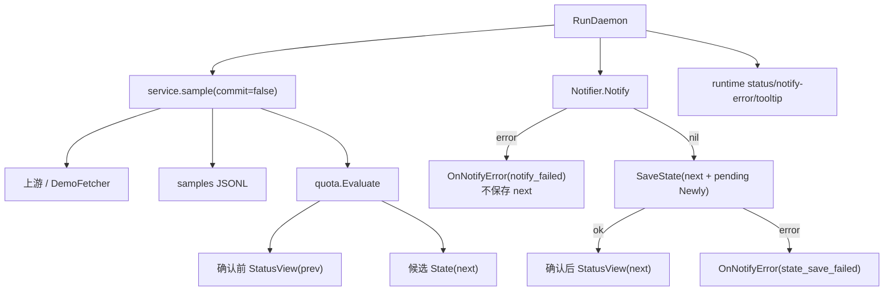

# Design Document

## Overview

修复两件事：第一，给 Wails `NotificationOptions` 填充必填且唯一的 `ID`，消除现场捕获的 `notification ID cannot be empty`；第二，把告警从“评估后立刻记账”改为“Toast 发送返回成功后记账”。daemon 采样仍走同一套上游、历史、阈值状态机，但新增一条未提交采样路径；通知失败通过 GUI 错误横幅、托盘状态和下一轮重试暴露。CLI `status` 的既有“立即采样、推进状态、不通知”语义保持不变。

## Context

当前 `Service.SampleOnce` 在返回前调用 `SaveState(next)`；`RunDaemon` 拿到的档位已经被标记为已通知。随后 `Notifier.Notify` 的失败只进入 `log.Warn`，而 GUI runtime 的 logger 写入 `io.Discard`，导致应用无法区分“已发送”“系统抑制展示”“发送失败”。GUI 手动采样也复用 `SampleOnce`，在阈值附近可能抢先推进状态并压掉 daemon 告警。

已批准的修复边界见同目录 `bugfix.md`。不修改 Windows 通知设置，不新增替代通知通道，不重做界面样式。

## Goals and Non-Goals

- Goals:
  - daemon 只有在 `Notifier.Notify` 返回 `nil` 后才持久化本轮新命中的阈值。
  - `Notify` 失败时 GUI 显示 `notify_failed`，未确认档位保留可重试。
  - GUI 手动采样只刷新当前观察状态，不抢占 daemon 的告警确认权。
  - CLI `status` 继续采样并推进 `state.json`。
- Non-Goals:
  - 不判定或绕过 Windows 专注助手、请勿打扰等系统级横幅抑制。
  - 不实现 Toast 展示回执；Wails 当前 API 的返回成功只代表调用链成功。
  - 不实现 TIME_LIMIT 告警或系统通知权限管理。

## Detailed Design

### service 采样拆分

- `UPDATED` `internal/quota/threshold.go`
  - **Purpose**: 保留完整的新触发档位，供通知失败后重试和成功后合并记账。
  - **Changes**: 给 `Outcome` 新增 `Newly []int` 字段；`Evaluate` 在 `Notify=true` 时按升序填充本轮未通知且 `threshold <= percentage` 的档位。原有 `Notify`、`Highest`、`Message`、`Cleared` 和 `state.json` 结构不变。
  - **Complexity**: Low
- `UPDATED` `internal/service/service.go`
  - **Purpose**: 把“获取并评估采样”与“确认阈值状态”拆成两个阶段。
  - **Changes**:
    - 新增包内私有类型 `sampleResult`，包含确认前视图、确认后视图、`prev`、`next`、`outcomes`。
    - 新增私有方法 `sample(ctx context.Context, commit bool) (sampleResult, []quota.Outcome, error)`，负责读配置、请求上游、追加 samples 历史、加载旧状态和调用 `quota.Evaluate`。
    - `commit=true` 时先 `SaveState(next)`，再用 `next` 构建状态视图；这是现有 `SampleOnce` 行为。
    - `commit=false` 时绝不写 `state.json`，状态视图用 `prev` 构建，保证未确认档位不会先显示为“已告警”。
    - `SampleOnce` 保持公开签名和 CLI 语义，内部调用 `sample(ctx,true)`。
    - 新增公开方法 `SampleUncommitted(ctx) (StatusView, error)`，内部调用 `sample(ctx,false)`，供 GUI 手动刷新使用。
  - **Complexity**: Medium

### daemon 通知确认流

- `UPDATED` `internal/service/daemon.go`
  - **Purpose**: 把 Toast 结果作为阈值记账的事务门闩，并在失败后保留重试上下文。
  - **Changes**:
    - `DaemonHooks` 新增 `OnNotifyError func(error)`，nil 安全；采样错误继续使用 `OnError`。
    - `RunDaemon` 的单轮采样改用未提交路径，先向 `OnSample` 推送确认前视图，让主窗口百分比及时刷新。
    - 若本轮有 `Outcome.Notify=true`，把所有窗口消息合并成一条多行通知，`Notifier.Notify` 成功返回后才 `SaveState(next)`，再用 `next` 构建的确认后视图调用一次 `OnSample`。
    - 若 `Notify` 返回错误，调用 `OnNotifyError(&Error{Code:"notify_failed", Message: err.Error()})`，不写 `state.json`，继续 daemon 循环。
    - 在 daemon 闭包内维护 `pendingAlerts`：key 到 `Newly` 档位和原通知消息的映射。失败后下一轮优先重试；若窗口消失、发生滞回清空或阈值指纹变化，则丢弃对应 pending。
    - 下一轮若同一窗口又产生新的 `Notify`，用新结果覆盖旧 pending 并发送当前百分比的最新消息；若没有新触发，则按原 pending 消息重试。通知成功时把当前 `next` 与 pending 的 `Newly` 合并去重后记账。
    - 多窗口和多档位仍然保持一条合并通知；发送失败时整轮状态都不确认，避免部分写入。
    - `SaveState` 在通知成功后失败时，发出 `state_save_failed`；该失败可能造成下一轮重复 Toast，但不会静默丢失已确认交付的记账意图。
  - **Complexity**: Medium

### GUI 状态与手动采样

- `UPDATED` `internal/guiapp/runtime.go`
  - **Purpose**: 把通知结果接到用户可见状态，同时避免手动刷新抢占告警记账。
  - **Changes**:
    - `toastNotifier.Notify` 构造 `NotificationOptions` 时填充非空 `ID`，格式为 `glmquotawatch-gui-<UnixNano>`；每次告警生成新 ID，避免不同轮次共用通知标识。
    - 新增事件常量 `EventNotifyErr = "notify-error"`。
    - 新增 `onNotifyError`：在 runtime 锁内更新 `lastErr`，错误码保留 `notify_failed` 或 `state_save_failed`，广播 `notify-error`，并更新托盘 tooltip。
    - `startDaemonLocked` 注入 `OnNotifyError: r.onNotifyError`。
    - `SampleNow` 改调 `svc.SampleUncommitted`，调用现有 `onSample` 只刷新观察视图；不写 `state.json`。
    - `tooltipText` 在 `lastErr.Code == "notify_failed"` 时显示“告警发送失败”，在 `state_save_failed` 时显示“告警状态保存失败”，不再把这两类错误描述成采样失败。
  - **Complexity**: Medium
- `UPDATED` `internal/guiapp/bindings.go`
  - **Purpose**: 修正手动采样的服务端语义。
  - **Changes**: `BindingsService.SampleNow` 注释改为“立即刷新观察状态，不发送通知，不推进告警记账”；方法仍调用 `MonitorRuntime.SampleNow`，前端契约不变。
  - **Complexity**: Low
- `UPDATED` `frontend/src/App.vue`
  - **Purpose**: 实时响应通知错误。
  - **Changes**: `useEvents` 监听表新增 `"notify-error": () => void refreshState()`。
  - **Complexity**: Low
- `UPDATED` `frontend/src/pages/Dashboard.vue`
  - **Purpose**: 让错误横幅准确区分采样、Toast 和状态保存失败。
  - **Changes**: 根据 `last_error.code` 渲染标题：`notify_failed` 显示“告警发送失败”，`state_save_failed` 显示“告警状态保存失败”，其他显示“采样失败”；`notify_failed` 的提示改为“未确认档位下轮重试”。样式和组件结构不变。
  - **Complexity**: Low

### Module Collaboration and Data Flow

daemon 只有一个 goroutine 读写自己的 `pendingAlerts`；store 的 config/state/samples 继续由 `Store` mutex 串行化。GUI 手动采样与定时采样可能并发请求上游，但不会并发写同一条未确认状态；定时路径是唯一从 GUI 进程推进告警状态的路径。CLI 是独立进程，`status` 仍可按既有契约推进共享状态，因此外部 CLI 采样可能使 GUI daemon 不再重复告警，这是 AC-5 明确保留的语义。

### Acceptance Criteria Mapping

| AC ID | Design Component |
|---|---|
| AC-1 | `NotificationOptions.ID` 消除 Wails 入参校验失败；`sample(commit=false)`、`Notifier.Notify` 成功分支、`SaveState(next)` |
| AC-2 | `notify_failed`、`OnNotifyError`、不保存 next、pending 重试 |
| AC-3 | `Outcome.Newly`、pending 合并、单条多窗口通知 |
| AC-4 | DemoFetcher + 固定 5s 采样 + 每档成功通知后记账 |
| AC-5 | `SampleOnce` 继续走 `sample(commit=true)`，CLI 不注入 Notifier |

## Design Review Notes

- **R-1 [HIGH] 确认前视图若直接用 `next` 构建，仍会在 Toast 失败时显示“已告警”**：已修复，未提交路径固定用 `prev` 构建视图，只有保存成功后才推送 `next` 视图。
- **R-2 [MEDIUM] GUI 手动采样继续调用 `SampleOnce` 会在阈值处抢先记账并抑制 daemon 告警**：已修复，GUI 手动路径改用 `SampleUncommitted`；CLI 的确认式采样语义单独保留。
- **R-3 [MEDIUM] 通知成功但 `SaveState` 失败会造成下一轮重复 Toast**：已明确为可见失败 `state_save_failed`；本设计选择不静默丢弃状态错误。重复提示优于把未确认交付误记为已确认。
- **R-4 [MEDIUM] 多窗口一轮部分通知成功不可表达**：已修复为单条合并通知、整批成功后整批记账；失败时整轮候选状态都不确认。
- **R-5 [MEDIUM] 用量在失败后回落可能导致 `Evaluate` 不再生成 pending**：已修复，daemon 维护 pending 消息和 `Newly` 档位；滞回清空、窗口消失或阈值指纹变化时才丢弃。
- **R-6 [NIT] 只保存最高档不足以在重试成功后补记较低档**：已采纳 `Outcome.Newly []int`，完整保存本轮新触发集合。
- **R-7 [NIT] Wails 返回成功不等于 Windows 实际展示横幅**：保持范围外；本设计只把 API 返回结果定义为应用内“发送成功”边界，README 记录该限制。

已验证假设：`RunDaemon` 和 GUI hooks 在同一 daemon goroutine 内串行调用；`Store` 已有 mutex；`SampleOnce` 当前在返回前保存状态；`toastNotifier.Notify` 会透传 Wails `SendNotification` 的错误。未验证假设：Windows 是否因系统设置抑制过本轮横幅，留待修复后通过可见错误或成功 Toast 现场区分。

已由现场复测验证：13:42:07 诊断日志捕获 `notification ID cannot be empty`；同一 AUMID 的独立 Toast 调用返回成功，并且 Windows 事件日志记录 `delivered to glmquotawatch-gui`。
