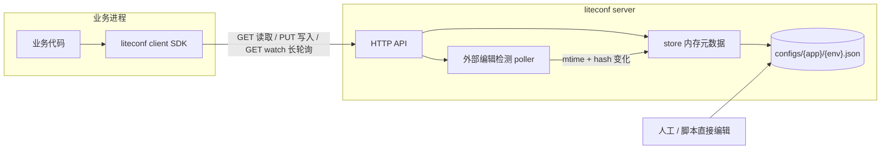
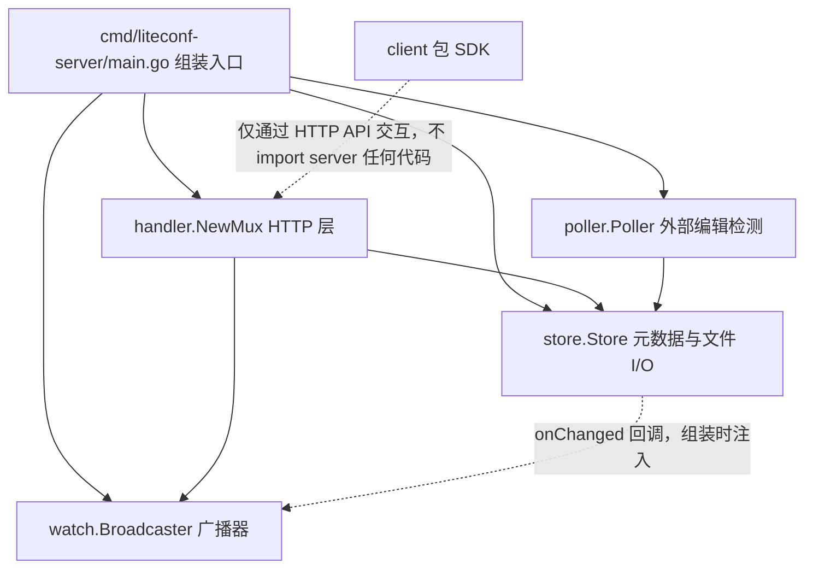

# Design Document

## Overview

liteconf 由两部分组成：**单实例 Go server**（常驻 HTTP 服务，托管配置文件并提供读/写/发现/长轮询 API）与 **Go client SDK**（业务项目 import 的库，提供缓存读取、OnChange 订阅与断线重连）。全部基于 Go 标准库实现（`net/http`、`log/slog`、`encoding/json`），零第三方依赖。本文档描述模块划分、关键机制与文件级变更清单。

## Context

- 全新项目，无存量代码；仓库为 monorepo（一个子目录 = 一个项目），项目位于 `go_projects/liteconf/`，文档镜像存放于父仓库 `docs/projects/go_projects/liteconf/`
- 数据目录约定：server 运行数据写入 `%APPDATA%\language_projects\liteconf\`（取不到 `APPDATA` 回退 `~/.language_projects/liteconf/`），写入前自动创建完整目录链
- 定位内网/本机可信环境：HTTP 明文、无鉴权；文件即数据库，无额外持久化存储
- 版本号语义（见 requirements 假设 #6）：server 运行期间单调递增，重启后从文件状态重建（全部重置为 1），长轮询以「版本号不相等」为变化依据



## Goals and Non-Goals

- Goals:
    - server：配置目录扫描加载、内存版本元数据、原子写入、外部编辑周期检测、长轮询变更通知
    - SDK：初始化同步拉取、无锁缓存读取（dot path / 完整快照 / struct 反序列化）、OnChange 观察者回调（异步派发）、指数退避自动重连
    - 单 Go module 同时交付 server 二进制（`cmd/liteconf-server`）与可 import 的公开 SDK（`client/`），零第三方依赖
- Non-Goals:
    - 集群、主备、多副本一致性；历史版本管理与回滚
    - 鉴权、TLS、审计；配置 schema 校验；灰度/多租户
    - Web 控制台；fsnotify 文件监听（用周期轮询）
    - CLI 管理入口与 MCP（按《CLI 工具开发标准》记录例外：本项目形态为服务 + 库，无管理命令面）

## Detailed Design

### 项目布局

- [ ] # `CREATED` `go_projects/liteconf/go.mod`
    - **Purpose** 定义 Go module：`module github.com/shihao-hub/liteconf`，`go 1.22`（启用 `ServeMux` 的方法 + 路径参数路由）
    - **Changes** 新建；零第三方依赖，无 `require` 项
    - **Complexity** Low

```
go_projects/liteconf/
├── go.mod
├── cmd/liteconf-server/
│   └── main.go          # server 入口
├── internal/server/     # server 实现（internal，不对外）
│   ├── store.go         # 存储层：加载/原子写/版本/元数据
│   ├── poller.go        # 外部编辑周期检测
│   ├── handler.go       # HTTP API（读/写/发现）
│   ├── watch.go         # 长轮询挂起与广播
│   └── errors.go        # 业务错误 code 与统一响应包络
└── client/              # SDK（公开路径，供业务 import）
    ├── client.go        # 初始化与公开 API
    ├── cache.go         # 缓存快照与 dot path 读取
    ├── poll.go          # 长轮询循环 + 指数退避
    └── callback.go      # OnChange 注册与异步派发
```

SDK 必须放在公开路径 `client/`（不能用 `internal/`），业务项目通过 `github.com/shihao-hub/liteconf/client` import。

### Server

- [ ] # `CREATED` `go_projects/liteconf/internal/server/store.go`
    - **Purpose** 配置存储核心：目录加载、内存元数据、原子写、版本递增（REQ-1、REQ-3）
    - **Changes** 定义 `key{app, env}`、`meta{version uint64, contentHash, modTime, raw json.RawMessage}`；全局 `sync.RWMutex` 保护 `map[key]*meta`（配置量小，无需分片）。`LoadAll()` 启动扫描两级目录，`app`/`env` 名称校验 `[a-zA-Z0-9_-]+`（防目录穿越），非法 JSON 文件跳过并告警。`AtomicWrite(app, env, body)`：校验名称与顶层 JSON 对象 → 同目录写临时文件 → `os.Rename` 覆盖 → 版本 +1 → 返回新版本。`Reload(app, env)` 供外部检测使用。设计决策：文件被删除时保留内存旧版本继续服务并告警，与 REQ-4 非法 JSON 的容错哲学一致
    - **Complexity** Medium

- [ ] # `CREATED` `go_projects/liteconf/internal/server/poller.go`
    - **Purpose** 周期检测绕过 API 的外部文件编辑（REQ-4）
    - **Changes** `time.Ticker`（默认 5s，可配）遍历配置根目录；先比 `modTime`，变化才算内容 hash（避免全量 hash 开销）。变更 → `Reload` + 版本 +1 + 广播；新增文件注册 version=1；消失 → 保留旧版本 + 告警；非法 JSON → 保留旧版本 + 告警
    - **Complexity** Low

- [ ] # `CREATED` `go_projects/liteconf/internal/server/errors.go`
    - **Purpose** 统一响应包络与稳定业务错误 code（REQ-2、REQ-3）
    - **Changes** 响应包络 `{"code":"ok|not_found|invalid_name|invalid_json|internal","message":"...","data":...}`；`code` 为字符串，写入端与读取端共用
    - **Complexity** Low

- [ ] # `CREATED` `go_projects/liteconf/internal/server/handler.go`
    - **Purpose** HTTP API（REQ-2、REQ-3）
    - **Changes** Go 1.22 `ServeMux` 路由：`GET /api/{app}/{env}`（返回内容 + 版本元数据）、`PUT /api/{app}/{env}`（body 即配置 JSON 对象，成功返回新版本）、`GET /api/discovery`（列出全部 app/env/version）、`GET /api/watch/{app}/{env}?version=N`（长轮询，见 watch.go）。所有路由入口统一做名称合法性校验。示例响应：
        ```json
        {"code":"ok","data":{"content":{"db":{"host":"127.0.0.1"}},"version":3}}
        ```
    - **Complexity** Low

- [ ] # `CREATED` `go_projects/liteconf/internal/server/watch.go`
    - **Purpose** 长轮询挂起与变更广播（REQ-3、REQ-5）
    - **Changes** 每 key 一个广播器：`struct{ mu sync.Mutex; ch chan struct{} }`，用 close-broadcast 惯用法（广播时 close 旧 channel 并换新），支持任意多客户端并发订阅。写入 API 与外部检测共用同一广播入口。挂起实现：
        ```go
        select {
        case <-bc.ch:      // 版本变化 → 返回最新
        case <-timer.C:    // 超时（默认 30s）→ 返回当前版本
        case <-r.Context().Done(): // 客户端断开
        }
        ```
        请求携带版本 ≥ 当前版本才挂起；当前版本已更新则立即返回，不挂起
    - **Complexity** Medium

- [ ] # `CREATED` `go_projects/liteconf/cmd/liteconf-server/main.go`
    - **Purpose** server 入口：启动参数、数据目录、日志（REQ-10）
    - **Changes** flags：`-addr`（默认 `:8646`）、`-root`（配置根目录，默认 `%APPDATA%\language_projects\liteconf\configs\`，取不到 `APPDATA` 回退 `~/.language_projects/liteconf/configs/`）、`-poll`（外部检测间隔，默认 5s）。启动前 `MkdirAll` 完整目录链。`slog` 日志同时写 stderr 与 `%APPDATA%\language_projects\liteconf\logs\liteconf-server.log`（追加）。启动时打印「无鉴权，仅限内网/本机使用」警告
    - **Complexity** Low

### Client SDK

- [ ] # `CREATED` `go_projects/liteconf/client/client.go`
    - **Purpose** SDK 初始化与公开 API 面（REQ-6、REQ-9）
    - **Changes** `Config{ServerURL, App, Env, PollInterval, RequestTimeout}`；`New(cfg)` 同步拉取一次配置，失败返回含重试建议的错误，**不返回空配置伪装成功**。公开 API：
        ```go
        func New(cfg Config) (*Client, error)
        func (c *Client) Get(path string) (json.RawMessage, bool) // path 支持 "db.host" 点路径；bool 为存在性标识
        func (c *Client) Snapshot() map[string]any                // 完整配置对象
        func (c *Client) Unmarshal(path string, v any) error      // path 为空则解码整个配置
        func (c *Client) OnChange(fn func(old, new map[string]any))
        func (c *Client) Close()
        ```
    - **Complexity** Low

- [ ] # `CREATED` `go_projects/liteconf/client/cache.go`
    - **Purpose** 缓存快照与 dot path 读取（REQ-8、REQ-9）
    - **Changes** 缓存用 `atomic.Pointer[map[string]any]` 存 copy-on-write 快照：读路径完全无锁；更新时整体替换指针。dot path 按 `.` 切分逐级下钻 `map[string]any`，任一层非 map 或键不存在返回 `false`
    - **Complexity** Low

- [ ] # `CREATED` `go_projects/liteconf/client/poll.go`
    - **Purpose** 长轮询循环与指数退避重连（REQ-7、REQ-8）
    - **Changes** 单后台 goroutine：携带本地版本请求 `GET /api/watch/...` → 成功则 `GET` 最新配置、替换缓存快照、触发回调、重置退避；请求失败/超时按指数退避（1s 起步、×2、上限 30s、加随机抖动）重试。网络故障期间 `Get`/`Snapshot` 继续返回最后缓存（无锁读不受影响）。`ctx` 取消退出，`Close()` 幂等
    - **Complexity** Medium

- [ ] # `CREATED` `go_projects/liteconf/client/callback.go`
    - **Purpose** OnChange 观察者注册与异步派发（REQ-7）
    - **Changes** 回调注册表（slice + mutex，返回注册句柄便于测试）；版本变化时对回调快照逐一 `go func()` 派发，每个回调独立 goroutine + `defer recover()`，单个回调 panic/阻塞不影响其他回调与主轮询循环；不保证回调间执行顺序
    - **Complexity** Low

### Module Collaboration and Data Flow

#### 静态依赖方向（单向，无循环）



关键解耦点：**store 不认识 Broadcaster**。`NewStore(root, bc.Notify)` 把广播入口作为 `onChanged` 回调注入，store 只负责「版本变更即广播」，不关心订阅方——store、watch、poller 三者可独立实现与测试。client 包与 server 代码零 import，仅通过 HTTP API 交互，二者可并行开发。

#### 启动组装（main.go 的全部工作，按序执行）

1. 解析 flags，确定 root，初始化日志
2. `bc := server.NewBroadcaster()` —— 先造广播器
3. `st, _ := server.NewStore(root, bc.Notify)` —— 造存储，注入广播入口
4. `mux := server.NewMux(st, bc)` —— 造 HTTP 层，持有 store + 广播器
5. `go poller.Run(ctx)` —— 后台检测协程，只持有 store
6. `http.Server{Handler: mux}.ListenAndServe()` —— 对外服务

依赖注入一次完成，运行期组件之间不再互相获取。

#### 三条运行时数据流

- **A. API 写入流**：`PUT /api/{app}/{env}` → handler 校验 → `store.Put`（锁内：JSON 校验 → 临时文件 → rename → 版本+1 → 更新内存）→ 触发 `onChanged(key)` = `bc.Notify`（close channel 唤醒全部等待者）→ 该 key 上所有挂起的 watch 请求从 `select` 恢复 → 各自 `store.Get` 读最新内容 → 分别响应
- **B. 外部编辑流**：poller ticker（5s）→ mtime 变化才计算 hash → hash 变化则 `store.Reload`（版本+1）→ 同样经 `onChanged` 广播。两条写入路径汇聚到同一「版本递增 + 广播」出口，长轮询客户端无感知差异
- **C. SDK 订阅流**：client 常驻 1 条 goroutine 循环 `watch?version=N` → server 唤醒 → `GET` 最新配置 → `swap`（atomic.Pointer 整体替换，COW）→ `dispatch(old, new)`（每回调独立 goroutine + recover）→ 立即发起下一轮 watch。网络失败 → 指数退避 1s→30s 重试；期间读路径走无锁快照不受影响

#### 并发模型

| 共享状态 | 保护方式 | 写者 | 读者 |
|----------|----------|------|------|
| `store.items`（元数据+内容） | `RWMutex` | Put/Reload（handler 或 poller） | handler 各请求 |
| 每 key 广播 channel | close 语义，无锁唤醒 | Put/Reload 经 onChanged | 各 watch 挂起请求 |
| client 缓存快照 | `atomic.Pointer` | 仅 poll goroutine | 业务任意 goroutine（无锁） |

### Functional Requirements Table

| Requirement ID | Requirement | Design Component |
|----------------|-------------|------------------|
| REQ-1 | 配置存储模型与版本元数据 | `internal/server/store.go` |
| REQ-2 | 配置读取 API 与发现接口 | `internal/server/handler.go`、`store.go` |
| REQ-3 | 配置写入 API（原子写 + 触发通知） | `handler.go`、`store.go`、`watch.go` |
| REQ-4 | 外部文件编辑检测 | `internal/server/poller.go`、`store.go` |
| REQ-5 | 长轮询变更通知 API | `internal/server/watch.go`、`handler.go` |
| REQ-6 | SDK 初始化与配置获取 | `client/client.go` |
| REQ-7 | SDK 变更订阅回调（观察者） | `client/callback.go`、`poll.go` |
| REQ-8 | SDK 容错（退避重连 + 降级读缓存） | `client/poll.go`、`cache.go` |
| REQ-9 | SDK 读取方法（dot path/快照/反序列化） | `client/cache.go`、`client.go` |
| REQ-10 | 部署定位与数据目录约定 | `cmd/liteconf-server/main.go` |

### Action checklist

- [ ] 初始化 Go module 与目录骨架（REQ-1）
- [ ] 实现存储层：目录加载、元数据、原子写、版本递增（REQ-1、REQ-3）
- [ ] 实现统一响应包络与业务错误 code（REQ-2、REQ-3）
- [ ] 实现 HTTP API：读、写、发现（REQ-2、REQ-3）
- [ ] 实现长轮询挂起与 close-broadcast 广播（REQ-3、REQ-5）
- [ ] 实现外部编辑周期检测（REQ-4）
- [ ] 实现 server 入口：flags、数据目录初始化、日志（REQ-10）
- [ ] 实现 SDK 初始化拉取与读取方法（REQ-6、REQ-9）
- [ ] 实现 SDK 长轮询循环与指数退避重连（REQ-7、REQ-8）
- [ ] 实现 OnChange 注册与异步派发（REQ-7）
- [ ] 端到端联调：PUT 写入 → 长轮询返回 / OnChange 触发（REQ-5、REQ-7）
- [ ] server 集成测试（`httptest`）[test]
- [ ] client 单元测试与本地起服联测 [test]
