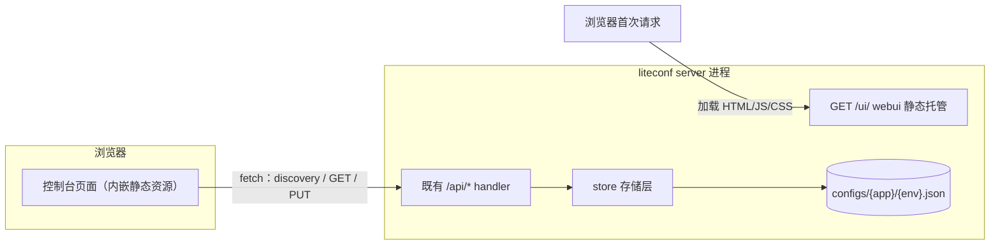
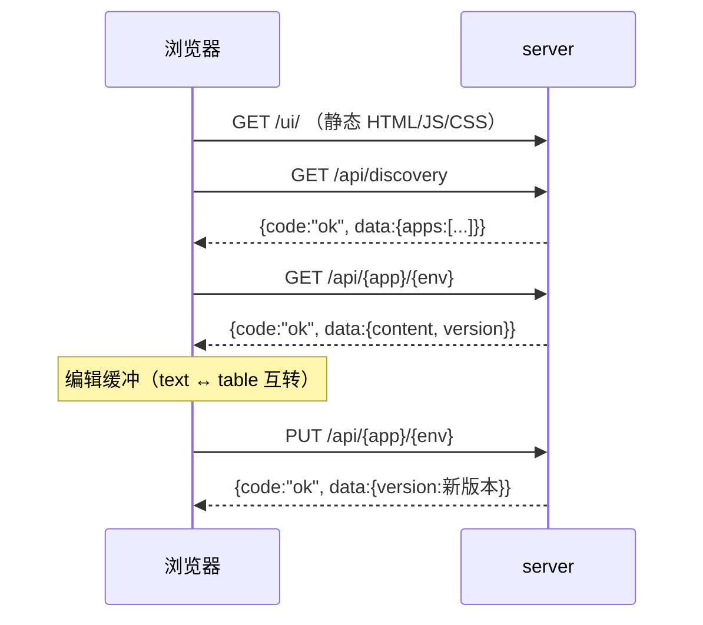

# Design Document — liteconf Web 控制台壳子

## Overview

在 liteconf server 进程内新增最小 Web 控制台：`go:embed` 将静态页内嵌进二进制，挂载于 `/ui/` 路由；页面用原生 JS 通过既有 `/api/*` 接口完成发现列表、查看配置、双模式编辑保存（JSON 文本 / 键值表）与新建配置。后端仅新增一个静态托管包，前端零框架零构建，项目保持零第三方依赖。

## Context

- 现状：控制台即编辑器，配置管理靠 curl 或直接改文件；server 已有统一响应包络 `{"code","message","data"}` 与四个 API（见 `specs/01-liteconf/`）
- 后端集成点唯一：`internal/server/handler.go` 的 `NewMux`（全部路由注册处）；store / watch / poller / client 零改动
- Go 1.22 `ServeMux` 特性直接可用：注册 `GET /ui/` 子树后，请求 `/ui` 会被自动 301 补斜杠到 `/ui/`（REQ-1 Scenario 1.1 天然满足）；`http.FileServerFS`（Go 1.22 新增）可直接服务 `embed.FS`，自动按扩展名设置 Content-Type
- 约束（REQ-6、REQ-7）：GUI 层只做资源托管与页面渲染，业务一律走既有 `/api/*`；页面仅对合法名称 `[a-zA-Z0-9_-]+` 发起请求，服务端校验继续兜底；`/api/*` 路径、包络、错误码不变



## Goals and Non-Goals

- Goals:
    - 静态资源随二进制分发：`/ui/` 托管内嵌 HTML/JS/CSS，不依赖外部文件
    - 页面功能：发现列表（空态/错误态）、查看配置、JSON 文本与键值表双模式编辑保存、新建配置（含覆盖确认）
    - GUI 零业务逻辑：页面只做渲染、交互与 `/api/*` 调用；GUI 路由层不新增存储/校验/版本管理实现
    - 既有 API 行为不变，README 同步更新
- Non-Goals:
    - 鉴权、TLS、多用户（沿用 server 内网/本机可信环境定位）
    - 配置历史/回滚、乐观锁与冲突检测（保存即覆盖，last-write-wins）
    - 页面自动刷新（不接 watch 长轮询）、自动保存/草稿
    - 前端框架、构建工具、i18n、移动端适配
    - 数组专用编辑器（REQ-4.5 明确：数组等复杂值按整体 JSON 片段编辑）

## Detailed Design

### 后端：静态资源托管

- [ ] # `CREATED` `go_projects/liteconf/internal/server/webui/webui.go`
    - **Purpose** 内嵌静态资源并提供 `/ui/` 的 HTTP Handler（REQ-1、REQ-6）
    - **Changes** 包 `webui`，`//go:embed static` 嵌入子目录，`fs.Sub` 取 `static` 为根，`http.FileServerFS` 直接作为 Handler 返回：

    ```go
    package webui

    //go:embed static
    var staticFS embed.FS

    // Handler 返回控制台静态资源处理器（只读托管，无任何业务逻辑）
    func Handler() http.Handler {
        sub, _ := fs.Sub(staticFS, "static")
        return http.FileServerFS(sub)
    }
    ```

    所有响应统一加 `Cache-Control: no-cache`（包一层中间件）：文件体积小，避免发版后浏览器缓存旧页面导致前后端不一致。GUI 路由层不出现任何存储、校验、版本管理代码
    - **Complexity** Low

- [ ] # `UPDATED` `go_projects/liteconf/internal/server/handler.go`
    - **Purpose** 在 `NewMux` 注册 `/ui/` 路由（REQ-1、REQ-7）
    - **Changes** 仅新增一行注册 `mux.Handle("GET /ui/", webui.Handler())`（import `github.com/shihao-hub/liteconf/internal/server/webui`）；`/ui`（无斜杠）由 `ServeMux` 自动 301 到 `/ui/`。既有四条 `/api/*` 路由的注册、实现、包络与错误码全部不动
    - **Complexity** Low

### 前端：单页控制台（原生 JS，无构建）

- [ ] # `CREATED` `go_projects/liteconf/internal/server/webui/static/index.html`
    - **Purpose** 页面骨架（REQ-1）
    - **Changes** 头部（标题 + 「新建配置」按钮）、列表容器、编辑器容器、全局错误横幅、新建配置对话框（原生 `<dialog>` 元素）；`<script src="app.js" defer>` + `<link rel="stylesheet" href="style.css">`
    - **Complexity** Low

- [ ] # `CREATED` `go_projects/liteconf/internal/server/webui/static/style.css`
    - **Purpose** 最小可读样式（REQ-1）
    - **Changes** 表格、横幅、对话框、空态/错误态提示样式；暗色背景亮色文字不强制，保持朴素内网工具风
    - **Complexity** Low

- [ ] # `CREATED` `go_projects/liteconf/internal/server/webui/static/app.js`
    - **Purpose** 全部页面交互逻辑（REQ-2、REQ-3、REQ-4、REQ-5、REQ-6）
    - **Changes** 单文件分节组织，无模块系统、无构建步骤：

    - **API 包装** `api(method, path, body)`：`fetch` → 解析统一包络 → `code !== "ok"` 时抛 `{status, code, message}`；网络异常（fetch reject / 非 JSON 响应）同样转为错误对象。所有调用点 catch 后写错误横幅（REQ-2.3）
    - **hash 路由**：`#/` 为列表，`#/{app}/{env}` 为编辑器；监听 `hashchange`，支持刷新保持与浏览器后退。仅接受匹配 `[a-zA-Z0-9_-]+` 的 app/env 段，不合法一律回列表（REQ-6.2）
    - **列表视图**：`GET /api/discovery` 取 `data.apps[]`，按 app 分组渲染 env 与 version，env 点击进入编辑器；`apps` 为空 → 空状态提示「仓库中还没有配置」（REQ-2.2）；请求失败 → 错误横幅，不渲染空列表（REQ-2.3）
    - **编辑器状态机**：`{app, env, version, mode: "text"|"table", text}`；**`text`（JSON 文本）是唯一权威缓冲**，表格视图由 `text` 解析派生、保存与切换一律以 `text` 或其派生结果为准，天然满足「切换不静默丢弃修改」（REQ-4.6）
    - **JSON 文本模式**：进入时 `JSON.stringify(content, null, 2)` 载入 textarea；保存前前端 `JSON.parse` 本地校验，失败立即拦截并显示错误，不发请求（REQ-4.2）；「格式化」= parse → `stringify(obj, null, 2)` 回填，parse 失败提示且不改动原文（REQ-4.3）；保存无自动触发，仅显式按钮（REQ-4.1）
    - **键值表模式**：
        - flatten：递归下钻普通对象生成点路径行（`db.host`）；**键名含 `.` 不下钻**、数组与非原始值 → 该键整行按「复杂值」处理，单元格内容为该值的 JSON 文本片段（REQ-4.4、REQ-4.5；键名含 `.` 时下钻会产生歧义路径，故按复杂值整体编辑）
        - rebuild：叶子单元格先尝试 `JSON.parse`（识别数字/布尔/null 字面量），失败按字符串；复杂值单元格整体 `JSON.parse`，失败则标红该行并阻止保存
        - 模式切换：text→table 需当前 `text` 可解析，失败报错并停留原模式；table→text 总是可行（rebuild 回写 `text`）（REQ-4.6）
    - **保存**：`PUT /api/{app}/{env}`，body 即缓冲 JSON；成功后显示返回的新版本号（REQ-4.7）；服务端返回 `invalid_json` 等错误 → 横幅提示，不改动本地缓冲，服务端原配置不被覆盖（REQ-4.8）
    - **查看/载入**：进入编辑器先 `GET /api/{app}/{env}` 展示 content 与当前 version；`not_found` → 「配置不存在」提示 + 返回列表链接（REQ-3.2）
    - **新建配置**：`<dialog>` 输入 app、env、初始 JSON（默认 `{}`）；app/env 前端按 `^[a-zA-Z0-9_-]+$` 预校验，不合法直接提示不提交（REQ-6.2）；提交前先 `GET` 探测存在性——已存在 → 明示「该配置已存在，提交将覆盖现有内容」，用户显式确认后才 PUT（REQ-5.3）；PUT 成功 → 跳转 `#/{app}/{env}` 并刷新列表，展示首版版本号 1（REQ-5.1）；返回 `invalid_name` → 命名规则提示（REQ-5.2）
    - **Complexity** High

### 项目结构（新增部分）

```
liteconf/
├── internal/server/
│   ├── handler.go              # UPDATED：NewMux 增加 /ui/ 注册（1 行）
│   └── webui/                  # CREATED：GUI 壳子（纯静态托管包）
│       ├── webui.go            # go:embed + http.FileServerFS
│       └── static/
│           ├── index.html      # 页面骨架 + 新建对话框
│           ├── app.js          # 全部交互逻辑（API 包装/路由/列表/双模式编辑/新建）
│           └── style.css       # 最小样式
```

### 集成影响面与数据流

- 后端改动收敛在 `NewMux` 一行注册 + 新包 `webui`；store / watch / poller / client 与 `/api/*` 行为零改动（REQ-7）
- 页面运行时只有一条数据通路：`fetch → /api/* → 统一包络`，GUI 不引入新的服务端状态



### Functional Requirements Table

| Requirement ID | Requirement | Design Component |
|----------------|-------------|------------------|
| REQ-1 | 控制台页面托管 | `internal/server/webui/webui.go`、`handler.go`（注册） |
| REQ-2 | 发现列表 | `webui/static/app.js`（列表视图） |
| REQ-3 | 查看配置 | `webui/static/app.js`（编辑器载入） |
| REQ-4 | 双模式编辑保存 | `webui/static/app.js`（编辑器状态机：text/table） |
| REQ-5 | 新建配置 | `webui/static/app.js`（新建对话框） |
| REQ-6 | GUI 入口不承载业务规则 | `webui/webui.go`（纯静态）+ `app.js`（仅调 `/api/*`） |
| REQ-7 | 现有行为不受影响 | `handler.go`（仅新增注册，不改既有路由） |
| REQ-8 | 文档一致性 | 子项目 `README.md` 更新 |

### Action checklist

- [ ] 实现 `webui/webui.go`：go:embed 嵌入与 no-cache Handler（REQ-1、REQ-6）
- [ ] `NewMux` 注册 `GET /ui/`（REQ-1、REQ-7）
- [ ] 编写 `static/index.html` 与 `static/style.css` 页面骨架（REQ-1）
- [ ] `app.js`：API 包装（包络解析/错误归一）与 hash 路由（REQ-2、REQ-6）
- [ ] `app.js`：发现列表（空态/错误态）（REQ-2）
- [ ] `app.js`：查看配置与 not_found 处理（REQ-3）
- [ ] `app.js`：JSON 文本模式（本地校验/格式化/显式保存）（REQ-4）
- [ ] `app.js`：键值表模式（flatten/rebuild/复杂值整体编辑）（REQ-4）
- [ ] `app.js`：模式互转以 text 缓冲为准、不丢修改（REQ-4）
- [ ] `app.js`：新建配置对话框（前端预校验/存在性探测/覆盖确认）（REQ-5、REQ-6）
- [ ] 更新 `README.md`：项目结构加入 GUI 部分、定位与边界改写（REQ-8）
- [ ] 端到端手工验证：列表/查看/双模式编辑/新建全流程（REQ-1~REQ-5）
- [ ] `go build` / `go vet` 验证编译与零第三方依赖（REQ-1、REQ-7）
