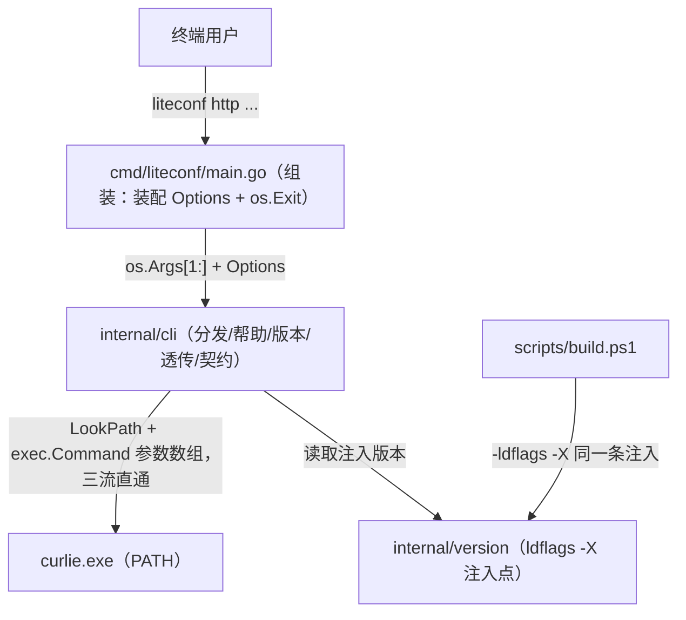
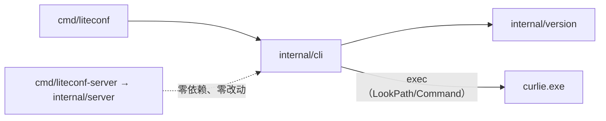

# Design Document — liteconf CLI 入口与 HTTP 调试透传

## Overview

为 liteconf 新增独立 CLI 程序 `liteconf.exe`（入口 `cmd/liteconf`），逻辑落在 `internal/cli` 适配包：`http` 子命令把全部参数原样透传给 PATH 中的 curlie（参数数组直启、三条标准流直通、退出码透传）；`schema` 子命令输出 `interface: "cli"` 的命令契约目录；`--help`/`--version` 提供自描述。server 二进制（`cmd/liteconf-server` 与 `internal/server`）零改动；构建脚本以同一条 `-ldflags -X` 为两个二进制注入版本号。项目保持零第三方依赖。

## Context

- 现状：liteconf 只有 server + Go SDK，HTTP API 调试靠手敲 curl（README「写入配置」一节）；README「定位与边界」仍记录"不配套 CLI 与 MCP"的过期例外，本次一并改写（REQ-6）
- 依据《CLI 工具开发标准》v1.0：无 MCP 的独立 CLI 必须 `schema` 导出自身契约并声明 `interface: "cli"`（标准 5.5）；透传命令不强制 JSON 包络（标准 4.1）；退出码 0/1/2 约定（标准 4.2）；帮助与契约目录应同源维护、避免漂移（标准 1.3）
- Go 1.22 标准库即可覆盖全部需求：`os/exec`（LookPath + 参数数组直启）、`encoding/json`；不引入 flag 包——子命令分发是简单 switch，且 flag 包会干扰透传参数的"原样"语义
- 版本注入：新增共享包 `internal/version`，`scripts/build.ps1` 用同一条 `-ldflags -X` 构建两个二进制（REQ-5）；server 不 import 该包、代码与行为零变化

## Goals and Non-Goals

- Goals:
    - 独立 CLI 入口 `cmd/liteconf`，构建产出 `build/liteconf.exe`；server 代码与行为零改动
    - `http` 子命令纯透传：参数数组直启 curlie、stdin/stdout/stderr 直通、退出码透传；curlie 缺失时人读报错 + 安装指引（退出码 1，stdout 静默）
    - 自描述：`--help`/`-h`/`help`/无参数、`--version`/`version`、`schema`（JSON 契约目录，`interface: "cli"`）；未知子命令退出码 2
    - 帮助文本与 schema 目录同源：命令目录单点维护（catalog），help 渲染与 schema 序列化共用一份数据
    - 构建脚本一次产出两个二进制，版本号注入方式一致
    - 单元测试覆盖 REQ-7 列出的四类路径
- Non-Goals:
    - MCP 入口（按标准 0.1 节例外：纯终端透传、无自身数据面与状态，理由记录于 README）
    - 对透传参数做任何解析、补全、改写或 JSON 包装；不拦截 `--help` 等 curlie 自身参数
    - server / SDK / Web 控制台的功能与行为变化
    - curlie 的安装管理（liteconf 只报缺失并给安装指引，不代装）

## Detailed Design

### CLI 适配包（internal/cli）

- [ ] # `CREATED` `go_projects/liteconf/internal/cli/cli.go`
    - **Purpose** 子命令分发与运行依赖注入点（REQ-2、REQ-3）
    - **Changes** 定义 `Options{Stdin io.Reader; Stdout, Stderr io.Writer; LookPath func(string) (string, error)}`，零值可用（nil 回退 `os.Stdin`/`os.Stdout`/`os.Stderr`/`exec.LookPath`），测试替换字段注入桩实现；`Run(args []string, opt Options) int` 按首参数分发并返回退出码（不调用 os.Exit，满足标准 4.2"命令函数返回退出码"）：无参数/`-h`/`--help`/`help` → 帮助（0）；`--version`/`version` → 输出 `version.Version`（0）；`http` → 透传；`schema` → 契约导出（0）；其余（含未知 flag）→ stderr 人读错误，退出码 2
    - **Complexity** Low

- [ ] # `CREATED` `go_projects/liteconf/internal/cli/http.go`
    - **Purpose** `http` 子命令：curlie 透传编排（REQ-3）
    - **Changes** `runHTTP(args, opt) int`：先 `opt.LookPath("curlie")` 解析可执行文件——失败则向 stderr 输出未找到说明与 `go install github.com/rs/curlie@latest`，返回 1，stdout 静默；成功则 `exec.Command(exe, args...)` 参数数组直启（不经 shell），`cmd.Stdin/Stdout/Stderr` 直连 Options 三流；`cmd.Run()` 后透传退出码：`exec.ExitError.ExitCode() >= 0` 原样返回；`-1`（被信号终止）→ stderr 说明并返回 1；非 ExitError 的启动失败 → stderr 说明并返回 1
    - **Complexity** Low

- [ ] # `CREATED` `go_projects/liteconf/internal/cli/catalog.go`
    - **Purpose** 命令契约目录：help 与 schema 的同源数据（REQ-2、REQ-4）
    - **Changes** 定义 `command{Name, Summary, Usage string; Input, Output map[string]any}` 与手工维护的 `commands` 切片（http/schema/version/help 四条；http 条目写明透传语义、流直通与退出码约定）；`renderHelp(opt)` 从目录渲染人读帮助（用法、子命令摘要、示例、curlie 依赖、退出码约定）到 stdout
    - **Complexity** Low

- [ ] # `CREATED` `go_projects/liteconf/internal/cli/schema.go`
    - **Purpose** `schema` 子命令：CLI 契约导出（REQ-4）
    - **Changes** 定义顶层契约结构 `{name: "liteconf", interface: "cli", version: <注入版本>, commands: <catalog>}`；`runSchema` 用 `json.MarshalIndent` 序列化后写 stdout（末尾换行），返回 0；不解析 PATH、不启动任何外部程序
    - **Complexity** Low

### 组装入口与版本注入

- [ ] # `CREATED` `go_projects/liteconf/internal/version/version.go`
    - **Purpose** 两个二进制共用的版本号注入点（REQ-2、REQ-5）
    - **Changes** `package version`，`var Version = "dev"`（构建未注入时的回退值），附注释说明注入方式
    - **Complexity** Low

- [ ] # `CREATED` `go_projects/liteconf/cmd/liteconf/main.go`
    - **Purpose** CLI 进程组装入口（REQ-2）
    - **Changes** `package main` 仅做装配：由 `os.Stdin/os.Stdout/os.Stderr` 构造 `cli.Options`（LookPath 留默认），`os.Exit(cli.Run(os.Args[1:], opt))`；无任何业务逻辑
    - **Complexity** Low

- [ ] # `UPDATED` `go_projects/liteconf/scripts/build.ps1`
    - **Purpose** 一次构建产出两个二进制，版本号注入方式一致（REQ-5）
    - **Changes** 新增 `[string]$Version = "0.1.0"` 参数；`$ldflags = "-s -w -X github.com/shihao-hub/liteconf/internal/version.Version=$Version"`；同一条 ldflags 依次构建 `build/liteconf-server.exe`（./cmd/liteconf-server）与 `build/liteconf.exe`（./cmd/liteconf），逐产物校验存在并报告体积；头部注释同步更新
    - **Complexity** Low

### 测试

- [ ] # `CREATED` `go_projects/liteconf/internal/cli/cli_test.go`
    - **Purpose** 分发与错误路径单元测试（REQ-7）
    - **Changes** 覆盖：未知子命令 `foo` 与未知 flag `--unknown` → 退出码 2、stderr 人读、stdout 为空；帮助四变体（无参数/`-h`/`--help`/`help`）→ 0 且 stdout 含 `http` 与 `schema`；`--version`/`version` → 0 且输出等于 `version.Version`；`schema` → 0 且 stdout 可 `json.Unmarshal`、`interface == "cli"`、commands 含 `http`；注入失败的 LookPath 模拟 curlie 缺失 → 1、stdout 为空、stderr 含安装命令
    - **Complexity** Medium

- [ ] # `CREATED` `go_projects/liteconf/internal/cli/http_test.go`
    - **Purpose** 透传编排的参数原样传递、流直通与退出码透传测试（REQ-7）
    - **Changes** 采用 Go 标准"测试二进制自举"手法：`TestHelperFakeCurlie` 在环境变量 `LITECONF_TEST_FAKE_CURLIE=1` 标记下，把 `--` 之后的 os.Args 以分隔符拼接回显 stdout、`io.Copy` 原样转发 stdin，最后 `os.Exit(7)`；用例注入 `LookPath` 返回 `os.Args[0]`（测试二进制本体）并用 `t.Setenv` 打开标记，断言：参数逐字透传（含 `--help`、`--`、含空格参数）、curlie 退出码 7 被 liteconf 透传、stdin 内容直通到达子进程
    - **Complexity** Medium

### 文档

- [ ] # `UPDATED` `go_projects/liteconf/README.md`
    - **Purpose** CLI 用法与 MCP 例外记录（REQ-6）
    - **Changes** 特性列表新增 CLI 条目；「快速开始」新增「调试 CLI」小节（curlie 安装前提、`http`/`schema` 示例、退出码约定）；「项目结构」树加入 `cmd/liteconf/`、`internal/cli/`、`internal/version/`；「定位与边界」改写"不配套 CLI 与 MCP"过期例外：已提供独立调试 CLI，无 MCP 的理由（CLI 仅含纯终端透传子命令、无自身数据面与状态，属标准 0.1 节例外）
    - **Complexity** Low

### Module Collaboration and Data Flow

**静态依赖方向**（谁 import 谁）：

- `cmd/liteconf` 只 import `internal/cli`；`internal/cli` 只 import `internal/version` 与标准库；server 侧与 CLI 侧无任何共享包，"server 行为零影响"由结构天然保证（REQ-2）
- 依赖注入点唯一：`cli.Options`——标准流与 LookPath 均可替换，产品路径零特判、测试路径零 hack；`internal/version` 是唯一的构建期可变点

**启动/组装顺序**：

1. 构建期：`build.ps1` 以同一条 `-ldflags -X` 把版本号写进 `internal/version.Version`（两个二进制一致，REQ-5）
2. 进程启动：`main` 构造 Options（os 三流 + 默认 `exec.LookPath`）→ `cli.Run(os.Args[1:], opt)` 按首参数分发 → 子命令返回退出码 → `os.Exit(code)`（进程内唯一退出调用点）

**关键运行时数据流**：

- `http` 透传：`args[1:]` 原样作为 `exec.Command` 参数数组 → LookPath 定位 curlie → 三条标准流直连（liteconf 自身不产生任何输出）→ 阻塞等待 curlie 退出 → `ExitError.ExitCode()`（或 0）作为 liteconf 退出码；curlie 缺失走前置失败分支（stderr 指引 + 退出码 1）
- `schema`：`internal/version.Version` + catalog（内存静态数据）→ `MarshalIndent` → stdout，纯内存零副作用，不触 PATH 与外部程序
- 帮助/版本：catalog / `version.Version` → stdout，零副作用

**并发模型**：CLI 为单线程短命进程，无共享状态、无 goroutine；与 curlie 的关系是"启动后阻塞等待"（`cmd.Run`），子进程生命周期等于一次 Run 调用，退出即回收；无超时/取消语义——交互式场景由用户 Ctrl-C 经控制台进程组传递，liteconf 不做额外处理。

### Functional Requirements Table

| Requirement ID | Requirement | Design Component |
|----------------|-------------|------------------|
| REQ-1 | curlie 依赖就绪（环境前提） | 非代码项：`go install github.com/rs/curlie@latest`；`http.go` 缺失错误路径兜底 |
| REQ-2 | 独立 CLI 入口与自描述 | `cmd/liteconf/main.go`、`internal/cli/cli.go`、`catalog.go`、`version.go` |
| REQ-3 | `http` 子命令透传 | `internal/cli/http.go` |
| REQ-4 | `schema` 子命令契约导出 | `internal/cli/schema.go`、`catalog.go` |
| REQ-5 | 构建集成（两二进制同注入） | `scripts/build.ps1`、`internal/version/version.go` |
| REQ-6 | MCP 例外与文档记录 | `README.md` |
| REQ-7 | 质量验证 | `internal/cli/cli_test.go`、`http_test.go` |

### Action checklist

- [ ] 创建 `internal/version` 版本注入点（REQ-5）
- [ ] 实现 `internal/cli` 分发、帮助与版本渲染（REQ-2）
- [ ] 维护 catalog 命令契约目录（REQ-2、REQ-4）
- [ ] 实现 `http` 透传编排与 curlie 缺失错误路径（REQ-3）
- [ ] 实现 `schema` 契约导出（REQ-4）
- [ ] 创建 `cmd/liteconf` 组装入口（REQ-2）
- [ ] 改造 `scripts/build.ps1`：双产物 + 版本注入（REQ-5）
- [ ] 单元测试覆盖 REQ-7 四类路径（REQ-7）
- [ ] 更新 README：CLI 用法、项目结构、MCP 例外改写（REQ-6）
- [ ] 全量验证：go build/vet/test + 构建脚本 + 真实透传冒烟（REQ-1、REQ-7）
