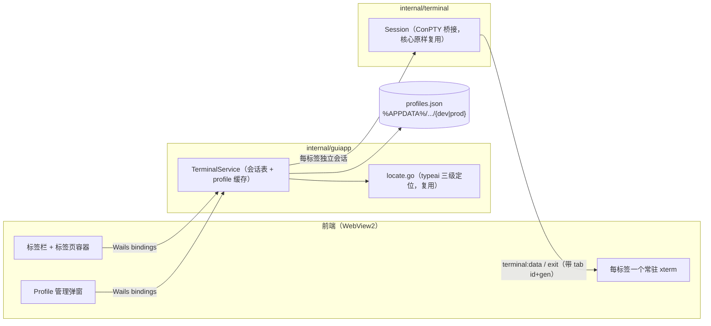

# Design Document — 通用 CLI/TUI 桌面终端

## Overview

把 typeai-gui 从「单会话 typeai 壳」泛化为多标签页通用终端：Go 侧 `TerminalService` 由单会话字段改为**会话表**（每个标签页一个 ConPTY 会话），新增 profile 持久化（`profiles.json`）与 exe 探测；前端由单 xterm 改为**标签页容器**（每标签一个常驻 xterm 实例）+ profile 管理弹窗。ConPTY 桥接层 `internal/terminal` 的核心生命周期逻辑（EOF 死锁规避、flush 宽限期）原样保留，仅扩展「启动参数」能力。typeai 作为内置默认 profile，定位逻辑沿用现有三级定位。

## Context

现状（`go_projects/typeai-gui/`）：

- `main.go` → `guiapp.Run`：创建单会话 `TerminalService` → Wails v3 窗口 → 内嵌 `frontend/dist` 资源。
- `internal/terminal/session.go`：单会话 ConPTY 桥接（`Start/Write/Resize/Close` + `OnData/OnExit`），含两个 Windows 特有规避（子进程退出后必须主动 `ClosePseudoConsole` 唤醒读循环；`Wait` 后留 300ms flush 宽限期防堆损坏 0xc0000374）——**本期逐行不动**。
- `internal/guiapp/bindings.go`：单会话服务，`gen` 防串扰，base64 事件通道（规避 UTF-8 多字节被 chunk 边界截断）。
- 前端 `src/main.ts`：单个 xterm + 覆盖层，`Alt+R` 重启。
- `build.py`：单一构建脚本，dev/release 自动判定；当前**未传 build tag**，且 `-X` 注入路径与实际包路径不符（`typeai-gui/version` vs `typeai-gui/internal/version`，注入静默失效）。
- 壳自身当前不产生任何数据文件。

约束与现状事实：

- 项目仅面向 Windows（ConPTY + WebView2），但 `internal/terminal` 保持可跨平台编译（go-pty 双实现）。
- 仓库规范：dev/prod 构建的数据目录必须隔离（`%APPDATA%\language_projects\<项目名>\{dev|prod}`）；同类 GUI 参考实现 `glmquotawatch-gui/internal/env`（build tag `dev`）。
- 开放问题（项目更名）按 requirements 的 Out of Scope 处理：**本期不更名**，目录名 / module 名 / 产物名 / 窗口名保持 `typeai-gui` / `typeai`。



## Goals and Non-Goals

- Goals:
    - FR-1~FR-8 全量落地：profile 管理 UI、exe 探测、多标签页、标签生命周期、窗口级清理、内置 typeai、配置持久化、错误呈现。
    - 现有 ConPTY 桥接的稳定性规避（EOF 死锁、堆损坏宽限期）零回退。
    - dev/prod 数据目录隔离，符合仓库构建规范（NFR）。
- Non-Goals:
    - 与 clictl 集成、多窗口、远程会话、工作目录 / 环境变量等高级启动属性、split pane、终端配色自定义、项目更名（requirements 已明确排除）。
    - **进程树终止**：沿用现状仅杀标签页直接子进程（requirements「桥接层原样复用」；typeai 等 TUI 无子进程守护）。
    - 文件选择对话框：exe 路径为文本输入 + 探测反馈，不引入 Wails dialog 服务。
    - profile 手工编辑热加载：应用内 UI 是唯一编辑入口；手工改 `profiles.json` 需重启应用生效。
    - 多实例并发写 `profiles.json` 的锁（无单实例互斥；last-write-wins，见 Design Review Notes）。

## Detailed Design

### 1. `internal/env`（NEW）— 构建环境与数据子目录

- `CREATED` `go_projects/typeai-gui/internal/env/env.go`
    - **Purpose** 数据目录 dev/prod 隔离（FR-7、AC-6）与窗口标题区分。
    - **Changes**
        ```go
        package env

        func DataSubDir() string   // IsDev() ? "dev" : "prod"
        func WindowTitle() string  // IsDev() ? "typeai [DEV]" : "typeai"
        ```
- `CREATED` `.../env/env_dev.go`（`//go:build dev`）：`func IsDev() bool { return true }`
- `CREATED` `.../env/env_prod.go`（`//go:build !dev`）：`func IsDev() bool { return false }`
- `CREATED` `.../env/env_test.go`：断言 `DataSubDir()`/`WindowTitle()` 与当前构建 tag 一致（默认 prod 分支；dev 分支由 `build.py` 传 tag 后验证）。
- `UPDATED` `go_projects/typeai-gui/build.py`
    - **Changes**
        1. dev 构建追加 `-tags dev`（release 不带 tag，走 `env_prod.go`）；
        2. 修正 `-X` 注入路径为 `typeai-gui/internal/version.Version` / `typeai-gui/internal/version.Commit`（现状静默失效；version 包当前无消费者，属零行为修正，消除隐性缺陷）；
        3. 文件头使用说明同步补充 dev tag 与数据目录隔离说明。
    - **Complexity** Low

### 2. `internal/store`（NEW）— profile 持久化、校验与探测

- `CREATED` `go_projects/typeai-gui/internal/store/profiles.go`
    - **Purpose** `profiles.json` 读写（FR-7）、profile 结构校验（FR-1）、exe 探测（FR-2）、ID 生成。
    - **Changes**
        - 类型与 API：
        ```go
        type Profile struct {
            ID      string `json:"id"`
            Name    string `json:"name"`
            ExePath string `json:"exePath"`
            Args    string `json:"args"`
        }

        func DefaultDir() (string, error)            // %APPDATA%\language_projects\typeai-gui\{dev|prod}；取不到 APPDATA 回退 ~/.language_projects/typeai-gui/{dev|prod}
        func Open(dir string) (*Store, error)        // MkdirAll 完整目录链（含 language_projects 一层）
        func (s *Store) Dir() string
        func (s *Store) LoadProfiles() ([]Profile, error)
        func (s *Store) SaveProfiles(profiles []Profile) error
        func NextProfileID(existing []Profile) string            // "p<N>"，N = 已有数字后缀最大值 + 1
        func ValidateProfile(others []Profile, p Profile) error  // others = 除自身外的全部 profile（含内置 typeai 的占位）
        func ProbeExe(path string) (string, error)               // 返回绝对路径；不存在/目录/空 均报错
        ```
        - 文件格式：`{"profiles":[{"id","name","exePath","args"}, ...]}`；`exePath` 持久化前规范为绝对路径（`filepath.Abs`）。
        - 读：文件不存在 → 空列表 + nil；JSON 损坏 → 原文件重命名备份为 `profiles.json.bak-<unix 秒>` 后按空列表继续（不阻塞启动、不静默覆盖用户数据）。
        - 写：`tmp + os.Rename` 原子写（参照 `glmquotawatch-gui/internal/store`）。
        - 校验规则（`ValidateProfile`，逐条失败返回中文错误，调用方不落盘）：
            | 字段 | 规则 |
            |---|---|
            | name | TrimSpace 后非空；不得与 others（含内置 `typeai`）重名（精确匹配）；不得含 NUL |
            | exePath | TrimSpace 后非空；不得含 NUL |
            | args | 允许空；不得含 NUL |
        - `ProbeExe`：空白 → 「路径为空」；`filepath.Abs` 后 `os.Stat`：目录 → 「路径指向目录」；不存在 → 「路径不存在」；成功 → 返回绝对路径。路径按字面处理，不展开环境变量（文档化）。
    - **Complexity** Medium
- `CREATED` `.../store/profiles_test.go`
    - **Purpose** 单测（全部注入 `t.TempDir()`，不触真实 APPDATA）。
    - **Changes** 覆盖：`DefaultDir` 的 AppData / 回退两分支（`t.Setenv`）；roundtrip；原子写内容完整；损坏备份；`NextProfileID`；`ValidateProfile` 各规则；`ProbeExe` 各分支。
    - **Complexity** Low

### 3. `internal/terminal`（UPDATED）— 启动参数扩展

- `UPDATED` `go_projects/typeai-gui/internal/terminal/session.go`
    - **Purpose** 支持 profile 启动参数（FR-1 参数字段、FR-3 带参数运行 exe）。
    - **Changes** `Start` 签名改为 `Start(exePath string, args []string, cols, rows int)`，内部 `p.Command(exePath, args...)`（go-pty 原生可变参数，argv[0] 由库处理）；其余生命周期代码（pump/waiter/Close/宽限期）逐行不动。
    - **Complexity** Low
- `CREATED` `.../terminal/args_windows.go`（`//go:build windows`）
    - **Purpose** 把 profile 的原始参数字符串按 Windows 命令行规则分词（FR-1「原样拼接」语义）。
    - **Changes**
        ```go
        func ParseArgs(raw string) ([]string, error)
        // TrimSpace 后为空 → nil, nil；含 NUL → error；
        // 否则 windows.DecomposeCommandLine（CommandLineToArgvW 语义，引号/转义按 Windows 规则）
        ```
        （`golang.org/x/sys/windows` 由间接依赖转直接依赖，已在 go.sum。）
- `CREATED` `.../terminal/args_other.go`（`//go:build !windows`）
    - **Changes** `strings.Fields(raw)` 兜底（保持包跨平台可编译；本项目实际只跑 Windows）。
- `UPDATED` `.../terminal/session_test.go`
    - **Changes** 适配新签名（其余测试补 nil args）；新增：参数透传测试 `Start(cmdPath, []string{"/c", "echo", "ARG_MARK_42"}, 80, 25)` 输出含标记且退出码 0；`ParseArgs` 引号/转义/空串用例。
    - **Complexity** Low

### 4. `internal/guiapp`（REWRITTEN）— 多标签会话服务

- `REWRITTEN` `go_projects/typeai-gui/internal/guiapp/bindings.go`
    - **Purpose** 会话表管理（FR-3/4/5）、profile CRUD 与探测转发（FR-1/2/7）、内置 typeai（FR-6）、每标签错误呈现（FR-8）。
    - **Changes**
        - 常量：`BuiltinProfileID = "builtin-typeai"`、`BuiltinProfileName = "typeai"`；事件名 `terminal:data` / `terminal:exit`；移除 `terminal:error`（启动错误改由返回值承载）。
        - 视图类型（Wails 自动生成 TS 模型）：
        ```go
        type ProfileInput struct { ID, Name, ExePath, Args string }  // ID 空 = 新建
        type ProfileView struct {
            ID, Name, ExePath, Args string
            Builtin      bool   // 内置 typeai（不可编辑/删除）
            Exists       bool   // 实时探测结果
            ResolvedPath string // 存在时的绝对路径（内置为定位结果）
        }
        type ProbeResult struct { Exists bool; ResolvedPath, Message string }
        type TabInfo struct { ID string; Gen int; ProfileID, ProfileName string; Builtin bool; StartError string }
        ```
        - 绑定方法（全部并发安全）：
        ```go
        ListProfiles() []ProfileView
        ProbeExe(path string) ProbeResult
        SaveProfile(input ProfileInput) (ProfileView, error)
        DeleteProfile(id string) error
        OpenTab(profileID string, cols, rows int) (TabInfo, error)
        RestartTab(id string, cols, rows int) (TabInfo, error)
        CloseTab(id string) error
        Write(id string, data string) error
        Resize(id string, cols, rows int) error
        CloseAllTabs()
        ```
        - **错误语义（关键约定）**：
            - `OpenTab` / `RestartTab`：标签页已建立 → `(TabInfo, nil)`，启动失败写入 `TabInfo.StartError`（前端照常建标签并显示覆盖层，AC-7）；**仅当未建立标签页**（未知 profileID / 未知标签 id / 内部错误）才返回 error（前端拒绝并提示，不建标签）。
            - `CloseTab`：未知 id 视为已关闭，返回 nil（幂等）。
            - `Write` / `Resize`：未知 id 或会话未运行 → error（前端静默忽略）。
            - `SaveProfile`：校验失败 / 持久化失败 → error（前端表单内联提示）；`DeleteProfile`：内置 id → error「内置 profile 不可删除」。
        - 内置 profile（FR-6）：列表首位虚拟项（ID `builtin-typeai`，名称 `typeai`，exePath 空，`Builtin=true`）；存在性 = `LocateTypeai()` 实时定位；打开时同样实时定位，不缓存路径。重名校验把 `typeai` 视为已占用。
        - profile 缓存：`NewTerminalService(st *store.Store)` 启动时 `LoadProfiles()` 载入内存；`SaveProfile`/`DeleteProfile` 先构造新列表 → `SaveProfiles` 成功后才替换缓存（失败则缓存不变）。`st == nil`（数据目录不可用）时仅内置 profile 可用，保存/删除返回「数据目录不可用」错误。
        - 会话表：`tabs map[string]*tab`，`tab{id, gen, profileID, name, builtin, sess terminalSession, startErr string}`；`nextTab` 自增生成 `t1/t2/...`；同一 profile 可开多标签（FR-3）。
        - `OpenTab` 流程：锁内建占位 tab（`gen=1`）→ 锁外解析路径（内置走 `LocateTypeai`，用户走 `ExePath`）、`ParseArgs`、`newSession(...)` → 锁内复查（tab 已被关闭则丢弃新会话并 Close）；否则挂载 sess、设置回调（`OnData`/`OnExit` 闭包捕获 `id+gen`）→ 返回 `TabInfo`。
        - `RestartTab`：锁内校验 tab 存在、摘除旧 sess、`gen++`、清 startErr → 锁外 Close 旧会话并按同一 profile 重新解析启动（profile 已被删除 → StartError「Profile 已删除，请关闭该标签页」）→ 锁内挂载（tab 消失则丢弃并 Close）。
        - `CloseTab`：锁内摘除 tab（含 sess）→ 锁外 `sess.Close()`（幂等杀进程 + ConPTY 释放）。
        - `CloseAllTabs`：锁内快照全部会话并清空表 → 锁外逐个 Close（FR-5 / AC-5）。
        - 事件负载（JSON 小写字段）：
        ```json
        // terminal:data
        {"id":"t1","gen":1,"data":"<base64>"}
        // terminal:exit
        {"id":"t1","gen":1,"code":0}
        ```
        base64 通道沿用现状；`gen` 供前端丢弃重启前旧会话的迟到事件（前端按 `id+gen` 路由，不匹配即丢）。
        - 可测性接缝（不暴露给前端）：
        ```go
        type terminalSession interface { Write([]byte) error; Resize(int, int) error; Close(); SetOnData(func([]byte)); SetOnExit(func(int, error)) }
        type sessionFactory func(exePath string, args []string, cols, rows int) (terminalSession, error)
        type emitter func(event string, payload any)
        ```
        默认实现：`sessionFactory` = `terminal.Start` + 适配器（`SetOnData/SetOnExit` 落到 `Session` 公有字段）；`emitter` = `t.app.Event.Emit`。测试注入 fake。
    - **Complexity** High
- `CREATED` `.../guiapp/service_test.go`
    - **Purpose** 会话表与 profile 逻辑单测（fake session/factory/emitter + 临时目录 store，不触真实 ConPTY 与 APPDATA）。
    - **Changes** 覆盖：内置 profile 列表与重名占用；OpenTab 成功 / 未知 id / 启动失败（建标签 + StartError）；多标签独立（Write 路由到正确 fake、CloseTab 只关一个）；CloseAllTabs；RestartTab（gen 递增、旧会话被 Close、事件带新 gen）；Save/Delete 校验与持久化（临时目录出现文件）；事件负载 id/gen。
    - **Complexity** Medium
- `UPDATED` `.../guiapp/app.go`
    - **Changes** 装配：`store.DefaultDir` + `Open` 失败降级 nil（仅内置 profile 可用，保存报「数据目录不可用」）；`NewTerminalService(st)`；窗口标题 `env.WindowTitle()`；`Description` 改为「通用 CLI/TUI 桌面终端（xterm.js + ConPTY）」；关窗钩子改 `svc.CloseAllTabs()`。
    - **Complexity** Low
- `locate.go` 不改：内置 typeai 定位复用，其错误信息（含全部已尝试位置）直接进覆盖层。

### 5. 前端（REWRITTEN）

- `UPDATED` `go_projects/typeai-gui/frontend/index.html`
    - **Changes** 骨架：`#app`（列布局）→ `#tabbar`（`#tabs` 容器、`#btn-new`「＋」、`#btn-manage` 齿轮）→ `#terminals`（标签页宿主容器 + `#empty` 空态）→ `#popover`（新建标签页选择器）→ `#modal`（profile 管理）。各标签页宿主 `.term-host` 与覆盖层由 JS 动态创建。
    - **Complexity** Low
- `CREATED` `go_projects/typeai-gui/frontend/src/api.ts`
    - **Purpose** Wails 绑定与事件的薄封装。
    - **Changes** 导出：绑定函数引用；`ProfileView / ProbeResult / TabInfo / ProfileInput` 类型；`TerminalDataEvent{id,gen,data}`、`TerminalExitEvent{id,gen,code}`；`onData/onExit` 订阅；`b64ToBytes`。
    - **Complexity** Low
- `CREATED` `.../frontend/src/tabs.ts`（TabManager）
    - **Purpose** 标签页生命周期与终端实例池（FR-3/4/5/8、NFR 状态保留）。
    - **Changes**
        - 每个标签页：常驻 `Terminal`（xterm）+ `FitAddon` + 宿主 div；**切换只切 `display`，实例与滚动缓冲永不重建**（NFR）。
        - `open(profile)`：显示新宿主并测量尺寸（`proposeDimensions`，回退 80×25）→ `await OpenTab` → 建 xterm、装载、按 `StartError` 决定是否立即显示覆盖层 → 激活并聚焦。
        - `activate(id)`：`display` 切换 + `requestAnimationFrame` 后 `fit()`（隐藏期间尺寸可能变化，激活时补同步 → AC-3 窗口缩放对当前标签即时生效）。
        - `close(id)`：`await CloseTab` → `term.dispose()` → 移除 DOM → 激活右邻（无则左邻，无则空态）。
        - `restart(id)`：`term.reset()` → `await RestartTab` → 更新 gen、清覆盖层；失败显示覆盖层。
        - 事件路由：`terminal:data` / `terminal:exit` 按 `id+gen` 匹配，未知或 gen 不符**静默丢弃**；exit → 覆盖层（「会话已结束（退出码 N）。按 Alt+R 重新启动。」）。
        - 启动失败覆盖层：消息 = `StartError`；提示语按 `Builtin` 区分：内置 → 现有文案（同目录放置 / `TYPEAI_GUI_TYPEAI_PATH`）；用户 profile → 「请在『管理 Profile』中修正或删除该路径；也可按 Alt+R 重试。」
        - `Alt+R`：模态关闭且存在活动标签时重启该标签（原全局重启语义收敛到活动标签）。
        - 尺寸同步：`ResizeObserver` 监听 `#terminals`，容器变化时仅 fit 活动标签；`term.onResize → Resize(id)`、`term.onData → Write(id)`（会话未运行时忽略）。
    - **Complexity** High
- `CREATED` `.../frontend/src/profiles.ts`（ProfileManager）
    - **Purpose** profile 管理 UI（FR-1/2）与新建标签页选择器。
    - **Changes**
        - 缓存 `profiles: ProfileView[]`；`refresh()` = `ListProfiles()` → 同步渲染管理列表与选择器。
        - 选择器（popover）：行 = 名称 + 缺失徽标；`Exists=false` 的行**禁用**（FR-2「缺失的 profile 不允许用于新建标签页」），点击 → `tabs.open(profile)`；底部「管理 Profile…」入口。
        - 管理弹窗：列表行（名称、exePath、参数、`内置`/`缺失` 徽标；内置行只读，用户行有编辑/删除）；表单（名称 / exe 路径 / 启动参数 + 探测反馈区）；删除二次确认（`confirm()`）。
        - 探测反馈：exe 输入 300ms 防抖 → `ProbeExe` → 存在：绿色「✓ 绝对路径」；缺失：红色「✗ 原因」；**保存按钮仅在名称非空 + 探测存在时可用**（AC-2）；保存失败（重名等）内联报错。
        - 保存/删除成功 → `refresh()`；表单关闭后聚焦活动终端。
    - **Complexity** Medium
- `REWRITTEN` `.../frontend/src/main.ts`
    - **Changes** 启动编排：`refresh()` → 若**用户 profile 数为 0** 则 `tabs.open(内置 typeai)`（FR-6 / AC-1；定位失败由覆盖层呈现错误，AC-7），否则显示空态（提示点「＋」）；绑定全局按键。
    - **Complexity** Low
- `UPDATED` `.../frontend/src/style.css`
    - **Changes** 布局与主题（沿用暗色 `#0c0c0c` / `#cccccc`）：`#tabbar`（高约 34px、`#181818` 底、活动标签 `#0c0c0c` 且顶部高亮边）；`.term-host` 绝对定位铺满、非活动 `display:none`；覆盖层复用现有 `.overlay` 样式（改为宿主内绝对定位）；popover / 模态（居中面板 + 半透明遮罩）；徽标与探测反馈色（成功 `#4ec9b0`、失败 `#f48771`）。
    - **Complexity** Low
- `UPDATED` `go_projects/typeai-gui/README.md`
    - **Changes** 更新定位（通用终端）、使用说明（多标签、profile 管理、数据目录 `%APPDATA%\language_projects\typeai-gui\{dev|prod}\profiles.json`）、typeai 内置 profile 定位说明、构建说明（dev tag 与数据隔离）。
    - **Complexity** Low

### Module Collaboration and Data Flow

- 依赖方向：`main.go → guiapp → {terminal, store, env}`；`guiapp` 是唯一装配点；`terminal` 与 `store` 互不依赖（可独立单测）；前端只经 Wails bindings / events 与 `guiapp` 通信。
- 组装顺序（`app.Run`）：解析数据目录（失败降级 nil store）→ 载入 profile 缓存 → 建 Wails app / 窗口（标题按 `env`）→ 注册关窗钩子（`CloseAllTabs`）。
- 关键流：
    1. **新建标签页**：前端选择 profile → `OpenTab(id, cols, rows)` → Go 建占位 tab → 解析路径 / 参数 → ConPTY 启动 → 返回 `TabInfo`（失败也返回，携带 `StartError`）→ 前端建 xterm 并显示（或覆盖层）。
    2. **输出 / 退出**：会话 pump goroutine → `terminal:data`（base64，带 id+gen）→ 前端按 id 路由写入对应 xterm；退出 → `terminal:exit` → 覆盖层。
    3. **切换 / 缩放**：纯前端 `display` 切换 + fit / Resize 同步，不触碰 Go 会话状态。
    4. **关闭**：`CloseTab` → Go 摘表 + `sess.Close()`（杀子进程、ConPTY 释放）；关窗 → `CloseAllTabs` 全量执行。
- 并发模型：服务方法以一把 `mu` 保护 `tabs` 与 profile 缓存，外部调用（会话启动 / 关闭 / 读写）一律在锁外执行；会话回调在各自 pump goroutine 触发，闭包仅携带 `id+gen`，不读共享状态；`emitter` 线程安全（Wails Event）。

### Acceptance Criteria Mapping

| AC ID | Design Component |
|---|---|
| AC-1 | `main.ts` 首启逻辑 + 内置 profile（`bindings.go`）+ `locate.go` 三级定位；定位失败由覆盖层兜底 |
| AC-2 | `ProbeExe`（bindings / store）+ `profiles.ts` 防抖探测与保存禁用 + `ValidateProfile` 服务端兜底 |
| AC-3 | `tabs.ts` 每标签常驻 xterm + `display` 切换 + 激活时补 fit + `ResizeObserver` |
| AC-4 | `CloseTab`（摘表 + `sess.Close()`）；`service_test.go` 覆盖单关不影响他标签 |
| AC-5 | `app.go` 关窗钩子 → `CloseAllTabs()` |
| AC-6 | `env.DataSubDir` + `build.py -tags dev` + `store.DefaultDir` |
| AC-7 | `OpenTab` 启动失败 → `TabInfo.StartError` → `tabs.ts` 覆盖层（含路径与修复提示，不闪退） |

## Design Review Notes

自审（零上下文视角重读）发现与处置：

1. **[已修复·HIGH] FR-2 与 AC-7 的交互歧义**（「缺失 profile 不允许新建标签页」vs「exe 失效时标签页显示覆盖层」）。裁定：选择器对缺失行禁用（FR-2 字面）；AC-7 由两条可达路径覆盖——① 首启自动打开内置 typeai（不经选择器）定位失败 → 建标签 + 覆盖层；② 探测通过后启动前失效（TOCTOU 竞态）→ 建标签 + 覆盖层。两者均有测试路径。
2. **[已修复·MEDIUM] 重启竞态**：旧会话收尾期间（flush 宽限期）可能向同 id 标签发迟到事件。处置：事件带每标签 `gen`，前端按 `id+gen` 丢弃过期事件；Go 侧对重启时已关闭的占位标签做二次复查（丢弃并 Close 新会话）。
3. **[已修复·MEDIUM] 锁外调用**：会话启动 / 关闭 / 读写可能耗时，禁止持 `mu` 调用；占位 → 启动 → 复查挂载的三段式流程已写入设计。
4. **[已修复·MEDIUM] 写失败污染缓存**：`SaveProfiles` 成功后才替换内存缓存，失败保持原状。
5. **[已修复·MEDIUM] 损坏文件不静默覆盖**：损坏的 `profiles.json` 先备份再按空列表继续。
6. **[已修复·LOW] `-X` 注入路径缺陷**：随本次 build.py 改动一并修正（零行为修正）。
7. **[挂起·已知限制] 多实例并发**：无单实例互斥，两个实例同时编辑 profile 时 last-write-wins；本期不加锁（requirements 未要求），如需要单独成期。
8. **[说明] 进程树**：仅杀直接子进程（沿用桥接层现状）；对会派生守护进程的 CLI 不保证孙进程清理。
