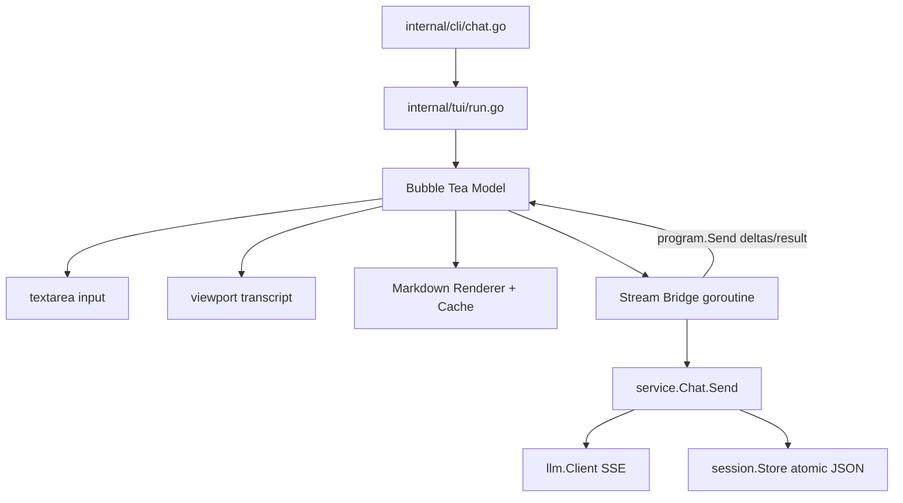

# Design Document

## Overview

采用 Charmbracelet TUI 栈改造无参数入口：Bubble Tea 负责事件循环和按键，Bubbles 提供 textarea/viewport 基础控件，Lip Gloss 负责轻量样式，Glamour 负责终端 Markdown 渲染。业务仍由现有 `service.Chat` 编排；TUI 只消费流式事件、维护显示状态并调用用例。思考流只在内存 UI state 中保留，Markdown 渲染器只处理 assistant 文本。

## Context

当前 `internal/cli/chat.go` 用 `bufio.Reader` 逐行读取 stdin，并把 `llm.Delta` 直接 `fmt.Print` 到 stdout。该链路无法回收已有行，也无法表达折叠面板。session、LLM SSE、业务错误和原子持久化已经稳定，测试通过；因此本次不改变持久化协议和网络协议，只替换交互壳并新增渲染适配层。

## Goals and Non-Goals

- Goals: 单进程 TUI；thinking 默认折叠；流式基础 Markdown；滚动/resize/错误状态；CLI 契约同步。
- Non-Goals: 用户输入 Markdown 预览、session resume/export、完整 Markdown 规范、主题系统、MCP。

## Detailed Design

### Dependencies

- `CREATED` Go 依赖
  - **Purpose**: 使用已维护的终端 UI 和 Markdown 生态，避免手写 ANSI 局部刷新。
  - **Changes**: 引入 `github.com/charmbracelet/bubbletea v1.3.10`、`github.com/charmbracelet/bubbles v1.0.0`、`github.com/charmbracelet/lipgloss v1.1.0`、`github.com/charmbracelet/glamour v1.0.0`；`go mod tidy` 后锁定间接依赖。
  - **Complexity**: Low

### TUI shell

- `CREATED` `internal/tui/run.go`
  - **Purpose**: 提供 `Run(chat *service.Chat, stdout io.Writer) error` 形态的 TUI 入口，创建 Program 并返回终端恢复后的错误。
  - **Changes**: 校验交互环境；构造 renderer、model 和 `tea.NewProgram`；使用 alt screen。启动错误由 CLI 映射为 stderr 与退出码。
  - **Complexity**: Medium
- `CREATED` `internal/tui/model.go`
  - **Purpose**: 保存对话轮、折叠状态、请求状态、textarea、viewport 和尺寸。
  - **Changes**: 实现 `Init/Update/View`；处理 Enter、Ctrl+J、Ctrl+T、滚动、resize、流式消息和完成/失败消息。`reasoningOpen` 每轮新请求重置为 false。
  - **Complexity**: High
- `UPDATED` `internal/cli/chat.go`
  - **Purpose**: 保留配置校验和 `service.NewChat` 组装，删除手写 REPL。
  - **Changes**: 构造成功后调用 `tui.Run`；非 TTY 无参数启动返回清晰错误，退出码 1；不再直接读取 stdin 或打印流式增量。
  - **Complexity**: Low

TUI 交互固定为：Enter 提交；Ctrl+J 换行；Ctrl+T 切换思考流；PageUp/PageDown 与 Up/Down 滚动；`/exit`、`/quit`、Ctrl+C 退出。请求进行中忽略新的 Enter 提交，避免并发调用 `Chat.Send`。

### Streaming bridge

- `CREATED` `internal/tui/stream.go`
  - **Purpose**: 把同步 `Chat.Send` 和回调转成 Bubble Tea 消息。
  - **Changes**: 提交后启动单个 goroutine，将 `llm.DeltaReasoning`、`llm.DeltaAnswer`、成功、取消和 `*service.OperationError` 转成不可变消息并 `program.Send`。启动前设置 `context.WithCancel`；Ctrl+C 或退出先 cancel 再等待结果消息，避免 goroutine 泄漏。
  - **Complexity**: Medium

数据流为：textarea 提交纯文本 -> TUI 创建 turn state -> goroutine 调用 `service.Send(ctx, input, callback)` -> callback 只发 UI 消息 -> model 更新 reasoning/answer buffer -> markdown renderer 生成显示块 -> viewport 更新。`service.Chat` 仍保证“完整回答且保存成功才提交历史”。

### Collapsible thinking

- `UPDATED` `internal/tui/model.go`、`internal/tui/view.go`
  - **Purpose**: 将 `reasoning_content` 作为每个 assistant 轮的临时折叠块。
  - **Changes**: 每轮保存 reasoning 字符数、耗时和最近内容窗口；折叠时渲染一行 `Thinking (N chars)` 类状态，展开时显示最近最多 64 KiB 的文本。全局开关每轮新请求重置为折叠；切换只影响当前进程显示，不触发网络请求，也不改 session。
  - **Complexity**: Medium

不变量归属：`service.Chat` 继续保证思考流不进入正式历史；TUI 只能通过 `session.Session` 之外的 UI state 持有 reasoning。对任意成功轮，session `messages` 中不存在 reasoning 专用字段或思考正文。

### Streaming Markdown renderer

- `CREATED` `internal/tui/markdown.go`
  - **Purpose**: 封装 Glamour，渲染 assistant Markdown 并缓存结果。
  - **Changes**: 使用 `glamour.NewTermRenderer(glamour.WithAutoStyle(), glamour.WithWordWrap(width))`；基础 Markdown 覆盖 FR-4 列出的元素。缓存 key 为 assistant 轮 ID、源文本长度/内容哈希、宽度和样式；resize 或内容变化未命中时重新渲染。渲染失败返回原文本，不返回致命错误。
  - **Complexity**: High
- `CREATED` `internal/tui/render_job.go`
  - **Purpose**: 防止 SSE 高频增量触发密集全量 Markdown 解析。
  - **Changes**: assistant buffer 脏标记加 80ms 节流；同一 generation 只允许一个渲染任务，完成前继续保留原始文本，新增量只标记 dirty。渲染完成消息携带 generation，过期结果丢弃；完成后执行一次最终渲染。
  - **Complexity**: Medium

用户消息不经过 Glamour，先做控制字符清理和宽度换行后按纯文本块显示。Glamour 不抓取远程图片；本设计也不启用 HTML 执行或自定义网络行为。

### View, scrolling, resize, errors

- `CREATED` `internal/tui/view.go`
  - **Purpose**: 组装 transcript、thinking 块、输入区、状态栏和错误条。
  - **Changes**: viewport 显示历史和当前轮；有新输出且用户未向上滚动时自动到底。状态栏显示 model、session ID/path、ready/running/saved/error、思考字符数和关键按键。错误优先显示 `OperationError.Code` 与消息，不显示 API Key 或内部堆栈。
  - **Complexity**: High

resize 时更新 textarea/viewport 尺寸、计算渲染宽度并使 Markdown 缓存按宽度失效。渲染宽度取终端内容宽度，下限 20、上限 120，避免超宽屏造成阅读困难。

### CLI contract

- `UPDATED` `internal/cli/schema.go`、`internal/cli/help.go`
  - **Purpose**: 同步无参数入口的行为描述。
  - **Changes**: `typeai` 契约说明 TTY 进入 TUI，列出 Enter/Ctrl+J/Ctrl+T/PageUp/PageDown/Ctrl+C 和 `/exit`；README 更新交互、快捷键、Markdown 范围和降级行为。管理命令输入输出不变。
  - **Complexity**: Low

## Module Collaboration and Data Flow

并发规则：同一时间至多一个 `Chat.Send` goroutine 和一个 Markdown 渲染 goroutine；`program.Send` 是跨 goroutine 唯一入口，model 字段只在 Bubble Tea Update 中变更。退出时先取消请求，再等待结果消息和 Program 退出。

## Acceptance Criteria Mapping

| AC ID | Design Component |
|---|---|
| AC-1 | `internal/tui/run.go`、model/view、单进程组装 |
| AC-2 | streaming bridge、collapsible thinking、既有 session 不变量 |
| AC-3 | `reasoningOpen` 每轮重置与 Ctrl+T 处理 |
| AC-4 | Glamour renderer、80ms 流式节流、viewport |
| AC-5 | 用户消息纯文本路径 |
| AC-6 | service 错误消息、TUI error bar、既有失败不落盘语义 |
| AC-7 | resize handler、renderer cache key |
| AC-8 | CLI schema/help 更新和轻量命令边界 |

## Design Review Notes

### Findings

- HIGH-1 初稿把 Markdown 渲染放在 SSE callback 内同步执行，可能阻塞读取循环。已改为 model 记 dirty、80ms 节流和单飞行渲染任务。
- MEDIUM-1 初稿未定义渲染失败行为。已确定降级为原始 assistant 文本，请求与持久化不受影响。
- MEDIUM-2 初稿未定义退出时在途请求。已确定先 cancel context，等待流结束结果消息后再退出，失败轮不落盘。

### Verified Assumptions

- `internal/service/chat.go` 当前确实使用历史副本请求，完整回答且 `store.Save` 成功后才提交历史。
- `internal/session/store.go` 当前 schema_version 为 1，使用临时文件加 rename 原子替换，权限 0600。
- `internal/llm/client.go` 已经区分 `reasoning_content` 与 `content` 增量。
- 本机 Go proxy 可解析 Bubble Tea v1.3.10、Bubbles v1.0.0、Lip Gloss v1.1.0、Glamour v1.0.0。

### Unverified Assumptions

- Windows Terminal 下 Bubble Tea/Glamour 的实际主题检测、滚动和重绘效果需要实现后用真实终端验收；设计已定义最小宽度、无色和降级行为。
