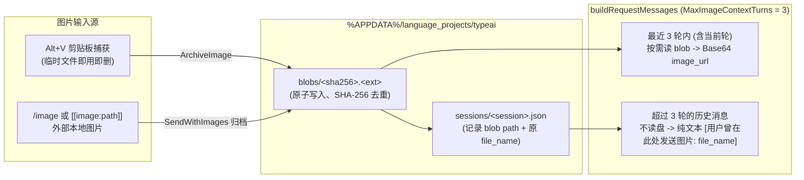

# Design Document

## Overview
本设计重构 `typeai` 的图片存储生命周期与多轮对话上下文构建逻辑：
1. **内容寻址 Blob 归档**：在应用数据目录 `%APPDATA%\language_projects\typeai\blobs\` 下按 `<sha256>.<ext>` 统一归档剪贴板截图（`Alt+V`）与外部图片（`/image`、`[[image:...]]`），使图片生命周期与 `sessions/` 对齐。
2. **无缓存按需加载**：移除 `service.Image.Base64` 字段与 `service.Chat.imageCache` 内存缓存，仅在构造多模态请求时从 `blobs/` 按需读取并编码 Base64，请求完成后即释放内存。
3. **多轮上下文老图片动态降级**：在构造 LLM 请求时仅保留最近 `MaxImageContextTurns = 3` 轮（含当前发送轮）的真实图片 Base64 负载；更早轮次的含图历史消息动态降级为纯文本占位符 `[用户曾在此处发送图片: <file_name>]`，不修改 `session.json` 持久化内容。

## Context
当前实现存在两处结构性问题：
- `Alt+V` 剪贴板图片保存在 `%TEMP%\language_projects\typeai\clipboard\`，外部图片仅在 `session.json` 记录原始外部路径。为了防止 `%TEMP%` 清理或原图删除导致多轮对话中断，`service.Chat` 在内存中维护了 `imageCache` 常驻所有图片的 Base64 字符串（单张最大约 13.3 MiB），既浪费内存，又导致进程退出后 `session.json` 中的图片路径成为死链接。
- 多轮长对话中，早期轮次发送的图片在后续每一轮请求中都会被全量 Base64 重传，浪费带宽与视觉 Token。

## Goals and Non-Goals
- **Goals**:
  - 将剪贴板图片与发送的外部图片统一归档至 `<dataDir>/blobs/<sha256>.<ext>`，清理 `%TEMP%` 临时截图文件。
  - 移除 `service.Image.Base64` 与 `service.Chat` 的内存图片缓存 `imageCache`，改为按需从 `blobs/` 读取编码。
  - 实现基于对话轮数（`MaxImageContextTurns = 3`，含当前发送轮）的历史图片动态降级，老图片转为基础文本占位符 `[用户曾在此处发送图片: <file_name>]`。
  - 修复 `internal/tui/model.go` 中 `submit()` 在调用 `startStreamWithImages` 前提前将 `m.staged` 置 `nil` 的问题，确保 `/image` 暂存图片正常透传。
- **Non-Goals**:
  - 不修改 `session.json` 的 `schema_version`（保持为 `2`）和字段结构。
  - 不提供配置项调整 `MaxImageContextTurns`。
  - 不在本期实现 `blobs/` 孤儿文件清理命令。

## Architecture Decisions
1. **剪贴板捕获与 Blob 归档职责划分**：
   - *备选方案 A*：修改 `internal/clipboard` 直接依赖 `internal/config` 并计算 SHA-256 写入 `blobs/`。
   - *备选方案 B（选定）*：`internal/clipboard` 保持纯平台命令执行职责（捕获图片到临时路径），由 `internal/service` 的 `CaptureClipboardImageInDir(dataDir)` 调用 `clipboard.CaptureImage()` 后通过 `defer os.Remove(tempPath)` 立即归档至 `<dataDir>/blobs/<sha256>.png` 并删除临时文件。
   - *理由*：保持 `internal/clipboard` 无业务状态且不耦合配置目录，既有平台测试无需改动，同时保证 `%TEMP%` 零残留。
2. **剪贴板标记二次解析时的 `FileName` 识别**：
   - `Alt+V` 将图片归档为 `<dataDir>/blobs/<sha256>.png` 后，向输入框插入 `[[image:<dataDir>/blobs/<sha256>.png]]`。用户按 Enter 发送时，`ParseImageMarkers` 会对该路径调用 `PrepareImage`。
   - 若直接取 `filepath.Base(path)`，`FileName` 会变成 `<sha256>.png`。因此规定：当 `PrepareImage` 检测到目标路径位于 `blobs` 目录且文件名为 `<64位十六进制sha256>.<ext>` 时，将其识别为已归档的剪贴板图片，`FileName` 设为 `"clipboard" + ext`（即 `"clipboard.png"`）；而外部图片（如 `D:\a\chart.png`）在 `PrepareImage` 时 `FileName` 为 `"chart.png"`，随后在 `SendWithImages` 中调用 `ArchiveImage` 归档到 `blobs/` 时显式保留 `image.FileName`（`"chart.png"`），仅将 `image.Path` 更新为归档后的 blob 路径。

## Detailed Design

### 1. 图片准备、归档与按需加载模块
- `UPDATED` `internal/service/image.go`
  - **Purpose**：负责图片校验、内容寻址归档（`blobs/`）、剪贴板图片捕获归档、按需 Base64 加载以及老图片降级文本格式化。
  - **Changes**：
    1. 新增常量 `MaxImageContextTurns = 3`。
    2. 从 `type Image struct` 中移除 `Base64 string` 字段，仅保留 `Path`、`FileName`、`MediaType`、`Size`。
    3. `PrepareImage(path string) (Image, error)`：
       - 展开路径、校验文件存在、非目录、`0 < Size <= MaxImageSize`、读取字节校验 `detectImageMediaType(raw)`。
       - 若 `isArchivedBlobPath(expanded)` 为真，则 `FileName = "clipboard" + mediaTypeExt(mediaType)`，否则 `FileName = info.Name()`。
       - 返回不含 Base64 的 `Image` 元数据。
    4. 新增 `ArchiveImage(blobDir string, image Image) (Image, error)`：
       - 读取 `image.Path` 原始字节并再次校验非空、`<= MaxImageSize` 及 `detectImageMediaType`（防御从暂存到发送期间原文件被篡改或删除）。
       - 计算 `sha256.Sum256(raw)`，拼接扩展名 `mediaTypeExt(mediaType)`（`image/png`->`.png`, `image/jpeg`->`.jpg`, `image/webp`->`.webp`, `image/gif`->`.gif`），目标路径为 `filepath.Join(blobDir, hexHash+ext)`。
       - 幂等判断：若目标文件已存在、非目录且 `Size == int64(len(raw))`，直接复用，不重复写盘。
       - 否则执行 `os.MkdirAll(blobDir, 0o700)` 并通过 `writeBlobAtomic(blobPath, raw, 0o600)`（同目录临时文件 `.blob-*.tmp` 写入、`Sync`、`Close`、`Chmod(0o600)`、`Rename`；若 `Rename` 时目标已存在且大小一致则视为成功）原子落盘。
       - 返回归档后的 `Image`：`Path: blobPath`，`FileName` 保留入参 `image.FileName`（若为空则回退 `"clipboard" + ext`），`MediaType: mediaType`，`Size: int64(len(raw))`。
    5. 重构剪贴板捕获入口：
       - 新增 `CaptureClipboardImageInDir(dataDir string) (Image, error)`：调用 `clipboard.CaptureImage()` 拿到临时文件路径后，立即 `defer os.Remove(tempPath)`，构造 `Image{Path: tempPath, FileName: "clipboard.png"}` 调用 `ArchiveImage(filepath.Join(dataDir, "blobs"), ...)` 返回归档后的 `Image`。
       - `CaptureClipboardImage() (Image, error)`：调用 `config.DefaultDir()` 获取默认 `dataDir` 后委托给 `CaptureClipboardImageInDir(dir)`。
    6. `loadImage(path string, expectedSize int64, expectedType string) (llm.Image, error)`：
       - 按需从 `path`（即 `blobs/` 下的归档路径）读取字节，校验 `Size == expectedSize` 且 `MediaType == expectedType`，实时执行 `base64.StdEncoding.EncodeToString(raw)` 并返回 `llm.Image{Base64Data: encoded, MediaType: mediaType}`。
    7. 新增 `formatDegradedImageMessage(rawContent string, images []session.Image) string`：
       - 调用 `stripImageMarkers(rawContent)` 获取干净文本 `text`。
       - 遍历 `images`，每张图生成 `fmt.Sprintf("[用户曾在此处发送图片: %s]", fileName)`（`fileName` 优先取 `stored.FileName`，若为空则取 `filepath.Base(stored.Path)`）。
       - 若 `text != ""` 则将 `text` 与所有占位符按 `"\n"` 拼接，否则仅将所有占位符按 `"\n"` 拼接返回。
  - **Complexity**：Medium

### 2. 多轮对话编排与上下文衰减模块
- `UPDATED` `internal/service/chat.go`
  - **Purpose**：在发送消息时归档本轮图片、按轮次阈值构造多模态或降级纯文本请求、并在成功后持久化 `session.json`。
  - **Changes**：
    1. `type Chat struct`：移除 `imageMu sync.Mutex` 与 `imageCache map[imageCacheKey]Image`；新增 `dataDir string` 与 `blobDir string`（在 `NewChat` 中初始化为 `filepath.Join(dataDir, "blobs")`）。
    2. 新增 `(c *Chat) CaptureClipboardImage() (Image, error)`：直接调用 `CaptureClipboardImageInDir(c.dataDir)`。
    3. `SendWithImages(ctx, input, stagedImages, onDelta)`：
       - 解析 `input` 中的 `[[image:...]]` 标记，合并 `stagedImages` 与 `markerImages`，校验总数 `<= MaxImagesPerMessage`、输入非空、APIKey 非空。
       - 对本轮每张图片调用 `ArchiveImage(c.blobDir, img)` 得到 `archivedImages []Image`。
       - 调用 `c.buildRequestMessages(requestText, archivedImages)` 构造请求。
       - 流式请求成功后，将 `imageMetadata(archivedImages)`（其中 `Path` 为 `blobs/<sha256>.<ext>`，`FileName` 为原文件名）写入 `session.Message` 并落盘 `c.store.Save(candidate)`。
    4. `buildRequestMessages(input string, currentImages []Image) ([]llm.Message, error)`：
       - 先统计 `c.session.Messages` 中 `Role == "user"` 的消息总数 `totalUserTurns`。
       - 遍历 `c.session.Messages`（维护当前遇到的历史 user 消息序号 `userTurnIdx`，从 `0` 开始递增）：
         - 若 `len(message.Images) == 0`：追加 `llm.TextMessage(message.Role, message.Content)`。
         - 若 `len(message.Images) > 0` 且 `message.Role == "user"` 且 `totalUserTurns - userTurnIdx >= MaxImageContextTurns`：
           该历史轮次距离当前发送轮已超过 `MaxImageContextTurns`（即早于最近 3 轮），调用 `formatDegradedImageMessage(message.Content, message.Images)` 构造降级文本，追加 `llm.TextMessage(message.Role, degradedText)`，**不读取磁盘图片文件**。
         - 否则（处于最近 `MaxImageContextTurns` 轮内）：对每张 `stored` 调用 `loadImage(stored.Path, stored.Size, stored.MediaType)` 按需读取并编码 Base64（失败时包装为 `"重建历史图片 %s 失败: %w"`），并将消息文本通过 `stripImageMarkers(message.Content)` 剥离标记后追加 `llm.ImageMessage(message.Role, cleanText, images)`。
       - 对于当前正在发送的这轮消息：
         - 若 `len(currentImages) == 0`：追加 `llm.TextMessage("user", input)`。
         - 若 `len(currentImages) > 0`：对每张 `img` 调用 `loadImage(img.Path, img.Size, img.MediaType)` 构造 `llm.Image` 列表，追加 `llm.ImageMessage("user", input, images)`。
    5. 删除 `imageCacheKey`、`cacheImage`、`cachedImage`、`historyImage` 四个缓存相关方法/类型。
  - **Complexity**：Medium

### 3. TUI 剪贴板绑定与暂存图片透传修复
- `UPDATED` `internal/tui/model.go`
  - **Purpose**：使 TUI 优先使用当前 `Chat` 实例的数据目录归档剪贴板图片，并修复 `/image` 暂存图片提交时被提前清空的问题。
  - **Changes**：
    1. 在 `newModel` 中：若 `chat != nil`，将 `captureClipboard` 设为 `chat.CaptureClipboardImage`；否则回退为 `service.CaptureClipboardImage`。
    2. 在 `submit()` 中：先用局部变量 `staged := m.staged` 保存已暂存图片，再执行 `m.staged = nil`，随后将 `staged` 传给 `startStreamWithImages(m.sender, m.chat, ctx, input, staged)`。
  - **Complexity**：Low

### 4. 文档与测试同步
- `UPDATED` `README.md`
  - **Purpose**：更新图片归档路径、按需读取机制与多轮上下文图片超过 3 轮降级为文本占位符的说明。
  - **Changes**：将 `%TEMP%\language_projects\typeai\clipboard\` 与内存缓存说明更新为 `%APPDATA%\language_projects\typeai\blobs\<sha256>.<ext>` 统一归档、按需加载及最近 3 轮保留真实图片负载、更早轮次降级为 `[用户曾在此处发送图片: <文件名>]`。
  - **Complexity**：Low
- `UPDATED` `internal/service/image_test.go` & `internal/service/image_marker_test.go`
  - **Purpose**：适配 `Image.Base64` 字段移除，新增 `blobs/` 归档测试、原图删除后按需读取测试、以及第 1~4 轮图片保留与降级测试。
  - **Complexity**：Low

### Module Collaboration and Data Flow
1. **输入校验规则**：
   - 外部图片路径：必填非空字符串，支持首尾引号/`~`展开；文件必须存在、非目录、`0 < size <= 10 MiB`；文件头必须匹配 `image/png`、`image/jpeg`、`image/webp`、`image/gif` 之一，否则返回 `OperationError{Code: "invalid_image"}`。
2. **错误处理逐操作具体化**：
   - `CaptureClipboardImageInDir`：剪贴板为空返回 `clipboard_empty`；平台命令失败返回 `clipboard_unavailable`；归档写盘失败返回 `invalid_image`；无论成功或失败，`defer os.Remove(tempPath)` 均确保删除 `%TEMP%` 下的临时捕获文件。
   - `ArchiveImage`：源文件读取失败或格式不合法返回 `invalid_image`；创建 `blobs/` 目录或原子写盘失败返回 `invalid_image`；调用方 `SendWithImages` 收到后直接中断本轮发送，不发起 LLM 请求、不写入 `session.json`。
   - `loadImage`（最近 3 轮内按需读取）：若 `blobs/` 下的文件被外部人为篡改或删除，返回 `invalid_image`（附带 `"重建历史图片 <path> 失败"`），`SendWithImages` 终止本轮请求且不污染 `session.json`；而超过 3 轮的历史图片因走纯文本降级分支，即使对应 blob 文件不存在也不会触发读取或报错。
3. **核心不变量（Invariants）**：
   - **不变量 1（零 Base64 落盘与零常驻缓存）**：由 `session.Store` 和 `service.Chat` 共同保证——`session.Image` 与 `service.Image` 均不含 Base64 字段，Base64 仅存在于 `SendWithImages` 栈内局部变量 `requestMessages []llm.Message` 的生命周期中。
   - **不变量 2（最近 N 轮图片窗口）**：由 `Chat.buildRequestMessages` 保证——对任意包含 $U$ 个已完成历史轮次的会话，发送第 $U+1$ 轮请求时，仅索引满足 $u \ge U - (\text{MaxImageContextTurns} - 1)$ 的历史轮次及当前第 $U+1$ 轮可产生 `image_url` part；对任意 $u < U - (\text{MaxImageContextTurns} - 1)$ 的含图历史消息，输出的 `llm.Message` 必为纯文本 `llm.TextMessage` 且包含 `[用户曾在此处发送图片: <file_name>]`。
4. **可测性**：
   - `ArchiveImage`、`PrepareImage`、`formatDegradedImageMessage` 可通过 `t.TempDir()` 进行纯单元测试。
   - `Chat.SendWithImages` 的多轮归档、原图删除恢复、以及超过 3 轮自动降级可通过 `httptest.NewServer` 拦截每轮 `/chat/completions` 请求体 JSON 进行端到端集成验证。

### Acceptance Criteria Mapping
| AC ID | Design Component |
|---|---|
| AC-1 | `internal/service/image.go` (`CaptureClipboardImageInDir`, `ArchiveImage`, `isArchivedBlobPath`)、`internal/tui/model.go` (`newModel`) |
| AC-2 | `internal/service/image.go` (`ArchiveImage`, `loadImage`, 移除 `Image.Base64`)、`internal/service/chat.go` (`SendWithImages`, 移除 `imageCache`) |
| AC-3 | `internal/service/chat.go` (`buildRequestMessages` 中 `totalUserTurns - userTurnIdx < MaxImageContextTurns` 分支 + `stripImageMarkers`) |
| AC-4 | `internal/service/chat.go` (`buildRequestMessages` 中 `totalUserTurns - userTurnIdx >= MaxImageContextTurns` 分支)、`internal/service/image.go` (`formatDegradedImageMessage`) |

## Design Review Notes

### 自审发现与处理
1. **[MEDIUM] 历史消息在未降级时（第 2、3 轮）是否剥离了 `[[image:...]]` 标记？**
   - *发现*：原 `chat.go` 第 128 行在重建历史含图消息时直接传了 `message.Content`（包含原始 `[[image:...]]` 路径文本），而首轮发送时传的是剥离了标记的 `requestText`。
   - *处理（已修复）*：在 `buildRequestMessages` 中，无论是未降级的历史含图消息（调用 `llm.ImageMessage`）还是已降级的历史含图消息（调用 `formatDegradedImageMessage`），均统一使用 `stripImageMarkers(message.Content)` 剥离 `[[image:...]]` 标记，确保历史轮次与首轮行为严格一致。
2. **[MEDIUM] `tui/model.go` 中 `/image` 暂存图片提交时被置空**
   - *发现*：`internal/tui/model.go` 第 357 行执行 `m.staged = nil` 后，第 372 行将 `m.staged`（此时已为 `nil`）传入了 `startStreamWithImages`。
   - *处理（已修复）*：纳入本设计模块 3，在 `m.staged = nil` 前用局部变量 `staged := m.staged` 保存并传给 `startStreamWithImages`。

### 已验证假设
- `internal/clipboard/clipboard.go` 的 `CaptureImage()` 返回 `%TEMP%\language_projects\typeai\clipboard\*.png` 路径，且 `internal/clipboard/clipboard_test.go` 仅测试 `CaptureImageWithRunner`（已读 `internal/clipboard/clipboard_test.go` 验证）。
- `session.Image` 结构仅包含 `Path`、`FileName`、`MediaType`、`Size` 四个字段，`SchemaVersion` 为 `2`（已读 `internal/session/store.go` 验证）。
- `llm.TextMessage` 与 `llm.ImageMessage` 分别生成 JSON string content 与 multimodal array content（已读 `internal/llm/client.go` 验证）。

### 未验证或错误假设
- 无（全部假设均已对照源码核实，HIGH = 0，MEDIUM = 0，评审通过）。