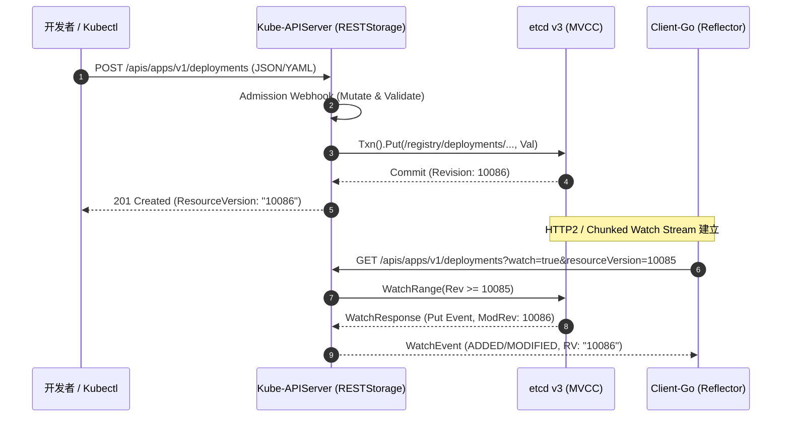
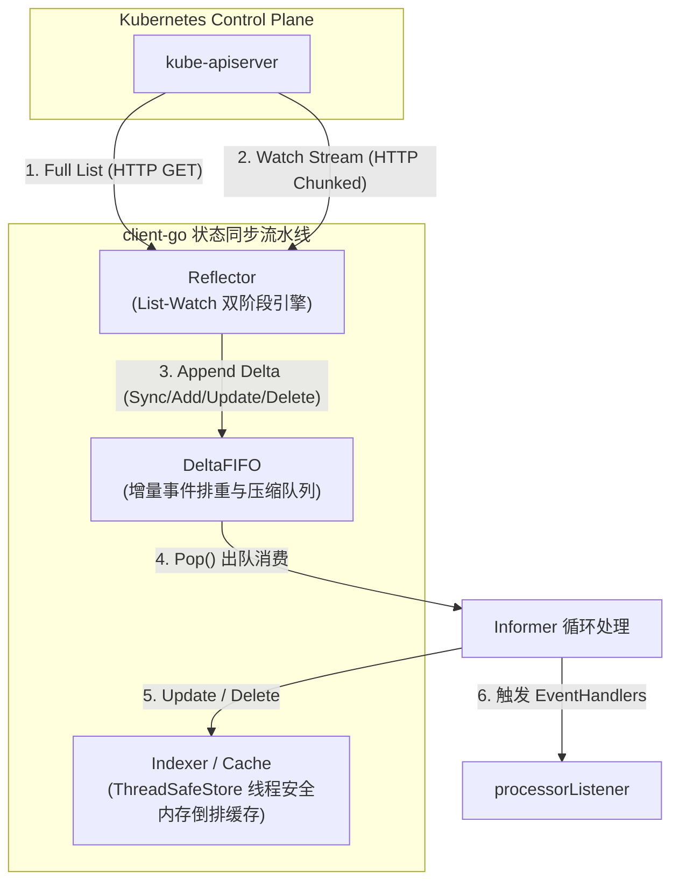
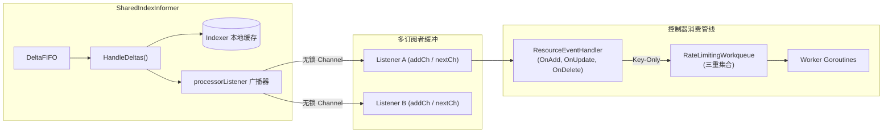
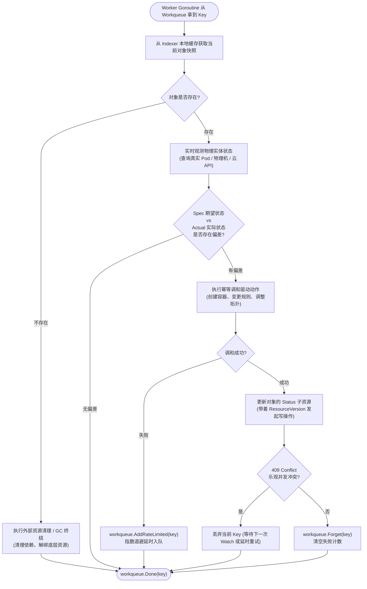

# K8S 核心声明式调和链路原理剖析与自研架构设计全景白皮书

> **目标**：本文档深入剖析 Kubernetes 控制面（Control Plane）的核心工作机制——包括声明式状态模型、etcd MVCC / Watch、client-go 流水线（Reflector、DeltaFIFO、Indexer、SharedInformer）、限速工作队列（RateLimitingQueue）与水平触发（Level-Triggered）控制循环；并在此基础上，系统性提炼出一套可直接用于自研分布式状态调和引擎的 Go 核心接口抽象与架构落地指南。

---

## 目录

- [一、声明式状态调和核心哲学](#一声明式状态调和核心哲学)
  - [1.1 边沿触发（Edge-Triggered）vs 水平触发（Level-Triggered）](#11-边沿触发edge-triggeredvs-水平触发level-triggered)
  - [1.2 控制循环的黄金公式：期望状态 vs 实际状态](#12-控制循环的黄金公式期望状态-vs-实际状态)
- [二、资源模型与 API Server / etcd 底座机制（Task 1）](#二资源模型与-api-server--etcd-底座机制task-1)
  - [2.1 GVK 与 GVR 体系解析](#21-gvk-与-gvr-体系解析)
  - [2.2 ObjectMeta、Spec 与 Status 的分离原则](#22-objectmetaspec-与-status-的分离原则)
  - [2.3 etcd MVCC 多版本机制与 ResourceVersion 的奥秘](#23-etcd-mvcc-多版本机制与-resourceversion-的奥秘)
  - [2.4 HTTP Chunked / HTTP2 Watch 流式长连接与 410 Gone 处理](#24-http-chunked--http2-watch-流式长连接与-410-gone-处理)
- [三、client-go 状态同步流水线深度解密（Task 2）](#三client-go-状态同步流水线深度解密task-2)
  - [3.1 List-Watch 双阶段机制：确定性与实时性的完美结合](#31-list-watch-双阶段机制确定性与实时性的完美结合)
  - [3.2 Reflector：底层的状态同步泵](#32-reflector底层的状态同步泵)
  - [3.3 DeltaFIFO：增量事件排重与无序压缩算法](#33-deltafifo增量事件排重与无序压缩算法)
  - [3.4 Indexer：线程安全的二级倒排索引本地缓存](#34-indexer线程安全的二级倒排索引本地缓存)
- [四、Informer 广播分发与 RateLimiting Workqueue 架构（Task 3）](#四informer-广播分发与-ratelimiting-workqueue-架构task-3)
  - [4.1 SharedInformer 与 processorListener 缓冲广播模型](#41-sharedinformer-与-processorlistener-缓冲广播模型)
  - [4.2 Resync 机制的本质与状态自愈意义](#42-resync-机制的本质与状态自愈意义)
  - [4.3 RateLimitingWorkqueue：“三重集合”与并发原子保证](#43-ratelimitingworkqueue三重集合与并发原子保证)
  - [4.4 指数退避算法与防雪崩限速设计](#44-指数退避算法与防雪崩限速设计)
- [五、Controller 幂等调和循环（Reconciliation Loop）（Task 4）](#五controller-幂等调和循环reconciliation-looptask-4)
  - [5.1 “Key-Only” 传递模型的设计考量](#51-key-only-传递模型的设计考量)
  - [5.2 标准 Reconciler 闭环执行流](#52-标准-reconciler-闭环执行流)
  - [5.3 并发调和、冲突重试与乐观并发控制（OCC）](#53-并发调和冲突重试与乐观并发控制occ)
  - [5.4 Finalizers 终结器与优雅级联删除](#54-finalizers-终结器与优雅级联删除)
- [六、自研声明式调和引擎架构设计与 Go 核心接口抽象规范（Task 5）](#六自研声明式调和引擎架构设计与-go-核心接口抽象规范task-5)
  - [6.1 自研引擎高层全景架构（Mini-Controller Framework）](#61-自研引擎高层全景架构mini-controller-framework)
  - [6.2 核心 Go 接口规范定义（代码级契约）](#62-核心-go-接口规范定义代码级契约)
  - [6.3 极简端到端运行闭环骨架（Demo 落地指引）](#63-极简端到端运行闭环骨架demo-落地指引)
- [七、总结与自研最佳实践沉淀](#七总结与自研最佳实践沉淀)

---

## 一、声明式状态调和核心哲学

### 1.1 边沿触发（Edge-Triggered）vs 水平触发（Level-Triggered）

在传统事件驱动架构（EDA）中，系统往往依赖 **边沿触发（Edge-Triggered）** 模式：
- 每次外界发生状态变迁，系统产生一个带参数的具体动作事件（如 `OrderCreatedEvent`, `AddReplicasEvent(count=1)`）。
- 消费者依赖每一个事件的有序、精确递送。如果网络抖动丢弃了一个 `AddReplicasEvent`，或者消息乱序到达，系统的最终状态将永久性失偏。

Kubernetes 则全面转向 **水平触发（Level-Triggered）**：
- 事件只是一个**信号（Signal）**，提醒控制器：“资源 X 发生变化了，请检查它的最新期望状态与当前实际状态”。
- 控制器**绝不消费事件的具体动作内容**，而是通过读取最新客观事实进行比对与收敛。
- 即使在网络分区、进程崩溃期间丢失了中间 100 次修改事件，只要恢复后获取到最新的“状态切片”，控制器就能单次调和完成自愈。

```
Edge-Triggered (脆弱):
  Event: Scale +1 ──► [Worker] ──► Replica=1 ──► (若丢失一次事件) ──► 状态与现实永远偏差!

Level-Triggered (自愈):
  Signal: Pod-A Changed ──► [Worker] ──► 读取最新 Spec(Replicas=3)
                                 ──► 观测现实 Actual(Running=1)
                                 ──► Diff 判定: 补齐 2 个 Pod ──► 自动收敛到期望状态!
```

### 1.2 控制循环的黄金公式：期望状态 vs 实际状态

Kubernetes 控制器的行为可以精炼为以下代数逻辑：

$$\Delta = \text{Observe}(\text{Actual State}) - \text{Desired State}$$
$$\text{Action} = \text{Reconcile}(\Delta)$$

整个系统持续以只读方式观测现实、以声明式方式比对差异、以幂等方式驱动现实向期望对齐。

---

## 二、资源模型与 API Server / etcd 底座机制（Task 1）



### 2.1 GVK 与 GVR 体系解析

K8s 的资源定义体系被分为逻辑层（GVK）与 REST 路由层（GVR）：
1. **GVK（Group / Version / Kind）**：
   - 面向对象逻辑：标识一个 Golang 强类型结构。
   - 例如：`Group: apps`, `Version: v1`, `Kind: Deployment` $\rightarrow$ 对应结构体 `apps/v1.Deployment`。
2. **GVR（Group / Version / Resource）**：
   - 面向 HTTP RESTful 路由：确定 API Server 的 URL Path。
   - 规则：`Resource` 通常是 `Kind` 的小写复数形式（Plural）。
   - URL 结构：`/apis/{Group}/{Version}/namespaces/{namespace}/{Resource}`。
   - 例如：`/apis/apps/v1/namespaces/default/deployments`。

### 2.2 ObjectMeta、Spec 与 Status 的分离原则

K8s 核心资源结构均严格遵守三分法：
```go
type Deployment struct {
    metav1.TypeMeta   `json:",inline"`            // APIVersion, Kind
    metav1.ObjectMeta `json:"metadata,omitempty"` // Name, Namespace, UID, ResourceVersion, Labels, Annotations
    Spec              DeploymentSpec              `json:"spec,omitempty"`   // 声明的期望状态（User/Client 编写）
    Status            DeploymentStatus            `json:"status,omitempty"` // 观察到的实际状态（Controller 上报）
}
```
- **Spec**：用户或上游控制面声明的**期望目标**，只允许有权限的用户/系统修改。
- **Status**：负责调和该资源的控制器观测并写入的**当前现状**，通常通过单独的子资源接口 `/status` 写入，避免权限混淆与并发写竞争。

### 2.3 etcd MVCC 多版本机制与 ResourceVersion 的奥秘

etcd v3 内部使用 MVCC（Multi-Version Concurrency Control）模型：
- 全局递增的 `64-bit` 整数：**`main revision`**（每发生一次写操作，revision +1）。
- 每个键值对的每一次修改都会生成一个新的版本，并附带修改版本号 `mod_revision`。
- **`ResourceVersion`** 的本质：在 K8s 中，对象的 `metadata.ResourceVersion` 就是该对象在 etcd 中最近一次被修改的 `mod_revision`（转换为十进制字符串）。
- **作用**：
  1. **乐观并发控制（OCC）**：更新时携带老版本的 RV，若 etcd 发现当前存量的 RV 已大于传入的 RV，拒绝修改并抛出 `409 Conflict`。
  2. **断点续传（Watch Resume）**：客户端掉线重连时，携带上一次处理成功的 `resourceVersion=N`，API Server 可直接向 etcd 请求从 revision `N+1` 开始的所有事件，做到不重不漏。

### 2.4 HTTP Chunked / HTTP2 Watch 流式长连接与 410 Gone 处理

- **传输载体**：早期使用 HTTP/1.1 `Transfer-Encoding: chunked`，现代普遍基于 HTTP/2 Multiplexing 连接。
- **410 Gone 场景（`Too old resource version`）**：
  - etcd 为了防止磁盘与内存无限膨胀，会周期性执行 **Compaction（压缩）**，将历史老版本的 Revision 物理清理。
  - 当某个长连接中断，客户端携带非常陈旧的 `resourceVersion` 发起 Watch 时，etcd 判定该版本已经被压缩清除，API Server 将向客户端返回 `HTTP 410 Gone: expired resource version`。
- **容灾恢复协议**：
  - client-go 遇到 410 错误时，**必须丢弃当前的 Watch 进度**。
  - 自动触发一次全量 **List** 请求（获取当前集群状态的全量快照及最新 RV）。
  - 然后基于全量快照的最新 RV 重新开启 Watch。

---

## 三、client-go 状态同步流水线深度解密（Task 2）

下图展示了从 API Server 经由 client-go 内部管道流转至本地高速缓存的完整流水线：



### 3.1 List-Watch 双阶段机制：确定性与实时性的完美结合

单纯依赖 List 无法保证实时性，轮询开销随规模线性剧增；单纯依赖 Watch 则无法应对启动、断线重连时的基准初始化。**List-Watch 模式是分布式状态同步的最优解**：
1. **阶段 1：List（全量同步）**
   - 客户端启动时向 API Server 发起一次 List 请求，获取某一时刻的所有对象快照，并记下返回报文中的 `metadata.resourceVersion = V_list`。
   - 将全量数据作为 `Sync` 事件批量灌入 DeltaFIFO。
2. **阶段 2：Watch（增量监听）**
   - 立即建立长连接：`?watch=true&resourceVersion=V_list`。
   - 持续接收基于 `V_list` 之后产生的所有变更事件（Added, Modified, Deleted）。
   - 实现**毫秒级延迟**的准实时状态同步。

### 3.2 Reflector：底层的状态同步泵

Reflector 封装了对特定 GVR 资源的 List-Watch 行为：
- 内部维护一个无限循环 `ListAndWatch(stopCh)`。
- 负责捕获网络异常、自动重连、退避算法（Exponential Backoff）。
- 负责在捕获到 410 Gone 时自动重新触发 List 阶段。

### 3.3 DeltaFIFO：增量事件排重与无序压缩算法

DeltaFIFO 是 client-go 中最核心的队列结构，它并不是普通的 FIFO，而是一个**按对象键（Object Key）去重的增量队列**：

```go
type DeltaType string

const (
    Added   DeltaType = "Added"
    Updated DeltaType = "Updated"
    Deleted DeltaType = "Deleted"
    Sync    DeltaType = "Sync"
)

type Delta struct {
    Type   DeltaType
    Object interface{}
}

type Deltas []Delta

type DeltaFIFO struct {
    lock sync.RWMutex
    // queue 保证对象键的有序遍历（FIFO）
    queue []string
    // items 存储对象键对应的所有增量变化历史（按 Key 聚合）
    items map[string]Deltas
    keyFunc KeyFunc
    knownObjects KeyListerGetter // 指向外部 Indexer 缓存，用于判定对象是否曾存在
}
```

#### 关键优化：增量去重压缩（Deltas Deduplication）
当一个对象在短时间内连续发生多次变更时：
1. 若队列中已存在对象键为 `default/pod-a` 的条目，新到来的变更只会被追加到 `items["default/pod-a"]` 切片尾部，而 `queue` 数组中**不会产生重复的 Key**。
2. **Delete 压缩**：如果一个对象刚发生了 `Updated`，在尚未出队消费前紧接着收到了 `Deleted`，DeltaFIFO 在特定配置下会精简中间状态。
3. **Pop() 交付**：每次 `Pop()` 弹出的不是单一 Delta，而是针对同一个 Key 的**完整增量历史切片 `Deltas`**。

### 3.4 Indexer：线程安全的二级倒排索引本地缓存

消费 DeltaFIFO 的最直接下游是 **Indexer**，它的职责是让控制器在本地内存中毫秒级检索对象，而无需穿透请求 API Server：
- **ThreadSafeStore**：内置读写锁 `sync.RWMutex` 保护的键值存储 `map[string]interface{}`。
- **Indices（二级索引表）**：
  - 例如支持按 `Namespace` 索引，或按字段索引（如 `spec.nodeName`）。
  - 数据结构：`map[IndexName]Index`，其中 `Index` 为 `map[IndexValue]sets.String`。
  - 查询指定节点上的所有 Pod 时，复杂度为 $O(1)$。

---

## 四、Informer 广播分发与 RateLimiting Workqueue 架构（Task 3）



### 4.1 SharedInformer 与 processorListener 缓冲广播模型

在真实集群中，可能有数十个控制器需要监听同一个资源（例如 Node 或 Pod）：
- 如果每个控制器都建立自己的 List-Watch 连接，API Server 将被轻易压垮。
- **SharedIndexInformer**：全进程内单实例共享单一底层 List-Watch 连接与一份 Indexer 缓存。
- **processorListener 弹性缓冲**：
  - 为防止某一个 Controller 处理过慢阻塞其他订阅者，每个 Listener 配备 `addCh`（接收写入）与 `nextCh`（消费分发），中间以滑动缓冲环连接，实现非阻塞广播。

### 4.2 Resync 机制的本质与状态自愈意义

在构造 Informer 时，开发者通常会配置 `resyncPeriod`（如 10 小时）：
- **误区**：Resync 不是向 API Server 重新发起全量网络请求！
- **本质**：SharedInformer 定期遍历本地已有的 **Indexer Cache**，为每个存量对象人工构造一个 `Sync` Delta 事件，重新投递给注册的 EventHandlers。
- **目的**：容灾兜底。如果控制器的外部交互（如操作 AWS 云资源、物理交换机）先前因网络抖动失败，而 K8s 内部对象此后再未更新，Resync 能确保该对象被再次送进队列进行自愈调和。

### 4.3 RateLimitingWorkqueue：“三重集合”与并发原子保证

client-go 的 `workqueue` 是工业级并发任务队列的典范，由三层组合而成：

```
RateLimitingQueue (Interface)
   └── DelayingQueue (延迟优先队列，基于小顶堆)
          └── Type (基础工作队列，三重数据结构)
```

#### 核心数据结构与三重集合
```go
type Type struct {
    queue []t               // FIFO 线性切片，存放等待被 Worker 领取的 Key
    dirty set               // 脏集合：所有已被添加、需要被处理的 Key
    processing set          // 处理中集合：当前正在被 Worker Goroutine 处理的 Key
    cond *sync.Cond
}
```

```
[任务到达] ──► dirty? ──(已在 dirty)──► 忽略 (去重)
                  │
              (不在 dirty)
                  ├── 加入 dirty
                  └── in processing? ──(是)──► 暂不进 queue (等待当前 Worker 完成)
                             │
                            (否)
                             └── 加入 queue ──► Worker Get() ──► 移出 queue，加入 processing
```

#### 关键并发保证：
1. **防并发重入（同一对象的串行隔离）**：如果 Worker 正在处理 `default/pod-1`（在 `processing` 中），此时外界又推送了 `default/pod-1` 的更新，该 Key 只会被记录进 `dirty`，**绝不会被第二个 Worker 并发拿到**。
2. **不丢更新（延迟重放）**：当前 Worker 处理完成后调用 `Done(key)`，队列检查若发现其在 `dirty` 中，会立即将其重新放回 `queue`，让下一次变更得到处理。

### 4.4 指数退避算法与防雪崩限速设计

当调和发生错误时，绝对不能立即把 Key 重新扔回队列头部，否则会产生自旋与 CPU 100% 消耗，引发雪崩。
- **`DefaultControllerRateLimiter`** 结合了两类限速算法：
  1. **指数退避（Exponential Failure Rate Limiting）**：针对失败的 Key，重试延迟随失败次数指数增加：$T = \text{baseDelay} \times 2^{\text{failures}}$，封顶到 `maxDelay`。
  2. **令牌桶（Token Bucket Rate Limiting）**：针对全局总吞吐限速（如 10 qps, 100 burst），防止系统超载。

---

## 五、Controller 幂等调和循环（Reconciliation Loop）（Task 4）



### 5.1 “Key-Only” 传递模型的设计考量

为什么 EventHandlers 只向队列传递 `namespace/name`，而不是把完整的 `Pod` 对象扔进去？
1. **防止陈旧状态（Stale Object）污染**：高并发下，一个资源在毫秒内可能变化 5 次。若队列存放完整对象，Worker 拿到的很可能是 2 秒前的过时视图。
2. **降低内存开销**：队列中只存极短的字符串键，极大地减少了 GC 压力与队列内存占用。
3. **驱动 Worker 去只读 Cache 查最新状态**：强制 Worker 每次处理前都去 Indexer Cache 获取当前最新客观事实。

### 5.2 标准 Reconciler 闭环执行流

标准控制循环严格遵循 **“观测 $\rightarrow$ 判定 $\rightarrow$ 调和 $\rightarrow$ 更新”** 步骤：
1. **从 Workqueue 取 Key**：`key, shutdown := queue.Get()`。
2. **查询 Indexer 本地缓存**：`obj, exists, err := indexer.GetByKey(key)`。
3. **缺失处理**：若 `!exists`，表明资源在 K8s 中已被物理删除，执行级联清理逻辑并调用 `queue.Done(key)`。
4. **比对期望与现实**：读取 `obj.Spec`，比对真实基础设施的运行状态。
5. **执行调和动作（幂等性）**：
   - 动作必须是**幂等**的，执行 1 次与执行 10 次的系统最终结果完全一致。
6. **更新 Status**：将观测结果写回 `k8sClient.Status().Update()`。

### 5.3 并发调和、冲突重试与乐观并发控制（OCC）

当并发多个 Worker 或不同控制器实例同时修改同一个对象时，API Server 依靠 `ResourceVersion` 拦截覆盖写：
- 若 API Server 判定 RV 冲突，返回 `409 Conflict`。
- **最佳实践**：控制器遇到 409 时，**直接放弃当前执行并报错**，由 Workqueue 的 `AddRateLimited(key)` 重新入队。下次执行时，Informer 必定已经接收到了导致冲突的最新事件并更新了 Indexer，控制器将自然基于最新数据重试成功。

### 5.4 Finalizers 终结器与优雅级联删除

如果资源直接从 etcd 中被抹除，外部关联物理设施（如云上负载均衡器、磁盘卷）将沦为孤儿资源。
- **Finalizer 机制**：在对象 `metadata.finalizers` 数组中写入控制器的专属标记（如 `mycontroller.io/cleanup`）。
- 当对象被 `kubectl delete` 时，API Server **并不物理删除它**，而是为其标记 `metadata.deletionTimestamp`。
- 控制器观察到 `deletionTimestamp != nil` 时，进入清理流程：
  1. 清理外部物理资源。
  2. 移除自己的 Finalizer 字符串并更新回 API Server。
  3. 当 `finalizers` 数组清空后，API Server 才会将其从 etcd 永久抹去。

---

## 六、自研声明式调和引擎架构设计与 Go 核心接口抽象规范（Task 5）

基于上述 K8s 核心机制，我们为自研通用状态调和引擎提炼出一套精简、解耦、工业级健壮的 Go 接口抽象规范。

### 6.1 自研引擎高层全景架构（Mini-Controller Framework）

```
[外部数据源 (MySQL / Redis / ETCD)]
          │
    ListerWatcher (List 全量 + Watch 增量通道)
          ▼
      Reflector (两阶段同步泵)
          ▼
      DeltaFIFO (对象级去重队列)
     /         \
    ▼           ▼
Indexer       Informer Event Broadcast
(本地读缓存)        │  OnAdd / OnUpdate / OnDelete
                ▼
      RateLimitingWorkqueue (Key 去重 + 指数退避)
                │
                ▼
        Reconcile Engine (Worker Goroutines)
                │  Reconcile(ctx, Request{Key})
                ▼
         [外部受控目标实体执行驱动]
```

### 6.2 核心 Go 接口规范定义（代码级契约）

以下接口可在自研系统（如工作流执行器、边缘设备管理平台、配置中心分发引擎）中直接引入或实现：

```go
package reconciler

import (
    "context"
    "time"
)

// 1. 基础资源抽象：所有受控资源必须实现的最小元数据契约
type Object interface {
    GetNamespace() string
    GetName() string
    GetResourceVersion() string
    SetResourceVersion(version string)
}

// 2. 状态变更事件
type EventType string

const (
    EventAdded    EventType = "ADDED"
    EventModified EventType = "MODIFIED"
    EventDeleted  EventType = "DELETED"
)

type Event struct {
    Type   EventType
    Object Object
}

// 3. 底层数据源同步契约：抽象任何具有版本号的外部存储系统
type Watcher interface {
    ResultChan() <-chan Event
    Stop()
}

type ListerWatcher interface {
    List(ctx context.Context) ([]Object, string, error) // 返回全量对象切片与最新 ResourceVersion
    Watch(ctx context.Context, resourceVersion string) (Watcher, error)
}

// 4. 线程安全本地只读缓存契约
type Indexer interface {
    GetByKey(key string) (item Object, exists bool, err error)
    List() []Object
    Add(obj Object) error
    Update(obj Object) error
    Delete(obj Object) error
}

// 5. 事件监听回调
type ResourceEventHandler interface {
    OnAdd(obj Object)
    OnUpdate(oldObj, newObj Object)
    OnDelete(obj Object)
}

// 6. 工业级限速工作队列契约
type RateLimitingQueue interface {
    Add(item string)                                 // 将 Key 加入队列
    Get() (item string, shutdown bool)              // 阻塞获取待处理 Key
    Done(item string)                               // 标记完成单次处理
    ShutDown()                                      // 关闭队列
    AddRateLimited(item string)                     // 带指数退避限速的重新入队
    Forget(item string)                             // 清空该 Key 的失败重试计数
    NumRequeues(item string) int                    // 获取失败重试次数
}

// 7. 核心调和器契约：业务逻辑的唯一注入点
type Request struct {
    Key string // 格式通常为 "namespace/name" 或单一业务 ID
}

type Result struct {
    Requeue      bool          // 是否需要重新排队调和
    RequeueAfter time.Duration // 延时重新排队时间间隔（0 表示走指数退避）
}

type Reconciler interface {
    // Reconcile 必须设计为幂等执行
    Reconcile(ctx context.Context, req Request) (Result, error)
}

// 8. 控制器生命周期运行器
type Controller interface {
    Start(ctx context.Context) error
}
```

### 6.3 极简端到端运行闭环骨架（Demo 落地指引）

以下给出一套纯 Go 原生的极简调和闭环实现骨架，展示各组件如何组装串联：

```go
package main

import (
    "context"
    "fmt"
    "sync"
    "time"
)

// --- 极简工作队列实现（具备去重与并发隔离保证）---
type MemoryWorkQueue struct {
    mu         sync.Mutex
    cond       *sync.Cond
    queue      []string
    dirty      map[string]bool
    processing map[string]bool
}

func NewMemoryWorkQueue() *MemoryWorkQueue {
    q := &MemoryWorkQueue{
        dirty:      make(map[string]bool),
        processing: make(map[string]bool),
    }
    q.cond = sync.NewCond(&q.mu)
    return q
}

func (q *MemoryWorkQueue) Add(key string) {
    q.mu.Lock()
    defer q.mu.Unlock()

    if q.dirty[key] {
        return // 已在等待处理，自动去重
    }
    q.dirty[key] = true

    if q.processing[key] {
        return // 正在被 Worker 执行，暂不入队列切片，等待 Done 后流转
    }

    q.queue = append(q.queue, key)
    q.cond.Signal()
}

func (q *MemoryWorkQueue) Get() string {
    q.mu.Lock()
    defer q.mu.Unlock()

    for len(q.queue) == 0 {
        q.cond.Wait()
    }

    key := q.queue[0]
    q.queue = q.queue[1:]
    delete(q.dirty, key)
    q.processing[key] = true
    return key
}

func (q *MemoryWorkQueue) Done(key string) {
    q.mu.Lock()
    defer q.mu.Unlock()

    delete(q.processing, key)
    if q.dirty[key] {
        // 在执行期间又来了新变更，重新塞回待调度队列
        q.queue = append(q.queue, key)
        q.cond.Signal()
    }
}

// --- 控制器运行引擎 ---
type Engine struct {
    queue      *MemoryWorkQueue
    reconciler func(ctx context.Context, key string) error
}

func (e *Engine) Run(ctx context.Context, workers int) {
    for i := 0; i < workers; i++ {
        go func(workerID int) {
            for {
                select {
                case <-ctx.Done():
                    return
                default:
                    key := e.queue.Get()
                    fmt.Printf("[Worker-%d] 开始调和对象: %s\n", workerID, key)

                    err := e.reconciler(ctx, key)
                    if err != nil {
                        fmt.Printf("[Worker-%d] 调和失败: %v, 触发重试\n", workerID, err)
                        // 生产环境应增加 RateLimiter 延迟入队
                        e.queue.Add(key)
                    } else {
                        fmt.Printf("[Worker-%d] 调和成功收敛: %s\n", workerID, key)
                    }
                    e.queue.Done(key)
                }
            }
        }(i)
    }
}

func main() {
    ctx, cancel := context.WithCancel(context.Background())
    defer cancel()

    queue := NewMemoryWorkQueue()
    engine := &Engine{
        queue: queue,
        reconciler: func(ctx context.Context, key string) error {
            // 业务幂等调和逻辑：
            // 1. 获取本地 Cache 期望状态
            // 2. 查询实际环境现状
            // 3. 驱动收敛
            time.Sleep(100 * time.Millisecond)
            return nil
        },
    }

    // 启动 3 个并发调和 Worker
    engine.Run(ctx, 3)

    // 模拟 Informer 事件注入
    queue.Add("tenant-a/service-1")
    queue.Add("tenant-a/service-1") // 快速重复事件自动去重
    queue.Add("tenant-b/service-2")

    time.Sleep(1 * time.Second)
}
```

---

## 七、总结与自研最佳实践沉淀

自研类 Kubernetes 声明式调和系统时，务必遵循以下**核心设计准则**：

1. **坚持 Level-Triggered 原则**：
   - 永远只传递 Key，不传递完整的 Event Payload。
   - 依赖本地 Cache 视图做最新状态比对，让系统具备天生的自我纠偏能力。
2. **读写分离与缓存优先**：
   - 任何控制器严禁直连底层主数据库查询列表，必须经过本地倒排索引内存缓存（Indexer）读取。
   - 只有更新 Status 或创建下级实体时才直连存储后端。
3. **隔离并发与限速保护**：
   - 同一业务 Key 必须串行调和，严禁两个 Worker 同时调和同一个 Key。
   - 错误重试必须绑定指数退避机制，严防下游物理基础设施因故障雪崩。
4. **调和必须幂等**：
   - 调和函数可能因网络闪断、409 冲突重试、Resync 机制被无差别触发多次，必须保证“执行多次与执行一次结果恒等”。

---
**文档归档版本：** v1.0.0
**适用场景：** 控制面自研、分布式状态编排引擎设计、云原生 Operator 深度定制
