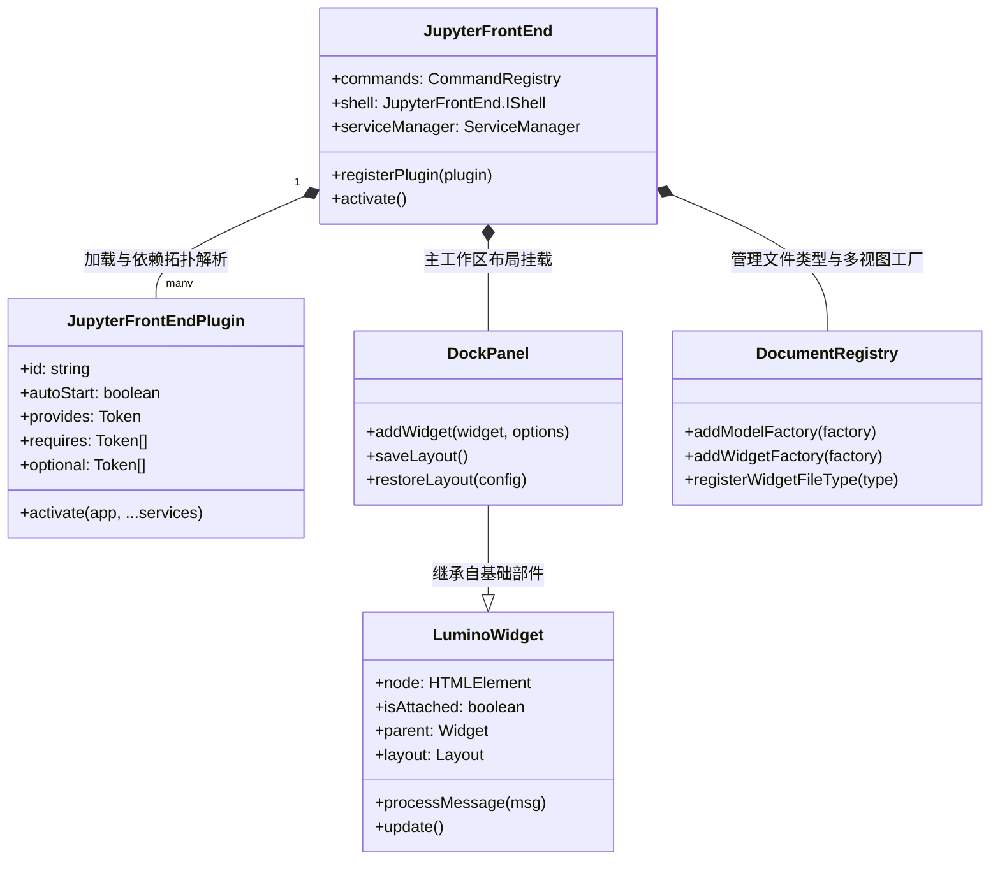
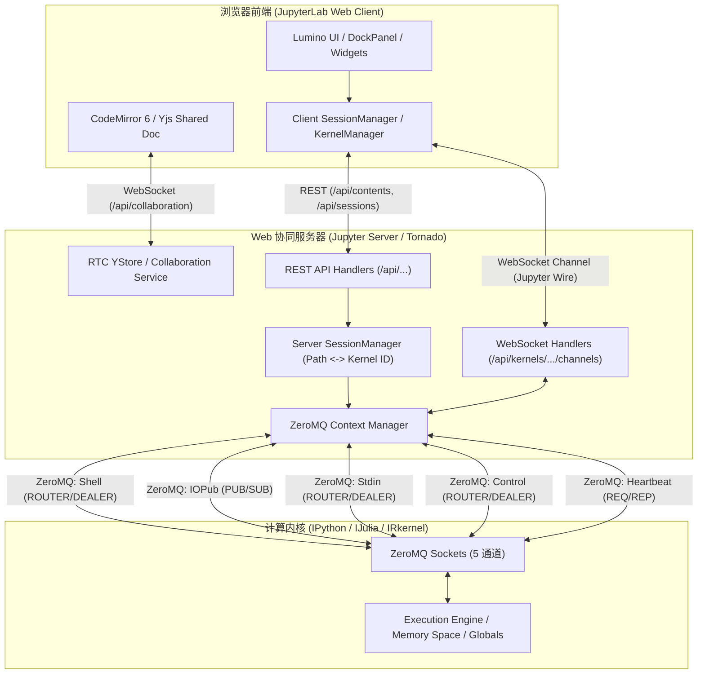
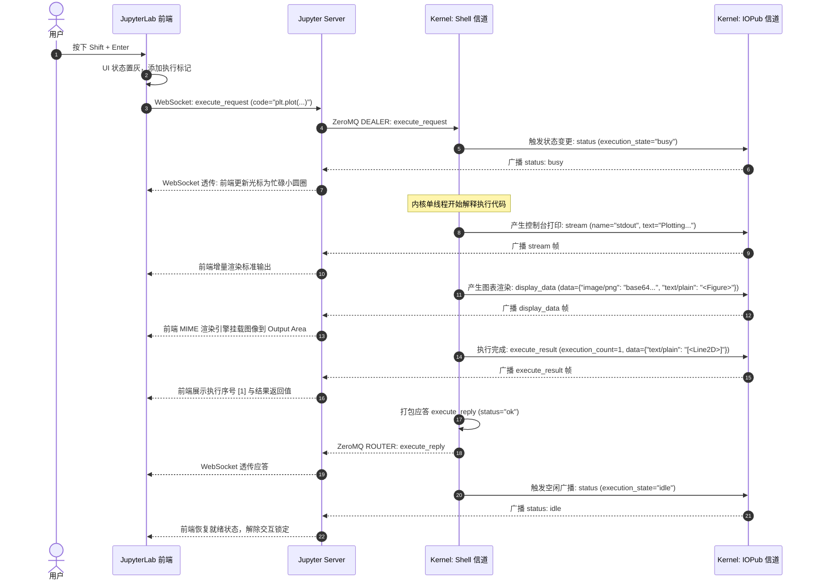
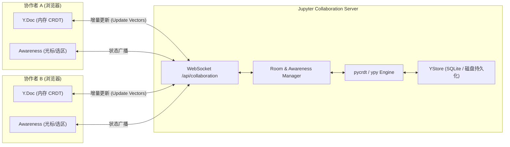
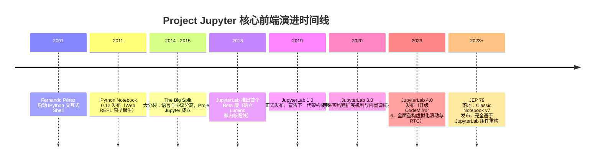

# JupyterLab 深度架构解析：基于浏览器的模块化下一代交互式开发环境（IDE）

- **调研日期**：**2026-10-09**
- **调研目标**：系统性解构并回答「1. JupyterLab 是什么？JupyterLab 是一个基于浏览器的交互式开发环境（IDE）。」，从官方权威定位、底层架构哲学、前后端全栈拓扑与通信协议、核心功能矩阵、前沿关键能力（RTC/LSP/Debugger）到历史演进脉络进行全维度一手学术与架构级深度调研。
- **信息分级标注约定**（全文严格区分）：
  - **【官方】**：来自 Project Jupyter、JupyterLab 官方文档、官方规范及 Jupyter 增强提案（JEPs）原文。
  - **【规范/代码】**：来自 GitHub 官方核心仓库源码、TypeScript 接口定义、Wire Protocol 消息体格式及官方实现。
  - **【推断/实践】**：基于工业界系统设计、现代数据科学工作流实践提炼的架构推断与工程总结。
- **数据取得方式**：Jupyter 官方文档站点（jupyterlab.readthedocs.io、docs.jupyter.org、jupyter-client.readthedocs.io）、JEP 原文库、GitHub 官方核心仓库（jupyterlab/jupyterlab、jupyterlab/lumino、jupyter-server/jupyter_server、ipython/ipykernel）源码核验。

---

## 1. 执行摘要（Executive Summary）

**直接回答核心问题**：
**JupyterLab** 是由 **Project Jupyter** 官方打造的**下一代基于 Web 浏览器的交互式开发环境（Interactive Development Environment / IDE）**。它的本质是为数据科学、科学计算、机器学习及交互式计算工作流设计的**高度模块化、插件化、可自由编排的桌面级前端工作台**。

与传统的“代码编辑器 + 终端”或“单文档 Web 页面”不同，JupyterLab 建立在三大核心支柱之上：
1. **统一的交互式计算抽象（Interactive Computing Abstraction）**：将 Notebook、交互式控制台（Console）、系统终端（Terminal）、富文本编辑器和任意定制化组件置于统一的窗口部件树与事件总线之下，共享底层的语言执行内核（Kernels）；
2. **“万物皆插件”（Everything is an Extension）的微内核架构**：核心自身不包含不可拆卸的特权界面，所有功能组件（包括 Notebook 自身、文件浏览器、主菜单、状态栏）均以 `JupyterFrontEndPlugin` 的形式挂载在 Lumino 依赖注入容器中；
3. **彻底解耦的分布式拓扑**：表现层（浏览器端的 Lumino/TypeScript）、协同服务层（基于 Tornado 的 Python `jupyter_server`）与计算执行层（跨语言的 ZeroMQ Kernel）通过标准化协议解耦，实现计算状态与渲染状态的严格物理隔离。

### 核心开发环境横向对比矩阵

| 维度 | JupyterLab (v4.x) | Classic Notebook (v6 遗留) | Notebook 7.x | VS Code Web / Desktop | Google Colab |
| :--- | :--- | :--- | :--- | :--- | :--- |
| **定位形态** | **模块化交互式 Web IDE**【官方】 | 单文档交互式记事本【官方】 | 基于 JupyterLab 组件的单文档现代记事本【官方】 | 通用多语言代码 IDE【官方】 | 托管式云端数据分析记事本【官方】 |
| **界面布局引擎** | **Lumino DockPanel**（桌面级多窗格停靠、自由分屏、标签页拖拽）【规范/代码】 | 单一线性流动 HTML 页面（基于 Bootstrap/jQuery）【官方】 | 简化版 Lumino 单文档页面（保留单页心智，共享底层组件）【官方】 | VS Code Workbench 布局系统（网格/侧边栏/编辑器组）【官方】 | 定制化 React/Angular 单文档流式面板【官方】 |
| **插件扩展机制** | **运行时模块联邦（Module Federation / Prebuilt Extensions）**【官方】 | 侵入式静态模板注入（nbextensions）【官方】 | 继承 JupyterLab 预构建扩展体系【官方】 | VS Code Extension API（独立进程隔离）【官方】 | 封闭系统（仅支持有限的内置插件与脚本注入）【官方】 |
| **核心交互工作流** | **多视图联动**（Notebook + 联动 Console + 独立输出监控 + 终端）【官方】 | 孤立单文档顺序自上而下交互【官方】 | 经典单文档体验，支持侧边栏折叠工具【官方】 | 文件树驱动，支持 Notebook 视图与纯代码运行【官方】 | 单文档顺序计算为主【官方】 |
| **内核通信协议** | 标准 **Jupyter Wire Protocol**（5 套接字 ZeroMQ / WebSocket 桥接）【官方】 | 标准 Jupyter Wire Protocol【官方】 | 标准 Jupyter Wire Protocol【官方】 | 适配器层转换（Jupyter Extension 转发）【官方】 | 专有 WebSocket 代理层【官方】 |
| **现代协作能力** | **Yjs 原生 CRDT 实时多人协同（RTC）**【官方】 | 不支持（多开冲突覆盖）【官方】 | 支持（借助共享的 `jupyter-collaboration` 模块）【官方】 | Live Share 专有远程协议【官方】 | Google Docs 风格专有 OT/CRDT 协同服务【官方】 |
| **调试支持** | **内核级 DAP 调试器**（JEP 47 原生内置 UI）【官方】 | 仅支持命令行 `pdb`【官方】 | 支持原生内置调试 UI【官方】 | 完整 DAP 协议支持【官方】 | 仅基本变量面板与基础调试【官方】 |

---

## 2. 官方权威定义与本质定位

### 2.1 官方定义词句拆解
在 Project Jupyter 官方架构文档及 JupyterLab 官方手册中，JupyterLab 被明确定义为：

> *"JupyterLab is a next-generation web-based user interface for Project Jupyter which brings all the familiar building blocks of the classic Jupyter Notebook (notebook, terminal, text editor, file browser, rich outputs, etc.) into a flexible and powerful user interface."* —— **Project Jupyter Documentation**【官方】

拆解其官方定义，包含三个关键特质：
1. **Next-Generation（下一代基石）**：旨在彻底替代诞生于 2011 年的单体 Classic Notebook 前端架构，成为未来所有交互式计算、数据分析及可视化研究的标准载体；
2. **Web-based（基于 Web 但具备桌面级能力）**：运行于现代浏览器环境中，但通过底层的专业级 GUI 框架克服了传统 Web 应用“页面滚动与文档孤岛”的限制，提供完全看齐桌面软件的窗口停靠、多任务并发与键盘导航能力；
3. **Flexible & Extensible IDE（灵活可扩展的集成开发环境）**：不再将自身限定为“数字笔记本”，而是将 Notebook 降维为一种文档类型，与控制台、终端、调试器、语言服务（LSP）等共同构成一个全功能 IDE【官方】。

### 2.2 为什么 JupyterLab 是一个“IDE”而非仅仅是“编辑器”？
在传统软件工程定义中，**IDE（集成开发环境）** 必须满足三项核心要件：
- **源代码编辑（Source Code Editing）**；
- **构建/执行自动化与即时反馈回路（Execution & REPL Runtime）**；
- **环境级调试与诊断工具链（Integrated Debugging & Diagnostics）**。

JupyterLab 之所以被定性为 **交互式计算 IDE（Interactive Computing IDE）**，是因为它重构了开发范式：
- **超越文件编辑**：它不仅处理 `.py`、`.r`、`.jl` 等扁平代码文件，还处理富媒体结构的 `.ipynb`（JSON 树形文档，包含代码、富文本、MIME 多模态数据及运行元信息）；
- **探索式计算（Literate Computing / Exploratory Data Analysis）**：它以内存常驻的 Kernel 作为计算实体，用户可以非线性地执行、复现、检查中间变量状态，并将结果直接以内联富媒体（图表、地图、3D 点云、交互式微件）的形式沉浸式持久化；
- **全栈工具链闭环**：在同一个浏览器视窗内，开发者左侧管理工作区与数据仓库（File Browser / Git），中央自由拆分代码与输出（DockPanel），下方挂载与当前 Notebook 共享同一内核命名空间的交互控制台（Console），右侧连接变量检视器与调用栈调试器（Debugger），底部运行系统 Shell 进程（Terminal），从而在单一工作空间内闭环了探索、开发、验证与系统调度的全部环节【官方】。

---

## 3. 核心架构与设计哲学

JupyterLab 系统的构建哲学可以概括为两句话：**“底层皆依赖注入，万物皆插件；顶层皆微内核，布局皆窗口部件树。”**



### 3.1 哲学一：“Everything is an Extension”（万物皆插件）
在 JupyterLab 内部，**核心框架本身几乎只是一个轻量级的微内核骨架（Microkernel Shell）**，不存在任何拥有特权的内置功能【官方】。

#### 1. 插件定义与依赖注入机制
JupyterLab 使用 **Lumino Token 系统**（`@lumino/coreutils`）实现类似 Spring / InversifyJS 的编译期与运行期依赖注入。每个插件均实现标准接口 `JupyterFrontEndPlugin<T>`【规范/代码】：

```typescript
// 规范示例：JupyterLab 插件生命周期与依赖注入声明
export interface JupyterFrontEndPlugin<T> {
  // 全局唯一插件 ID（如 '@jupyterlab/notebook-extension:factory'）
  id: string;
  // 描述信息
  description?: string;
  // 是否在系统启动时无条件自动激活
  autoStart?: boolean;
  // 该插件对外暴露的服务契约（Token）
  provides?: Token<T>;
  // 必须依赖的前置服务 Token 列表（拓扑排序前置节点）
  requires?: Token<any>[];
  // 可选依赖的服务 Token 列表
  optional?: Token<any>[];
  // 激活函数：当所有 requires 服务解析完成时由容器调用
  activate: (app: JupyterFrontEnd, ...services: any[]) => T | Promise<T>;
}
```

- **拓扑依赖解析算法**：在前端启动期，`Application` 实例接收所有被注册的插件，依据 `provides`、`requires` 和 `optional` 构建**有向无环图（DAG）**。如果存在循环依赖或缺失强制依赖，系统将报出显式拓扑异常；解析通过后，按依赖层级拓扑顺序依次异步调用 `activate()`【规范/代码】。
- **微内核构成**：从应用外壳（`IShell`）、文件浏览器（`IFileBrowserFactory`）、主菜单栏（`IMainMenu`）、状态栏（`IStatusBar`），到 Notebook 面板本身（`INotebookTracker`），全都是遵循上述契约的平行插件【官方】。这意味着企业或开发者可以通过替换某个 Token 的 Provider 插件，无缝替换掉 JupyterLab 的核心行为（如用自定义的云端文件存储浏览器替换本地文件系统）。

#### 2. 扩展构建分发模式演进
- **JupyterLab 1.x / 2.x（源码编译打包模式）**：
  早期扩展需要用户在宿主机安装 Node.js/npm 环境。安装扩展时，Python 后端在后台拉取 npm 包，并触发本地 Webpack 全量重新编译（Rebuild & Bundle），导致容器镜像膨胀、安装耗时极长（数分钟），且常因前端依赖冲突导致编译崩溃【官方】。
- **JupyterLab 3.x / 4.x（预构建联邦扩展 Prebuilt / Federated Extensions）**：
  自 JupyterLab 3.0 开始全面拥抱 **Webpack 5 模块联邦（Module Federation）**【官方】。扩展编译为符合规范的静态 assets（JavaScript bundle + 共享依赖清单），直接打包在 Python Wheel 包中通过 `pip install` 分发。JupyterLab 启动时由后端扫描扩展清单（federated extensions manifest），前端在浏览器运行时按需动态加载（Async Dynamic Import），**无需本地 Node.js 参与，秒级安装生效**【官方】。

---

### 3.2 哲学二：前端组件基石——Lumino（原 PhosphorJS）
标准 HTML/DOM 及现代前端框架（如 React/Vue）设计初衷是面对“网页与表单流式布局”，当面对类似 Eclipse/Visual Studio 的高度复杂的窗口停靠、拆分拖拽、菜单级联和超大虚拟滚动时，往往性能崩溃或缺乏成熟的布局算力。Project Jupyter 团队为此专门自研并演化出了 **Lumino** 框架（前身为 PhosphorJS）【官方】。

#### 1. 核心构件剖析
- **`@lumino/widgets`（部件树体系）**：
  - **`Widget` 基础类**：封装了对原始 DOM 节点的强类型生命周期托管（`onAfterAttach`, `onBeforeDetach`, `onUpdateRequest`, `onResize`）。Widget 树形成了虚拟的消息传递链路，避开全局 DOM 操作带来的性能颠簸【规范/代码】。
  - **`DockPanel`（停靠面板）**：JupyterLab 主工作区的绝对核心。通过自研的绝对定位分屏与拖拽计算算法，支持将任意 Widget 拖拽为上下左右停靠、标签页合并（Tabbed Docking）以及绝对悬浮窗，具备保存与序列化布局状态（Layout State）的能力【规范/代码】。
  - **`SplitPanel` 与 `BoxPanel`**：提供高精度的可折叠、可缩放侧边栏布局支持。
- **`@lumino/signaling`（类型安全信号系统）**：
  实现了经典的 **Qt 风格 Signal/Slot（信号与槽）机制**。相比 EventEmitter，Lumino 的 `Signal<Sender, Args>` 实现了发布者与订阅者的强类型类型推导，有效避免了弱类型字符串事件导致的悬空监听和内存泄漏，是整个 JupyterLab 内部模块间解耦通信的核心媒介【规范/代码】。
- **`@lumino/commands`（命令总线）**：
  提供中央命令注册表（`CommandRegistry`）。每一个操作（如 `notebook:run-cell`、`filemenu:save`）被抽象为一个唯一的命令 ID，统管该命令的执行函数（`execute`）、是否可用判定（`isEnabled`）、是否可见（`isVisible`）、标签标题及全局快捷键绑定，实现 UI 表现（菜单、工具栏、右键面板、快捷键）与具体业务实现的解耦【规范/代码】。

---

### 3.3 哲学三：响应式状态与文档多模型体系（DocumentRegistry）
在 JupyterLab 中，**“数据模型（Model）”与“视图表现（Widget View）”是严格一对多绑定的**【官方】。

- **`DocumentRegistry`**：系统全局文档注册中心。每种文件扩展名（如 `.ipynb`、`.csv`、`.md`、`.png`）都可注册多个与之关联的 `ModelFactory` 和 `WidgetFactory`【规范/代码】。
- **多视图联动机制（Multiple Views on Single Model）**：
  当一个文件被打开时，底层实例化一个共享的 `DocumentModel`。用户可以针对同一个 `.ipynb` 文件，右键开启一个常规的 Notebook Widget，同时再开启一个“Markdown Editor”或者“Raw JSON Editor”。由于它们底层订阅了同一个 Model 的状态变化，**在任意一个视图中的输入将实时镜像到另一个视图中**，构建起真正的数据驱动工作台【官方】。

---

## 4. 前后端全栈拓扑与通信协议

JupyterLab 采用典型的客户端-服务端分离拓扑，逻辑上分为三层：**浏览器端前端（Client UI）**、**Web 支撑服务器（Jupyter Server）**、以及**计算执行引擎（Kernel）**。



### 4.1 浏览器与 Jupyter Server 的双通道交互
前端与 Tornado Web Server（`jupyter_server`）之间通过两种通信机制连接：

1. **RESTful API 矩阵（无状态资源管理）**【官方】：
   - `/api/contents`：对标操作系统的文件抽象层，处理文件的读取、写入、重命名、检查点（Checkpoints）保存，支持插拔式存储引擎（如将文件存入本地磁盘、S3 或数据库）；
   - `/api/sessions`：管理文档与计算内核的映射绑定，维护 `{id, path, type, kernel: {id, name}}` 的活跃关联；
   - `/api/kernels`：内核实例的轮询、启停、重启控制；
   - `/api/terminals`：系统终端子进程（PTY）的生命周期管理；
   - `/api/workspaces` & `/api/settings`：前端 UI 停靠布局与插件配置选项的持久化存储。
2. **WebSocket 隧道（长连接双向流）**【官方】：
   - `/api/kernels/<kernel-id>/channels`：核心信道。Jupyter Server 将底层的 ZeroMQ 报文打包为 JSON / 二进制帧，通过此 WebSocket 全双工透传给前端；
   - `/terminals/websocket/<terminal-id>`：xterm.js 前端与宿主机 PTY 子进程之间的字符双向流；
   - `/api/collaboration/room/...`：实时协同（RTC）专用的 Yjs 增量更新与 Awareness 广播通道。

---

### 4.2 Jupyter 线路消息协议（Wire Messaging Protocol）
前端与 Kernel 之间的真正对话遵循标准化、语言无关的 **Jupyter Messaging Protocol**（当前规范版本为 v5.x）【官方】。

#### 1. 报文物理结构
每一条协议消息由五个不可拆分的 JSON 字典组成，并外挂若干二进制缓冲区（Buffers）与安全哈希【官方】【规范/代码】：
```json
{
  "header": {
    "msg_id": "993a4c51-4e92-4919-86f7-b28e622b7a3a",
    "username": "jupyterlab_user",
    "session": "f8a0e28d-d557-41ec-b27b-eef4dc7f3112",
    "msg_type": "execute_request",
    "version": "5.3",
    "date": "2026-10-09T02:30:00.000Z"
  },
  "parent_header": {
    /* 关联的上游请求 Header，用于跟踪异步请求调用链 */
  },
  "metadata": {
    /* 包含界面环境、Cell ID、执行标签等元数据 */
  },
  "content": {
    /* 强类型消息负载，按 msg_type 变化 */
    "code": "import numpy as np\nnp.arange(5)",
    "silent": false,
    "store_history": true,
    "user_expressions": {},
    "allow_stdin": true,
    "stop_on_error": true
  },
  "buffers": [ /* 二进制数据流，如 Arrow 内存块或原始图像字节 */ ]
}
```
- **HMAC 安全机制**：在 ZeroMQ 传输时，消息各部分之间使用 SHA-256 HMAC 密钥签名，防止在多用户或共享网络环境中发生未授权代码执行【官方】。

#### 2. ZeroMQ 经典的五大套接字通道（The 5 Socket Channels）
Jupyter Server 与 Kernel 之间由 ZeroMQ 维系的 5 个套接字构成了高并发、低延迟的通信基石【官方】：

| 套接字信道 | ZeroMQ 模式 | 传输方向 | 核心消息类型（`msg_type`）与架构职责 |
| :--- | :--- | :--- | :--- |
| **Shell** | `ROUTER` (Kernel) <br>`DEALER` (Server) | 双向请求/响应 | `execute_request`/`reply`（执行代码）、`inspect_request`/`reply`（悬浮内省/文档查询）、`complete_request`/`reply`（代码补全）、`kernel_info_request`/`reply`（内核协议握手）。支持队列调度，单线程顺序执行以保证计算上下文一致性【官方】。 |
| **IOPub** | `PUB` (Kernel) <br>`SUB` (Server) | 单向广播（内核 -> 前端） | `stream`（stdout/stderr 标准流输出）、`display_data`（富多媒体中间呈现）、`update_display_data`（原地更新已渲染图表）、`execute_result`（单元格最终表达式求值）、`status`（`busy`/`idle`/`starting` 状态机广播）、`error`（异常抛出与调用回溯栈）。所有连入客户端均可无差别监听【官方】。 |
| **Stdin** | `ROUTER` (Kernel) <br>`DEALER` (Server) | 反向请求/响应（内核 -> 前端 -> 内核） | `input_request`/`reply`。当用户在代码中调用 `input("Enter name: ")` 或命令行密码提示时，内核阻塞当前计算并反向发起输入请求，等待前端模态框输入并返回数据后方才恢复执行【官方】。 |
| **Control** | `ROUTER` (Kernel) <br>`DEALER` (Server) | 双向高优先级通道 | `interrupt_request`/`reply`（中断正在死循环的计算，脱离被阻塞的 Shell 队列）、`shutdown_request`/`reply`（内核优雅退出）、`debug_request`/`reply`（**JEP 47 调试适配器协议，断点与步进控制**）【官方】。 |
| **Heartbeat** | `REQ` (Server) <br>`REP` (Kernel) | 探活心跳检测 | 超轻量级原始字节 ping/pong。当 Server 连续多次未收到心跳响应时，立即向前端判定内核已崩溃（Kernel Dead），并触发重启恢复流程【官方】。 |

---

### 4.3 经典执行生命周期时序图
一次典型的“单元格执行”在整个全栈协议中的完整时序如下：



---

### 4.4 富媒体渲染机制（MIME Bundle Architecture）
Jupyter 交互体验的核心竞争力在于其**多模态输出能力（Rich Display Output）**【官方】。
- 当 Kernel 返回数据时，并非简单返回字符串，而是封装为一个 **MIME Bundle（MIME 字典集）**：
  ```json
  {
    "text/plain": "Figure(800x600)",
    "text/html": "<div class='graph-render'>...</div>",
    "image/png": "iVBORw0KGgoAAAANSUhEUgAA...",
    "application/vnd.jupyter.widget-view+json": {
      "version_major": 2,
      "model_id": "a90b4d..."
    }
  }
  ```
- **MimeRenderer 优先级仲裁**：
  JupyterLab 前端维护了一个 **MimeRenderer 注册表**，定义了严格的 MIME 优先级权重。系统遍历输出数据，选择当前环境支持的**最高保真度（Highest Fidelity）渲染器**【官方】。
  - 例如：若包含 IPyWidgets 模型 ID，优先激活交互式前端微件（如动态滑动条）；若环境不支持，优雅降级（Graceful Degradation）回退到 `text/html`；若仍不支持，退化至 `image/png` 静态图；最底线降级到 `text/plain` 纯文本，确保任何环境下输出均安全可见【官方】。

---

## 5. 核心功能矩阵与多模型联动

JupyterLab 不仅是单一 Notebook 文件的承载器，它通过一套完备的功能矩阵构筑了闭环的交互式开发体验。

### 5.1 核心组件功能矩阵

| 组件 | 对应插件/接口 | 核心架构特性与工业价值 |
| :--- | :--- | :--- |
| **Notebook** | `@jupyterlab/notebook` <br>`INotebookTracker` | **计算与叙事混合文档**。基于 `nbformat` 规范，集成 CodeMirror 6 编辑器。单元格支持代码（Code）、说明（Markdown）与非格式化文本（Raw）。支持单单元格多类型输出独立折叠、代码行号、快捷键批处理【官方】。 |
| **交互控制台 (Code Console)** | `@jupyterlab/console` <br>`IConsoleTracker` | **传统 REPL 的现代进化**。不同于传统终端单一文本行，Console 单元格同样享受完整的语法高亮、自动补全与多行缩进。支持“历史代码浏览”和与同一 Kernel 的即时试错探索【官方】。 |
| **系统终端 (Terminal)** | `@jupyterlab/terminal` <br>`ITerminalTracker` | **原生 Shell 访问**。基于 xterm.js 构建，在宿主操作系统层面直接运行 Bash/Zsh/PowerShell，支持完整的颜色转义、Vim/Emacs/Top 等终端程序运行，无需跳出浏览器【官方】。 |
| **文件管理器 (File Browser)** | `@jupyterlab/filebrowser` <br>`IFileBrowserFactory` | **虚拟化文件与存储网关**。支持文件上传、下载、重命名、文件树过滤。底层对齐 Contents API，可映射本地目录、远端挂载卷或对象存储【官方】。 |
| **文本编辑器与预览** | `@jupyterlab/fileeditor` <br>`@jupyterlab/markdownviewer` | **多语言代码与文档工作区**。支持主流语言高亮，支持 Markdown 实时双向联动渲染预览，支持 CSV/TSV 电子表格虚拟网格化查看与交互筛选【官方】。 |
| **多标签停靠主壳 (DockPanel)** | `@lumino/widgets` <br>`IShell` | **全自由度桌面级窗口编排**。支持视窗任意切分、拖拽成浮动窗口、多文档并列对比，并支持工作区状态（Workspaces URL）保存与分享【官方】。 |

---

### 5.2 跨文档与多模型协同联动能力
JupyterLab 区别于普通 Web 笔记本的最显著特征在于其**跨组件的组合性（Composability）**【官方】：

1. **Notebook 与 Code Console 联动（One Kernel, Two Windows）**：
   开发者常常担心在 Notebook 中随意写入临时探查代码（如 `df.head()`, `df.info()`）会导致单元格执行序号混乱、文档被脏代码污染。
   在 JupyterLab 中，开发者可以为当前运行的 Notebook **一键挂载一个附随控制台（New Console for Notebook）**。控制台与 Notebook **完全共享同一内存空间与全局变量**。开发者可在控制台内任意实验变量，完全不打乱 Notebook 自身的陈述结构【官方】。
2. **单元格发送执行（Run Code from Editor in Console）**：
   在纯 Python 脚本（`.py`）或 Markdown 代码块中，用户可通过 `Shift + Enter` 将选中的代码行直接发送至后方的交互式控制台执行，赋予传统扁平代码文件即时反馈的 REPL 体验【官方】。
3. **独立输出视图（Create New View for Output）**：
   对于包含持续动态图表刷新、大模型生成输出、或训练监控面板（如 TensorBoard / Matplotlib 动图）的单元格，用户可右键选择将其输出**剥离为一个独立的 DockPanel 标签页**。在滚动阅读上方繁长文档的同时，该监控窗口始终固定在侧边栏保持实时渲染更新【官方】。

---

## 6. 现代前沿能力深度剖析

自 JupyterLab 3.0 与 4.0 演进以来，系统吸收了现代 IDE 领域的三大前沿能力：**实时协作（RTC）**、**语言服务协议（LSP）**、以及**内核级可视化调试器（Debugger）**。

### 6.1 实时协同系统（Real-Time Collaboration, RTC）



#### 1. 架构演进与 Yjs 技术选型
在早期版本中，多人同时打开同一个 Notebook 会发生致命的覆盖写入冲突（Last-Write-Wins 覆盖前人成果）。
在现代 JupyterLab（v4.x + `jupyter-collaboration`）中，官方彻底采用了 **CRDT（Conflict-free Replicated Data Types，无冲突复制数据类型）** 技术，全面集成由 Kevin Jahns 发起的 **Yjs 协议**【官方】。
- **前端栈**：`@jupyter/ydoc`，将 Notebook 的 Cells 数组、Metadata 字典、Cell 内容分别建模为 `Y.Array`、`Y.Map`、`Y.Text`【规范/代码】。
- **后端栈**：采用高性能 Rust 绑定或 C++ 核心的 Python 库 **`pycrdt`（前身为 `ypy`）**，在 `jupyter_server` 后端同步维护一份影子 CRDT 文档状态，并接入 `YStore` 持久化引擎（如写入 SQLite 或磁盘）【规范/代码】。

#### 2. JEP 62 的关键基石作用
实现 Notebook 协同的最关键痛点是单元格的重排与定位。在传统 `nbformat` 结构中，Cell 仅仅是数组中的一个索引项。如果两个人同时插入或删除单元格，会导致整个文档树索引混乱。
**JEP 62（Cell ID Addition to Notebook Format）** 规定：每个单元格必须拥有全局唯一的不可变 `id` 属性（UUID 风格字符串）【官方】。
这使得 CRDT 能够精确追踪每个单元格的移动、合并、删除，甚至在网络严重分区断网的情况下，重连后依然能通过因果时间戳和状态向量（State Vector）完成**确定性的最终一致性自动合并**【官方】。

#### 3. 意识状态（Awareness Protocol）
RTC 系统通过 WebSocket 广播轻量级 ephemeral 状态：包括协作者的当前在线清单、自定义用户名与分配的高亮颜色、当前激活的单元格焦点框、以及文字光标与文本选区（Selections），达成完全等同于 Google Docs 或 Figma 的协作质感【官方】。

---

### 6.2 语言服务协议（Language Server Protocol, LSP）集成

在大型代码库中，开发者对跳转到定义（Go-to-Definition）、智能上下文感知补全、全局符号重命名及实时 Linter 警告有强烈刚需。JupyterLab 通过 `@jupyter-lsp/jupyterlab-lsp` 模块接入了微软主导的 **LSP（Language Server Protocol）** 标准【官方】。

#### 核心技术难点与“虚拟文档”（Virtual Document）机制
LSP 规范原本是为“传统的连续单文件源代码”（如一个扁平的 `.py` 文件）设计的，而 Notebook 却是由零散分布的几十个单元格切片（Code Cells）构成的，中间还夹杂着 Markdown 单元格以及特有的 IPython 魔法命令（如 `%timeit`, `!pip install`）。

为了攻克这一鸿沟，JupyterLab LSP 实现了一套高度精密的**虚拟文档映射引擎（Virtual Document Mapping Engine）**【规范/代码】：
1. **代码合并与提取**：在后台，前端将所有代码单元格按执行顺序拼接为一个内存中的单一虚拟源文件；
2. **语法屏蔽（Magics Shimming）**：将 IPython 专有的 `%` 或 `!` 魔法命令替换为等长、等字符跨度的 Python 合法占位符（如 `get_ipython().run_line_magic(...)`），确保 Python 语言服务器解析 AST 时不抛出语法错误；
3. **坐标双向投影（Bidirectional Coordinate Projection）**：
   - 语言服务器返回的行号列号是在整个“虚拟合并文件”上的（例如：第 340 行，第 12 列）；
   - LSP 适配器拦截该坐标，通过区间查找树将其逆向映射计算出对应的“Notebook 第 5 单元格，第 8 行，第 12 列”；
   - 最终在精准对应的 CodeMirror 单元格内绘制红色波浪线或弹出补全气泡【规范/代码】。

---

### 6.3 内核级交互式调试器（Integrated Debugger）

在 JupyterLab 3.0 之前，调试 Notebook 只能使用极其原始的 `import pdb; pdb.set_trace()` 命令行拦截。现代 JupyterLab 原生内置了桌面级可视化调试器【官方】。

#### 1. JEP 47：Jupyter 调试器协议与 DAP 桥接
微软创建的 **DAP（Debug Adapter Protocol）** 构成了现代 IDE 调试的前端通用标准。然而，Jupyter 的通信拓扑并不允许前端直接通过 TCP Socket 绕过中间件直连 Python 调试子进程。
为此，Project Jupyter 批准并实施了 **JEP 47（Jupyter Debugger Protocol）**【官方】：
- **信道复用**：将 DAP 的 JSON 请求包裹在 Jupyter 核心协议的 **Control 套接字通道** 中（`msg_type: debug_request`, `content: {type: "request", command: "setBreakpoints", ...}`）【官方】；
- **事件广播**：将断点命中、线程挂起等 DAP 事件通过 **IOPub 信道** 广播（`msg_type: debug_event`, `content: {type: "event", event: "stopped", ...}`）【官方】；
- **全生态内核支持**：任何支持 JEP 47 的内核（如基于 `debugpy` 的 `ipykernel 6.0+`、以及原生 C++ 实现的 `xeus-python`）均能直接激活 JupyterLab 的图形调试界面【官方】。

#### 2. JEP 93：调试态与 REPL 的状态融合（`copyToGlobals`）
在传统调试器中，当断点命中时，程序完全暂停在局部堆栈帧（Frame）中，无法进行其他全局交互。
**JEP 93** 针对数据科学工作流专门扩展了 `copyToGlobals` 指令【官方】。它允许开发者在命中复杂函数内部的断点时，一键将当前堆栈帧内的局部变量（如未对齐的高维 Tensor）深拷贝提取至外层全局命名空间，使得用户可以在 Notebook 底部另起单元格，使用这组现场捕获的数据自由编写数据可视化代码，**彻底将“被动停滞的调试”与“主动探索的 REPL”合二为一**【官方】。

---

## 7. 演进脉络与技术选型对比

JupyterLab 并非凭空诞生的产物，它是整个 Project Jupyter 在面对架构老化时自我革命的演进终点。

### 7.1 演进四部曲历史脉络


1. **第一阶段：IPython Notebook 单体原型时代（2011）**：
   Fernando Pérez、Brian Granger 与 Min Ragan-Kelley 等人将 Mathematica 的“笔记本文档”心智引入开源世界。最初前端作为 IPython 仓库内部的一个子模块实现，代码与 Python 强绑定【官方】。
2. **第二阶段：The Big Split（大分裂）与 Classic Notebook 黄金时代（2014-2015）**：
   由于社区涌现出在 Notebook 中运行 Julia、R、Scala、C++ 的强烈诉求，项目经历“大分裂”：执行内核与核心语言拆分为各个语言包（如 `ipykernel`），前端协议抽象为 `jupyter` 系列包。Classic Notebook（v1 到 v6）成为全球数据科学事实上的行业标准，但其前端代码积累了大量基于 jQuery、Bootstrap 的直接 DOM 胶水代码，技术债急剧累积【官方】。
3. **第三阶段：JupyterLab 重塑下一代标准（2015 研发，2019 1.0 发布）**：
   社区意识到单文档界面无法承载现代科研对多任务、控制台、终端协同的复杂需求，决定彻底重写前端，PhosphorJS（后更名为 Lumino）与全新微内核插件体系诞生，经过数年打磨推出 JupyterLab【官方】。
4. **第四阶段：JEP 79 与底层大一统（2023+）**：
   虽然 JupyterLab 功能完备，但许多教育界及轻量级用户依然留恋 Classic Notebook 那种“打开即是一个简单文档”的极简心智，导致社区长期存在“分裂维护两条庞大技术路线”的负担。
   **JEP 79（Build Jupyter Notebook v7 off of JupyterLab components）** 终结了这一分歧：直接废弃掉所有历史 jQuery/Bootstrap 遗留代码，**将 Notebook 7.x 变成基于 JupyterLab 组件配置出来的“轻量单文档发行版”**（由 RetroLab 原型孵化而来）【官方】。从此，Classic Notebook 界面与 JupyterLab 在底层技术栈上彻底统一。

---

### 7.2 为什么 Classic Notebook 最终被淘汰？技术选型分歧的深度复盘

| 架构对比维度 | 经典 Classic Notebook (v1 - v6) | JupyterLab (v1 - v4) 与 Notebook 7.x | 淘汰与重构的技术根源分析 |
| :--- | :--- | :--- | :--- |
| **底层渲染驱动** | **直接 DOM 拼接 + jQuery 选择器**【规范/代码】 | **Lumino 部件生命周期 + 虚拟分发**【规范/代码】 | 经典版随着 Cell 数量增长（如上千单元格），页面发生严重的 DOM 节点爆炸，导致浏览器渲染主线程卡死崩溃；现代版采用 CodeMirror 6 与虚拟化局部滚动挂载，大幅减轻 DOM 负担【官方】。 |
| **样式与布局** | **Bootstrap 3 网格**，死板单列垂直流【官方】 | **Lumino 绝对计算 DockPanel / SplitPanel**【官方】 | 经典版无法原生并列对比两个文档，无法拖拽视窗；现代版具备桌面级窗口系统的完整能力【官方】。 |
| **模块解耦粒度** | **单体庞大页面对象**（全局挂载 `IPython.notebook` 单例）【规范/代码】 | **微内核依赖注入（Token DI System）**【规范/代码】 | 经典版任何扩展都可以随意破坏全局对象，插件之间缺乏隔离与契约定义，极易互相踩踏冲突；现代版面向接口编程，依赖关系在编译期与拓扑期严格受控【官方】。 |
| **插件部署方式** | **`nbextensions` 静态文件硬拷贝与模板篡改**【官方】 | **Webpack 5 Module Federation 动态联邦**【官方】 | 经典版的扩展安装依赖 Python 脚本去修改 Tornado 模板和静态资源目录，升级极易损毁；现代版预构建扩展无需污染全局资产，安全独立加载【官方】。 |
| **状态机与文档** | **视图强耦合内部结构**【规范/代码】 | **`DocumentRegistry` + Yjs CRDT 数据流**【官方】 | 经典版完全无法支撑多人同时编辑协作；现代版数据与视图解耦，为实时协同、多视图观察打下了绝对基石【官方】。 |

---

## 8. 调研结论与架构启示

综合上述一手官方来源与技术全栈深度剖析，我们可以得出以下三条核心架构启示与总结：

1. **JupyterLab 的本质定位不是单纯的代码编辑器，而是“交互式计算的操作平台”**：
   它成功地将科学计算的核心要素——**流式叙述（Markdown 文档）、执行引擎（内核状态）、即时反馈（富 MIME 多媒体）、以及系统控制（控制台与终端）**，收敛并统一在由 Lumino 强力驱动的单页面桌面级 Web 工作台内。
2. **“微内核 + 依赖注入”是解耦超大型前端工程的终极范式之一**：
   JupyterLab 不把自身任何一个核心 UI 视作理所当然的特权构件，而是全量下放为 `JupyterFrontEndPlugin`。这种“万物皆插件”的克制与严密性，使得它既能收敛演化为极其轻量专注的教育产品（如 Notebook 7 / RetroLab），也能横向扩展为整合 Git、LSP、DAP 调试、以及企业专有资产中台的工业级重型数据科学开发底盘。
3. **计算与界面的彻底物理隔离保障了工业级系统的高容错性**：
   前端 UI 无论如何因海量数据渲染发生卡顿、崩溃或网络断连，后端的计算内核（Kernel）始终在独立的宿主进程或容器集群中静默运算；通过标准化且经过十余年工业界验证的 **Jupyter Wire Protocol（ZeroMQ 5 通道机制）**，使得整个系统具备极高的分布式韧性。这一优雅的架构体系确立了其作为全球现代探索式数据科学首选 IDE 的基石地位。

---

## 9. 一手权威引用清单（Primary Sources & References）

1. **Project Jupyter 官方顶层架构规范与文档**：
   - Project Jupyter Architecture Overview: <https://docs.jupyter.org/en/latest/projects/architecture/content-architecture.html>
   - Jupyter Messaging Protocol Specification (v5.3+): <https://jupyter-client.readthedocs.io/en/latest/messaging.html>
2. **JupyterLab 官方技术手册与仓库**：
   - JupyterLab Official Documentation: <https://jupyterlab.readthedocs.io/>
   - JupyterLab Extension Developer Guide: <https://jupyterlab.readthedocs.io/en/stable/extension/extension_dev.html>
   - JupyterLab GitHub Monorepo (`jupyterlab/jupyterlab`): <https://github.com/jupyterlab/jupyterlab>
3. **Lumino 前端组件与窗口布局框架**：
   - Lumino Documentation & GitHub Repository (`jupyterlab/lumino`): <https://github.com/jupyterlab/lumino>
   - Lumino Widgets & DockPanel API: <https://jupyterlab.github.io/lumino/widgets/classes/dockpanel.html>
4. **Jupyter 增强提案（Jupyter Enhancement Proposals, JEPs）**：
   - **JEP 47: Jupyter Debugger Protocol**: <https://github.com/jupyter/enhancement-proposals/blob/master/jupyter-debugger-protocol/jupyter-debugger-protocol.md>
   - **JEP 62: Cell ID Addition to Notebook Format**: <https://github.com/jupyter/enhancement-proposals/blob/master/cell-id/cell-id.md>
   - **JEP 79: Build Jupyter Notebook v7 off of JupyterLab components**: <https://github.com/jupyter/enhancement-proposals/blob/master/notebook-v7/notebook-v7.md>
   - **JEP 93: Debugger Support to copyToGlobals**: <https://github.com/jupyter/enhancement-proposals/pull/93>
5. **实时协同与网络核心依赖库**：
   - Jupyter Collaboration (`jupyterlab/jupyter-collaboration`): <https://github.com/jupyterlab/jupyter-collaboration>
   - Yjs CRDT Framework: <https://yjs.dev/>
   - Jupyter Server Documentation: <https://jupyter-server.readthedocs.io/>
