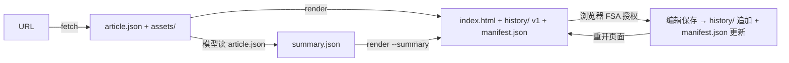

# Design Document

## Overview

新建可复用 skill `sh-web-archive`：输入无需鉴权的网页 URL，脚本抓取正文并本地化全部图文音视频资源，产出**目录形态**静态存档（`index.html` + `assets/` + `history/` + `manifest.json`）；页面左侧三主 tab（原文 / AI 总结 / 可编辑页面），每主 tab 下有子 tab 展示编辑历史（倒序、最新第一）；编辑经浏览器 File System Access API 写回存档目录，形成不可变版本链。总结内容由模型写 `summary.json` 注入，脚本只做确定性渲染。

## Context

- 既有同类实现 `sh-lark-chat-archive`（`C:\Users\29580\.agents\skills\sh-lark-chat-archive\`）：聊天记录 → **单文件** HTML 存档（base64 内嵌图）。本次是网页文章 → **目录**存档，资源走文件而非内嵌，因此可以去掉 Pillow 压缩依赖，图片原样保存。
- 保存机制参照其页内编辑器：`showSaveFilePicker`（FSA）优先、`a[download]` 降级（build_archive.py L532-564 已验证此模式）。目录形态需要升级为 `showDirectoryPicker` + directory handle 持久写。
- 排版与写作纪律复用其 `references/design-rules.md`（纸底噪点、衬线、朱砂、去 AI 味禁止清单），针对网页存档改写一份。
- skill 结构遵循 skill-creator 规范：`SKILL.md` + `scripts/` + `references/`，渐进披露。

## Goals and Non-Goals

- Goals:
  - 任何服务端渲染的公开网页（微信/博客/新闻）一键产出离线可看的三 tab 存档目录
  - 编辑留痕：每次保存生成不可变历史版本，子 tab 倒序浏览
  - 首个目标：Jev 模型微信文章（已验证匿名可访问）
- Non-Goals:
  - JS 渲染的 SPA 站点（检测到正文过少时明确报错，不做无头浏览器）
  - 需鉴权页面（拒绝，不绕过）
  - 音视频转码压缩、单文件 HTML 产物、分发动作（需求已排除）
  - skill-creator 的完整量化 eval 流水线（本次以真实任务验收代替，见 Design Review Notes）

## Detailed Design

### 技术栈（锁定）

- 脚本：Python 3.11+，PEP 723 内联元数据，`dependencies = ["beautifulsoup4"]`（HTML 解析，html.parser 后端），其余全标准库；`uv run` 执行。
- 页面：零依赖原生 HTML/CSS/JS，无 CDN、无构建，`file://` 直开。
- 运行环境要求：Chrome/Edge 获得完整编辑功能；Firefox/Safari 只读（无 FSA，页面明确提示）。

### 模块一：skill 本体（安装于 `C:\Users\29580\.agents\skills\sh-web-archive\`，与 sh-lark-chat-archive 同库）

- `CREATED` SKILL.md
    - **Purpose** skill 入口：触发条件（用户给 URL 要"总结这个网页/存档这篇文章/做成三 tab 页面"）、七步工作流、审批门
    - **Changes** YAML frontmatter（name/description，description 按 skill-creator 建议写得 pushy）+ 工作流：①接 URL → ②`fetch` → ③模型读 article.json 写 summary.json（先读 references/design-rules.md）→ ④`render` → ⑤chrome-devtools 打开交付 → ⑥用户反馈改 JSON 重跑 render；安全门：鉴权拒绝如实上报、不做绕过。**写明两处同名目录的职责区别**：`C:\Users\29580\.agents\skills\sh-web-archive\` 是 skill 本体（代码），`%APPDATA%\agents-skills\sh-web-archive\` 是存档产物根目录（数据）
    - **Complexity** Low
- `CREATED` scripts/build_archive.py
    - **Purpose** 确定性管线：抓取、资源本地化、渲染（详见模块二）
    - **Complexity** High
- `CREATED` references/design-rules.md
    - **Purpose** 去 AI 味排版规范 + 网页总结写作纪律（从 sh-lark-chat-archive 版改写：纸底/衬线/朱砂/禁止清单保留；编后记纪律改为"文章总结纪律"——主题分节、引原文、成段不成列、禁套话、数字具体化）
    - **Complexity** Low

### 模块二：build_archive.py（两个子命令，fetch 与 render 解耦）

- `CREATED` build_archive.py 之 `fetch --url <URL> [--title <标题>] [--dir <子目录名>]`
    - **Purpose** 网络阶段：鉴权筛选 → 抓取 → 资源下载 → 结构化中间产物
    - **Changes**
        1. 输入校验：URL scheme ∈ {http, https} 且长度 < 2000，否则 `bad_url` 拒绝（退出码 2）。
        2. 目标目录：`%APPDATA%\agents-skills\sh-web-archive\{YYYY-MM-DD 标题}\`（`--dir` 覆盖；目录名清洗 `[\\/:*?"<>|]` → `_`、strip 结尾空格与点、截 60 字符；**目录已存在则报错退出**，防覆盖编辑产物，提示用 `--dir` 换名）。
        3. 匿名 GET（浏览器 UA，无 Cookie，30s 超时，urllib；网络错误/5xx 重试 1 次）。鉴权判定（FR1）：HTTP 401/403 → `auth_required` 拒绝；200 但正文为空且含登录特征（`<input type=password>`、URL 含 login/passport）→ `login_wall` 拒绝；微信环境异常页（正文空 + 提示文案）→ `blocked_by_site` 拒绝。拒绝时不创建目录、退出码 1、stderr 给可读错误。
        4. 正文提取三级：①微信特化（`#js_content`，图片取 `data-src`，`mpvoice` 取 `voice_encode_file_digest`）②`<article>`/`main`/`[role=main]` ③文本密度最大的 div（子元素文本量/标签数得分最高者）。提取文本 < 200 字 → `extract_failed`（提示可能为 SPA）。
        5. 元数据：标题（`og:title` > `<title>` > `#activity-name`）、作者（`og:article:author`/微信公众号名）、发布时间（`og:article:published_time`/`em#publish_time`）、原文 URL、抓取时间。
        6. 资源下载到 `assets/`（收集规则**全站统一**：img 的 `data-src`/`data-original` 优先于 `src`，适配懒加载站点）：图片按出现序 `img-001.<ext>`；`<audio>/<video>` 的 src → `aud-001.*`/`vid-001.*`；微信 `mpvoice` → 请求 `https://res.wx.qq.com/voice/getvoice?mediaid=<digest>` 存 `aud-*.mp3`。保护上限 `MAX_ASSETS = 300`：超出部分不下载、保留远程 URL 并在输出警告。下载规则：每资源失败重试 1 次（间隔 2s），仍失败**不中断**——保留远程 URL 并在 article.json 标记 `{"ok": false, "url": 原址}`。图片请求不带 Referer（微信 CDN 拒外站 Referer、放行空 Referer）。iframe 嵌入视频（v.qq.com 等）不下载：协议补全 `https:` 原样保留。
        7. 产出 `article.json`：`{meta, content_html（引用已本地化相对路径）, assets:[{file, kind, ok, url}], text（纯文本供模型读）}`。
    - **Complexity** High
- `CREATED` build_archive.py 之 `render --dir <存档目录> [--summary <summary.json>]`
    - **Purpose** 本地阶段：渲染最终页面 + 初始化/追加版本历史
    - **Changes**
        1. 读 `article.json`（缺失 → 致命报错）与可选 `summary.json`；`summary.json` 校验：`one_liner` 必填（非空字符串 ≤ 60 字）、`sections` 数组非空、每节必有 `title` 与 `paragraphs`（非空字符串数组），`quote`/`quote_ref` 可选，违规报出具体 JSON 路径。无 `--summary` 时总结 tab 渲染"总结待生成"占位。
        2. 生成 `index.html`（结构见模块三）：三个 `<section data-tab="original|summary|scratch">` **内嵌**初始内容；CSS 控制主 tab 显隐；`<noscript>` 下三 section 纵向全展。assets 引用一律相对路径。scratch 初始内容为一段引导文字（"此页可自由编辑：记录你的批注、补充与想法。每次保存生成一个历史版本。"）。
        3. 版本历史初始化/追加（不变量：history 只增不改）：`history/` 不存在 → 为 original/summary（若已注入）/scratch 各写 v1 快照 `history/{tab}-<YYYYMMDD-HHMMSS>.html`（内容 = 该 tab 的 section 内 HTML）+ 生成 `manifest.json`；`history/` 已存在（重渲染场景）→ **仅当该 tab 内容与其现有最新快照不同**（字符串比较）才追加新快照，内容未变的 tab 不产生重复版本。manifest 各 tab 列表按时间戳**降序**（最新第一）；`actions` 列表记录每次保存动作 `{ts, tab, file}`，同样降序。manifest 结构：`{"tabs": {"original|summary|scratch": [{ts, file}]}, "actions": [{ts, tab, file}]}`。
        4. 输出摘要打印：目录路径、资源成功/失败计数、tab 版本数。
    - **Complexity** High

### 模块三：index.html 页面架构（三主 tab + 子 tab + 编辑）

- `CREATED` 页面结构（由 render 生成，内嵌于 index.html）
    - **Purpose** 纯静态交互壳
    - **Changes**
        - 左侧 rail：存档元信息（标题/作者/时间/原文链接/资源计数）+ 三个主 tab 导航 + 当前主 tab 的**子 tab 行**（原文/AI 总结的子 tab = 各自内容版本列表，可编辑页面的子 tab = **编辑动作时间线**，格式 `HH:MM 编辑了 <对象>`，均倒序，当前选中朱砂高亮）+ 编辑授权状态提示。动作时间线条目点击后跳转到对应主 tab 并载入该版本。
        - 主区：`section[data-tab]` 三块——原文（忠实渲染，含 lightbox 图片放大）、AI 总结（设计规范排版）、可编辑页面（编辑工作台：选择编辑对象 [原文转录/AI 总结/自由页] → 该内容以 contenteditable 载入 → 工具条 [保存新版本/放弃修改]）。
        - 失败媒体占位：虚线框 + "此资源未能本地化" + 原文链接；iframe 在线视频：原样嵌入 + 下方小字"在线视频，需联网播放"。
        - 兼容提示：无 FSA 浏览器（Firefox/Safari）在 rail 显示"当前浏览器只读，编辑与完整历史需 Chrome/Edge"；Firefox 亦无法读取 Chrome 编辑出的新版本（内嵌内容为最后一次 render 的快照），提示语中一并说明。
    - **Complexity** High
- `CREATED` 页面 JS（内嵌，零依赖）
    - **Purpose** tab 切换、历史加载、FSA 编辑保存
    - **Changes**
        - **执行前置验证（gate）**：本方案依赖 Chrome/Edge 在 `file://` 页面下 `showDirectoryPicker` / directory handle 读写可用（file:// 属 secure context，API 预期可用但未实测）。执行阶段第一个任务先做最小验证页实证（详见 tasks.md 任务 1）；若验证失败，回退方案：编辑保存降级为 `a[download]` 导出快照文件与更新版 manifest.json（用户手动放入存档目录），历史查看保留内嵌清单，页面提示改为"手动导入模式"。该 gate 结论决定模块三 JS 的保存实现走向，验证失败不阻塞 fetch/render 管线。
        - 加载：先渲染内嵌内容（秒开，无需授权）→ 若浏览器支持 `showDirectoryPicker`，尝试从 IndexedDB 恢复已保存的 directory handle（`queryPermission` 已授权则静默使用；未授权显示"启用编辑"按钮，点击触发 `requestPermission`）→ 经 handle 读 `manifest.json`，比内嵌版本多则读各 tab 最新快照渲染，并渲染子 tab 列表与动作时间线。**file:// 下 fetch 本地文件被 Chrome 拦截，因此一切历史读取都走 handle.getFile()，不走 fetch。**
        - 保存：序列化被编辑 section 的 innerHTML → 写 `history/{tab}-<ts>.html`（`getFileHandle(name, {create:true})` + `createWritable`）→ 读改写 `manifest.json`（新条目 unshift 到对应 tab 首位与 actions 首位）→ 前端立即插入对应主 tab 子 tab 列表最前、可编辑页面动作时间线最前，并选中。**先写快照后写 manifest**：中途失败则产生孤儿快照（无害，不在 manifest 即不可见）。
        - 查看历史版本：点子 tab → 经 handle 读快照 → 以只读方式渲染到对应主 tab（查看历史版时工具条隐藏，提示"正在查看历史版本 vN，回到最新"）。
        - 降级：无 FSA（Firefox/Safari）→ 编辑工具条禁用并提示"编辑需 Chrome/Edge"；rail 显示只读状态。
    - **Complexity** High

### summary.json（模型撰写，脚本校验渲染）

```json
{
  "one_liner": "一句话导语，≤30 字",
  "sections": [
    {"title": "小节标题（观点式，非分类名）",
     "paragraphs": ["自然段 2-5 句……"],
     "quote": "可选：直接引用原文原句",
     "quote_ref": "可选：出处定位（如\"第三节·实战测评\"）"}
  ]
}
```

### Module Collaboration and Data Flow



- fetch（网络）与 render（本地）严格解耦：改总结只需重跑 render（资源缓存复用，秒级）。
- 模型只碰 summary.json（语义层）；article.json/index.html/history/manifest 全部由脚本拥有，模型不手改。
- 并发模型：单进程顺序执行，无并发；页面 JS 单线程，无 worker。

### Acceptance Criteria Mapping

| AC ID | Design Component |
|---|---|
| AC-1 | fetch 目录规则 + render 产物（模块二） |
| AC-2 | 正文提取三级 + 资源本地化 + 占位策略（fetch 步骤 3/5） |
| AC-3 | summary.json + design-rules.md 写作纪律（模块一/二） |
| AC-4 | FSA 保存链路：快照 + manifest + IndexedDB handle（模块三 JS） |
| AC-5 | rail 主 tab + 子 tab 倒序高亮（模块三页面结构） |
| AC-6 | 鉴权三判定：auth_required / login_wall / blocked_by_site（fetch 步骤 2） |
| AC-7 | 通用提取三级 + 通用 audio/video/iframe 处理（fetch 步骤 3/5） |

### 正确性属性

- 对任意成功 render 的存档：index.html 中每个 `assets/` 相对引用都存在对应本地文件（未本地化资源必为远程 URL 且带占位标记）。
- 对任意出现在 manifest.json 中的历史条目：其指向的 history 文件此后不被脚本删除或改写（版本只增）。

## Design Review Notes

零上下文自审发现与回应（判定标准：HIGH/MEDIUM > 0 = 返修）：

| # | 级别 | 发现 | 回应 |
|---|---|---|---|
| 1 | HIGH | FSA 在 `file://` 下可用性未验证，是编辑持久化（FR6/AC-4）的方案基石 | 已修复：模块三 JS 增加"执行前置验证 gate"与回退方案（下载导出 + 手动导入模式）；tasks.md 将其设为任务 1，gate 失败不阻塞 fetch/render 管线 |
| 2 | MEDIUM | render 重跑无条件追加快照 → 内容未变的 tab 产生重复版本噪音 | 已修复：render 步骤 3 改为"内容与最新快照不同才追加" |
| 3 | MEDIUM | 需求 A3 要求可编辑页面的子 tab 为编辑动作时间线，初稿未实现 | 已修复：manifest 增加 `actions` 列表；可编辑页面子 tab 渲染动作时间线，点击跳转对应主 tab 载入该版本 |
| 4 | MEDIUM | URL 输入校验缺失（撰写规则 6） | 已修复：fetch 步骤 1 增加 scheme/长度校验（`bad_url`，退出码 2） |
| 5 | MEDIUM | 懒加载图片（`data-src`）仅在微信特化路径处理，通用站点会全丢图（违 AC-2/AC-7） | 已修复：资源收集规则全站统一（`data-src`/`data-original` 优先于 `src`） |
| 6 | NIT | `one_liner` 必填性未定义 | 已修复：定为必填，≤ 60 字 |
| 7 | NIT | 目录名清洗缺 Windows 结尾点/空格处理 | 已修复：strip 结尾空格与点 |
| 8 | NIT | scratch 初始内容未定义 | 已修复：引导文字 |
| 9 | NIT | Firefox 无法读取 Chrome 编辑出的历史 | 已修复：rail 兼容提示写明 |
| 10 | NIT | 超大资源数无保护 | 已修复：`MAX_ASSETS = 300` + 警告 |
| 11 | NIT | 页面 GET 无重试 | 已修复：失败重试 1 次 |
| 12 | NIT | skill 本体与产物根目录同名易混淆 | 已修复：SKILL.md 写明两处职责区别 |

**已验证假设**：
- `showSaveFilePicker` + `a[download]` 降级保存模式在同类页面上可用（sh-lark-chat-archive build_archive.py L532-564 为已投产实现）。
- 微信公众号文章匿名 GET 可得完整正文（本次 webfetch 实测）。
- 纸面排版/去 AI 味规范有成熟参考实现（sh-lark-chat-archive references/design-rules.md + 两个成品 HTML）。

**未验证或待执行验证的假设**：
- Chrome/Edge `file://` 下 `showDirectoryPicker` + directory handle 持久读写 + IndexedDB handle 恢复——任务 1 实证（见 HIGH-1 回应）。
- 微信图片 CDN 空 Referer 放行策略、`getvoice` 端点有效性——fetch 管线自带失败兜底（保留远程 URL + 占位），首次真实任务时观察。

**评审结论**：初轮 HIGH=1 / MEDIUM=4 → CHANGES_REQUESTED；上述修复已全部并入正文，复审 HIGH=0 / MEDIUM=0 → 通过，提交用户审批。
