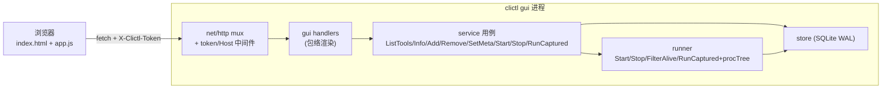

# Design Document

> spec 编号：03 ｜ 项目：`go_projects/clictl` ｜ 日期：2026-10-04
> 前置：requirements.md 已定稿（GUI 内嵌子命令方案、四类能力范围、安全基线）

## Overview

为 clictl 新增第三个壳 `clictl gui`：Go 标准库 `net/http` + `go:embed` 的本机 Web GUI。复用 `internal/service` 全部现有用例（CLI/GUI/MCP 三壳同源）；「捕获运行」能力把 `internal/mcp/exec.go` 的执行编排下沉为公共用例 `service.RunCaptured`，进程树/有界缓冲原语平移至 `internal/runner`，MCP 层改薄壳——顺带消除《CLI 工具开发标准》§10.3 记录的「执行及记账编排重复」偏差。前端为手写单页（index.html + app.css + app.js），浅色亮堂、绿主色、圆角卡片，无框架无构建。

## Context

clictl 按「管理命令永远输出 JSON」的 CLI/GUI 分离思想设计，service 层（`internal/service`）已承载全部业务：校验、记账、错误分类（`*service.Error{Code,Message,ExitCode,Suggestions}`）。MCP 壳（`internal/mcp`）已验证「常驻进程复用一个 Service」的模式可行（SQLite WAL + busy_timeout=2s，`*sql.DB` 连接池，多进程并发安全——`internal/store/store.go:105`）。

「非交互捕获运行」在 MCP 侧已完整实现（`internal/mcp/exec.go`）：stdin 关闭、单流 1 MiB 有界收集（超限继续排空防死锁）、默认 60s 超时、取消/超时杀整棵进程树（Windows Job Object，`exec_windows.go`）、启动记账闭环。GUI 的捕获运行语义与之完全一致，直接复用而非重写。

约束回忆：本仓规定文档不进子仓；数据文件只落 `%APPDATA%\language_projects\clictl\`（store 已处理，GUI 零新增数据文件）；产 exe 项目带地鼠图标（build.py 不变，go:embed 自动生效）。

已知形态说明：clictl.exe 是 console 程序，`clictl gui` 与 `clictl mcp` 一样在前台终端常驻（Ctrl+C 退出）。一期不做去黑窗的独立 GUI exe（agyquota 的 `-tags gui` 先例属另一种产物形态，不在本 spec 范围）。

## Goals and Non-Goals

- **Goals**
  - `clictl gui` 一条命令点火即用：起 server → 自动开浏览器 → 网页可看列表/启停/注册/捕获运行
  - 三壳同源：GUI 与 CLI/MCP 业务结果、错误码完全一致（同一 service）
  - 执行编排下沉：`RunCaptured` 成为公共用例，MCP 改薄壳，行为零变化（现有 `mcp_test.go` 保护）
  - 零新增第三方依赖、单文件 exe、build.py 不变
- **Non-Goals**
  - 不做 WebSocket/SSE/实时终端；不做 WebView 窗口；不做 GUI 调用 MCP 工具的转发
  - 不改 CLI 现有命令的任何行为与输出
  - 不新增自动化测试（现有测试保持通过；验证以构建 + 手工冒烟为准）

## Detailed Design

### 模块一：执行原语下沉（internal/runner）

- `CREATED` `internal/runner/proctree_windows.go`
    - **Purpose**：Windows Job Object 进程树接管与树杀原语
    - **Changes**：整文件自 `internal/mcp/exec_windows.go` 平移，包名 `mcp`→`runner`，标识符不变（`newProcTree`/`setup`/`attach`/`kill`/`close`）。平移前先确认与 runner 现有文件无标识符冲突（有则加 `procTree` 前缀统一改名）
    - **Complexity**：Low
- `CREATED` `internal/runner/proctree_other.go`
    - **Purpose**：非 Windows 的空实现（现有测试跨平台可编译）
    - **Changes**：自 `internal/mcp/exec_other.go` 平移，同上
    - **Complexity**：Low
- `CREATED` `internal/runner/captured.go`
    - **Purpose**：有界收集 + 捕获执行的低层原语（不含记账——记账归 service 用例）
    - **Changes**：
        - `limitedBuffer` 自 `mcp/exec.go` 平移（语义不变：1 MiB 上限、超限继续排空只丢不留）
        - 新类型 `CapturedResult{ExitCode int; DurationMs int64; Stdout, Stderr string; StdoutTruncated, StderrTruncated, TimedOut, Cancelled bool}`（纯 Go 字段，无 json tag——wire 形状由壳层 DTO 负责）
        - 新函数 `RunCaptured(ctx context.Context, path string, args []string, timeoutMs int64) (CapturedResult, error)`：exec.Command 组装（`Stdin=nil`）、tree.setup/attach、wait/超时竞速、退出码提取——即 `mcp/exec.go:102-147` 的流程原样上移；仅启动失败返回 error（`start_failed`）
        - 常量 `MaxStreamBytes = 1 << 20`、`DefaultRunTimeoutMs int64 = 60000` 从 mcp 迁入并导出（超时缺省值此后只有一个定义源，mcp 与 gui 共用）
    - **Complexity**：Medium（平移为主，新壳少许）

### 模块二：捕获运行公共用例（internal/service）

- `CREATED` `internal/service/captured.go`
    - **Purpose**：捕获运行用例：前置校验 + 启动记账闭环 + 调 runner 原语——对齐《CLI 工具开发标准》§2.3「执行用例统一完成前置校验、访问检查、启动记账、执行器调用和最终记账」
    - **Changes**：
        - 类型 `CapturedRun{Name, Path string; Result runner.CapturedResult}`（service 层返回值）
        - 方法 `RunCaptured(name string, args []string, timeoutMs int64) (*CapturedRun, error)`：流程与记账语义逐行对齐现 `mcp.execTool`——`PreflightRun` → `InsertLaunch` → `runner.RunCaptured`（传 `DefaultRunTimeoutMs` 兜底）→ `FinishLaunch(code)`；启动失败路径 finish(127) 后返回 `start_failed`，与现状一致
        - **不变量（由本方法独占保证）**：一旦 `InsertLaunch` 成功，任何路径（正常/超时/取消/启动失败）必达 `FinishLaunch`
        - context：`RunCaptured` 的 ctx 取自调用方（MCP 请求 ctx / GUI HTTP 请求 ctx），客户端断开即取消杀树
    - **Complexity**：Medium
- `UPDATED` `internal/mcp/exec.go`
    - **Changes**：删除 `limitedBuffer`/`execTool` 执行体与常量；`execTool` 改为薄壳——调 `svc.RunCaptured` 后映射为现有 `runOut`（wire 形状逐字段保持：`runOut` 结构体与 `failureSummary` 原样保留）；`runOut` 字段名即现有 MCP 输出契约，不得改动
- `DELETED` `internal/mcp/exec_windows.go`、`internal/mcp/exec_other.go`（已平移至 runner）

### 模块三：GUI server（internal/gui）

- `CREATED` `internal/gui/gui.go`
    - **Purpose**：HTTP server 生命周期、路由、安全中间件、包络渲染、端口策略、浏览器拉起
    - **Changes**：
        - 入口 `Serve(ctx context.Context, opts Options) error`，`Options{Port int; NoOpen bool; Version string}`
        - `//go:embed web` 嵌入静态资源；启动时读出 index.html、把占位符 `__CLICTL_TOKEN__` 替换为本次进程 token 后缓存（每次请求直接回缓存串）
        - **token**：`crypto/rand` 32 字节 hex；中间件对除 `GET /api/version` 外的全部 `/api/*` 校验 `X-Clictl-Token` 头（`subtle.ConstantTimeCompare`），不符 → 403 `{"ok":false,"error":{"code":"forbidden",...}}`。**`/api/version` 豁免 token 是刻意的**：二次启动探测发生在本进程 token 生成之后、但探测的是别的实例（token 不可知）；该端点只回 `{"program":"clictl","version":...}`，无敏感信息，且 Host 校验仍然生效
        - **Host 校验**：中间件校验 `Host` 头主机部分必须为 `127.0.0.1` 或 `localhost`（防 DNS rebinding），不符 → 403
        - **路由**（Go 1.22+ ServeMux 方法+路径模式；go.mod 因 MCP SDK 已 ≥1.23）：

            | Method | Path | service 用例 | 请求体 → data |
            |---|---|---|---|
            | GET | /api/version | —（零 DB） | → `{program, version}` |
            | GET | /api/tools | `ListTools("")` + `ListRunning()` 合并（后者建 name→pids 映射并入每项 `running_pids`） | → `{tools: [...]}`，字段同 `clictl list` + `running_pids` |
            | GET | /api/tools/{name} | `Info` | → InfoResult 原样 |
            | POST | /api/tools | `Add` | `{path, name?, desc?, source?, tags?}` → tool |
            | DELETE | /api/tools/{name} | `Remove` | → RemoveResult |
            | PUT | /api/tools/{name}/meta | `SetMeta` | `{source?, tags?}`（整体替换：未提供的 key 即清除，等价 CLI `--meta`） → tool |
            | POST | /api/tools/{name}/start | `Start` | `{args?: []string}` → StartResult（含 `already_running` 提示） |
            | POST | /api/tools/{name}/stop | `Stop` | → StopResult（`failed` 非空属部分失败，作为正常 data 返回，UI 呈现失败清单——对齐 CLI 退出码 1 的判定方式，不作 HTTP 错误） |
            | POST | /api/tools/{name}/run | `RunCaptured` | `{args?: []string, timeout_ms?: number}` → CapturedRun 展平（字段名与 MCP `runOut` 一致：name/path/exit_code/duration_ms/stdout/stderr/stdout_truncated/stderr_truncated/timed_out/cancelled） |

        - **包络**：`writeOK(w, data)` / `writeErr(w, *service.Error)` 输出 `{"ok":...}` 包络（UTF-8、紧凑单行，与 CLI 默认一致）。不复用 `internal/cli` 的 Emit/Fail（它们绑定全局 --pretty/--ascii 与 stdout）；gui 自行 marshal（约 15 行），错误码与字段语义同源
        - **错误映射（逐操作统一）**：handler 内 `errors.As(err, *service.Error)` → HTTP 200 + `ok:false`（code/message/suggestions 原样）；非 service 错误 → code `internal`、message 原文、写 stderr 日志。路由级（404/405）与安全级（403）用真实 HTTP 状态码 + 同形包络。**rationale**：业务错误走 200 与 CLI「错误 JSON 也走 stdout」、MCP「isError 工具结果」的消费习惯一致，前端统一按 `ok` 分支
        - **body 解码**：`json.NewDecoder` 默认（未知字段忽略——本期契约明确为忽略，不做 DisallowUnknownFields）；解码失败 → 200 + `bad_args`。args 必须 `[]string`（`[]` 或缺省合法），timeout_ms 缺省/≤0 → `DefaultRunTimeoutMs`
        - **端口策略**：① 生成 token；② 若 Port==17630（默认值），先 `GET http://127.0.0.1:17630/api/version`（client 超时 800ms）探测已有实例——命中（`program=="clictl"`）则按 NoOpen 决定是否拉起浏览器指向旧地址，stderr 打印「已有实例」后 return nil（进程 exit 0）；③ `net.Listen("tcp", "127.0.0.1:port")`，失败（端口被他用）→ 回退 `:0` 随机端口并 stderr 警告；④ 按 NoOpen 拉起浏览器；⑤ stderr 打印 `clictl GUI 已启动: http://127.0.0.1:<port> (version=...)`；⑥ `http.Server.Serve`，ctx.Done（cmdGui 的 signal.NotifyContext）→ `Shutdown(3s)` → service.Close
        - **浏览器拉起**：`openBrowser(url string)` 单文件内按 `runtime.GOOS` 分支——windows: `rundll32 url.dll,FileProtocolHandler <url>`；darwin: `open`；其他: `xdg-open`；启动失败仅 stderr 记录不致命。不用构建标签
        - 静态路由：`GET /`（token 化 index）、`GET /static/app.css`、`GET /static/app.js`（显式 handler，回嵌入字节 + 正确 Content-Type + `Cache-Control: no-store`——一期免缓存烦恼）
    - **Complexity**：Medium
- `CREATED` `internal/gui/web/index.html`、`internal/gui/web/static/app.css`、`internal/gui/web/static/app.js`
    - **Purpose**：单页 GUI
    - **Changes**（结构约定，视觉细节实现期微调不属架构决策）：
        - 布局：顶栏（`clictl` 标题 + 版本 badge + 搜索框 + 刷新按钮 + 「注册工具」主按钮）；主区工具卡片网格；右侧滑出详情面板；居中弹层（运行/注册编辑/确认）；右上 toast
        - 卡片：name（大字）+ status 徽标（active 灰绿描边 / invalid 红）+ running 徽标（主绿实心，显示 PID 列表）+ desc + path（截断、hover 全文）+ launch_count/last_launch 小字 + 操作行（启动/停止/运行/详情/编辑/删除）
        - 运行弹层：args textarea（**每行一个参数**——规避空格/引号歧义）、timeout_ms 数字输入（默认 60000）、提示「交互式程序不适用：stdin 已关闭」；执行中显示运行态 + 「取消」按钮（`AbortController` abort fetch → HTTP 请求 ctx 取消 → 杀树）；输出区浅底等宽字体，stdout/stderr 分块，展示退出码/耗时/截断/超时/取消徽标；abort 后本地标记「已取消」（响应不会到达，记账已由 server 侧闭环，可从详情核实）
        - 注册/编辑弹层：path（文本输入，粘贴绝对路径）、name、desc、source、tags（逗号分隔转数组）；编辑态复用同弹层（name 只读）
        - rm：自绘确认弹层，文案含「将级联删除其全部启动记录」
        - api 封装：从 `<meta name="clictl-token">` 读 token，`fetch` 自动带 `X-Clictl-Token`；`!ok` → toast(code + message + suggestions)；成功后按需刷新列表
        - 轮询：10s `setInterval` 刷新列表，仅当无弹层打开且 `document.visibilityState==='visible'`
        - 视觉：浅色亮堂底（#f6f8f7 级）、绿主色（#16a34a 级）、12px 圆角卡片、系统字体栈含中文回退；无暗色终端风、无装饰性动效
    - **Complexity**：Medium

### 模块四：CLI 接线（internal/cli）

- `UPDATED` `internal/cli/commands.go`
    - **Changes**：`Run` 分发加 `case "gui": return cmdGui(rest)`；新增 `cmdGui`：`flag.NewFlagSet` 解析 `--port`（默认 17630）/`--no-open`，未知 flag → `Fail("bad_args", 用法提示)`；`mustService()` + `signal.NotifyContext(os.Interrupt)` + `gui.Serve(ctx, Options{Port, NoOpen, Version: Version})`；Serve 返回 nil → 0，否则 stderr 打印 + 1。`EmitHelp`（commands.go:152）帮助清单补 `gui` 一行（与 mcp 行并列，注明「本机网页 GUI」）
    - **Complexity**：Low

### 模块五：文档

- `UPDATED` `go_projects/clictl/README.md`（子仓根级说明文件，原地保留合规）：命令表补 `gui` 行；「特性」补一条本机网页 GUI；`run vs start` 表后补「GUI 中的形态」两行（start=点火/stop=树杀，run 以捕获运行形态呈现）
- `UPDATED` 父仓 `docs/projects/go_projects/clictl/clictl 使用指南.md`：新增「GUI 模式」章节（启动方式、端口/二次启动行为、四类操作说明、安全说明、已知限制：交互式程序、console 黑窗），章节内附迷你能力表（业务用例 × CLI/MCP/GUI 三入口对照），满足《CLI 工具开发标准》§8.4 交付记录要求
- `UPDATED` `go_projects/clictl/CHANGELOG.md`：按现有格式追加条目

### Module Collaboration and Data Flow

- 依赖方向：gui → service → {runner, store}（与 cli/mcp 同构，无反向依赖）；mcp → service → runner（下沉后新增）
- 组装顺序：cmdGui 解析 flag → mustService（惰性开库）→ gui.Serve（token → 探测 → listen → 浏览器 → serve → shutdown → service.Close）
- 关键数据流（捕获运行）：浏览器 POST run → handler 解码 body → service.RunCaptured（PreflightRun → InsertLaunch 短事务 → runner.RunCaptured（全程不持 DB 连接）→ FinishLaunch 短事务）→ 展平 DTO → 包络响应
- 并发模型：http.Server 每连接一 goroutine；service/*sql.DB 池 + WAL 并发安全；捕获运行与 start/stop 互不持锁；同工具并发 start 由既有 `already_running` 提示语义兜底（不拦截，与 CLI 一致）

### Acceptance Criteria Mapping

| AC ID | Design Component |
|---|---|
| AC-1 | gui.Serve 启动序列 + openBrowser + `GET /api/tools` 合并 ListTools/ListRunning |
| AC-2 | `POST /api/tools/{name}/start` → service.Start（StartResult 含 pid/already_running）+ 前端 10s 轮询与操作后刷新 |
| AC-3 | `POST /api/tools/{name}/stop` → service.Stop（StopResult.failed 呈现） |
| AC-4 | `POST /api/tools/{name}/run` → service.RunCaptured（记账闭环、timeout/cancel 杀树）+ 运行弹层 AbortController |
| AC-5 | `POST /api/tools`、`DELETE /api/tools/{name}`、`PUT /api/tools/{name}/meta` → service.Add/Remove/SetMeta + 确认弹层 |
| AC-6 | 统一错误映射（`*service.Error` → 包络 ok:false）+ 前端 toast + server 不崩（每请求独立 goroutine） |
| AC-7 | token 中间件（/api/version 豁免除外）+ Host 校验中间件 |
| AC-8 | 端口策略②：探测 /api/version → 复用旧实例 → 本进程 exit 0 |

## Design Review Notes

自审（零上下文重读）发现与处置：

1. **[HIGH→已修复] `/api/version` 豁免 token 的安全性未论证**：二次启动探测方不知对方 token，豁免是功能必需；该端点仅回 program/version 且 Host 校验仍生效、无 CORS 头（浏览器跨源读不到响应），其余 `/api/*` 全部强制 token——已在上文 token 小节写明理由与边界。
2. **[MEDIUM→已修复] 执行编排下沉可能改变 MCP 行为**：约束为「逐行平移」——runOut 字段、finish(127) 路径、1 MiB/60s 缺省值、超时取消语义全部保持；wire 契约由 `runOut` 原样保留兜底，现有 `mcp_test.go` 提供回归保护（执行阶段虽默认不跑，Verify 备用）。
3. **[MEDIUM→已修复] stop 部分失败若映射为 HTTP 错误会丢结果**：StopResult.failed 属业务结果数据（CLI 也仅以退出码 1 表达），设计定为正常 data 返回 + UI 呈现失败清单，不伪造 HTTP 层错误。
4. **[NIT→说明] runner 包平移可能标识符冲突**：处理规则已写入模块一（冲突则统一 `procTree` 前缀改名），实现期机械执行，无需决策。
5. **[NIT→说明] list 合并做两次遍历（ListTools + ListRunning 各查一遍）**：本地工具量为个位/十位数，两次查询开销可忽略；换取零新 service 方法、纯复用现有用例。若未来工具数上百再优化为单遍合并。
6. **已验证假设**：service 层用例签名与错误形态（`service.go`/`tools.go`/`process.go` 实读）；捕获执行机制与记账路径（`mcp/exec.go` 实读）；WAL + busy_timeout + `*sql.DB` 池并发安全（`store/store.go:105` 实读）；StartResult/StopResult 字段（`start.go:17`/`stop.go:19` 实读）；EmitHelp 位置（`commands.go:152`）；go.mod 经 MCP SDK 间接要求 Go ≥1.23（ServeMux 方法+路径模式可用）。
7. **未验证假设（实现期首步核实）**：`exec_windows.go`/`exec_other.go` 的具体标识符清单（平移冲突检查的前置）；`mcp_test.go` 对 execTool 的测试面（薄壳化后是否需同步微调测试内部引用——只允许调整 import 与构造方式，不得改断言语义）。
